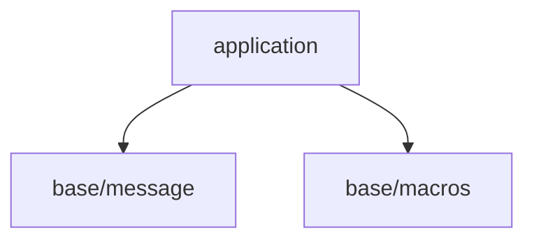
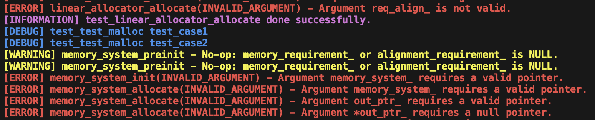

## このステップでやること

前回では、エンジンを構成する各サブシステムを起動、実行していくための土台としてアプリケーションレイヤーを構築しました。
ただ、前回のコードでは、

```c
fprintf(stderr, "[ERROR](NO_MEMORY): application_create - Failed to allocate app_state memory.\n");
```

のように、出力するメッセージを全て記載する必要がありました。メッセージにはエラーやワーニング等の重要度があります。
これらのメッセージは全て統一感のある形にすることが重要です。こうすることで、後で検索することが容易になりますし、視覚的にも分かりやすいためです。
また、重要度に応じて色分けして表示できるようにすると、欲しいメッセージを探すことが簡単になります。
このステップでは、メッセージ出力を統一感を持って行えるようにするための機能を作っていきます。この機能は、今後開発していく全ての機能で使用することになるため、
全体の最下層であるベースレイヤーに追加していくことにします。このレイヤーは全体のユーティリティ(共通部品)を集約する場所になります。
また、メッセージ機能に加え、今後発生する定型的なエラー処理を便利に行えるマクロ集も作っていくことにします。

今回の開発で、全体のレイヤー構成は以下のようになります。



## メッセージ機能の追加

まずはメッセージ機能を作っていきます。本機能はベースレイヤーに作成していきます。ベースレイヤーのディレクトリは下記のように作成しました。
message.hでは名称が一般的すぎて被る可能性があるため、choco_message.hとしています。

```console
.
├── build.sh
├── Doxyfile
├── include
│   ├── application
│   │   └── application.h
│   └── engine
│       └── base
│           └── choco_message.h
├── makefile_macos.mak
├── README.md
└── src
    ├── application
    │   └── application.c
    ├── engine
    │   └── base
    │       └── choco_message.c
    └── entry.c
```

### message.hの作成

messege.hについては解説が必要であるため、まずは要点を説明し、セクションの最後でmessage.hの全体を貼り付けることにします。
まずは全体像を把握したい方は本セクションの最後をご覧ください。

#### メッセージの重要度について

今後、アプリケーション全体で発生するメッセージについて、重要度を整理していきます。今回は、下記のようなカテゴリーとしました。

```c
typedef enum {
    MESSAGE_SEVERITY_ERROR,         /**< 重要度: エラー */
    MESSAGE_SEVERITY_WARNING,       /**< 重要度: ワーニング */
    MESSAGE_SEVERITY_INFORMATION,   /**< 重要度: 情報 */
    MESSAGE_SEVERITY_DEBUG,         /**< 重要度: デバッグ情報 */
} message_severity_t;
```

これらカテゴリーごとにメッセージ出力機能を作っていきますが、デバッグ情報や単純な情報というのはアプリケーションのリリース時には不要なメッセージとなります。
一方、エラーやワーニングといった情報は、リリース時にも重要なメッセージとなります。このように、ビルドモードによって出力の要否を自動で判別し、
不要なメッセージを出力しない構造を導入していきます。

#### メッセージ出力のON/OFF切り替え

メッセージの出力要否を判定するためのスイッチを用意します。エラー、ワーニングについては常時ON(=1)、
インフォメーション、デバッグについては、RELEASE_BUILD時にはOFF(=0)にしています。

```c
#define ENABLE_MESSAGE_SEVERITY_ERROR 1
#define ENABLE_MESSAGE_SEVERITY_WARNING 1

#ifdef RELEASE_BUILD
    #define ENABLE_MESSAGE_SEVERITY_INFORMATION 0
    #define ENABLE_MESSAGE_SEVERITY_DEBUG 0
#else
    #define ENABLE_MESSAGE_SEVERITY_INFORMATION 1
    #define ENABLE_MESSAGE_SEVERITY_DEBUG 1
#endif
```

このスイッチを使用し、下記のようなマクロを定義します。これにより、スイッチがOFF(=0)の際には、コンパイル時に空行に変換されます。
このため、ビルドモードに応じた分岐処理を追加することなく、出力の要否を切り替えることができます。なお、マクロ内のmessage_output()については後述します。

```c
#if ENABLE_MESSAGE_SEVERITY_ERROR
    #define ERROR_MESSAGE(...) message_output(MESSAGE_SEVERITY_ERROR, __VA_ARGS__)
#else
    #define ERROR_MESSAGE(...)
#endif

#if ENABLE_MESSAGE_SEVERITY_WARNING
    #define WARN_MESSAGE(...) message_output(MESSAGE_SEVERITY_WARNING, __VA_ARGS__)
#else
    #define WARN_MESSAGE(...)
#endif

#if ENABLE_MESSAGE_SEVERITY_INFORMATION
    #define INFO_MESSAGE(...) message_output(MESSAGE_SEVERITY_INFORMATION, __VA_ARGS__)
#else
    #define INFO_MESSAGE(...)
#endif

#if ENABLE_MESSAGE_SEVERITY_DEBUG
    #define DEBUG_MESSAGE(...) message_output(MESSAGE_SEVERITY_DEBUG, __VA_ARGS__)
#else
    #define DEBUG_MESSAGE(...)
#endif
```

次にメッセージ出力関数本体を追加します。この関数は次のような形をとります。重要度を引数に加えることで、
メッセージの先頭に[ERROR]、[INFORMATION]のように自動的に定型句を挿入することが可能になります。
さらに、可変個引数を取ることにより、printf関数のようにメッセージ+パラメータという構造での出力が可能になります。

```c
void message_output(message_severity_t severity_, const char* const fmt_,  ...);
```

以上がmessege.hの要点になります。ここまでの情報を全て詰め込んだmessage.hを貼り付けます。

```c
#ifndef GLCE_ENGINE_BASE_CHOCO_MESSAGE_H
#define GLCE_ENGINE_BASE_CHOCO_MESSAGE_H

#ifdef __cplusplus
extern "C" {
#endif

typedef enum {
    MESSAGE_SEVERITY_ERROR,         /**< 重要度: エラー */
    MESSAGE_SEVERITY_WARNING,       /**< 重要度: ワーニング */
    MESSAGE_SEVERITY_INFORMATION,   /**< 重要度: 情報 */
    MESSAGE_SEVERITY_DEBUG,         /**< 重要度: デバッグ情報 */
} message_severity_t;

#define ENABLE_MESSAGE_SEVERITY_ERROR 1
#define ENABLE_MESSAGE_SEVERITY_WARNING 1

#ifdef RELEASE_BUILD
    #define ENABLE_MESSAGE_SEVERITY_INFORMATION 0
    #define ENABLE_MESSAGE_SEVERITY_DEBUG 0
#else
    #define ENABLE_MESSAGE_SEVERITY_INFORMATION 1
    #define ENABLE_MESSAGE_SEVERITY_DEBUG 1
#endif

void message_output(message_severity_t severity_, const char* const fmt_,  ...);

#if ENABLE_MESSAGE_SEVERITY_ERROR
    #define ERROR_MESSAGE(...) message_output(MESSAGE_SEVERITY_ERROR, __VA_ARGS__)
#else
    #define ERROR_MESSAGE(...)
#endif

#if ENABLE_MESSAGE_SEVERITY_WARNING
    #define WARN_MESSAGE(...) message_output(MESSAGE_SEVERITY_WARNING, __VA_ARGS__)
#else
    #define WARN_MESSAGE(...)
#endif

#if ENABLE_MESSAGE_SEVERITY_INFORMATION
    #define INFO_MESSAGE(...) message_output(MESSAGE_SEVERITY_INFORMATION, __VA_ARGS__)
#else
    #define INFO_MESSAGE(...)
#endif

#if ENABLE_MESSAGE_SEVERITY_DEBUG
    #define DEBUG_MESSAGE(...) message_output(MESSAGE_SEVERITY_DEBUG, __VA_ARGS__)
#else
    #define DEBUG_MESSAGE(...)
#endif

#ifdef __cplusplus
}
#endif
#endif
```

ここまででヘッダが完成しました。次は実際の処理をmessage.cに書いていきます。

### message.cの作成

次にmessage出力機能の実装の説明をしていきます。message.cで実装する関数は、message_outputのみです。
まずはmessage.c全体を貼り付けて、要点を説明していきます。

```c
#include <stddef.h>
#include <stdio.h>
#include <string.h>
#include <stdarg.h>

#include "engine/base/choco_message.h"

void message_output(message_severity_t severity_, const char* format_, ...) {
    FILE* const out = (severity_ == MESSAGE_SEVERITY_ERROR) ? stderr : stdout;

    static const char head_err[] = "\033[1;31m[ERROR] ";
    static const char head_war[] = "\033[1;33m[WARNING] ";
    static const char head_inf[] = "\033[1;35m[INFORMATION] ";
    static const char head_dbg[] = "\033[1;34m[DEBUG] ";

    flockfile(out); // 同一ストリームの同時書き込みをまとめる

    switch (severity_) {
        case MESSAGE_SEVERITY_ERROR:       fputs(head_err, out); break;
        case MESSAGE_SEVERITY_WARNING:     fputs(head_war, out); break;
        case MESSAGE_SEVERITY_INFORMATION: fputs(head_inf, out); break;
        case MESSAGE_SEVERITY_DEBUG:       fputs(head_dbg, out); break;
        // -Wswitch-enumで足りないものは警告してくれるのでdefaultは削除
    }

    // body
    va_list args;
    va_start(args, format_);
    vfprintf(out, format_, args);
    va_end(args);

    // tail (色リセット + 改行)
    static const char s_color_reset[] = "\033[0m\n";
    fputs(s_color_reset, out);

    funlockfile(out);
}
```

#### 出力ファイルディスクリプタの指定

まず、エラーメッセージを標準エラー出力に、それ以外を標準出力に出力するよう、出力先を切り替え処理です。

```c
FILE* const out = (severity_ == MESSAGE_SEVERITY_ERROR) ? stderr : stdout;
```

こうすることで、

```bash
./bin/gl_choco_engine 2> error_log.log
```

と実行するとエラー情報のみがerror_log.logに出力される、といったことができるようになります。

#### ヘッダー情報の表示

メッセージはヘッダー+メッセージ+テイルで構成されます。ここで、ヘッダーは[ERROR]等のメッセージ重要度を文頭に付加するためのものです。
また、printfやfprintfでの出力の際には、適切な文字列を文頭に追加することにより、色分けで出力することが可能です。

[参考: printf色設定](https://qiita.com/yuutakaki/items/a6536cdce5f9eef4471e)

この機能を利用し、ヘッダーに文字色情報を付加しています。なお、背景色はデフォルトの黒にしています。
今回はメッセージ重要度別に下記の色分けを行いました。なお、色指定は明示的にデフォルトに戻さない限り、以降、この色が適用されます。
このため、本関数の最後で黒に戻す処理を実行しています。

```c
static const char head_err[] = "\033[1;31m[ERROR] ";        // 文字が赤
static const char head_war[] = "\033[1;33m[WARNING] ";      // 文字が黄
static const char head_inf[] = "\033[1;35m[INFORMATION] ";  // 文字がマゼンタ
static const char head_dbg[] = "\033[1;34m[DEBUG] ";        // 文字が青
```

このように定義したメッセージ重要度別のヘッダを出力先の表示します。

```c
switch (severity_) {
    case MESSAGE_SEVERITY_ERROR:       fputs(head_err, out); break;
    case MESSAGE_SEVERITY_WARNING:     fputs(head_war, out); break;
    case MESSAGE_SEVERITY_INFORMATION: fputs(head_inf, out); break;
    case MESSAGE_SEVERITY_DEBUG:       fputs(head_dbg, out); break;
    // -Wswitch-enumで足りないものは警告してくれるのでdefaultは削除
}
```

#### メッセージボディの表示

メッセージ本体は下記のようにして出力します。この処理は、可変個引数を出力するための定型的な処理になっています。
各行の内容についてはコメントを参考にしてください。

```c
    va_list args;                   // 可変個引数列を扱うためのイテレータ(のようなもの)
    va_start(args, format_);        // 可変個引数読み出し開始の初期化(第二引数にメッセージ本体を指定する)
    vfprintf(out, format_, args);   // fprintfのv版に渡す(val_listを使用するためのfprintf)
    va_end(args);                   // 終了処理
```

#### テイル情報の表示

ここまででメッセージの出力は行えたのですが、このままでは表示色が変更されたままになってしまいます。
最後に下記を実行して色をリセットしています。

```c
static const char s_color_reset[] = "\033[0m\n";
fputs(s_color_reset, out);
```

以上でメッセージ出力処理が完成しました。実際に色付きで表示すると、
のようになります。

## マクロ機能の追加

次は、アプリケーション全体で使用されるマクロ集を作っていきます。レイヤーはメッセージと同様にbaseです。

```console
.
├── build.sh
├── Doxyfile
├── include
│   ├── application
│   │   └── application.h
│   └── engine
│       └── base
│           ├── choco_message.h
│           └── choco_macros.h
├── makefile_macos.mak
├── README.md
└── src
    ├── application
    │   └── application.c
    ├── engine
    │   └── base
    │       └── choco_message.c
    └── entry.c
```

内容はchoco_macros.hの内容をそのまま貼り付けます。内容がシンプルなのと、そこまで量が多くないため、
コード上のコメントのみでの解説とさせてください。これらのマクロは、次回以降、エンジンの各処理でエラーチェック等を統一するために使っていきます。

```c
/** @addtogroup base
 * @{
 *
 * @file choco_macros.h
 * @author chocolate-pie24
 * @brief システム全体で使用する共通マクロ定義
 *
 * @version 0.1
 * @date 2025-09-20
 *
 * @copyright Copyright (c) 2025
 *
 */
#ifndef GLCE_ENGINE_BASE_CHOCO_MACROS_H
#define GLCE_ENGINE_BASE_CHOCO_MACROS_H

#ifdef __cplusplus
extern "C" {
#endif

#include <stddef.h>

#ifdef __clang__
  /**
   * @brief テスト関数をカバレッジ計測対象外とするためのマクロ定義(clang使用時のみ)
   *
   */
  #define NO_COVERAGE __attribute__((no_profile_instrument_function))
#else
  #define NO_COVERAGE
#endif

/**
 * @brief KiB定義(=1024)
 *
 */
#define KIB ((size_t)(1ULL << 10))

/**
 * @brief MiB定義(=1024 * 1024)
 *
 */
#define MIB ((size_t)(1ULL << 20))

/**
 * @brief GiB定義(=1024 * 1024 * 1024)
 *
 */
#define GIB ((size_t)(1ULL << 30))

/**
 * @brief 2の冪乗かをチェックする
 *
 * @retval true  2の冪乗
 * @retval false 2の冪乗ではない
 */
#define IS_POWER_OF_TWO(val_) ( ((size_t)(val_) != 0u) && ( (((size_t)(val_) & ((size_t)(val_) - 1u)) == 0u)))

/**
 * @brief 引数ptr_がNULLであればret_コードを出力し、cleanupにジャンプする
 *
 * @note エラーメッセージはINVALID_ARGUMENTで、function_name_とvariable_name_をエラーメッセージに出力する
 */
#define CHECK_ARG_NULL_GOTO_CLEANUP(ptr_, ret_, function_name_, variable_name_) \
    if(NULL == ptr_) { \
        ERROR_MESSAGE("%s(INVALID_ARGUMENT) - Argument %s requires a valid pointer.", function_name_, variable_name_); \
        ret = ret_; \
        goto cleanup;  \
    } \

/**
 * @brief 引数ptr_がNULLでなければret_コードを出力し、cleanupにジャンプする
 *
 * @note エラーメッセージはINVALID_ARGUMENTで、function_name_とvariable_name_をエラーメッセージに出力する
 */
#define CHECK_ARG_NOT_NULL_GOTO_CLEANUP(ptr_, ret_, function_name_, variable_name_) \
    if(NULL != ptr_) { \
        ERROR_MESSAGE("%s(INVALID_ARGUMENT) - Argument %s requires a null pointer.", function_name_, variable_name_); \
        ret = ret_; \
        goto cleanup;  \
    } \

/**
 * @brief 引数ptr_がNULLであればret_コードを出力し、cleanupにジャンプする
 *
 * @note エラーメッセージはNO_MEMORYで、function_name_とvariable_name_をエラーメッセージに出力する
 */
#define CHECK_ALLOC_FAIL_GOTO_CLEANUP(ptr_, ret_, function_name_, variable_name_) \
    if(NULL == ptr_) { \
        ERROR_MESSAGE("%s(NO_MEMORY) - Failed to allocate %s memory.", function_name_, variable_name_); \
        ret = ret_; \
        goto cleanup;  \
    } \

/**
 * @brief 引数is_valid_がfalseであればret_コードを出力し、cleanupにジャンプする
 *
 * @note エラーメッセージはINVALID_ARGUMENTで、function_name_とvariable_name_をエラーメッセージに出力する
 */
#define CHECK_ARG_NOT_VALID_GOTO_CLEANUP(is_valid_, ret_, function_name_, variable_name_) \
    if(!(is_valid_)) { \
        ERROR_MESSAGE("%s(INVALID_ARGUMENT) - Argument %s is not valid.", function_name_, variable_name_); \
        ret = ret_; \
        goto cleanup;  \
    } \

#ifdef __cplusplus
}
#endif
#endif

/*@}*/
```

以上でベースレイヤーの処理が完成しました。次回は本格的にエンジンを構成する機能の実装に入っていきます。
