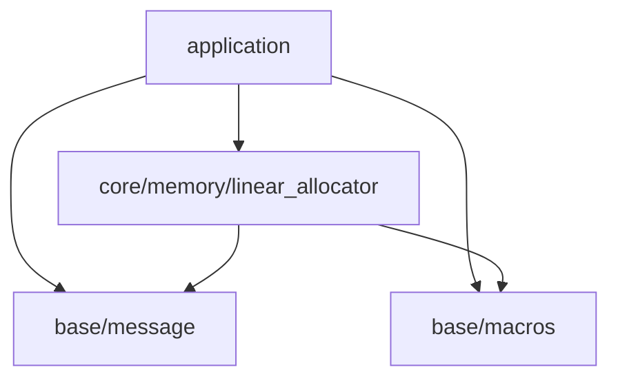

※本記事は [全体イントロダクション](../../articles/introduction.md)のBook1に対応しています。

## このステップでやること

前回までで、

- アプリケーションをビルドする仕組みの構築
- 機能を追加する器となるアプリケーションレイヤーの構築
- 基本的なメッセージ出力ユーティリティ、マクロユーティリティの追加

を行ってきました。ここからは、エンジンを構成するサブシステムの構築に移りたいのですが、そのためにはもう少しだけ準備が必要です。
今回は、サブシステムを起動する際に必要となるメモリリソースを割り当てるためのリニアロケータを作っていくことにします。

## メモリ確保戦略について

ゲームエンジンに限らず、メモリリソースには大きく3つの種類があります。

1. 起動時に確保され、終了時に解放されるリソース
2. 一定周期ごとに確保され、解放されるリソース(例えば描画周期の最初で確保して、最後に解放)
3. 実行中の各種イベント等によって不定期的に確保され、不定期的に解放されるリソース

また、ゲームエンジンのように、速度が要求され、かつ、メモリ確保要求が頻繁に発行されるソフトウェアにおいては、
mallocの頻繁な呼び出しによるオーバーヘッドを避けるため、オリジナルのメモリアロケータを実装します。
具体的には、起動時にmallocで一気に大量のメモリを確保し、以降はオリジナルのメモリアロケータを使用し、そこからメモリを使っていくという手法を取ります。
ここで、先ほど説明した3種類のメモリリソースについてなのですが、それぞれメモリ管理の手法が異なります。

例えば1番目のメモリについては、アプリケーション終了時にOSが解放してくれるため、解放しないでも最悪困ることはありません。

2番目のメモリについては、周期の最初にロールバックポイントを設定して、周期の最後に周期の最初の状態までロールバックという手法を取ることができます。
この場合、途中で確保されるメモリは個別に解放する必要はなく、ロールバックポイントとして設定してあるアドレスまで戻せば一気に解放することができます。
または、ロールバックポイントを設けず、周期の最後で周期の最初の状態まで一気に戻すという方法を取ることもできます。
このため、確保された各領域についての詳細を管理する必要がなく、高速なメモリアロケーションが可能です。

最後に3番目のケースでは、メモリは個別に解放できる必要があります。この場合、空き領域を統合するための処理が必要ですし、
そのためには確保された各領域についての詳細も管理する必要があります。

このように、メモリリソースではその性質によって、最適なアロケータが異なります。
最適なアロケータを使用することで、不要なメモリリソースを削減することが可能ですし、割り当ての際の速度も向上します。

今回作成していくのは、1番目の性質を持つメモリに対するアロケータである、リニアアロケータを作成していきます。
今回実装するリニアアロケータは今後、2番目の性質を持つメモリに対しても使用可能にするよう機能追加予定ですが、
当面は現状に必要な機能のみを実装し、シンプルに保つようにします。
マルチスレッド対応についても同様で、当面はシングルスレッドのみでの運用とし、必要となった際にマルチスレッド化を行っていきます。

## リニアアロケータ概要

今回ターゲットとしているメモリリソースは、エンジンを構成するサブシステムの起動時に必要となる、サブシステムの内部状態リソースの確保です。
このリソースは、アプリケーションの起動時から終了時まで残り続けます。このため、起動中にサブシステムが個別に確保したリソースを個別に解放することはありません。
このようなリソースの確保に適しているのがリニアアロケータで、下記のような特徴があります。

- 最初にまとまった量のメモリを確保
- メモリ確保要求ごとに空き領域の先頭アドレスをシフト
- メモリの個別解放は不可

以降、リニアアロケータの実装について説明していきます。

## リニアアロケータ実装

### レイヤー検討

リニアアロケータは、メモリ管理が目的のため、プロジェクト全体で使用されることになり、比較的低レイヤーの機能になります。
一方で、実装の際にはベースレイヤーのメッセージ機能や、マクロも使用するため、ベースレイヤーよりは上位の機能になります。
なので、下記のcore/memoryレイヤーを追加することにします。これで現状でのレイヤー構成は下記のようになります。



レイヤー構成に従い、ディレクトリ構成は下記のようになります。

```console
.
├── build.sh
├── Doxyfile
├── include
│   ├── application
│   │   └── application.h
│   └── engine
│       ├── base
│       │   ├── choco_macros.h
│       │   └── choco_message.h
│       └── core
│           └── memory
│               └── linear_allocator.h
├── LICENSE
├── makefile_macos.mak
├── README.md
└── src
    ├── application
    │   └── application.c
    ├── engine
    │   ├── base
    │   │   └── choco_message.c
    │   └── core
    │       └── memory
    │           └── linear_allocator.c
    └── entry.c
```

### 構造体の内部データ隠蔽

リニアアロケータは、オブジェクト内部状態の管理にメモリ領域を扱います。このため、オブジェクトの内部データにユーザーがアクセスできるようにすることは避けたいです。
オブジェクトの内部構造はユーザー側に隠蔽する形で実装していくことにします。
具体的な方法としては、ヘッダファイルでは構造体の前方宣言のみを行い、構造体の詳細はソースファイルで定義することにより実現します。

***ヘッダファイル***

```c
typedef struct linear_alloc linear_alloc_t; // 構造体前方宣言
```

***ソースファイル***

```c
struct linear_alloc {
    int member1;
    int member2;
    int member3;
};
```

この手法を取ることによるデメリットも存在します。例えばアプリケーション内で、

```c
void function(void) {
    linear_alloc_t alloc;
}
```

このようにすることができません。なぜなら、構造体の内部構造がcファイルに記載されているため、
コンパイラがlinear_alloc_tのサイズを知ることができず、スタックメモリに積むことができないためです。
このようにする必要があります。ただ、そこまで大きなデメリットではないため、今回はデータを隠蔽する手法で実装を進めていきます。

```c
void function(void) {
    linear_alloc_t* alloc;
}
```

### ヘッダファイルの作成

リニアアロケータのヘッダファイルを貼り付けます。保有APIはシンプルで下記の3つです。

- オブジェクト作成: linear_allocator_create()
- オブジェクト破棄: linear_allocator_destroy()
- メモリアロケーション: linear_allocator_allocate()

```c
#ifndef GLCE_ENGINE_CORE_MEMORY_LINEAR_ALLOCATOR_H
#define GLCE_ENGINE_CORE_MEMORY_LINEAR_ALLOCATOR_H

#ifdef __cplusplus
extern "C" {
#endif

#include <stddef.h>

typedef struct linear_alloc linear_alloc_t;

typedef enum {
    LINEAR_ALLOC_SUCCESS,           /**< 処理成功 */
    LINEAR_ALLOC_NO_MEMORY,         /**< メモリ不足 */
    LINEAR_ALLOC_INVALID_ARGUMENT,  /**< 無効な引数 */
} linear_alloc_err_t;

linear_alloc_err_t linear_allocator_create(linear_alloc_t** allocator_, size_t capacity_);

void linear_allocator_destroy(linear_alloc_t** allocator_);

linear_alloc_err_t linear_allocator_allocate(linear_alloc_t* allocator_, size_t req_size_, size_t req_align_, void** out_ptr_);

#ifdef __cplusplus
}
#endif
#endif
```

以下、それぞれの処理の詳細を説明していきます。

### リニアアロケータ実装(linear_allocator.c): オブジェクト内部データ構造

linear_allocator.hで前方宣言したlinear_allocの内部データ構造を説明します。これは、外部からは仕様を隠蔽するため、
linear_allocator.cに記述します。データ構造は下記のようになっています。

```c
struct linear_alloc {
    size_t capacity;    /**< アロケータが管理するメモリ容量(byte) */
    void* head_ptr;     /**< 次にメモリを確保する際の先頭アドレス(実際にはアライメント要件分オフセットされたアドレスを渡す) */
    void* memory_pool;  /**< アロケータが管理するメモリ領域 */
};
```

構造は非常にシンプルで、

- memory_pool: アロケータが管理するメモリ領域です。要求されたメモリ割り当てに対する領域は全てここから取得されることになります。
- capacity: memory_poolの領域サイズです。byte単位で指定します。
- head_ptr: memory_pool内の空き領域の先頭アドレスです。割り当て要求がされるたび、オフセットします。

これでデータ構造ができましたので、このデータ構造のメモリを確保し、初期化するlinear_allocator_create関数について説明していきます。

### リニアアロケータ実装(linear_allocator.c): linear_allocator_create

***linear_allocator_create全体像***

まずは、リニアアロケータオブジェクトlinear_alloc_tのメモリを確保し、オブジェクトを初期化する処理としてlinear_allocator_createを作成します。
この関数は次のように使用します。

```c
linear_alloc_t* alloc = NULL;
linear_alloc_err_t ret = linear_allocator_create(&alloc, 128);
```

上記コードでは、リニアアロケータが管理するmemory_poolに128byteの領域を割り当てる処理を行っています。
linear_allocator_create内でallocのメモリを確保するため、ダブルポインタで渡しています。

では、linear_allocator_createの処理の説明です。全体のコードを貼り付け、個別に解説していきます。

```c
linear_alloc_err_t linear_allocator_create(linear_alloc_t** allocator_, size_t capacity_) {
    linear_alloc_err_t ret = LINEAR_ALLOC_INVALID_ARGUMENT;
    linear_alloc_t* tmp = NULL;

    // Preconditions
    CHECK_ARG_NULL_GOTO_CLEANUP(allocator_, LINEAR_ALLOC_INVALID_ARGUMENT, "linear_allocator_create", "allocator_")
    CHECK_ARG_NOT_NULL_GOTO_CLEANUP(*allocator_, LINEAR_ALLOC_INVALID_ARGUMENT, "linear_allocator_create", "allocator_")
    CHECK_ARG_NOT_VALID_GOTO_CLEANUP(0 != capacity_, LINEAR_ALLOC_INVALID_ARGUMENT, "linear_allocator_create", "capacity_")

    // Simulation
    tmp = (linear_alloc_t*)test_malloc(sizeof(*tmp));
    CHECK_ALLOC_FAIL_GOTO_CLEANUP(tmp, LINEAR_ALLOC_NO_MEMORY, "linear_allocator_create", "tmp")
    memset(tmp, 0, sizeof(*tmp));

    tmp->memory_pool = test_malloc(capacity_);
    CHECK_ALLOC_FAIL_GOTO_CLEANUP(tmp->memory_pool, LINEAR_ALLOC_NO_MEMORY, "linear_allocator_create", "tmp->memory_pool")
    memset(tmp->memory_pool, 0, capacity_);

    tmp->capacity = capacity_;
    tmp->head_ptr = tmp->memory_pool;

    // commit
    *allocator_ = tmp;
    ret = LINEAR_ALLOC_SUCCESS;

cleanup:
    if(LINEAR_ALLOC_SUCCESS != ret) {
        if(NULL != tmp && NULL != tmp->memory_pool) {
            free(tmp->memory_pool);
            tmp->memory_pool = NULL;
        }
        if(NULL != tmp) {
            free(tmp);
            tmp = NULL;
        }
    }
    return ret;
}
```

***変数宣言部***

```c
linear_alloc_err_t ret = LINEAR_ALLOC_INVALID_ARGUMENT;
linear_alloc_t* tmp = NULL;
```

関数の冒頭で使用するローカル変数の宣言をしています。一般に、CやC++においてローカル変数を宣言する際は、
変数のスコープを短くするために使用の直前で宣言する手法がよく取られます。ただ、今回のケースでは、処理の失敗時にgoto cleanupをしており、
処理が一気に飛ばされる可能性があります。飛ばされた領域に含まれる変数を、飛ばされる領域で宣言していた場合、cleanup以降での使用の際、未初期化となり危険です。
これを防止するため、あえて関数の冒頭でまとめて変数を宣言しています。cleanup以降では使用しないのであれば、使用の直前での宣言でも問題ありません。

***引数エラーチェック部***

```c
// Preconditions
CHECK_ARG_NULL_GOTO_CLEANUP(allocator_, LINEAR_ALLOC_INVALID_ARGUMENT, "linear_allocator_create", "allocator_")
CHECK_ARG_NOT_NULL_GOTO_CLEANUP(*allocator_, LINEAR_ALLOC_INVALID_ARGUMENT, "linear_allocator_create", "allocator_")
CHECK_ARG_NOT_VALID_GOTO_CLEANUP(0 != capacity_, LINEAR_ALLOC_INVALID_ARGUMENT, "linear_allocator_create", "capacity_")
```

この領域では、前回作成したエラー処理マクロを使用して、引数のチェックを行っています。例えば、1番目のエラーチェックは下記のコードと等価です。

```c
if(NULL == allocator_) {
    ERROR_MESSAGE("linear_allocator_create(INVALID_ARGUMENT) - Argument allocator_ requires a valid pointer.");
    ret = ret_;
    goto cleanup;
}
```

もしallocator_がNULLであった場合、ERROR_MESSAGEによって下記のメッセージが文字色が赤で出力されます。

```console
[ERROR] linear_allocator_create(INVALID_ARGUMENT) - Argument allocator_ requires a valid pointer.
```

次に、2番目のエラーチェックなのですが、これは与えられたallocator_にすでにメモリが割り当てられている場合です。これは、allocator_が既に初期化されている場合を示しています。
linear_allocator_createを2回呼び出した場合や、allocator_が未定義状態だった場合に発生します。

3番目については、割り当てる領域が0だった場合です。必ず0より大きいサイズを要求するということをlinear_allocator_createのAPI仕様としています。
この仕様については、次回の記事で説明するdoxygenを使用して、ドキュメントに残していくようにします。

***初期化処理***

次にメモリを確保し、初期化する処理を作成します。メモリ確保の際には失敗する可能性があります。
なので、ローカル変数linear_alloc_t* tmpに対してオブジェクトを生成していき、成功した場合にはallocator_のアドレスにtmpをセットする方法をとります。
こうすることで、仮にメモリ確保に失敗したとしても、引数allocator_には一切影響を及ぼしません。

では、メモリ確保、初期化する部分のコードを貼り付けます。
なお、test_mallocという関数を使用していますが、これはmallocが失敗した際の挙動をテストするための関数です。
なので、mallocに置き換えて読んでいただいて問題ありません。

```c
tmp = (linear_alloc_t*)test_malloc(sizeof(*tmp));
CHECK_ALLOC_FAIL_GOTO_CLEANUP(tmp, LINEAR_ALLOC_NO_MEMORY, "linear_allocator_create", "tmp")
memset(tmp, 0, sizeof(*tmp));

tmp->memory_pool = test_malloc(capacity_);
CHECK_ALLOC_FAIL_GOTO_CLEANUP(tmp->memory_pool, LINEAR_ALLOC_NO_MEMORY, "linear_allocator_create", "tmp->memory_pool")
memset(tmp->memory_pool, 0, capacity_);

tmp->capacity = capacity_;
tmp->head_ptr = tmp->memory_pool;
```

処理の内容についてはシンプルで、

- linear_alloc_t型のメモリ領域をmallocで確保
- 確保したlinear_alloc_tのメモリ領域を全て0で初期化
- linear_alloc_t->memory_poolの領域をmallocで確保
- linear_alloc_t->memory_poolの領域を全て0で初期化
- linear_alloc_t->capacityを初期化
- linear_alloc_t->head_ptrをmemory_poolの先頭アドレスで初期化

という内容になっています。最後まで処理が進めば処理に成功したということで、

```c
*allocator_ = tmp;
ret = LINEAR_ALLOC_SUCCESS;
```

として*allocator_にtmpをセットします。これでallocator_に対するメモリ割り当てと初期化が完了したことになります。

***エラー時クリーンナップ***

メモリ確保に失敗した場合、エラーとなり、cleanupに飛ばされます。この際にローカル変数tmpに対して行ったメモリ割り当てを解放していく必要があります。
このための処理が、以下の処理で、実行結果がLINEAR_ALLOC_SUCCESSの場合には確保されているtmpのリソースの解放を行っています。
解放の際は、必ず確保と逆順で行うようにします。今回の例で行けば、最後に確保したmemory_pool -> tmpの領域の順で解放していきます。

```c
if(LINEAR_ALLOC_SUCCESS != ret) {
    if(NULL != tmp && NULL != tmp->memory_pool) {
        free(tmp->memory_pool);
        tmp->memory_pool = NULL;
    }
    if(NULL != tmp) {
        free(tmp);
        tmp = NULL;
    }
}
```

以上がlinear_alloc_tオブジェクトの生成と初期化処理についての解説です。
次は生成の反対の破棄について見ていきます。

### リニアアロケータ実装(linear_allocator.c): linear_allocator_destroy

linear_alloc_tオブジェクトの破棄の処理について説明していきます。この処理は以下のように使用します。

```c
linear_alloc_t* alloc = NULL;
linear_alloc_err_t ret = linear_allocator_create(&alloc, 128);

// なんらかの処理

linear_allocator_destroy(&alloc);   // alloc = NULLになる
```

まず、全体のコードを貼り付けます。

```c
void linear_allocator_destroy(linear_alloc_t** allocator_) {
    if(NULL == allocator_) {
        goto cleanup;
    }
    if(NULL == *allocator_) {
        goto cleanup;
    }
    if(NULL != (*allocator_)->memory_pool) {
        free((*allocator_)->memory_pool);
        (*allocator_)->memory_pool = NULL;
    }
    (*allocator_)->capacity = 0;
    (*allocator_)->head_ptr = NULL;
    free(*allocator_);
    *allocator_ = NULL;

cleanup:
    return;
}
```

今回作成するlinear_allocator_destroyは、2重destroyを許容することにします。こうすることで仮に誤って2重で解放しようとしてもアプリケーションが落ちることはありません。
今後、2重destroyが行われた際にワーニングを出すよう変更するかも知れませんが、当面はこのままで行くことにします。

linear_allocator_destroyの内容についてはシンプルで、linear_alloc_tが保有するmemory_poolの解放と、linear_alloc_t自身のメモリの解放を行っています。

以上がlinear_allocator_destroyの説明になります。最後に、リニアアロケータの最後の処理である、linear_allocator_allocateの説明を行っていきます。

### リニアアロケータ実装(linear_allocator.c): linear_allocator_allocate

この関数がリニアアロケータを使用したメモリアロケーション処理となります。このように使用します。

```c
linear_alloc_t* alloc = NULL;    // 必ずNULL初期化をすること
linear_alloc_err_t ret = linear_allocator_create(&alloc, 128);   // 128byteの容量でアロケータを生成

// エラー処理
int* int_ptr = NULL;
ret = linear_allocator_allocate(alloc, sizeof(int), alignof(int), &int_ptr);   // int型のメモリを確保
```

リニアアロケータは個別解放を行わないため、メモリ確保ごとにhead_ptrをズラしていくだけで良いため非常にシンプルです。
ただ、一個だけ注意点があります。メモリを割り当てる変数には、それぞれ決まったメモリアライメント要件があるということです。
各変数の型には、それぞれ異なるメモリアライメント要件があり、例えば、

- int16_t型変数を割り当てるアドレスは2の倍数でなければいけない
- float型変数を割り当てるアドレスは4の倍数でなければいけない
- double型変数を割り当てるアドレスは8の倍数でなければいけない

といったルールがあります。これを違反したアドレスを割り当てようとした場合、未定義の動作を引き起こすことになるため非常に危険です。
これを防止するため、linear_allocator_allocateにはアライメント要件を伝えて割り当てるようにしています。

では、実際のアロケーション処理の説明をしていきます。シンプルなアロケータではありますが、注意点が2点あります。

- アライメント要件満たすよう正しくメモリをオフセットすること
- ゲームエンジンで要求されるメモリ使用量はギガバイトオーダーも普通であるため、オーバーフローに注意する

です。では、全体のコードを貼り付けて、個別に解説していきます。

```c
linear_alloc_err_t linear_allocator_allocate(linear_alloc_t* allocator_, size_t req_size_, size_t req_align_, void** out_ptr_) {
    linear_alloc_err_t ret = LINEAR_ALLOC_INVALID_ARGUMENT;
    uintptr_t head = 0;
    uintptr_t align = 0;
    uintptr_t size = 0;
    uintptr_t offset = 0;
    uintptr_t start_addr = 0;
    uintptr_t pool = 0;
    uintptr_t cap = 0;

    // Preconditions
    CHECK_ARG_NULL_GOTO_CLEANUP(allocator_, LINEAR_ALLOC_INVALID_ARGUMENT, "linear_allocator_allocate", "allocator_")
    CHECK_ARG_NULL_GOTO_CLEANUP(out_ptr_, LINEAR_ALLOC_INVALID_ARGUMENT, "linear_allocator_allocate", "out_ptr_")
    CHECK_ARG_NOT_NULL_GOTO_CLEANUP(*out_ptr_, LINEAR_ALLOC_INVALID_ARGUMENT, "linear_allocator_allocate", "out_ptr_")
    if(0 == req_align_ || 0 == req_size_) {
        WARN_MESSAGE("linear_allocator_allocate - No-op: req_align_ or req_size_ is 0.");
        ret = LINEAR_ALLOC_SUCCESS;
        goto cleanup;
    }
    CHECK_ARG_NOT_VALID_GOTO_CLEANUP(IS_POWER_OF_TWO(req_align_), LINEAR_ALLOC_INVALID_ARGUMENT, "linear_allocator_allocate", "req_align_")

    // Simulation
    head = (uintptr_t)allocator_->head_ptr;
    align = (uintptr_t)req_align_;
    size = (uintptr_t)req_size_;
    offset = head % align;
    if(0 != offset) {
        offset = align - offset;    // 要求アライメントに先頭アドレスを調整
    }
    if(UINTPTR_MAX - offset < head) {
        ERROR_MESSAGE("linear_allocator_allocate(INVALID_ARGUMENT) - Requested offset is too big.");
        ret = LINEAR_ALLOC_INVALID_ARGUMENT;
        goto cleanup;
    }
    start_addr = head + offset;
    if(UINTPTR_MAX - size < start_addr) {
        ERROR_MESSAGE("linear_allocator_allocate(INVALID_ARGUMENT) - Requested size is too big.");
        ret = LINEAR_ALLOC_INVALID_ARGUMENT;
        goto cleanup;
    }
    pool = (uintptr_t)allocator_->memory_pool;
    cap = (uintptr_t)allocator_->capacity;
    if((start_addr + size) > (pool + cap)) {
        uintptr_t free_space = pool + cap - start_addr;
        ERROR_MESSAGE("linear_allocator_allocate(NO_MEMORY) - Can not allocate requested size. Requested size: %zu / Free space: %zu", req_size_, (size_t)free_space);
        ret = LINEAR_ALLOC_NO_MEMORY;
        goto cleanup;
    }

    // commit
    *out_ptr_ = (void*)start_addr;
    head += offset + size;
    allocator_->head_ptr = (void*)head;
    ret = LINEAR_ALLOC_SUCCESS;

cleanup:
    return ret;
}
```

***エラーチェック部***

```c
CHECK_ARG_NULL_GOTO_CLEANUP(allocator_, LINEAR_ALLOC_INVALID_ARGUMENT, "linear_allocator_allocate", "allocator_")
CHECK_ARG_NULL_GOTO_CLEANUP(out_ptr_, LINEAR_ALLOC_INVALID_ARGUMENT, "linear_allocator_allocate", "out_ptr_")
CHECK_ARG_NOT_NULL_GOTO_CLEANUP(*out_ptr_, LINEAR_ALLOC_INVALID_ARGUMENT, "linear_allocator_allocate", "out_ptr_")
if(0 == req_align_ || 0 == req_size_) {
    WARN_MESSAGE("linear_allocator_allocate - No-op: req_align_ or req_size_ is 0.");
    ret = LINEAR_ALLOC_SUCCESS;
    goto cleanup;
}
CHECK_ARG_NOT_VALID_GOTO_CLEANUP(IS_POWER_OF_TWO(req_align_), LINEAR_ALLOC_INVALID_ARGUMENT, "linear_allocator_allocate", "req_align_")
```

引数のNULLチェックの他に、特記事項として、

- 要求サイズまたは要求メモリアライメントが0の場合にはワーニングを出し何もしない
- メモリアライメント要件は2の冪乗でなくてはいけない

のルールをAPIの仕様として設けます。これについては次回セットアップするdoxygenを用いてドキュメントに記載するようにしていきます。
2点目の2の冪乗をAPI仕様に盛り込む理由なのですが、これは、多くのCPUアーキテクチャが2の冪境界を前提としており、計算もビット演算で完結になるためです。

***アライメントオフセット計算部***

```c
head = (uintptr_t)allocator_->head_ptr;
align = (uintptr_t)req_align_;
size = (uintptr_t)req_size_;
offset = head % align;
if(0 != offset) {
    offset = align - offset;    // 要求アライメントに先頭アドレスを調整
}

start_addr = head + offset;
if(UINTPTR_MAX - size < start_addr) {
    ERROR_MESSAGE("linear_allocator_allocate(INVALID_ARGUMENT) - Requested size is too big.");
    ret = LINEAR_ALLOC_INVALID_ARGUMENT;
    goto cleanup;
}
```

アライメント要件を満たすよう、head_ptrをズラす方法について説明します。仮に、

- アライメント要件が8byte境界
- 現在のhead_ptrのアドレス値が3

だったとします。この場合、head_ptrを8の倍数にする必要があるため、オフセット量を5byte設ける必要があります。
このオフセット量を計算するコードが以下になっています。

```c
head = (uintptr_t)allocator_->head_ptr;
align = (uintptr_t)req_align_;
size = (uintptr_t)req_size_;
offset = head % align;
if(0 != offset) {
    offset = align - offset;    // 要求アライメントに先頭アドレスを調整
}
```

こうして求められたオフセットをheadに追加すれば、それが割り当てるメモリの先頭アドレスなのですが、オーバーフローに注意する必要があります。

***オーバーフロー検出(型の上限値チェック)***

オーバーフローは、memory_poolのキャパシティを超過する場合と、加算をする際のオーバーフローがあります。まず、加算を行うことによるオーバーフローを検出します。

```c
if(UINTPTR_MAX - offset < head) {
    ERROR_MESSAGE("linear_allocator_allocate(INVALID_ARGUMENT) - Requested offset is too big.");
    ret = LINEAR_ALLOC_INVALID_ARGUMENT;
    goto cleanup;
}
start_addr = head + offset;
if(UINTPTR_MAX - size < start_addr) {
    ERROR_MESSAGE("linear_allocator_allocate(INVALID_ARGUMENT) - Requested size is too big.");
    ret = LINEAR_ALLOC_INVALID_ARGUMENT;
    goto cleanup;
}
```

上記コードによって、各変数の型を超過しないよう、チェックを行っています。チェック対象は2点で、

- 先頭アドレスにoffsetを加えた値がオーバーフローしないか
- 先頭アドレス+offsetから要求メモリサイズを加えた値がオーバーフローしないか

です。この処理によって、計算過程でのオーバーフローの心配がなくなりましたので、割り当て処理に移ります。

***オーバーフロー検出(割り当て領域チェック)***

```c
    pool = (uintptr_t)allocator_->memory_pool;
    cap = (uintptr_t)allocator_->capacity;
    if((start_addr + size) > (pool + cap)) {
        uintptr_t free_space = pool + cap - start_addr;
        ERROR_MESSAGE("linear_allocator_allocate(NO_MEMORY) - Can not allocate requested size. Requested size: %zu / Free space: %zu", req_size_, (size_t)free_space);
        ret = LINEAR_ALLOC_NO_MEMORY;
        goto cleanup;
    }
```

次がメモリ領域を割り当てた結果、memory_poolが管理する領域を超過しないかのチェックです。上記コードで領域のオーバーフローチェックを行っています。

***割り当て処理***

以上の処理によって要求されたアライメント、メモリサイズを満たすよう割り当てることが確認されましたので、最後にメモリを割り当て、次の割り当てのためにhead_ptrをズラします。

```c
*out_ptr_ = (void*)start_addr;
head += offset + size;
allocator_->head_ptr = (void*)head;
ret = LINEAR_ALLOC_SUCCESS;
```

***失敗時ロールバック部***

今回の処理では、エラー発生後に解放するリソースはないため、cleanup以降のクリーンナップ処理は特にありません。

以上がlinear_allocatorの解説になります。これでようやくエンジンのサブシステムを作成する準備が整いました。
次回はメモリ資源を管理するためのメモリシステムを構築していきます。
