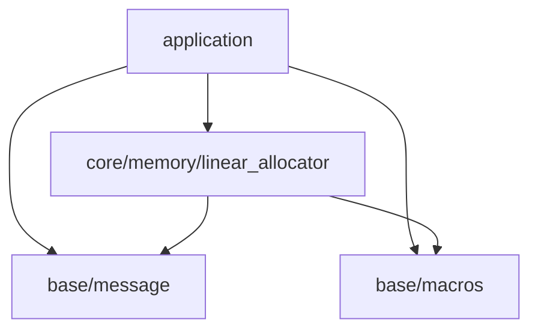

## このステップでやること

前回までで、

- アプリケーションをビルドする仕組みの構築
- 機能を追加する器となるアプリケーションレイヤーの構築
- 基本的なメッセージ出力ユーティリティ、マクロユーティリティの追加

を行ってきました。ここからは、エンジンを構成するサブシステムの構築に移りたいのですが、そのためにはもう少しだけ準備が必要です。
今回は、サブシステムを起動する際に必要となるメモリリソースを割り当てるためのリニアロケータを作っていくことにします。

## メモリ確保戦略について

ゲームエンジンに限らず、メモリーリソースには大きく3つの種類があります。

1. 起動時に確保され、終了時に解放されるリソース
2. 一定周期ごとに確保され、解放されるリソース(例えば描画周期の最初で確保して、最後に解放)
3. 実行中の各種イベント等によって不定期的に確保され、不定期的に解放されるリソース

また、ゲームエンジンのように、メモリ確保要求が頻繁に発行されるソフトウェアにおいては、mallocによるメモリの確保は失敗のリスクを伴います。
このため、起動時にmallocで一気に大量のメモリを確保し、以降はオリジナルのメモリアロケータを使用し、そこからメモリを使っていくという手法を取ります。
ここで、先ほど説明した3種類のメモリーリソースについてなのですが、それぞれメモリ管理の手法が異なります。

例えば1番目のメモリについては、アプリケーション終了時にOSが解放してくれるため、解放しないでも最悪困ることはありません。

また、2番目のメモリについては、周期の最初にロールバックポイントを設定して、周期の最後に周期の最初の状態までロールバックという手法を取ることができます。
この場合、途中で確保されるメモリは個別に解放する必要はなく、ロールバックポイントとして設定してあるアドレスまで戻せば一気に解放することができます。
このため、確保された各領域についての詳細を管理する必要があまりません。

最後に3番目のケースでは、メモリは個別に解放できる必要があります。この場合、空き領域を統合するための処理が必要ですし、
そのためには確保された各領域についての詳細も管理する必要があります。

このように、メモリリソースではその性質によって、最適なアロケータが異なります。
最適なアロケータを使用することで、不要なメモリリソースを削減することが可能ですし、割り当ての際の速度も向上します。

## リニアアロケータ概要

今回ターゲットとしているメモリリソースは、エンジンを構成するサブシステムの起動時に必要となる、サブシステムの内部状態リソースの確保です。
このリソースは、アプリケーションの起動時から終了時まで残り続けます。このため、起動中にサブシステムが個別に確保したリソースを個別に解放することはありません。
このようなリソースの確保に適しているのがリニアアロケータで、下記のような特徴があります。

- 最初にまとまった量のメモリを確保
- メモリ確保要求ごとに空き領域の先頭アドレスをシフト
- メモリの個別解放は不可

以降、リニアアロケータの実装について説明していきます。

## リニアアロケータ実装

### レイヤー検討

リニアアロケータは、メモリ管理が目的のため、プロジェクト全体で使用されることになり、比較的低レイヤーの機能になります。
一方で、実装の際にはベースレイヤーのメッセージ機能や、マクロも使用するため、ベースレイヤーよりは上位の機能になります。
なので、下記のcore/memomryレイヤーを追加することにします。これで現状でのレイヤー構成は下記のようになります。



レイヤー構成に従い、ディレクトリ構成は下記のようになります。

```console
.
├── build.sh
├── Doxyfile
├── include
│   ├── application
│   │   └── application.h
│   └── engine
│       ├── base
│       │   ├── choco_macros.h
│       │   └── choco_message.h
│       └── core
│           └── memory
│               └── linear_allocator.h
├── LICENSE
├── makefile_macos.mak
├── README.md
└── src
    ├── application
    │   └── application.c
    ├── engine
    │   ├── base
    │   │   └── choco_message.c
    │   └── core
    │       └── memory
    │           └── linear_allocator.c
    └── entry.c
```

### 構造体の内部データ隠蔽

リニアアロケータは、オブジェクト内部状態の管理にメモリ領域を扱います。このため、オブジェクトの内部データにユーザーがアクセスできるようにすることは避けたいです。
なので、オブジェクトの内部構造はユーザー側に隠蔽する形で実装していくことにします。
具体的な方法としては、ヘッダファイルでは構造体の前方宣言のみを行い、構造体の詳細はソースファイルで定義することにより実現します。

***ヘッダファイル***

```c
typedef struct linear_allocator linear_allocator_t; // 構造体前方宣言
```

***ソースファイル***

```c
struct linear_allocator {
    int member1;
    int member2;
    int menber3;
};
```

この手法を取ることによるデメリットも存在します。例えばアプリケーション内で、

```c
void function(void) {
    linear_allocator_t alloc;
}
```

このようにすることができません。なぜなら、構造体の内部構造がcファイルに記載されているため、
コンパイラがlinear_allocator_tのサイズを知ることができず、スタックメモリに積むことができないためです。
このようにする必要があります。ただ、そこまで大きなデメリットではないため、今回はデータを隠蔽する手法で実装を進めていきます。

```c
void function(void) {
    linear_allocator_t* alloc;
}
```

### ヘッダファイルの作成

リニアアロケータのヘッダファイルを貼り付けます。保有APIはシンプルで下記の3つです。

- オブジェクト作成: linear_allocator_create()
- オブジェクト破棄: linear_allocator_destroy()
- メモリアロケーション: linear_allocator_allocate()

```c
#ifndef GLCE_ENGINE_CORE_MEMORY_LINEAR_ALLOCATOR_H
#define GLCE_ENGINE_CORE_MEMORY_LINEAR_ALLOCATOR_H

#ifdef __cplusplus
extern "C" {
#endif

#include <stddef.h>

typedef struct linear_alloc linear_alloc_t;

typedef enum {
    LINEAR_ALLOC_SUCCESS,           /**< 処理成功 */
    LINEAR_ALLOC_NO_MEMORY,         /**< メモリ不足 */
    LINEAR_ALLOC_INVALID_ARGUMENT,  /**< 無効な引数 */
} linear_alloc_err_t;

linear_alloc_err_t linear_allocator_create(linear_alloc_t** allocator_, size_t capacity_);

void linear_allocator_destroy(linear_alloc_t** allocator_);

linear_alloc_err_t linear_allocator_allocate(linear_alloc_t* allocator_, size_t req_size_, size_t req_align_, void** out_ptr_);

#ifdef __cplusplus
}
#endif
#endif
```
