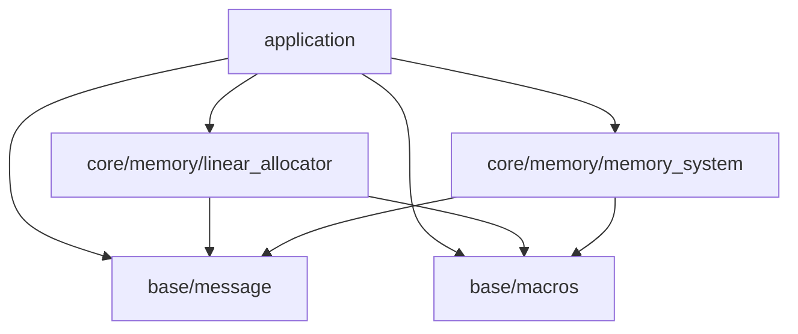

※本記事は [全体イントロダクション](../../articles/introduction.md)のBook1に対応しています。

## このステップでやること

前回はリニアアロケータを実装し、エンジンサブシステム初期化用のメモリを確保できるようにしました。
今回はいよいよエンジンのサブシステムの開発を行っていきます。と言ってもグラフィックス描画はまだ先になります。
まずは今後大量に発生するメモリ要求に対し、
各メモリタグごとにどれくらいメモリを使っているかをトラッキングするシステムを作っていきます。
これを作成することで、全体のメモリ使用量と、各タグごとのメモリ使用量を把握できるようになるため、
メモリプールサイズの検討や、モデルデータ等、各種アセットのサイズ把握に使用していくことができます。

## レイヤー検討

前回、リニアアロケータをcore/memory/linear_allocatorに配置しました。今回作成するメモリシステムも、
メモリトラッキング機能に加え、不定期に発生するメモリ確保要求に対応する機能を持ちます。
なので、リニアアロケータと同じレイヤーに配置することにします。



ただ、ここで、一つ問題があります。前回、今回追加するメモリシステムを作成するためにリニアアロケータを作成すると説明しました。
ただ、上のレイヤー図では、メモリシステムはリニアアロケータに依存していません。この矛盾の解決策については、後ほど実装で説明していくことにします。

レイヤー構成に従い、ディレクトリ構成は下記のようになります。
今回追加するヘッダとソースはchoco_memory.h、choco_memory.cになります。

```console
.
├── build.sh
├── Doxyfile
├── include
│   ├── application
│   │   └── application.h
│   └── engine
│       ├── base
│       │   ├── choco_macros.h
│       │   └── choco_message.h
│       └── core
│           └── memory
│               ├── choco_memory.h
│               └── linear_allocator.h
├── LICENSE
├── makefile_macos.mak
├── README.md
└── src
    ├── application
    │   └── application.c
    ├── engine
    │   ├── base
    │   │   └── choco_message.c
    │   └── core
    │       └── memory
    │           ├── choco_memory.c
    │           └── linear_allocator.c
    └── entry.c
```

## メモリトラッキング機能概要

メモリトラッキングは、各メモリタグごとのメモリ使用量を管理します。
この機能は、ユーザー側がメモリ確保、メモリ解放時に、メモリタグを指定することで実現できます。
実際に実装方法を説明していきます。

### ヘッダファイル作成

まずはヘッダファイル全体を貼り付け、個別に説明していきます。

```c
#ifndef GLCE_ENGINE_CORE_MEMORY_CHOCO_MEMORY_H
#define GLCE_ENGINE_CORE_MEMORY_CHOCO_MEMORY_H

#ifdef __cplusplus
extern "C" {
#endif

#include <stddef.h>

typedef enum {
    MEMORY_TAG_SYSTEM,  /**< メモリタグ: システム系 */
    MEMORY_TAG_STRING,  /**< メモリタグ: 文字列系 */
    MEMORY_TAG_MAX,     /**< メモリタグカウント用max値 */
} memory_tag_t;

typedef enum {
    MEMORY_SYSTEM_SUCCESS,          /**< メモリシステム成功 */
    MEMORY_SYSTEM_INVALID_ARGUMENT, /**< 無効な引数 */
    MEMORY_SYSTEM_RUNTIME_ERROR,    /**< 実行時エラー */
    MEMORY_SYSTEM_NO_MEMORY,        /**< メモリ不足 */
} memory_sys_err_t;

typedef struct memory_system memory_system_t;

void memory_system_preinit(size_t* const memory_requirement_, size_t* const alignment_requirement_);

memory_sys_err_t memory_system_init(memory_system_t* memory_system_);

void memory_system_destroy(memory_system_t* memory_system_);

memory_sys_err_t memory_system_allocate(memory_system_t* memory_system_, size_t size_, memory_tag_t mem_tag_, void** out_ptr_);

void memory_system_free(memory_system_t* memory_system_, void* ptr_, size_t size_, memory_tag_t mem_tag_);

void memory_system_report(const memory_system_t* memory_system_);

#ifdef __cplusplus
}
#endif
#endif
```

***メモリタグ***

```c
typedef enum {
    MEMORY_TAG_SYSTEM,  /**< メモリタグ: システム系 */
    MEMORY_TAG_STRING,  /**< メモリタグ: 文字列系 */
    MEMORY_TAG_MAX,     /**< メモリタグカウント用max値 */
} memory_tag_t;
```

これがメモリトラッキング機能が管理するメモリタグです。現状では2種類のタグを設けてあります。
また、メモリタグの値をループで回す際のループカウンタ上限値としてMEMORY_TAG_MAXを設けてあります。
MEMORY_TAG_MAXはこのように使用します。

```c
for(size_t i = 0; i != MEMORY_TAG_MAX; ++i) {
    // 何かの処理
}
```

***メモリシステムオブジェクト前方宣言***

```c
typedef struct memory_system memory_system_t;
```

linear_allocatorと同様、memory_systemの内部構造もユーザーからは隠蔽するようにします。
こうすることで、間違った使用方法によるmemory_systemの破壊を防ぎます。

***外部公開API***

```c
// メモリシステム初期化準備(リニアアロケータに依存しないようにするための仕組み、詳細は実装参照)
void memory_system_preinit(size_t* const memory_requirement_, size_t* const alignment_requirement_);

// メモリシステム初期化
memory_sys_err_t memory_system_init(memory_system_t* memory_system_);

// メモリシステム破棄(memory_system_自体のメモリは上位レイヤーで破棄する)
void memory_system_destroy(memory_system_t* memory_system_);

// メモリ割り当て処理(mallocのラッパー関数)
memory_sys_err_t memory_system_allocate(memory_system_t* memory_system_, size_t size_, memory_tag_t mem_tag_, void** out_ptr_);

// メモリ解放処理(freeのラッパー関数)
void memory_system_free(memory_system_t* memory_system_, void* ptr_, size_t size_, memory_tag_t mem_tag_);

// メモリ割り当て状態レポート
void memory_system_report(const memory_system_t* memory_system_);
```

### メモリシステム実装(choco_memory.c): オブジェクト内部データ構造

memory_system.hで前方宣言したmemory_systemの内部データ構造を説明します。これは、外部からは仕様を隠蔽するため、
choco_memory.cに記述します。データ構造は下記のようになっています。

```c
struct memory_system {
    size_t total_allocated;                     /**< メモリ総割り当て量 */
    size_t mem_tag_allocated[MEMORY_TAG_MAX];   /**< 各メモリタグごとのメモリ割り当て量 */
    const char* mem_tag_str[MEMORY_TAG_MAX];    /**< 各メモリタグ文字列 */
};
```

次に、実際の実装の詳細について説明していきます。

### メモリシステム初期化準備実装(choco_memory.c): memory_system_preinit

この関数は、メモリシステムがリニアアロケータに依存せず、メモリシステムのメモリを確保するために使用します。
ユーザー側が本APIを呼ぶことで、ユーザーはメモリシステムの必要メモリ量、メモリアライメント要件を取得できます。
このように使用します。こうすることで、上位側でリニアアロケータを使用してメモリシステムのメモリを割り当てることができます。

```c
size_t memory_requirement;        /**< メモリシステム要求メモリ量 */
size_t alignment_requirement;     /**< メモリシステムメモリアライメント要件 */
memory_system_preinit(&memory_requirement, &alignment_requirement);
```

memory_system_preinitの実装を説明します。処理全体を貼り付けます。

```c
void memory_system_preinit(size_t* const memory_requirement_, size_t* const alignment_requirement_) {
    if(NULL == memory_requirement_ || NULL == alignment_requirement_) {
        WARN_MESSAGE("memory_system_preinit - No-op: memory_requirement_ or alignment_requirement_ is NULL.");
        goto cleanup;
    }
    *memory_requirement_ = sizeof(memory_system_t);
    *alignment_requirement_ = alignof(memory_system_t);
    goto cleanup;

cleanup:
    return;
}
```

関数冒頭で引数チェックを行っています。この関数の場合は、間違った使用方法がされることは少ないのではないかと思い、
NULLが渡された際にはワーニングを出力し、何も処理をしないで関数を終了させています。
引数が正常の場合はmemory_system_tのサイズとアライメント要件を引数に入れています。

### メモリシステム初期化処理(choco_memory.c): memory_system_init

次がメモリシステムの初期化処理です。これも全体を貼り付けます。

```c
memory_sys_err_t memory_system_init(memory_system_t* memory_system_) {
    memory_sys_err_t ret = MEMORY_SYSTEM_INVALID_ARGUMENT;
    CHECK_ARG_NULL_GOTO_CLEANUP(memory_system_, MEMORY_SYSTEM_INVALID_ARGUMENT, "memory_system_init", "memory_system_")

    memory_system_->total_allocated = 0;
    for(size_t i = 0; i != MEMORY_TAG_MAX; ++i) {
        memory_system_->mem_tag_allocated[i] = 0;
    }
    memory_system_->mem_tag_str[MEMORY_TAG_SYSTEM] = "system";
    memory_system_->mem_tag_str[MEMORY_TAG_STRING] = "string";

    ret = MEMORY_SYSTEM_SUCCESS;

cleanup:
    return ret;
}
```

処理は、最初に引数チェックをしてエラーを出力します。そのあとは、memory_system_t構造体の初期化をしていきます。
初期化内容は、合計割り当てサイズと、メモリタグごとの割当量を0にしています。
また、メモリタグ文字列をタグごとに初期化しています。特に特筆する内容はないかと思います。

## メモリシステム破棄処理(choco_memory.c): memory_system_destroy

メモリシステムを構築する関数のあとは、破棄を行う関数を作成します。内容は以下のようになっています。

```c
void memory_system_destroy(memory_system_t* memory_system_) {
    if(NULL == memory_system_) {
        goto cleanup;
    }
    memory_system_->total_allocated = 0;
    for(size_t i = 0; i != MEMORY_TAG_MAX; ++i) {
        memory_system_->mem_tag_allocated[i] = 0;
    }

cleanup:
    return;
}
```

メモリ割当量を全て0に初期化するだけのシンプルな内容になっています。

## メモリシステムメモリ割り当て処理(choco_memory.c): memory_system_allocate

この関数では、メモリを割り当てる処理を行いますが、当面はmallocのラッパー関数と、メモリ割当量管理を行います。
将来的にmallocの代替となるメモリアロケータを作成し、そちらを用いる予定です。処理全体像です。

```c
memory_sys_err_t memory_system_allocate(memory_system_t* memory_system_, size_t size_, memory_tag_t mem_tag_, void** out_ptr_) {
    memory_sys_err_t ret = MEMORY_SYSTEM_INVALID_ARGUMENT;
    void* tmp = NULL;

    // Preconditions.
    CHECK_ARG_NULL_GOTO_CLEANUP(memory_system_, MEMORY_SYSTEM_INVALID_ARGUMENT, "memory_system_allocate", "memory_system_")
    CHECK_ARG_NULL_GOTO_CLEANUP(out_ptr_, MEMORY_SYSTEM_INVALID_ARGUMENT, "memory_system_allocate", "out_ptr_")
    CHECK_ARG_NOT_NULL_GOTO_CLEANUP(*out_ptr_, MEMORY_SYSTEM_INVALID_ARGUMENT, "memory_system_allocate", "*out_ptr_")
    CHECK_ARG_NOT_VALID_GOTO_CLEANUP(mem_tag_ < MEMORY_TAG_MAX, MEMORY_SYSTEM_INVALID_ARGUMENT, "memory_system_allocate", "mem_tag_")
    if(0 == size_) {
        WARN_MESSAGE("memory_system_allocate - No-op: size_ is 0.");
        ret = MEMORY_SYSTEM_SUCCESS;
        goto cleanup;
    }
    if(memory_system_->mem_tag_allocated[mem_tag_] > (SIZE_MAX - size_)) {
        ERROR_MESSAGE("memory_system_allocate(INVALID_ARGUMENT) - size_t overflow: tag=%s used=%zu, requested=%zu, sum would exceed SIZE_MAX.", memory_system_->mem_tag_str[mem_tag_], memory_system_->mem_tag_allocated[mem_tag_], size_);
        ret = MEMORY_SYSTEM_INVALID_ARGUMENT;
        goto cleanup;
    }
    if(memory_system_->total_allocated > (SIZE_MAX - size_)) {
        ERROR_MESSAGE("memory_system_allocate(INVALID_ARGUMENT) - size_t overflow: total_allocated=%zu, requested=%zu, sum would exceed SIZE_MAX.", memory_system_->total_allocated, size_);
        ret = MEMORY_SYSTEM_INVALID_ARGUMENT;
        goto cleanup;
    }

    // Simulation.
    tmp = test_malloc(size_);
    CHECK_ALLOC_FAIL_GOTO_CLEANUP(tmp, MEMORY_SYSTEM_NO_MEMORY, "memory_system_allocate", "tmp")
    memset(tmp, 0, size_);

    // commit.
    *out_ptr_ = tmp;
    memory_system_->total_allocated += size_;
    memory_system_->mem_tag_allocated[mem_tag_] += size_;
    ret = MEMORY_SYSTEM_SUCCESS;

cleanup:
    return ret;
}
```

***エラー処理***

処理はちょっと長いのですが、内容はシンプルです。まずエラー処理です。

```c
CHECK_ARG_NULL_GOTO_CLEANUP(memory_system_, MEMORY_SYSTEM_INVALID_ARGUMENT, "memory_system_allocate", "memory_system_")
CHECK_ARG_NULL_GOTO_CLEANUP(out_ptr_, MEMORY_SYSTEM_INVALID_ARGUMENT, "memory_system_allocate", "out_ptr_")
CHECK_ARG_NOT_NULL_GOTO_CLEANUP(*out_ptr_, MEMORY_SYSTEM_INVALID_ARGUMENT, "memory_system_allocate", "*out_ptr_")
CHECK_ARG_NOT_VALID_GOTO_CLEANUP(mem_tag_ < MEMORY_TAG_MAX, MEMORY_SYSTEM_INVALID_ARGUMENT, "memory_system_allocate", "mem_tag_")
if(0 == size_) {
    WARN_MESSAGE("memory_system_allocate - No-op: size_ is 0.");
    ret = MEMORY_SYSTEM_SUCCESS;
    goto cleanup;
}
if(memory_system_->mem_tag_allocated[mem_tag_] > (SIZE_MAX - size_)) {
    ERROR_MESSAGE("memory_system_allocate(INVALID_ARGUMENT) - size_t overflow: tag=%s used=%zu, requested=%zu, sum would exceed SIZE_MAX.", memory_system_->mem_tag_str[mem_tag_], memory_system_->mem_tag_allocated[mem_tag_], size_);
    ret = MEMORY_SYSTEM_INVALID_ARGUMENT;
    goto cleanup;
}
if(memory_system_->total_allocated > (SIZE_MAX - size_)) {
    ERROR_MESSAGE("memory_system_allocate(INVALID_ARGUMENT) - size_t overflow: total_allocated=%zu, requested=%zu, sum would exceed SIZE_MAX.", memory_system_->total_allocated, size_);
    ret = MEMORY_SYSTEM_INVALID_ARGUMENT;
    goto cleanup;
}
```

エラーチェック内容は、いつものように引数のNULLチェックに加え、メモリタグが正常な値かをチェックしています。
また、割り当て要求サイズを割り当てた結果、割当量管理の値がオーバーフローしないかをチェックしています。

***メモリ割り当て処理***

```c
tmp = test_malloc(size_);
CHECK_ALLOC_FAIL_GOTO_CLEANUP(tmp, MEMORY_SYSTEM_NO_MEMORY, "memory_system_allocate", "tmp")
memset(tmp, 0, size_);
```

ここではtest_mallocを使用していますが、これはテスト用に用意したmallocのラッパー関数で、mallocと読み替えて問題ありません。
mallocで要求サイズを割り当て、割り当て成功かをチェックし、メモリ領域を初期化しています。

***割当量の更新***

```c
*out_ptr_ = tmp;
memory_system_->total_allocated += size_;
memory_system_->mem_tag_allocated[mem_tag_] += size_;
ret = MEMORY_SYSTEM_SUCCESS;
```
