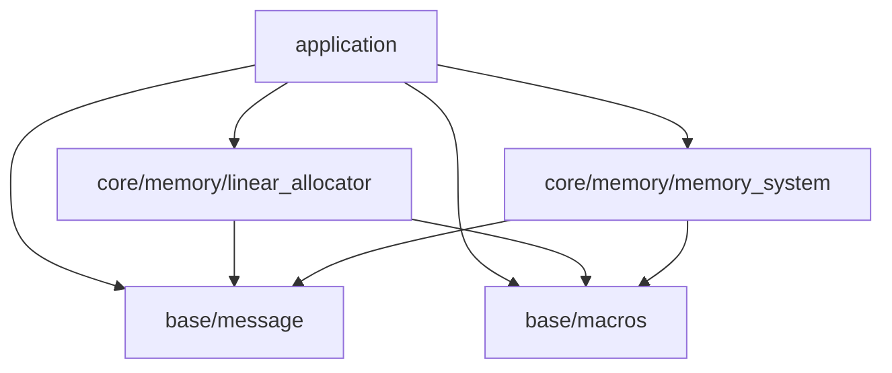

※本記事は [全体イントロダクション](../../articles/introduction.md)のBook1に対応しています。

## このステップでやること

前回はリニアアロケータを実装し、エンジンサブシステム初期化用のメモリを確保できるようにしました。

今回はいよいよエンジンのサブシステムの開発を行っていきます。と言ってもグラフィックス描画はまだ先になります。まずは今後大量に発生するメモリ要求に対し、各メモリタグごとにどれくらいメモリを使っているかをトラッキングするシステムを作っていきます。ここで、メモリタグとは、例えば、文字列、テクスチャ等のメモリの使用種別を意味します。

これを作成することで、全体のメモリ使用量と、各タグごとのメモリ使用量を把握できるようになるため、メモリプールサイズの検討や、モデルデータ等、各種アセットのサイズ把握に使用していくことができます。

## レイヤー検討

前回、リニアアロケータをcore/memory/linear_allocatorに配置しました。今回作成するメモリシステムも、メモリトラッキング機能に加え、不定期に発生するメモリ確保要求に対応する機能を持ちます。なので、リニアアロケータと同じレイヤーに配置することにします。



ただ、ここで、一つ問題があります。前回、今回追加するメモリシステムのメモリを確保するためにリニアアロケータを作成すると説明しました。上のレイヤー図では、メモリシステムはリニアアロケータに依存していません。この矛盾の解決策については、後ほど実装の解説をする際に紹介します。

レイヤー構成に従い、ディレクトリ構成は下記のようになります。今回追加するヘッダとソースはchoco_memory.h、choco_memory.cになります。

```console
.
├── build.sh
├── Doxyfile
├── include
│   ├── application
│   │   └── application.h
│   └── engine
│       ├── base
│       │   ├── choco_macros.h
│       │   └── choco_message.h
│       └── core
│           └── memory
│               ├── choco_memory.h
│               └── linear_allocator.h
├── LICENSE
├── makefile_macos.mak
├── README.md
└── src
    ├── application
    │   └── application.c
    ├── engine
    │   ├── base
    │   │   └── choco_message.c
    │   └── core
    │       └── memory
    │           ├── choco_memory.c
    │           └── linear_allocator.c
    └── entry.c
```

## メモリトラッキング機能概要

メモリトラッキングは、各メモリタグごとのメモリ使用量を管理します。この機能は、ユーザー側がメモリ確保・解放を行う際に、メモリタグを指定することで実現できます。実際に実装方法を説明していきます。

### ヘッダファイル作成

まずはヘッダファイル全体を貼り付け、個別に説明していきます。

```c
#ifndef GLCE_ENGINE_CORE_MEMORY_CHOCO_MEMORY_H
#define GLCE_ENGINE_CORE_MEMORY_CHOCO_MEMORY_H

#ifdef __cplusplus
extern "C" {
#endif

#include <stddef.h>

typedef enum {
    MEMORY_TAG_SYSTEM,  /**< メモリタグ: システム系 */
    MEMORY_TAG_STRING,  /**< メモリタグ: 文字列系 */
    MEMORY_TAG_MAX,     /**< メモリタグカウント用max値 */
} memory_tag_t;

typedef enum {
    MEMORY_SYSTEM_SUCCESS,          /**< メモリシステム成功 */
    MEMORY_SYSTEM_INVALID_ARGUMENT, /**< 無効な引数 */
    MEMORY_SYSTEM_RUNTIME_ERROR,    /**< 実行時エラー */
    MEMORY_SYSTEM_NO_MEMORY,        /**< メモリ不足 */
} memory_sys_err_t;

typedef struct memory_system memory_system_t;

void memory_system_preinit(size_t* const memory_requirement_, size_t* const alignment_requirement_);

memory_sys_err_t memory_system_init(memory_system_t* memory_system_);

void memory_system_destroy(memory_system_t* memory_system_);

memory_sys_err_t memory_system_allocate(memory_system_t* memory_system_, size_t size_, memory_tag_t mem_tag_, void** out_ptr_);

void memory_system_free(memory_system_t* memory_system_, void* ptr_, size_t size_, memory_tag_t mem_tag_);

void memory_system_report(const memory_system_t* memory_system_);

#ifdef __cplusplus
}
#endif
#endif
```

***メモリタグ***

```c
typedef enum {
    MEMORY_TAG_SYSTEM,  /**< メモリタグ: システム系 */
    MEMORY_TAG_STRING,  /**< メモリタグ: 文字列系 */
    MEMORY_TAG_MAX,     /**< メモリタグカウント用max値 */
} memory_tag_t;
```

これがメモリトラッキング機能が管理するメモリタグです。現状では2種類のタグを設けてあります。また、メモリタグの値をループで回す際のループカウンタ上限値としてMEMORY_TAG_MAXを設けてあります。MEMORY_TAG_MAXはこのように使用します。

```c
for(size_t i = 0; i != MEMORY_TAG_MAX; ++i) {
    // 何かの処理
}
```

***メモリシステムオブジェクト前方宣言***

```c
typedef struct memory_system memory_system_t;
```

linear_allocatorと同様、memory_systemの内部構造もユーザーからは隠蔽するようにします。こうすることで、間違った使用方法によるmemory_systemの破壊を防ぎます。

***外部公開API***

```c
// メモリシステム初期化準備(リニアアロケータに依存しないようにするための仕組み、詳細は実装参照)
void memory_system_preinit(size_t* const memory_requirement_, size_t* const alignment_requirement_);

// メモリシステム初期化
memory_sys_err_t memory_system_init(memory_system_t* memory_system_);

// メモリシステム破棄(memory_system_自体のメモリは上位レイヤーで破棄する)
void memory_system_destroy(memory_system_t* memory_system_);

// メモリ割り当て処理(mallocのラッパー関数)
memory_sys_err_t memory_system_allocate(memory_system_t* memory_system_, size_t size_, memory_tag_t mem_tag_, void** out_ptr_);

// メモリ解放処理(freeのラッパー関数)
void memory_system_free(memory_system_t* memory_system_, void* ptr_, size_t size_, memory_tag_t mem_tag_);

// メモリ割り当て状態レポート
void memory_system_report(const memory_system_t* memory_system_);
```

### メモリシステム実装(choco_memory.c): オブジェクト内部データ構造

memory_system.hで前方宣言したmemory_systemの内部データ構造を説明します。これは、外部からは仕様を隠蔽するため、choco_memory.cに記述します。データ構造は下記のようになっています。

```c
struct memory_system {
    size_t total_allocated;                     /**< メモリ総割り当て量 */
    size_t mem_tag_allocated[MEMORY_TAG_MAX];   /**< 各メモリタグごとのメモリ割り当て量 */
    const char* mem_tag_str[MEMORY_TAG_MAX];    /**< 各メモリタグ文字列 */
};
```

次に、実際の実装の詳細について説明していきます。

### メモリシステム初期化準備実装(choco_memory.c): memory_system_preinit

この関数は、メモリシステムがリニアアロケータに依存せず、メモリシステムのメモリを確保するために使用します。ユーザー側が本APIを呼ぶことで、ユーザーはメモリシステムの必要メモリ量、メモリアライメント要件を取得できます。

このように使用します。こうすることで、上位側でリニアアロケータを使用してメモリシステムのメモリを割り当てることができます。

```c
size_t memory_requirement;        /**< メモリシステム要求メモリ量 */
size_t alignment_requirement;     /**< メモリシステムメモリアライメント要件 */
memory_system_preinit(&memory_requirement, &alignment_requirement);
```

memory_system_preinitの実装を説明します。処理全体を貼り付けます。

```c
void memory_system_preinit(size_t* const memory_requirement_, size_t* const alignment_requirement_) {
    if(NULL == memory_requirement_ || NULL == alignment_requirement_) {
        WARN_MESSAGE("memory_system_preinit - No-op: memory_requirement_ or alignment_requirement_ is NULL.");
        goto cleanup;
    }
    *memory_requirement_ = sizeof(memory_system_t);
    *alignment_requirement_ = alignof(memory_system_t);
    goto cleanup;

cleanup:
    return;
}
```

関数冒頭で引数チェックを行っています。この関数の場合は、間違った使用方法がされることは少ないのではないかと思い、NULLが渡された際にはワーニングを出力し、何も処理をしないで関数を終了させています。引数が正常の場合はmemory_system_tのサイズとアライメント要件を引数に入れています。

### メモリシステム初期化処理(choco_memory.c): memory_system_init

次がメモリシステムの初期化処理です。これも全体を貼り付けます。

```c
memory_sys_err_t memory_system_init(memory_system_t* memory_system_) {
    memory_sys_err_t ret = MEMORY_SYSTEM_INVALID_ARGUMENT;
    CHECK_ARG_NULL_GOTO_CLEANUP(memory_system_, MEMORY_SYSTEM_INVALID_ARGUMENT, "memory_system_init", "memory_system_")

    memory_system_->total_allocated = 0;
    for(size_t i = 0; i != MEMORY_TAG_MAX; ++i) {
        memory_system_->mem_tag_allocated[i] = 0;
    }
    memory_system_->mem_tag_str[MEMORY_TAG_SYSTEM] = "system";
    memory_system_->mem_tag_str[MEMORY_TAG_STRING] = "string";

    ret = MEMORY_SYSTEM_SUCCESS;

cleanup:
    return ret;
}
```

処理は、最初に引数チェックをしてエラーを出力します。そのあとは、memory_system_t構造体の初期化をしていきます。

初期化内容は、合計割り当てサイズと、メモリタグごとの割り当て量を0にしています。また、メモリタグ文字列をタグごとに初期化しています。特に特筆する内容はないかと思います。

## メモリシステム破棄処理(choco_memory.c): memory_system_destroy

メモリシステムを構築する関数のあとは、破棄を行う関数を作成します。内容は以下のようになっています。

```c
void memory_system_destroy(memory_system_t* memory_system_) {
    if(NULL == memory_system_) {
        goto cleanup;
    }
    memory_system_->total_allocated = 0;
    for(size_t i = 0; i != MEMORY_TAG_MAX; ++i) {
        memory_system_->mem_tag_allocated[i] = 0;
    }

cleanup:
    return;
}
```

メモリ割り当て量を全て0に初期化するだけのシンプルな内容になっています。

## メモリシステムメモリ割り当て処理(choco_memory.c): memory_system_allocate

この関数では、メモリを割り当てる処理を行いますが、当面はmallocのラッパー関数と、メモリ割り当て量管理を行います。将来的にmallocの代替となるメモリアロケータを作成し、そちらを用いる予定です。処理全体像です。

```c
memory_sys_err_t memory_system_allocate(memory_system_t* memory_system_, size_t size_, memory_tag_t mem_tag_, void** out_ptr_) {
    memory_sys_err_t ret = MEMORY_SYSTEM_INVALID_ARGUMENT;
    void* tmp = NULL;

    // Preconditions.
    CHECK_ARG_NULL_GOTO_CLEANUP(memory_system_, MEMORY_SYSTEM_INVALID_ARGUMENT, "memory_system_allocate", "memory_system_")
    CHECK_ARG_NULL_GOTO_CLEANUP(out_ptr_, MEMORY_SYSTEM_INVALID_ARGUMENT, "memory_system_allocate", "out_ptr_")
    CHECK_ARG_NOT_NULL_GOTO_CLEANUP(*out_ptr_, MEMORY_SYSTEM_INVALID_ARGUMENT, "memory_system_allocate", "*out_ptr_")
    CHECK_ARG_NOT_VALID_GOTO_CLEANUP(mem_tag_ < MEMORY_TAG_MAX, MEMORY_SYSTEM_INVALID_ARGUMENT, "memory_system_allocate", "mem_tag_")
    if(0 == size_) {
        WARN_MESSAGE("memory_system_allocate - No-op: size_ is 0.");
        ret = MEMORY_SYSTEM_SUCCESS;
        goto cleanup;
    }
    if(memory_system_->mem_tag_allocated[mem_tag_] > (SIZE_MAX - size_)) {
        ERROR_MESSAGE("memory_system_allocate(INVALID_ARGUMENT) - size_t overflow: tag=%s used=%zu, requested=%zu, sum would exceed SIZE_MAX.", memory_system_->mem_tag_str[mem_tag_], memory_system_->mem_tag_allocated[mem_tag_], size_);
        ret = MEMORY_SYSTEM_INVALID_ARGUMENT;
        goto cleanup;
    }
    if(memory_system_->total_allocated > (SIZE_MAX - size_)) {
        ERROR_MESSAGE("memory_system_allocate(INVALID_ARGUMENT) - size_t overflow: total_allocated=%zu, requested=%zu, sum would exceed SIZE_MAX.", memory_system_->total_allocated, size_);
        ret = MEMORY_SYSTEM_INVALID_ARGUMENT;
        goto cleanup;
    }

    // Simulation.
    tmp = test_malloc(size_);
    CHECK_ALLOC_FAIL_GOTO_CLEANUP(tmp, MEMORY_SYSTEM_NO_MEMORY, "memory_system_allocate", "tmp")
    memset(tmp, 0, size_);

    // commit.
    *out_ptr_ = tmp;
    memory_system_->total_allocated += size_;
    memory_system_->mem_tag_allocated[mem_tag_] += size_;
    ret = MEMORY_SYSTEM_SUCCESS;

cleanup:
    return ret;
}
```

***エラー処理***

処理はちょっと長いのですが、内容はシンプルです。まずエラー処理です。

```c
CHECK_ARG_NULL_GOTO_CLEANUP(memory_system_, MEMORY_SYSTEM_INVALID_ARGUMENT, "memory_system_allocate", "memory_system_")
CHECK_ARG_NULL_GOTO_CLEANUP(out_ptr_, MEMORY_SYSTEM_INVALID_ARGUMENT, "memory_system_allocate", "out_ptr_")
CHECK_ARG_NOT_NULL_GOTO_CLEANUP(*out_ptr_, MEMORY_SYSTEM_INVALID_ARGUMENT, "memory_system_allocate", "*out_ptr_")
CHECK_ARG_NOT_VALID_GOTO_CLEANUP(mem_tag_ < MEMORY_TAG_MAX, MEMORY_SYSTEM_INVALID_ARGUMENT, "memory_system_allocate", "mem_tag_")
if(0 == size_) {
    WARN_MESSAGE("memory_system_allocate - No-op: size_ is 0.");
    ret = MEMORY_SYSTEM_SUCCESS;
    goto cleanup;
}
if(memory_system_->mem_tag_allocated[mem_tag_] > (SIZE_MAX - size_)) {
    ERROR_MESSAGE("memory_system_allocate(INVALID_ARGUMENT) - size_t overflow: tag=%s used=%zu, requested=%zu, sum would exceed SIZE_MAX.", memory_system_->mem_tag_str[mem_tag_], memory_system_->mem_tag_allocated[mem_tag_], size_);
    ret = MEMORY_SYSTEM_INVALID_ARGUMENT;
    goto cleanup;
}
if(memory_system_->total_allocated > (SIZE_MAX - size_)) {
    ERROR_MESSAGE("memory_system_allocate(INVALID_ARGUMENT) - size_t overflow: total_allocated=%zu, requested=%zu, sum would exceed SIZE_MAX.", memory_system_->total_allocated, size_);
    ret = MEMORY_SYSTEM_INVALID_ARGUMENT;
    goto cleanup;
}
```

エラーチェック内容は、いつものように引数のNULLチェックに加え、メモリタグが正常な値かをチェックしています。また、割り当て要求サイズを割り当てた結果、割り当て量管理の値がオーバーフローしないかをチェックしています。

***メモリ割り当て処理***

```c
tmp = test_malloc(size_);
CHECK_ALLOC_FAIL_GOTO_CLEANUP(tmp, MEMORY_SYSTEM_NO_MEMORY, "memory_system_allocate", "tmp")
memset(tmp, 0, size_);
```

ここではtest_mallocを使用していますが、これはテスト用に用意したmallocのラッパー関数で、mallocと読み替えて問題ありません。mallocで要求サイズを割り当て、割り当て成功かをチェックし、メモリ領域を初期化しています。

***割り当て量の更新***

```c
*out_ptr_ = tmp;
memory_system_->total_allocated += size_;
memory_system_->mem_tag_allocated[mem_tag_] += size_;
ret = MEMORY_SYSTEM_SUCCESS;
```

割り当て量の更新処理はシンプルです。与えられたメモリタグに対応する割り当て量と、総割り当て量に加算するだけです。この関数は、失敗した際のクリーンナップ処理はないので、以上で終了です。

次はメモリ解放処理について説明します。

## メモリシステムメモリ解放処理(choco_memory.c): memory_system_free

メモリ解放処理についてもまずは全体を貼り付けます。

```c
void memory_system_free(memory_system_t* memory_system_, void* ptr_, size_t size_, memory_tag_t mem_tag_) {
    if(NULL == memory_system_) {
        WARN_MESSAGE("memory_system_free - No-op: memory_system_ is NULL.");
        goto cleanup;
    }
    if(NULL == ptr_) {
        WARN_MESSAGE("memory_system_free - No-op: ptr_ is NULL.");
        goto cleanup;
    }
    if(mem_tag_ >= MEMORY_TAG_MAX) {
        WARN_MESSAGE("memory_system_free - No-op: invalid mem_tag_.");
        goto cleanup;
    }
    if(memory_system_->mem_tag_allocated[mem_tag_] < size_) {
        WARN_MESSAGE("memory_system_free - No-op: mem_tag_allocated broken.");
        goto cleanup;
    }
    if(memory_system_->total_allocated < size_) {
        WARN_MESSAGE("memory_system_free: No-op: total_allocated broken.");
        goto cleanup;
    }

    free(ptr_);
    memory_system_->total_allocated -= size_;
    memory_system_->mem_tag_allocated[mem_tag_] -= size_;
cleanup:
    return;
}
```

この関数はvoid型としており、異常な引数が与えられたときや、メモリ割り当て量が0未満になる際にはワーニングのみとしています。標準ライブラリのfreeがvoid型であるため、それに合わせたかったのが理由です。

解放処理もメモリ割り当て処理と同様に、指定されたメモリタグの割り当て量と、総割り当て量から指定されたサイズを減算するのみです。

ここで、仮にユーザーが割り当て時に指定したタグと異なるタグをfreeで指定した場合、割り当て量の値がおかしくなります。これについては使用上の制約とします。今後もう少し複雑な仕組みを導入することによって解決することにし、当面はこのシンプルな構造を使用していきます。

以上がメモリ解放処理です。次はメモリシステムの割り当て量レポート処理について説明します。

## メモリシステムメモリレポート処理(choco_memory.c): memory_system_report

以下がmemory_system_reportの全体像です。

```c
void memory_system_report(const memory_system_t* memory_system_) {
    if(NULL == memory_system_) {
        WARN_MESSAGE("memory_system_report - No-op: memory_system_ is NULL.");
        goto cleanup;
    }
    INFO_MESSAGE("memory_system_report");
    fprintf(stdout, "\033[1;35m\tTotal allocated: %zu\n", memory_system_->total_allocated);
    fprintf(stdout, "\tMemory tag allocated:\n");
    for(size_t i = 0; i != MEMORY_TAG_MAX; ++i) {
        const char* const tag_str = memory_system_->mem_tag_str[i];
        fprintf(stdout, "\t\ttag(%s): %zu\n", (NULL != tag_str) ? tag_str : "unknown", memory_system_->mem_tag_allocated[i]);
    }
    fprintf(stdout, "\033[0m\n");
cleanup:
    return;
}
```

この処理では、これまでのメッセージ出力と異なり、fprintfを使用して標準出力に出力しています。これは、出力内容が複数行にまたがり、2行目以降に[INFORMATION]を付加したくないためこうしています。今後、行頭に[INFORMATION]等を付加しないメッセージ出力関数を作成するかもしれません。当面はこのままにします。

また、memory_system_->mem_tag_strについては、memory_system_initで初期化しているのですが、今後、メモリタグが増えた際、初期化を忘れた時のことを考慮し、値が入っていなければ"unknown"と出力するようにしています。

ここまででメモリシステムが保有するAPIの説明になります。ここからは、作成したメモリシステムをapplication側で起動していく処理を作成していきます。

## メモリシステム起動処理(application.c)

***アプリケーション内部状態管理オブジェクトへの追加***

まず、アプリケーション内部状態管理オブジェクトにメモリシステムオブジェクトを追加します。
メモリシステムの必要メモリ量、メモリアライメント要件も一緒に保存するようにします。

```c
typedef struct app_state {
    // core/memory/linear_allocator
    linear_alloc_t* linear_allocator;   /**< リニアアロケータオブジェクト */

    // core/memory/memory_system
    size_t memory_system_memory_requirement;        /**< メモリシステム要求メモリ量 */
    size_t memory_system_alignment_requirement;     /**< メモリシステムメモリアライメント要件 */
    memory_system_t* memory_system;                 /**< メモリシステム内部状態管理オブジェクトへのポインタ */
} app_state_t;
```

***メモリシステム起動処理の追加***

次に、application_createでメモリシステムを起動する処理を追加していきます。追加する処理は、リニアアロケータの起動が完了した後にします。

```c
app_err_t application_create(void) {
    app_err_t ret = APPLICATION_RUNTIME_ERROR;
    linear_alloc_err_t ret_linear_alloc = LINEAR_ALLOC_INVALID_ARGUMENT;

    app_state_t* tmp = NULL;

    //////////////////////////////////
    // ここから追加
    void* tmp_memory_system_ptr = NULL;

    linear_alloc_err_t ret_memory_system_allocate = LINEAR_ALLOC_INVALID_ARGUMENT;
    memory_sys_err_t ret_memory_system_init = MEMORY_SYSTEM_INVALID_ARGUMENT;
    // ここまで追加
    //////////////////////////////////

    // Preconditions
    if(NULL != s_app_state) {
        ERROR_MESSAGE("application_create(RUNTIME_ERROR) - Application state is already initialized.\n");
        ret = APPLICATION_RUNTIME_ERROR;
        goto cleanup;
    }

    // begin Simulation
    tmp = (app_state_t*)malloc(sizeof(*tmp));
    if(NULL == tmp) {
        ERROR_MESSAGE("application_create(NO_MEMORY) - Failed to allocate app_state memory.\n");
        ret = APPLICATION_NO_MEMORY;
        goto cleanup;
    }
    memset(tmp, 0, sizeof(*tmp));

    // begin Simulation -> launch all systems.(Don't use s_app_state here.)

    // Simulation -> launch all systems -> create linear allocator.(Don't use s_app_state here.)
    tmp->linear_allocator = NULL;
    ret_linear_alloc = linear_allocator_create(&tmp->linear_allocator, 1 * KIB);
    if(LINEAR_ALLOC_NO_MEMORY == ret_linear_alloc) {
        ERROR_MESSAGE("Failed to create linear allocator.");
        ret = APPLICATION_NO_MEMORY;
        goto cleanup;
    } else if(LINEAR_ALLOC_INVALID_ARGUMENT == ret_linear_alloc) {
        ERROR_MESSAGE("Failed to create linear allocator.");
        ret = APPLICATION_INVALID_ARGUMENT;
        goto cleanup;
    } else if(LINEAR_ALLOC_SUCCESS != ret_linear_alloc) {
        ERROR_MESSAGE("Failed to create linear allocator.");
        ret = APPLICATION_UNDEFINED_ERROR;
        goto cleanup;
    }

    //////////////////////////////////
    // ここから追加
    // Simulation -> launch all systems -> create memory system.(Don't use s_app_state here.)
    tmp->memory_system = NULL;
    memory_system_preinit(&tmp->memory_system_memory_requirement, &tmp->memory_system_alignment_requirement);
    ret_memory_system_allocate = linear_allocator_allocate(tmp->linear_allocator, tmp->memory_system_memory_requirement, tmp->memory_system_alignment_requirement, &tmp_memory_system_ptr);
    if(LINEAR_ALLOC_NO_MEMORY == ret_memory_system_allocate) {
        ERROR_MESSAGE("Failed to allocate memory system memory.");
        ret = APPLICATION_NO_MEMORY;
        goto cleanup;
    } else if(LINEAR_ALLOC_INVALID_ARGUMENT == ret_memory_system_allocate) {
        ERROR_MESSAGE("Failed to allocate memory system memory.");
        ret = APPLICATION_INVALID_ARGUMENT;
        goto cleanup;
    }
    ret_memory_system_init = memory_system_init((memory_system_t*)tmp_memory_system_ptr);
    if(MEMORY_SYSTEM_INVALID_ARGUMENT == ret_memory_system_init) {
        ERROR_MESSAGE("Failed to initialize memory system.");
        ret = APPLICATION_INVALID_ARGUMENT;
        goto cleanup;
    }
    tmp->memory_system = (memory_system_t*)tmp_memory_system_ptr;
    // ここまで追加
    //////////////////////////////////

    // end Simulation -> launch all systems.
    // end Simulation

    // commit
    s_app_state = tmp;
    ret = APPLICATION_SUCCESS;

cleanup:
    if(APPLICATION_SUCCESS != ret) {
        if(NULL != tmp && NULL != tmp->memory_system) {
            memory_system_destroy(tmp->memory_system);
        }
        if(NULL != tmp) {
            linear_allocator_destroy(&tmp->linear_allocator);
            free(tmp);
            tmp = NULL;
        }
    }

    return ret;
}
```

エラー処理があるため行が多くなっていますが、やっていることはシンプルで、

```c
    tmp->memory_system = NULL;
    // メモリシステムのサイズとアライメント要件を取得
    memory_system_preinit(&tmp->memory_system_memory_requirement, &tmp->memory_system_alignment_requirement);

    // リニアアロケータでメモリ領域を取得
    ret_memory_system_allocate = linear_allocator_allocate(tmp->linear_allocator, tmp->memory_system_memory_requirement, tmp->memory_system_alignment_requirement, &tmp_memory_system_ptr);

    // メモリシステム初期化
    ret_memory_system_init = memory_system_init((memory_system_t*)tmp_memory_system_ptr);
    tmp->memory_system = (memory_system_t*)tmp_memory_system_ptr;
```

最後に処理が失敗した際の解放処理を追加して終了です。次に、application終了処理にメモリシステムの終了処理を追加します。

## メモリシステム停止処理(application.c)

```c
void application_destroy(void) {
    if(NULL == s_app_state) {
        goto cleanup;
    }

    // begin cleanup all systems.
    memory_system_destroy(s_app_state->memory_system);
    linear_allocator_destroy(&s_app_state->linear_allocator);
    // end cleanup all systems.

    free(s_app_state);
    s_app_state = NULL;
cleanup:
    return;
}
```

ここについてはシンプルにmemory_system_destroyを呼ぶだけです。注意点は、起動時の逆順で停止することで、必ずリニアアロケータよりも前で停止する必要があります。

最後に、application_runでmemory_system_reportを実行すると、このような出力が標準出力にされます。


以上がメモリシステムの解説になります。

ところで、ここまで多くの処理を書いてきました。ただ、様々なAPI仕様等をドキュメントとして残していません。今後、多くの機能を作っていく中で、どうしてもAPIの使用方法を忘れたりする場合も出てきます。なので、次回は仕様を整理して残す仕組みとしてdoxygenによるドキュメント生成を行っていきます。
