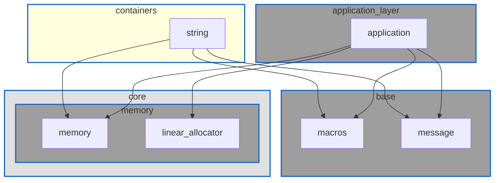

※本記事は [全体イントロダクション](https://zenn.dev/chocolate_pie24/articles/c-glfw-game-engine-introduction)のBook2に対応しています。

## このステップでやること

ここからはGLFWを使ってウィンドウを生成する処理を作っていきます。ウィンドウには名称が必要で、名称は文字列として管理することになります。
なので、まずは準備としてシンプルな文字列コンテナを作成していくことにします。

文字列についてはchar*やchar[]を使用することでも機能上は問題はありません。
しかし、今後追加される文字列のコピーや連結処理には必ず文字列格納バッファの管理が必要となってきます。
さらに、文字列処理は文字列長さが終端文字`\0`を含むのか、含まないのか、を常に把握する必要が出てきます。

これらの煩雑な処理や守らなくてはいけないルールを全てコンテナオブジェクトに一任することで、バグの発生を防ぎます。

## 文字列コンテナレイヤー

文字列コンテナは自身でリソースの管理を行いますが、これは不定期に発生するメモリ確保であるため、メモリシステムを使用してメモリを確保、解放することにします。
よって、coreレイヤーの上位にcontainersレイヤーを追加して配置することにします。

TODO: 色調整



## 今回作成する文字列コンテナ

今回作成する文字列コンテナに実装する機能について説明します。

文字列コンテナはcore/messageの上位レイヤーに属するため、core/messageのインターフェイスは従来どおりchar*とします。
このため文字列コンテナから文字列への変換機能を作成することにします。
なお、将来的には文字列の連結、比較等の処理も追加していきますが、当面はシンプルに最小限の機能に絞って実装することにします。

保有機能は下記のようになっています。なお、文字列コンテナオブジェクトの内部データについては外部からは隠蔽することにし、ソース内で定義します。
こうすることで、APIの誤用を防ぎます。

```c
#ifndef GLCE_ENGINE_CONTAINERS_CHOCO_STRING_H
#define GLCE_ENGINE_CONTAINERS_CHOCO_STRING_H

#ifdef __cplusplus
extern "C" {
#endif

#include <stdbool.h>
#include <stddef.h>

typedef struct choco_string choco_string_t;

typedef enum {
    CHOCO_STRING_SUCCESS = 0,       /**< 処理成功 */
    CHOCO_STRING_NO_MEMORY,         /**< メモリ確保に失敗 */
    CHOCO_STRING_INVALID_ARGUMENT,  /**< 無効な引数 */
    CHOCO_STRING_UNDEFINED_ERROR,   /**< 未定義エラー */
} choco_string_result_t;

// 文字列コンテナデフォルトコンストラクタ
choco_string_result_t choco_string_default_create(choco_string_t** string_);

// 文字列コンテナコンストラクタ(文字列を使用したで初期化)
choco_string_result_t choco_string_create_from_char(choco_string_t** string_, const char* src_);

// 文字列コンテナデストラクタ
void choco_string_destroy(choco_string_t** string_);

// 文字列コンテナのコピー(dst_は初期化されている必要あり)
choco_string_result_t choco_string_copy(choco_string_t* dst_, const choco_string_t* src_);

// 文字列の文字列コンテナへのコピー(dst_は初期化されている必要あり)
choco_string_result_t choco_string_copy_from_char(choco_string_t* dst_, const char* src_);

// 文字列長さの取得
size_t choco_string_length(const choco_string_t* string_);

// 文字列コンテナから文字列への変換
const char* choco_string_c_str(const choco_string_t* string_);

#ifdef __cplusplus
}
#endif
#endif

/** @}*/

```

## 文字列コンテナ実装解説

各APIについて実装の解説を行っていきます。

### 内部データ構造

まずは文字列コンテナの内部データ構造を示します。中身はシンプルで、文字列格納バッファ、文字列長さ、バッファ容量のみとなっています。

```c
struct choco_string {
    size_t len;         /**< 文字列長さ(終端文字は含まない) */
    size_t capacity;    /**< バッファサイズ */
    char* buffer;       /**< 文字列格納バッファ */
};
```

### ヘルパー関数

choco_string.c内ではメモリシステムAPIであるmemory_system_allocateを多用することになります。
エラー処理を用意にするため、プライベート関数として以下の関数を用意しました。

内容はmemory_system_allocateを実行し、エラーコードをchoco_string_result_t型に変換するだけです。
memory_system_allocate実行の際に与えるメモリータグはもちろんMEMORY_TAG_STRINGとなります。

```c
static choco_string_result_t string_malloc(size_t size_, void** out_ptr_) {
    void* tmp_ptr = NULL;
    choco_string_result_t ret = CHOCO_STRING_INVALID_ARGUMENT;
    memory_system_result_t ret_mem = MEMORY_SYSTEM_INVALID_ARGUMENT;
    ret_mem = memory_system_allocate(size_, MEMORY_TAG_STRING, &tmp_ptr);
    if(MEMORY_SYSTEM_INVALID_ARGUMENT == ret_mem) {
        ret = CHOCO_STRING_INVALID_ARGUMENT;
        goto cleanup;
    } else if(MEMORY_SYSTEM_NO_MEMORY == ret_mem) {
        ret = CHOCO_STRING_NO_MEMORY;
        goto cleanup;
    } else if(MEMORY_SYSTEM_SUCCESS != ret_mem) {
        ret = CHOCO_STRING_UNDEFINED_ERROR;
        goto cleanup;
    }
    *out_ptr_ = tmp_ptr;
    ret = CHOCO_STRING_SUCCESS;
cleanup:
    return ret;
}
```

### choco_string_default_create

このAPIは、デフォルトコンストラクタに相当します。
なので、choco_string_t型のメモリ確保のみを行い、バッファ容量および文字列長さを0で初期化します。

実装の全体を貼り付けます。今回はそこまで量が多くないため、エラー処理を含めた形となっています。

```c
choco_string_result_t choco_string_default_create(choco_string_t** string_) {
    choco_string_t* tmp_string = NULL;
    choco_string_result_t ret = CHOCO_STRING_INVALID_ARGUMENT;

    // Preconditions.
    CHECK_ARG_NULL_GOTO_CLEANUP(string_, CHOCO_STRING_INVALID_ARGUMENT, "choco_string_default_create", "string_")
    CHECK_ARG_NOT_NULL_GOTO_CLEANUP(*string_, CHOCO_STRING_INVALID_ARGUMENT, "choco_string_default_create", "*string_")

    // Simulation.
    ret = string_malloc(sizeof(*tmp_string), (void**)&tmp_string);
    if(CHOCO_STRING_SUCCESS != ret) {
        ERROR_MESSAGE("choco_string_default_create(%s) - Failed to allocate memory for 'tmp_string'.", rslt_to_str(ret));
        goto cleanup;
    }
    memset(tmp_string, 0, sizeof(*tmp_string));

    // Commit.
    *string_ = tmp_string;
    ret = CHOCO_STRING_SUCCESS;

cleanup:
    if(CHOCO_STRING_SUCCESS != ret) {
        if(NULL != tmp_string) {
            memory_system_free(tmp_string, sizeof(*tmp_string), MEMORY_TAG_STRING);
            tmp_string = NULL;
        }
    }
    return ret;
}
```

choco_string_tは、ヘッダファイルで内部データ構造を定義していないため、使用側でchoco_string_t型のインスタンスを宣言することができません。
以下のように宣言する必要があります。

```c
// ヘッダファイルでデータ構造を定義していないため、型のサイズが不明なため、コンパイル不可
choco_string_t str;

// これはOK
choco_string_t* str = NULL;
```

このため、choco_string_t自身のメモリをchoco_string_default_create内で確保するようにするため、ダブルポインタを引数に渡しています。

### choco_string_create_from_char

このAPIでは、文字列を引数に与えてchoco_string_t自身のメモリと、内部データを初期化する機能を持ちます。

このように使用します。

```c
choco_string_t* string = NULL;
choco_string_result_t result = choco_string_create_from_char(&string, "sample string.");
```

処理の全体を貼り付け、個別に説明していきます。今回もそこまで量が多くないため、エラー処理も含めています。

```c
choco_string_result_t choco_string_create_from_char(choco_string_t** string_, const char* src_) {
    choco_string_t* tmp_string = NULL;
    choco_string_result_t ret = CHOCO_STRING_INVALID_ARGUMENT;
    size_t src_len = 0;

    // Preconditions.
    CHECK_ARG_NULL_GOTO_CLEANUP(string_, CHOCO_STRING_INVALID_ARGUMENT, "choco_string_create_from_char", "string_")
    CHECK_ARG_NOT_NULL_GOTO_CLEANUP(*string_, CHOCO_STRING_INVALID_ARGUMENT, "choco_string_create_from_char", "*string_")
    CHECK_ARG_NULL_GOTO_CLEANUP(src_, CHOCO_STRING_INVALID_ARGUMENT, "choco_string_create_from_char", "src_")

    // Simulation.
    ret = string_malloc(sizeof(*tmp_string), (void**)&tmp_string);
    if(CHOCO_STRING_SUCCESS != ret) {
        ERROR_MESSAGE("choco_string_create_from_char(%s) - Failed to allocate memory for 'tmp_string'.", rslt_to_str(ret));
        goto cleanup;
    }
    memset(tmp_string, 0, sizeof(*tmp_string));

    src_len = strlen(src_);
    if(0 != src_len) {
        ret = string_malloc(src_len + 1, (void**)&tmp_string->buffer);
        if(CHOCO_STRING_SUCCESS != ret) {
            ERROR_MESSAGE("choco_string_create_from_char(%s) - Failed to allocate memory for 'tmp_string->buffer'.", rslt_to_str(ret));
            goto cleanup;
        }
        memset(tmp_string->buffer, 0, src_len + 1);
        tmp_string->len = src_len;
        tmp_string->capacity = src_len + 1;
        memcpy(tmp_string->buffer, src_, src_len + 1);
    }

    // Commit.
    *string_ = tmp_string;
    ret = CHOCO_STRING_SUCCESS;

cleanup:
    if(CHOCO_STRING_SUCCESS != ret) {
        if(NULL != tmp_string) {
            if(NULL != tmp_string->buffer) {
                memory_system_free(tmp_string->buffer, src_len + 1, MEMORY_TAG_STRING);
                tmp_string->buffer = NULL;
            }
            memory_system_free(tmp_string, sizeof(*tmp_string), MEMORY_TAG_STRING);
            tmp_string = NULL;
        }
    }
    return ret;
}
```

引数が増えたことによるエラー処理の追加を除けば、choco_string_default_createとの違いはこの部分になります。

```c
    src_len = strlen(src_);
    if(0 != src_len) {
        ret = string_malloc(src_len + 1, (void**)&tmp_string->buffer);
        if(CHOCO_STRING_SUCCESS != ret) {
            ERROR_MESSAGE("choco_string_create_from_char(%s) - Failed to allocate memory for 'tmp_string->buffer'.", rslt_to_str(ret));
            goto cleanup;
        }
        memset(tmp_string->buffer, 0, src_len + 1);
        tmp_string->len = src_len;
        tmp_string->capacity = src_len + 1;
        memcpy(tmp_string->buffer, src_, src_len + 1);
    }
```

内容はシンプルで、引数で与えた文字列長さ+1(終端文字分)のメモリを確保し、終端文字を含めて文字列をコピーしています。
なお、choco_string_tが保持する文字列長さは string.h の strlen 仕様を踏襲し、終端文字を含まないことにしますので、strlenの出力をそのまま与えています。
choco_string_tが保持するメモリ容量capacityは確保したメモリ容量と同じになります。

### choco_string_destroy

次はデストラクタに相当するAPIであるchoco_string_destroyです。

このように使用します。

```c
choco_string_t* string = NULL;
choco_string_result_t result = choco_string_create_from_char(&string, "sample string.");
choco_string_destroy(&string);  // これでstring == NULLになり、内部のデータも解放される
```

このAPIがあることで、ユーザーは文字列バッファのサイズを意識することなく、リソースを解放することができます。
処理の全体を貼り付けます。

```c
void choco_string_destroy(choco_string_t** string_) {
    if(NULL == string_) {
        goto cleanup;
    }
    if(NULL == *string_) {
        goto cleanup;
    }
    if(NULL != (*string_)->buffer) {
        memory_system_free((*string_)->buffer, (*string_)->capacity, MEMORY_TAG_STRING);
        (*string_)->buffer = NULL;
    }
    memory_system_free(*string_, sizeof(choco_string_t), MEMORY_TAG_STRING);
    *string_ = NULL;
cleanup:
    return;
}
```

特に特筆すべき点は無いのですが、あるとすれば2重デストロイを許可していることです。
2重デストロイを実行するということは処理の誤りであるため、ワーニングを出力したりエラーとしても良いのですが、
そこまで厳しくする必要もないかなということと、stdlib.hのfree()の仕様を踏襲しようということで、ワーニングなしでの許可としました。

### choco_string_copy

次がchoco_string_copyです。このAPIは、コンストラクタに相当するのではなく、内部バッファへ文字列をコピーします。
このように使用します。

```c
choco_string_t* string = NULL;
choco_string_result_t result = choco_string_default_create(&string);  // これを実行してもstringの内部バッファ容量は0

choco_string_t* string2 = NULL;
result = choco_string_create_from_char(&string2, "sample string");

result = choco_string_copy(string, string2);  // これでstringの内部バッファ容量が"sample string"の長さ+1になる
```

```c
choco_string_t* string = NULL;
result = choco_string_create_from_char(&string, "sample string");

choco_string_t* string2 = NULL;
result = choco_string_create_from_char(&string2, "sample string sample string");

result = choco_string_copy(string, string2);  // これでstringの内部バッファ容量が増大する
```

このAPIがあることで、バッファ容量の変更を意識することなく、文字列の更新が可能になります。

ちょっと処理が長いのですが、処理の全体を貼り付け、個別に解説します。

```c
choco_string_result_t choco_string_copy(choco_string_t* dst_, const choco_string_t* src_) {
    choco_string_result_t ret = CHOCO_STRING_INVALID_ARGUMENT;
    char* tmp_buffer = NULL;

    // Preconditions.
    CHECK_ARG_NULL_GOTO_CLEANUP(dst_, CHOCO_STRING_INVALID_ARGUMENT, "choco_string_copy", "dst_")
    CHECK_ARG_NULL_GOTO_CLEANUP(src_, CHOCO_STRING_INVALID_ARGUMENT, "choco_string_copy", "src_")

    // Commit.
    if(0 == src_->len) {
        if(NULL != dst_->buffer) {
            memset(dst_->buffer, 0, dst_->len + 1);
        }
        dst_->len = 0;
        ret = CHOCO_STRING_SUCCESS;
        goto cleanup;
    }

    if(dst_->capacity >= (src_->len + 1)) {
        // Commit.
        memcpy(dst_->buffer, src_->buffer, src_->len + 1);  // 終端文字を含めてコピー
        dst_->len = src_->len;
    } else {
        // Simulation.
        ret = string_malloc(src_->len + 1, (void**)&tmp_buffer);
        if(CHOCO_STRING_SUCCESS != ret) {
            ERROR_MESSAGE("choco_string_copy(%s) - Failed to allocate tmp_buffer memory.", rslt_to_str(ret));
            goto cleanup;
        }
        memset(tmp_buffer, 0, src_->len + 1);
        memcpy(tmp_buffer, src_->buffer, src_->len + 1);  // 終端文字を含めてコピー
        // Commit.
        if(NULL != dst_->buffer) {
            memory_system_free(dst_->buffer, dst_->capacity, MEMORY_TAG_STRING);
            dst_->buffer = NULL;
        }
        dst_->buffer = tmp_buffer;
        dst_->len = src_->len;
        dst_->capacity = src_->len + 1;
    }
    ret = CHOCO_STRING_SUCCESS;

cleanup:
    if(CHOCO_STRING_SUCCESS != ret) {
        if(NULL != tmp_buffer) {
            memory_system_free(tmp_buffer, src_->len + 1, MEMORY_TAG_STRING);
            tmp_buffer = NULL;
        }
    }
    return ret;
}
```

まず、コピー元の文字列長さが0だった場合ですが、コピー先のバッファ容量を維持したままバッファの中身をクリアします。
バッファ容量もコピー元と同じにする考えもありますが、リソース確保や解放処理が増えることによるメモリの断片化を考慮し、バッファサイズを維持することにしました。

```c
    if(0 == src_->len) {
        if(NULL != dst_->buffer) {
            memset(dst_->buffer, 0, dst_->len + 1);
        }
        dst_->len = 0;
        ret = CHOCO_STRING_SUCCESS;
        goto cleanup;
    }
```

次に、コピー先のバッファ容量がコピーする文字列長さよりも大きい場合です。この場合もバッファサイズは維持しつつ、文字列のコピーのみを行います。
なお、コピーサイズはsrc_->len + 1としています。このため、配列インデックス[src_->len]以降にゴミが残る可能性があります。
しかし、choco_string_t型は内部データ構造を隠蔽しており、配列の中途半端な位置を参照することはないと思われることと、高速化のために許容しました。

```c
    if(dst_->capacity >= (src_->len + 1)) {
        // Commit.
        memcpy(dst_->buffer, src_->buffer, src_->len + 1);  // 終端文字を含めてコピー
        dst_->len = src_->len;
    } else {
```

最後に、コピー先のバッファ容量がコピーする文字列長さよりも小さい場合です。この場合はバッファの拡張が必須になります。
次の手順でバッファを拡張します。この手順を踏むことで、仮に新しいバッファのメモリ確保に失敗したとしても、引数に与えたdst_の文字列格納バッファは破壊されません。

1. 一次変数tmp_bufferに必要なメモリを確保
2. tmp_bufferのメモリ確保に失敗したらエラーリターン
3. tmp_bufferに文字列をコピー
4. 引数dst_のバッファメモリを解放
5. 引数dst_のバッファをtmp_bufferに差し替え
6. 引数dst_の文字列長さ、バッファキャパシティを更新

```c
    } else {
        // Simulation.
        ret = string_malloc(src_->len + 1, (void**)&tmp_buffer);
        if(CHOCO_STRING_SUCCESS != ret) {
            ERROR_MESSAGE("choco_string_copy(%s) - Failed to allocate tmp_buffer memory.", rslt_to_str(ret));
            goto cleanup;
        }
        memset(tmp_buffer, 0, src_->len + 1);
        memcpy(tmp_buffer, src_->buffer, src_->len + 1);  // 終端文字を含めてコピー
        // Commit.
        if(NULL != dst_->buffer) {
            memory_system_free(dst_->buffer, dst_->capacity, MEMORY_TAG_STRING);
            dst_->buffer = NULL;
        }
        dst_->buffer = tmp_buffer;
        dst_->len = src_->len;
        dst_->capacity = src_->len + 1;
    }
```

### choco_string_copy_from_char

先程のchoco_string_copyはchoco_string_t型同士のコピーでした。
ただ、これだけだとコピー元文字列を引数で与えるために毎回choco_string_tのインスタンスを作る必要があります。
なので、リテラル型のchar*をそのまま使用できるchoco_string_copy_from_charを用意していきます。

このように使用します。

```c
choco_string_t* string = NULL;
choco_string_result_t result = choco_string_default_create(&string);  // これを実行してもstringの内部バッファ容量は0

result = choco_string_copy_from_char(string, "sample string");  // これでstringの内部バッファ容量が"sample string"の長さ+1になる
```

コード全体を貼り付け、解説します。

```c
choco_string_result_t choco_string_copy_from_char(choco_string_t* dst_, const char* src_) {
    choco_string_result_t ret = CHOCO_STRING_INVALID_ARGUMENT;
    char* tmp_buffer = NULL;
    size_t src_len = 0;

    // Preconditions.
    CHECK_ARG_NULL_GOTO_CLEANUP(dst_, CHOCO_STRING_INVALID_ARGUMENT, "choco_string_copy_from_char", "dst_")
    CHECK_ARG_NULL_GOTO_CLEANUP(src_, CHOCO_STRING_INVALID_ARGUMENT, "choco_string_copy_from_char", "src_")
    src_len = strlen(src_);
    if(0 == src_len) {
        if(NULL != dst_->buffer) {
            memset(dst_->buffer, 0, dst_->len + 1);
        }
        dst_->len = 0;
        ret = CHOCO_STRING_SUCCESS;
        goto cleanup;
    }

    // Simulation, Commit.
    if(dst_->capacity >= (src_len + 1)) {
        memcpy(dst_->buffer, src_, src_len + 1);
        dst_->len = src_len;
    } else {
        ret = string_malloc(src_len + 1, (void**)&tmp_buffer);
        if(CHOCO_STRING_SUCCESS != ret) {
            ERROR_MESSAGE("choco_string_copy_from_char(%s) - Failed to allocate tmp_buffer memory.", rslt_to_str(ret));
            goto cleanup;
        }
        memset(tmp_buffer, 0, src_len + 1);
        memcpy(tmp_buffer, src_, src_len + 1);

        if(NULL != dst_->buffer) {
            memory_system_free(dst_->buffer, dst_->capacity, MEMORY_TAG_STRING);
            dst_->buffer = NULL;
        }
        dst_->len = src_len;
        dst_->capacity = src_len + 1;
        dst_->buffer = tmp_buffer;
    }
    ret = CHOCO_STRING_SUCCESS;

cleanup:
    if(CHOCO_STRING_SUCCESS != ret) {
        if(NULL != tmp_buffer) {
            memory_system_free(tmp_buffer, src_len + 1, MEMORY_TAG_STRING);
            tmp_buffer = NULL;
        }
    }
    return ret;
}
```

処理の内容はほぼ全てchoco_string_copyと同様ですが、コピー元文字列長さの取得にstring.hのstrlenを使用しています。
それ以外についてはchoco_string_copyと同じです。

### choco_string_length

choco_string_tは内部データ構造を隠蔽しているため、文字列の長さをそのまま取得することはできません。
なので、APIの使用者に文字列長さを提供するAPIを用意します。構造体メンバのlenを出力するのみです。

なお、引数にNULLが与えられた場合なのですが、今回は長さ0を返すようにしています。
取得する文字列長さをポインタ変数で引数に与え、エラーを返しても良いのですが、そうすると文字列長さを取得するためのコードが長くなってしまいます。
得られるメリットの割にデメリットが大きいのではないかと考え、0を返すようにしました。

```c
size_t choco_string_length(const choco_string_t* string_) {
    if(NULL == string_) {
        return 0;
    } else {
        return string_->len;
    }
}
```

### choco_string_c_str

最後がchoco_string_c_strです。今回、GL Choco Engineの設計方針として、モジュール依存関係は上から下のみになるようにしています。
このため、coreレイヤー、baseレイヤーはchoco_string_tを使用できません。一方で、base/choco_messageはプロジェクト全体で使用されます。
なので、リテラル型のchar*へ変換するAPIを用意し、choco_string_tを使用しつつ、choco_messageも使用できるようにします。

このAPIも先程のchoco_string_lengthと同様、引数がNULLだった場合にはエラーを出力するのではなく、NULLを返すようにしています。
その他の実装については特に説明が必要なところは無いかと思うので、省きます。

```c
const char* choco_string_c_str(const choco_string_t* string_) {
    if(NULL == string_) {
        return "";
    } else {
        if(NULL != string_->buffer) {
            return string_->buffer;
        } else {
            return "";
        }
    }
}
```

以上が文字列コンテナの作成についての説明です。次回もウィンドウを生成するための準備になるのですが、
Win32やX-windowといったプラットフォームへの拡張性を有するプラットフォームレイヤーというものを作成していきます。
