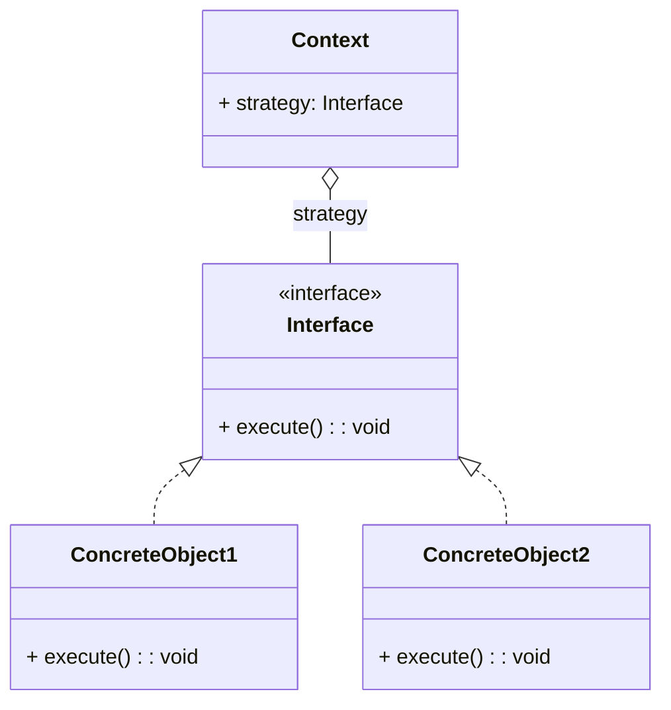

※本記事は [全体イントロダクション](https://zenn.dev/chocolate_pie24/articles/c-glfw-game-engine-introduction)のBook2に対応しています。

## このステップでやること

前回は、ウィンドウの生成の準備として文字列コンテナを作成しました。今回も引き続きウィンドウ生成の準備となります。
今回はプラットフォームレイヤーを構築していきます。

プラットフォームレイヤーは、アプリケーションの下層に位置するレイヤーであり、

- キーボードやマウス等のイベントを取得し、アプリケーションレイヤーへ伝える
- ウィンドウの生成、ウィンドウのサイズ管理、ウィンドウクローズといった処理を担当

が役割です。

今回のGL Choco Engineでは、GLFW APIを介してこれらの処理を行っていくのですが、
将来的なwin32やX-windowシステムへの対応が可能なように作っていきます。

なお、プラットフォームレイヤーは、作成過程で複数のレイヤーを作っていきますので、都度、レイヤー構成を出しながら説明していきます。

## Strategyパターンの導入

win32やX-window､GLFWの使用を前提としたプラットフォーム処理を作っていきます。これを実現するためには、例えば次のようなやり方があります。
mouse_eventを取得するmouse_event_getというAPIを例にします(実際に今後作成するmouse_event_getとはインターフェイスは異なります)。

```c
void mouse_event_get(platform_t platform_) {
    if(platform_ == WIN_32) {
#ifdef PLATFORM_WIN_32
        mouse_event_get_win32();
#else
        ERROR_MESSAGE("Provided platform_ is not supported.");
#endif
    } else if(platform_ == X_WINDOW) {
#ifdef PLATFORM_X_WINDOW
        mouse_event_get_x_window();
#else
        ERROR_MESSAGE("Provided platform_ is not supported.");
#endif
    } else if(platform_ == GLFW) {
#ifdef PLATFORM_GLFW
        mouse_event_get_glfw();
#else
        ERROR_MESSAGE("Provided platform_ is not supported.");
#endif
    } else {
        ERROR_MESSAGE("Provided platform_ is not supported.");
    }
}
```

上の例ではシンプルにif, elseでプラットフォームの処理を切り替えています。この方式は機能するのですが、
デメリットとして、mouse_event_get以外の全てのイベント処理にも同じif, elseを書く必要があります。
また、ターゲットプラットフォーム以外のコードをビルドしないようにするために、#ifdefを使用していますが、あまり読みやすいコードとも言えません。

なので、別の手段を考えるのですが、このようなケースで便利なのがオブジェクト指向のGoFデザインパターンのStrategyパターンを使用すると便利です。
Strategyパターンについては既に詳しく解説されている方が多くいるためここでは説明を省略します。

[Strategyパターン解説例](https://qiita.com/hankehly/items/1848f2fd8e09812d1aaf)

Strategyパターンのクラス図はこのようになります。



まだ具体的な実装や効果がイメージできないかと思いますので、簡単な実装例を用いて説明していきます。
ここで、Strategyパターンはオブジェクト指向のデザインパターンであるため、オブジェクト指向言語ではないC言語で実装することは余り無いかもしれません。
ただ、C言語でも関数ポインタと構造体を使用することで同じ効果を持つ実装を行うことが可能です。

まず、このような構造体を用意します。なお、v_tableとは仮想関数テーブルの略であり、pfnとは関数ポインタを意味しています。

```c
typedef struct vtable {
    void (*pfn_function_a)(void);
    void (*pfn_function_b)(void);
    void (*pfn_function_c)(void);
} vtable_t;

vtable_t* vtable;
```

上のコードのvtable_tがクラス図におけるInterfaceに相当します。次に具象クラスを作っていきます。

```c
static const vtable_t concrete_vtable = {
    .pfn_function_a = concrete_obj1_function_a,
    .pfn_function_b = concrete_obj1_function_b,
    .pfn_function_c = concrete_obj1_function_c,
};

const vtable_t* vtable_concrete_get(void) {
    return &concrete_vtable;
}

static void concrete_obj1_function_a(void) {
}

static void concrete_obj1_function_b(void) {
}

static void concrete_obj1_function_c(void) {
}
```

これが具象クラスになります。concreteという具象クラス用のfunction_a､function_b､function_cを用意し、それをvtableにまとめてあります。
こうしておけば、例えば、

```c
const vtable_t* vtable = vtable_concrete_get();
vtable->pfn_function_a();
```

こうすることで、具象クラスのconcrete_obj1_function_aをpfn_function_aというInterfaceを介して実行できるようになります。
また、具象クラスが追加されても、既存のクラスと完全に独立して実装し、テーブルの代入部のみを差し替えることで具象クラスの変更が可能になります。

以上がStrategyを使用する効果になります。ここからは今回作成するプラットフォームレイヤーに沿った形でのStrategyパターンを実装していきます。

## 外部公開API検討

先程の実装例と同じ流れでプラットフォームレイヤーのStrategyを実装していきます。まずはInterfaceオブジェクトが保有する関数を検討します。
今回は、プラットフォームレイヤーの構築のみを目指すのですが、プラットフォームレイヤーの要件として、

- 内部状態管理オブジェクトのハンドルをapplicationに持たせる(APIとしてアプリケーションから独立して存在可能にするため)
- 内部状態管理オブジェクトのメモリはリニアアロケータで確保する(起動時から終了時まで存在し続けるシステム系のメモリであるため)

なので、

1. アプリケーション側で内部状態管理オブジェクトのメモリ要件を取得
2. 取得したメモリ要件でメモリを確保
3. 確保したメモリでプラットフォーム初期化

といった流れで構築することになります。なので、外部公開APIとして今回3つのAPIを作成していきます。

- platform_backend_preinit()
- platform_backend_init()
- platform_backend_destroy()

## Interfaceの実装

## ConcreteObjectの実装

ConcreteObjectは、インターフェイスオブジェクトであるInterfaceの具象クラスになります。
Interfaceがwin-32､X-window､GLFWそれぞれの固有実装を抽象化したオブジェクトに対し、
ConcreteObjectは各プラットフォーム固有の実装を格納するオブジェクトになります。

今回は、ConcreteObjectが保有することになる複数のメソッドのうち、

- platform_glfw_preinit
- platform_glfw_init
- platform_glfw_destroy

を実装していきます。