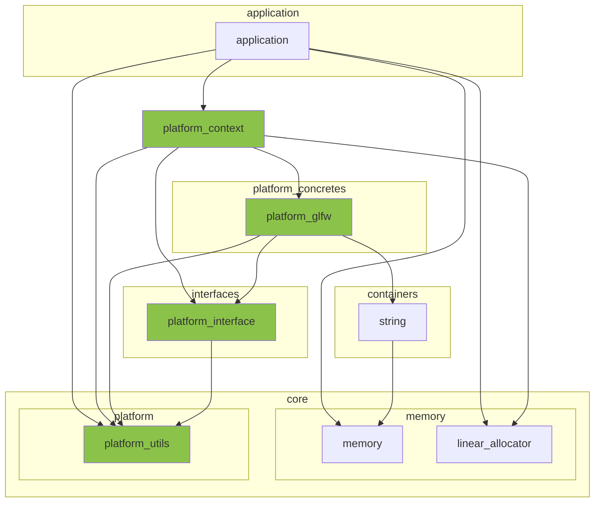
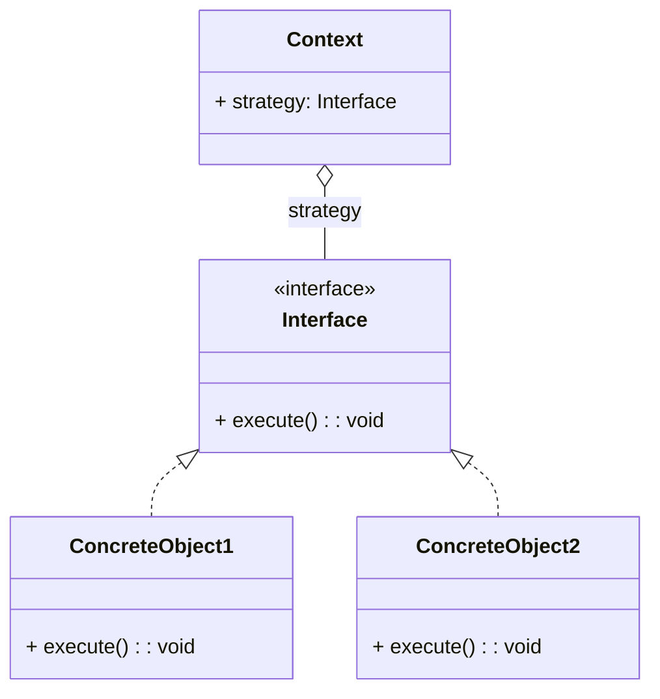
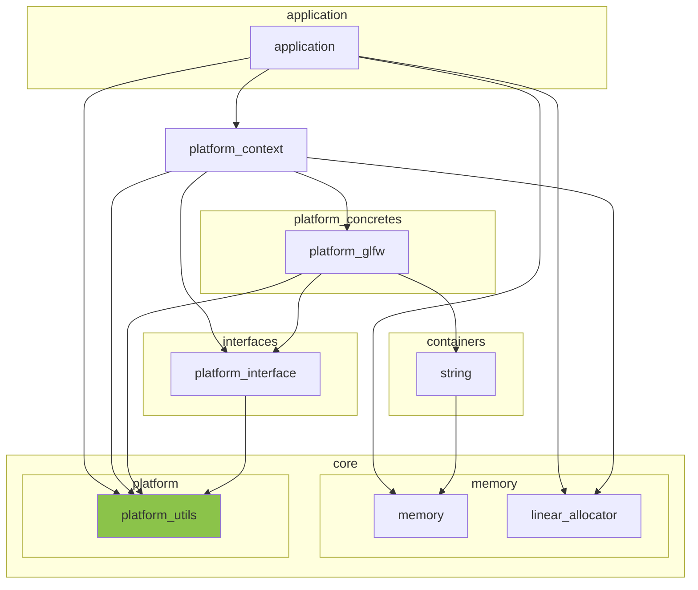
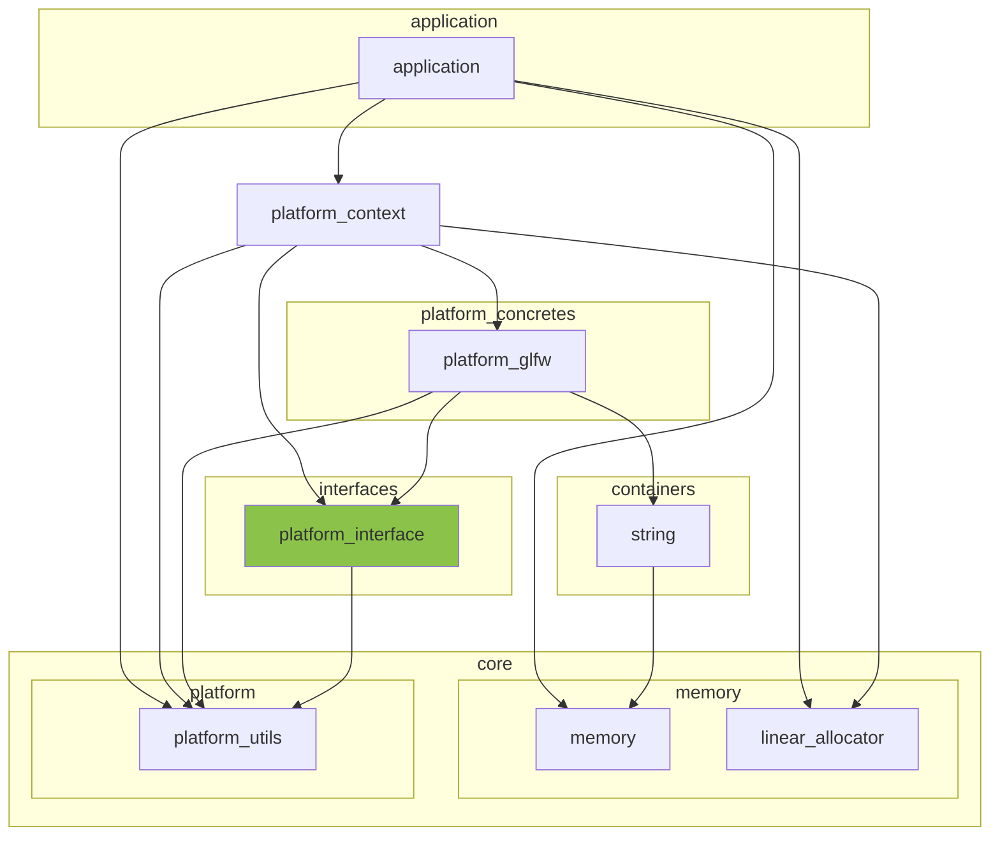
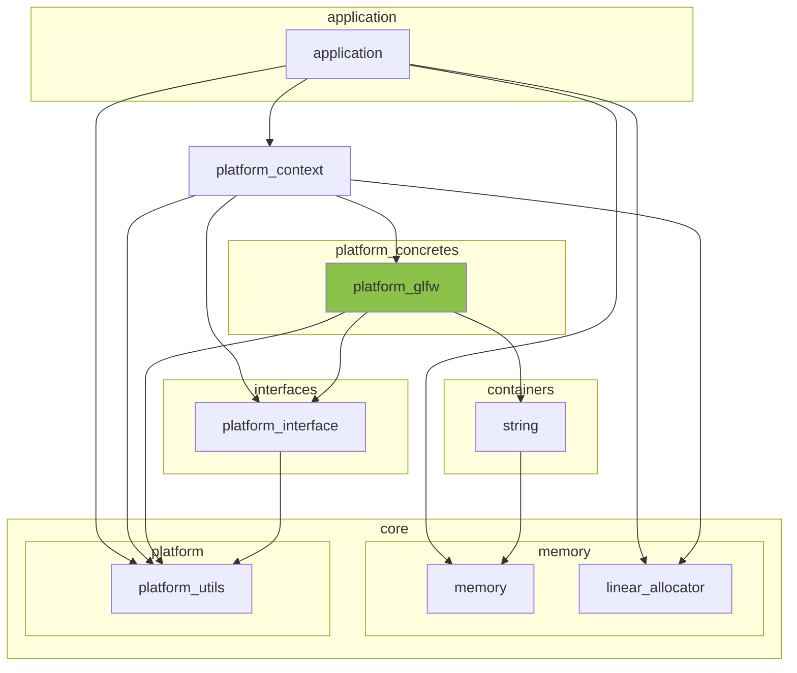
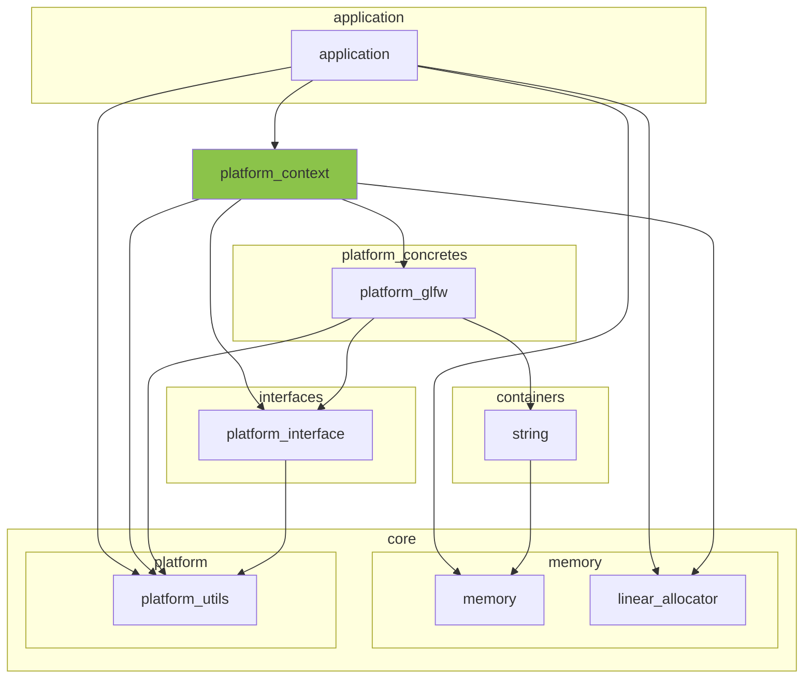

※本記事は [全体イントロダクション](https://zenn.dev/chocolate_pie24/articles/c-glfw-game-engine-introduction)のBook2に対応しています。

- [このステップでやること](#このステップでやること)
- [今回作成するモジュール群のレイヤー構成](#今回作成するモジュール群のレイヤー構成)
- [Strategyパターンの導入](#strategyパターンの導入)
- [外部公開API検討](#外部公開api検討)
- [共通データ構造の定義](#共通データ構造の定義)
- [Interfaceの実装](#interfaceの実装)
- [ConcreteObjectの実装](#concreteobjectの実装)
- [Contextの実装](#contextの実装)
- [プラットフォームシステムの初期化処理の実行](#プラットフォームシステムの初期化処理の実行)


## このステップでやること

前回は、ウィンドウの生成の準備として文字列コンテナを作成しました。今回も引き続きウィンドウ生成の準備となります。
今回はプラットフォームシステムを構築していきます。

プラットフォームシステムは、アプリケーションレイヤーの下層に位置し、アプリケーションの初期化完了時から終了時まで常駐し続けます。
主な役割は、

- キーボードやマウス等のイベントを取得し、アプリケーションレイヤーへ伝える
- ウィンドウの生成、ウィンドウのサイズ管理、ウィンドウクローズといった処理を担当

となっています。

今回のGL Choco Engineでは、GLFW APIを介してこれらの処理を行っていくのですが、
将来的なwin32やX-windowシステムへの対応が可能なように作っていきます。

## 今回作成するモジュール群のレイヤー構成

今回作成するプラットフォームシステムを構成するモジュールのレイヤー構成は下記のようになります。緑色のブロックが今回追加していくブロックになります。
なお、下図において、baseレイヤーのmessage, macrosについては図がわかりにくくなるため、省略してあります(ほぼ全てのモジュールが依存)。



## Strategyパターンの導入

今回は、win32やX-window､GLFWの使用を前提としたプラットフォームシステムを作っていきます。これを実現するためには、例えば次のようなやり方があります。
mouse_eventを取得するmouse_event_getというAPIを例にします(実際に今後作成するmouse_event_getとはインターフェイスは異なります)。

```c
void mouse_event_get(platform_t platform_) {
    if(platform_ == WIN_32) {
#ifdef PLATFORM_WIN_32
        mouse_event_get_win32();
#else
        ERROR_MESSAGE("Provided platform_ is not supported.");
#endif
    } else if(platform_ == X_WINDOW) {
#ifdef PLATFORM_X_WINDOW
        mouse_event_get_x_window();
#else
        ERROR_MESSAGE("Provided platform_ is not supported.");
#endif
    } else if(platform_ == GLFW) {
#ifdef PLATFORM_GLFW
        mouse_event_get_glfw();
#else
        ERROR_MESSAGE("Provided platform_ is not supported.");
#endif
    } else {
        ERROR_MESSAGE("Provided platform_ is not supported.");
    }
}
```

上の例ではシンプルにif, elseでプラットフォームの処理を切り替えています。この方式は機能するのですが、
デメリットとして、mouse_event_get以外の全てのイベント処理にも同じif, elseを書く必要があります。
また、ターゲットプラットフォーム以外のコードをビルドしないようにするために、#ifdefを使用していますが、あまり読みやすいコードとも言えません。

なので、別の手段を考えるのですが、このようなケースで便利なのがオブジェクト指向のGoFデザインパターンの一つであるStrategyを使用するとキレイにまとまります。
Strategyパターンの詳細については既に詳しく解説されている方が多くいるためここでは説明を省略します。

[Strategyパターン解説例](https://qiita.com/hankehly/items/1848f2fd8e09812d1aaf)

Strategyパターンをクラス図で表現すると、このようになります。



まだ具体的な実装や効果がイメージできないかと思いますので、簡単な実装例を用いて説明していきます。
ここで、Strategyパターンはオブジェクト指向のデザインパターンであるため、オブジェクト指向言語ではないC言語で実装することは余り無いかもしれません。
ただ、C言語でも関数ポインタと構造体を使用することで同じ効果を持つ実装を行うことが可能です。

まず、このような構造体を用意します。なお、vtableとは仮想関数テーブルの略であり、pfnとは関数ポインタを意味しています。

```c
typedef struct vtable {
    void (*pfn_function_a)(void);
    void (*pfn_function_b)(void);
    void (*pfn_function_c)(void);
} vtable_t;

vtable_t* vtable;
```

上のコードのvtable_tがクラス図におけるInterfaceに相当します。次に具象クラスを作っていきます。

```c
static const vtable_t concrete_vtable = {
    .pfn_function_a = concrete_obj1_function_a,
    .pfn_function_b = concrete_obj1_function_b,
    .pfn_function_c = concrete_obj1_function_c,
};

const vtable_t* vtable_concrete_get(void) {
    return &concrete_vtable;
}

static void concrete_obj1_function_a(void) {
}

static void concrete_obj1_function_b(void) {
}

static void concrete_obj1_function_c(void) {
}
```

これが具象クラスになります。concreteという具象クラス用のfunction_a､function_b､function_cを用意し、それをvtableにまとめてあります。
こうしておけば、例えば、

```c
const vtable_t* vtable = vtable_concrete_get();
vtable->pfn_function_a();
```

こうすることで、具象クラスのconcrete_obj1_function_aをpfn_function_aというInterfaceを介して実行できるようになります。
また、具象クラスが追加されても、既存のクラスと完全に独立して実装し、テーブルの代入部のみを差し替えることで具象クラスの変更が可能になります。

以上がStrategyを使用する効果になります。ここからは今回作成するプラットフォームシステムに沿った形でのStrategyパターンを実装していきます。

## 外部公開API検討

プラットフォームシステムの作成に先立ち、まずはvtableが保有するAPIを検討します(先程の例でのpfn_function_a,pfn_function_b,pfn_function_c)｡
今回、プラットフォームシステムは次のような仕様で作ることにします。

- 内部状態管理オブジェクトのハンドルをapplicationに持たせる(APIとしてアプリケーションから独立して存在可能にするため)
- 内部状態管理オブジェクトのメモリはリニアアロケータで確保する(起動時から終了時まで存在し続けるシステム系のメモリであるため)

なので、

1. アプリケーション側で内部状態管理オブジェクトのメモリ要件を取得
2. 取得したメモリ要件でメモリを確保
3. 確保したメモリでプラットフォーム初期化

といった流れで構築することになります。なので、外部公開APIとして今回3つのAPIを作成していきます。

- platform_backend_preinit() : アプリケーション側で内部状態管理オブジェクトのメモリ要件を取得
- platform_backend_init()    : 確保したメモリでプラットフォームシステム初期化
- platform_backend_destroy() : プラットフォームシステムの破棄

## 共通データ構造の定義

APIの実装に先立ち、実行結果コードの定義といったプラットフォームシステム全体で使用されるデータ構造を定義します。

include/engine/core/platform/platform_utils.h



次に、ファイルの中身を作成します。実行結果コードと、プラットフォームリストを作成します。
プラットフォームリストは現状ではGLFWのみにしておきます。将来、x-windowやwin32へ拡張する際に増えることになります。

```c
#ifndef GLCE_ENGINE_CORE_PLATFORM_PLATFORM_UTILS_H
#define GLCE_ENGINE_CORE_PLATFORM_PLATFORM_UTILS_H

#ifdef __cplusplus
extern "C" {
#endif

typedef enum {
    PLATFORM_SUCCESS = 0,
    PLATFORM_INVALID_ARGUMENT,
    PLATFORM_RUNTIME_ERROR,
    PLATFORM_NO_MEMORY,
    PLATFORM_UNDEFINED_ERROR,
    PLATFORM_WINDOW_CLOSE,
} platform_result_t;

typedef enum {
    PLATFORM_USE_GLFW,
} platform_type_t;

#ifdef __cplusplus
}
#endif
#endif
```

上記コードで、platform_result_tの中にPLATFORM_WINDOW_CLOSEというのがあります。
これはウィンドウクローズのイベントが発生した場合に返すため、後で開発するイベント系として扱うべきという考え方もあります。
ただ今回は、ウィンドウクローズイベントに関しては絶対に逃してはいけないイベントということで、キーボードやマウスイベントとは別格として扱います。

## Interfaceの実装

次は、StrategyパターンにおけるInterfaceモジュールを作成していきます。

- include/engine/interfaces/platform_interface.h



このファイルには、仮想関数テーブル構造体を定義します。今回、外部に公開するAPIとしては、

- platform_backend_preinit()
- platform_backend_init()
- platform_backend_destroy()

なので、これらの関数ポインタを定義し、それを保持する構造体を作れば良いです。また、プラットフォームシステムの内部状態を保持する構造体も用意します。

関数ポインタと内部状態管理構造体の定義

```c
// プラットフォーム内部状態管理オブジェクト前方宣言(実体は各ソースファイルで定義)
typedef struct platform_backend platform_backend_t;

// アプリケーション側で内部状態管理オブジェクトのメモリ要件を取得
typedef void (*pfn_platform_backend_preinit)(size_t* memory_requirement_, size_t* alignment_requirement_);

// フォームシステム初期化
typedef platform_result_t (*pfn_platform_backend_init)(platform_backend_t* platform_backend_);

// プラットフォームシステムの破棄
typedef void (*pfn_platform_backend_destroy)(platform_backend_t* platform_backend_);
```

関数ポインタへのtypedefが余り見慣れないかもしれませんが、この書式は、pfn_platform_backend_initの例で言えば、
「platform_backend_t*型のplatform_backend_を受け取って、platform_result_tを返す関数のポインタ型にpfn_platform_backend_initという名前をつける」
という意味になります。

typedefしておくことにより、関数ポインタをまとめたvtableはこのように書けます。

```c
typedef struct platform_vtable {
    pfn_platform_backend_preinit platform_backend_preinit;  // 関数ポインタpfn_platform_backend_preinit
    pfn_platform_backend_init    platform_backend_init;     // 関数ポインタpfn_platform_backend_init
    pfn_platform_backend_destroy platform_backend_destroy;  // 関数ポインタpfn_platform_backend_destroy
} platform_vtable_t;
```

以上で、Interfaceとして機能するvtableが出来ました。次はStrategyにおけるConcreteObjectの実装に進みます。

## ConcreteObjectの実装

ConcreteObjectは、インターフェイスオブジェクトであるInterfaceの具象クラスになります。
Interfaceがwin-32､X-window､GLFWそれぞれの固有実装を抽象化したオブジェクトであるのに対し、
ConcreteObjectは各プラットフォーム固有の実装を格納するオブジェクトになります。

なので、次の機能を実装していきます。

- platform_backend_t構造体の内部実装
- platform_glfw_preinit : pfn_platform_backend_preinitのGLFW実装版
- platform_glfw_init    : pfn_platform_backend_initのGLFW実装版
- platform_glfw_destroy : pfn_platform_backend_destroyのGLFW実装版

を実装していきます。

レイヤー構成図における位置づけは下記のようになります。



先ずはヘッダファイルを用意します。外部に公開するAPIは、GLFW実装版の関数へのポインタが格納されたvtableを取得する機能のみです。

include/engine/platform_concretes/platform_glfw.h

```c
#ifndef GLCE_ENGINE_PLATFORM_CONCRETES_PLATFORM_GLFW_H
#define GLCE_ENGINE_PLATFORM_CONCRETES_PLATFORM_GLFW_H
#ifdef __cplusplus
extern "C" {
#endif

#include <stdbool.h>

#include "engine/interfaces/platform_interface.h"

#include "engine/core/platform/platform_utils.h"

const platform_vtable_t* platform_glfw_vtable_get(void);

#ifdef __cplusplus
}
#endif
#endif
```

次はソースファイルです。

src/engine/platform_concretes/platform_glfw.c

ヘッダのinclude､内部状態管理構造体の定義、関数プロトタイプ宣言までを貼り付けます。
platform_backend_t構造体は今のところは最小限の変数しか入れておりません。次回以降、変数が追加されていくことになります。

```c
#include <stdalign.h>
#include <stdbool.h>
#include <stddef.h>

#include "engine/platform_concretes/platform_glfw.h"

#include "engine/base/choco_macros.h"
#include "engine/base/choco_message.h"

#include "engine/core/platform/platform_utils.h"

#include "engine/interfaces/platform_interface.h"

/**
 * @brief GLFWプラットフォーム内部状態管理オブジェクト
 *
 */
struct platform_backend {
    bool initialized_glfw;          /**< GLFW初期済みフラグ */
};

static void platform_glfw_preinit(size_t* memory_requirement_, size_t* alignment_requirement_);
static platform_result_t platform_glfw_init(platform_backend_t* platform_backend_);
static void platform_glfw_destroy(platform_backend_t* platform_backend_);
```

では、関数の実装を一つづつ見ていきます。

platform_glfw_preinit

```c
static void platform_glfw_preinit(size_t* memory_requirement_, size_t* alignment_requirement_) {
    if(NULL == memory_requirement_ || NULL == alignment_requirement_) {
        WARN_MESSAGE("platform_backend_preinit - No-op: 'memory_requirement_' or 'alignment_requirement_' is NULL.");
        goto cleanup;
    }
    *memory_requirement_ = sizeof(platform_backend_t);
    *alignment_requirement_ = alignof(platform_backend_t);
    goto cleanup;
cleanup:
    return;
}
```

内容はplatform_backend_tの構造体サイズとアライメント要件を取得し、引数に入れているだけになります。
次はplatform_glfw_initです。

```c
static platform_result_t platform_glfw_init(platform_backend_t* platform_backend_) {
    platform_result_t ret = PLATFORM_INVALID_ARGUMENT;
    CHECK_ARG_NULL_GOTO_CLEANUP(platform_backend_, PLATFORM_INVALID_ARGUMENT, "platform_glfw_init", "platform_backend_")

    platform_backend_->initialized_glfw = false;

    // 次回以降、ここに初期化処理を追加していく

    platform_backend_->initialized_glfw = true;

    ret = PLATFORM_SUCCESS;

cleanup:
    return ret;
}
```

現状では初期化する構造体メンバがinitialized_glfwのみなので、initialized_glfwを初期化するのみです。
次はplatform_glfw_destroyです。

```c
static void platform_glfw_destroy(platform_backend_t* platform_backend_) {
    if(NULL == platform_backend_) {
        return;
    }
    platform_backend_->initialized_glfw = false;
}
```

こちらも特に説明が必要な箇所はないと思います。
以上で外部公開APIのGLFW版実装が完成しましたので、vtableを作成していきます。

GLFW版vtableは実行時に変更する必要はないので、構造体のインスタンスを静的に保持することにします。
ソースファイルの関数プロトタイプ宣言の下に以下を追加します。

```c
static const platform_vtable_t s_glfw_vtable = {
    .platform_backend_preinit = platform_glfw_preinit,
    .platform_backend_init = platform_glfw_init,
    .platform_backend_destroy = platform_glfw_destroy,
};
```

これでvtableが出来ましたので、vtableを外部に渡すAPIの実装を行います。

```c
const platform_vtable_t* platform_glfw_vtable_get(void) {
    return &s_glfw_vtable;
}
```

以上でInterfaceの実装までが完了しました。ここまでを実装することにより、
アプリケーション側ではvtableを取得し、プラットフォーム固有実装のAPIを呼び出すことが可能になります。
例えば以下のようになります。

```c
typedef struct app_state {
    // core/memory/linear_allocator
    size_t linear_alloc_mem_req;    /**< リニアアロケータオブジェクトに必要なメモリ量 */
    size_t linear_alloc_align_req;  /**< リニアアロケータオブジェクトが要求するメモリアライメント */
    size_t linear_alloc_pool_size;  /**< リニアアロケータオブジェクトが使用するメモリプールのサイズ */
    void* linear_alloc_pool;        /**< リニアアロケータオブジェクトが使用するメモリプールのアドレス */
    linear_alloc_t* linear_alloc;   /**< リニアアロケータオブジェクト */

    platform_vtable_t* vtable;
} app_state_t;

static app_state_t* s_app_state = NULL; /**< アプリケーション内部状態およびエンジン各サブシステム内部状態 */

application_result_t application_create(void) {
    // 途中省略
    s_app_state->vtable = platform_glfw_vtable_get();
    s_app_state->vtable->platform_backend_preinit(/* 引数省略 */);
    // 以降省略
}
```

これでの十分に機能はするのですが、vtableを直にapp_state_tに持たせていることにより、
vtableの構造をユーザーが知っておく必要があります。また、上の例では省略しましたが、リニアアロケータによるメモリ確保手順も煩雑です。

今回はもう一段レイヤーを噛ませることにより、よりシンプルにプラットフォームシステムを初期化、使用できるようにしていきます。
この役割がStrategyパターンのContextになります。

## Contextの実装

Contextの役割は、これまで作成したAPIを簡便に扱えるようにすることと、それに伴い、不要な依存関係を減らすことにあります。
作成するレイヤーの位置づけは下図の通りです。



では、まずはヘッダファイルの作成からしていきます。全体を貼り付けて、個別に説明します。

include/engine/platform_context/platform_context.h

```c
#ifndef GLCE_ENGINE_PLATFORM_CONTEXT_PLATFORM_CONTEXT_H
#define GLCE_ENGINE_PLATFORM_CONTEXT_PLATFORM_CONTEXT_H

#ifdef __cplusplus
extern "C" {
#endif

#include "engine/core/platform/platform_utils.h"

#include "engine/core/memory/linear_allocator.h"

typedef struct platform_context platform_context_t;

platform_result_t platform_initialize(linear_alloc_t* allocator_, platform_type_t platform_type_, platform_context_t** out_platform_context_);

void platform_destroy(platform_context_t* platform_context_);

#ifdef __cplusplus
}
#endif
#endif
```

内容は、プラットフォームコンテキストの構造体の前方宣言と、プラットフォームシステムの初期化、破棄になっています。
プラットフォームコンテキストの構造体は後ほど詳細に説明しますが、

- プラットフォーム識別子
- プラットフォームシステム内部状態管理構造体(platform_backend_t_t)インスタンス
- プラットフォーム固有vtable

を持たせる予定です。では、詳細な実装を説明していきます。ソースファイルは、

src/engine/platform_context/platform_context.c

です。まずはヘッダファイルのincludeと構造体宣言までを貼り付けます。

```c
#include <stdbool.h>
#include <stdalign.h>
#include <string.h>

#include "engine/platform_context/platform_context.h"

#include "engine/interfaces/platform_interface.h"

#include "engine/platform_concretes/platform_glfw.h"

#include "engine/core/platform/platform_utils.h"

#include "engine/core/memory/linear_allocator.h"

#include "engine/base/choco_macros.h"
#include "engine/base/choco_message.h"

struct platform_context {
    platform_type_t type;               /**< プラットフォームタイプ */
    platform_backend_t* backend;        /**< 各プラットフォーム固有実装バックエンドデータ */
    const platform_vtable_t* vtable;    /**< 各プラットフォーム仮想関数テーブル */
};
```

次はplatform_initializeです。

```c
platform_result_t platform_initialize(linear_alloc_t* allocator_, platform_type_t platform_type_, platform_context_t** out_platform_context_) {
    platform_result_t ret = PLATFORM_INVALID_ARGUMENT;
    linear_allocator_result_t ret_linear_alloc = LINEAR_ALLOC_INVALID_ARGUMENT;
    void* backend_ptr = NULL;
    size_t backend_memory_req = 0;
    size_t backend_align_req = 0;

    // Preconditions.
    CHECK_ARG_NULL_GOTO_CLEANUP(allocator_, PLATFORM_INVALID_ARGUMENT, "platform_initialize", "allocator_")
    CHECK_ARG_NULL_GOTO_CLEANUP(out_platform_context_, PLATFORM_INVALID_ARGUMENT, "platform_initialize", "out_platform_context_")
    CHECK_ARG_NOT_NULL_GOTO_CLEANUP(*out_platform_context_, PLATFORM_INVALID_ARGUMENT, "platform_initialize", "out_platform_context_")
    CHECK_ARG_NOT_VALID_GOTO_CLEANUP(platform_type_valid_check(platform_type_), PLATFORM_INVALID_ARGUMENT, "platform_initialize", "platform_type_")

    // Simulation.
    platform_context_t* tmp_context = NULL;
    ret_linear_alloc = linear_allocator_allocate(allocator_, sizeof(platform_context_t), alignof(platform_context_t), (void**)&tmp_context);
    if(LINEAR_ALLOC_SUCCESS != ret_linear_alloc) {
        ret = rslt_convert_linear_alloc(ret_linear_alloc);
        ERROR_MESSAGE("platform_initialize(%s) - Failed to allocate memory for platform context.", rslt_to_str(ret));
        goto cleanup;
    }
    memset(tmp_context, 0, sizeof(platform_context_t));

    tmp_context->vtable = platform_vtable_get(platform_type_);
    if(NULL == tmp_context->vtable) {
        ret = PLATFORM_RUNTIME_ERROR;
        ERROR_MESSAGE("platform_initialize(%s) - Failed to get platform vtable.", rslt_to_str(ret));
        goto cleanup;
    }

    tmp_context->vtable->platform_backend_preinit(&backend_memory_req, &backend_align_req);
    ret_linear_alloc = linear_allocator_allocate(allocator_, backend_memory_req, backend_align_req, &backend_ptr);
    if(LINEAR_ALLOC_SUCCESS != ret_linear_alloc) {
        ret = rslt_convert_linear_alloc(ret_linear_alloc);
        ERROR_MESSAGE("platform_initialize(%s) - Failed to allocate memory for platform backend.", rslt_to_str(ret));
        goto cleanup;
    }
    memset(backend_ptr, 0, backend_memory_req);

    ret = tmp_context->vtable->platform_backend_init((platform_backend_t*)backend_ptr);
    if(PLATFORM_SUCCESS != ret) {
        ERROR_MESSAGE("platform_initialize(%s) - Failed to initialize platform backend.", rslt_to_str(ret));
        goto cleanup;
    }
    tmp_context->backend = backend_ptr;
    tmp_context->type = platform_type_;

    // commit.
    *out_platform_context_ = tmp_context;
    ret = PLATFORM_SUCCESS;

cleanup:
    // リニアアロケータで確保したメモリは個別解放不可であるためクリーンナップ処理はなし
    return ret;
}
```

一つづつ説明していきます。

```c
    platform_result_t ret = PLATFORM_INVALID_ARGUMENT;
    linear_allocator_result_t ret_linear_alloc = LINEAR_ALLOC_INVALID_ARGUMENT;
    void* backend_ptr = NULL;
    size_t backend_memory_req = 0;
    size_t backend_align_req = 0;

    // Preconditions.
    CHECK_ARG_NULL_GOTO_CLEANUP(allocator_, PLATFORM_INVALID_ARGUMENT, "platform_initialize", "allocator_")
    CHECK_ARG_NULL_GOTO_CLEANUP(out_platform_context_, PLATFORM_INVALID_ARGUMENT, "platform_initialize", "out_platform_context_")
    CHECK_ARG_NOT_NULL_GOTO_CLEANUP(*out_platform_context_, PLATFORM_INVALID_ARGUMENT, "platform_initialize", "out_platform_context_")
    CHECK_ARG_NOT_VALID_GOTO_CLEANUP(platform_type_valid_check(platform_type_), PLATFORM_INVALID_ARGUMENT, "platform_initialize", "platform_type_")

    // Simulation.
    platform_context_t* tmp_context = NULL;
    ret_linear_alloc = linear_allocator_allocate(allocator_, sizeof(platform_context_t), alignof(platform_context_t), (void**)&tmp_context);
    if(LINEAR_ALLOC_SUCCESS != ret_linear_alloc) {
        ret = rslt_convert_linear_alloc(ret_linear_alloc);
        ERROR_MESSAGE("platform_initialize(%s) - Failed to allocate memory for platform context.", rslt_to_str(ret));
        goto cleanup;
    }
    memset(tmp_context, 0, sizeof(platform_context_t));
```

まず、Preconditionsで引数のチェックを行います。platform_type_valid_checkというのは、platform_glfwモジュールのプライベート関数で、
platform_type_tで定義されている列挙子以外が入力されたらfalseを返す関数です。

引数が正常であれば、platform_context_t型のメモリを確保します。
以降の処理で失敗したときのために、一旦、tmp_contextに対してメモリ確保を行い、全ての処理が成功したら引数のout_platform_context_とアドレスを差し替えます。
こうすることで、失敗時にout_platform_context_の値を変更しないようにします。

また、プラットフォームシステムは起動時から終了時まで常駐するシステムです。よって、メモリの確保にはリニアアロケータを使用しています。

その他、rslt_convert_linear_allocやrslt_to_strはエラー処理を統一するためのヘルパー関数です。説明は省略します。

```c
    tmp_context->vtable = platform_vtable_get(platform_type_);
    if(NULL == tmp_context->vtable) {
        ret = PLATFORM_RUNTIME_ERROR;
        ERROR_MESSAGE("platform_initialize(%s) - Failed to get platform vtable.", rslt_to_str(ret));
        goto cleanup;
    }
```

次がプラットフォーム固有のvtableの取得処理です。これは引数で与えたplatform_type_に応じたvtableを取得します。
platform_vtable_getはplatform_contextモジュールのプライベート関数になっており、実装はこのようになっています。

```c
const platform_vtable_t* platform_vtable_get(platform_type_t platform_type_) {
    switch (platform_type_) {
    case PLATFORM_USE_GLFW:
        return platform_glfw_vtable_get();
    default:
        return NULL;
    }
}
```

後はプラットフォーム固有の初期化処理行うだけです。分かりやすくするため、エラー処理を除いたコードを貼り付けます。

```c
    // プラットフォーム固有内部状態管理構造体のメモリ要件取得
    tmp_context->vtable->platform_backend_preinit(&backend_memory_req, &backend_align_req);

    // 取得したメモリ要件に基づき、リニアアロケータでメモリ確保
    ret_linear_alloc = linear_allocator_allocate(allocator_, backend_memory_req, backend_align_req, &backend_ptr);
    memset(backend_ptr, 0, backend_memory_req);

    // プラットフォーム固有初期化処理
    ret = tmp_context->vtable->platform_backend_init((platform_backend_t*)backend_ptr);
```

最後に、プラットフォームシステムの終了処理です。コード全体はこのようになっています。

```c
void platform_destroy(platform_context_t* platform_context_) {
    if(NULL == platform_context_) {
        goto cleanup;
    }
    if(NULL == platform_context_->vtable) {
        goto cleanup;
    }
    if(NULL == platform_context_->backend) {
        goto cleanup;
    }
    platform_context_->vtable->platform_backend_destroy(platform_context_->backend);
cleanup:
    return;
}
```

内容は、プラットフォーム固有のplatform_backend_destroyを呼び出すだけです。
メモリリソースについてはリニアアロケータを使用して確保したメモリであるため、解放は不要です。
以上でStrategyパターンのContextまでの実装が完了しました。次は、作成したプラットフォームシステムをアプリケーションレイヤーで初期化していきます。

## プラットフォームシステムの初期化処理の実行

大分長くなってしまいましたが、これでstep2_5の最後になります。
プラットフォームシステムの基盤が完成したので、最後にapplicationレイヤーに処理を組み込んでいきます。

まずはアプリケーション内部状態管理構造体にプラットフォームシステムを組み込みます。

```c
typedef struct app_state {
    // core/memory/linear_allocator
    size_t linear_alloc_mem_req;    /**< リニアアロケータオブジェクトに必要なメモリ量 */
    size_t linear_alloc_align_req;  /**< リニアアロケータオブジェクトが要求するメモリアライメント */
    size_t linear_alloc_pool_size;  /**< リニアアロケータオブジェクトが使用するメモリプールのサイズ */
    void* linear_alloc_pool;        /**< リニアアロケータオブジェクトが使用するメモリプールのアドレス */
    linear_alloc_t* linear_alloc;   /**< リニアアロケータオブジェクト */

    // platform/platform_context
    platform_context_t* platform_context; /**< プラットフォームstrategyパターンへの窓口としてのコンテキストオブジェクト */
} app_state_t;
```

次にapplication_createでプラットフォームシステムを初期化します。大分長いのでエラー処理は省いてあるのと、
リニアアロケータの初期化より前の処理は省略してあります。

```c
application_result_t application_create(void) {
    app_state_t* tmp = NULL;

    // リニアアロケータの初期化処理より前は省略

    ret_linear_alloc = linear_allocator_init(tmp->linear_alloc, tmp->linear_alloc_pool_size, tmp->linear_alloc_pool);
    INFO_MESSAGE("linear_allocator initialized successfully.");

    ///////////////////////////////////////////////////////////////////////////////////////////////////////////////////////////////////
    // Simulation -> launch all systems -> create platform.(Don't use s_app_state here.)
    INFO_MESSAGE("Initializing platform state...");
    ret_platform = platform_initialize(tmp->linear_alloc, PLATFORM_USE_GLFW, &tmp->platform_context);
    INFO_MESSAGE("platform_backend initialized successfully.");

    // end Simulation -> launch all systems.

    // end Simulation
    ///////////////////////////////////////////////////////////////////////////////////////////////////////////////////////////////////

    // commit
    s_app_state = tmp;
    INFO_MESSAGE("Application created successfully.");
    memory_system_report();
    ret = APPLICATION_SUCCESS;

cleanup:
    if(APPLICATION_SUCCESS != ret) {
        if(NULL != tmp) {
            if(NULL != tmp->platform_context) {
                platform_destroy(tmp->platform_context);
            }
            if(NULL != tmp->linear_alloc_pool) {
                memory_system_free(tmp->linear_alloc_pool, tmp->linear_alloc_pool_size, MEMORY_TAG_SYSTEM);
            }
            if(NULL != tmp->linear_alloc) {
                memory_system_free(tmp->linear_alloc, tmp->linear_alloc_mem_req, MEMORY_TAG_SYSTEM);
            }
            memory_system_free(tmp, sizeof(*tmp), MEMORY_TAG_SYSTEM);
            tmp = NULL;
        }
        memory_system_destroy();
    }

    return ret;
}
```

これで初期化ができましたので、次は終了処理です。

```c
void application_destroy(void) {
    INFO_MESSAGE("Starting application shutdown...");
    if(NULL == s_app_state) {
        goto cleanup;
    }

    // begin cleanup all systems.


    ////////////////////////////////////////////////////////
    // ここから追加
    if(NULL != s_app_state->platform_context) {
        platform_destroy(s_app_state->platform_context);
    }
    // ここまで追加
    ////////////////////////////////////////////////////////


    if(NULL != s_app_state->linear_alloc_pool) {
        memory_system_free(s_app_state->linear_alloc_pool, s_app_state->linear_alloc_pool_size, MEMORY_TAG_SYSTEM);
        s_app_state->linear_alloc_pool = NULL;
    }
    if(NULL != s_app_state->linear_alloc) {
        memory_system_free(s_app_state->linear_alloc, s_app_state->linear_alloc_mem_req, MEMORY_TAG_SYSTEM);
        s_app_state->linear_alloc = NULL;
    }

    memory_system_free(s_app_state, sizeof(*s_app_state), MEMORY_TAG_SYSTEM);
    s_app_state = NULL;
    INFO_MESSAGE("Freed all memory.");
    memory_system_report();
    memory_system_destroy();
    // end cleanup all systems.

    INFO_MESSAGE("Application destroyed successfully.");
cleanup:
    return;
}
```

platform_destroyの呼び出しを追加するだけなので、特に説明は不要かと思います。

以上でプラットフォームシステムの基盤が完成しました。これでX-window-systemやwin32環境への対応が今後必要になっても、
プラットフォームコンテキストのvtableの差し替えと、プラットフォーム固有実装の追加のみで対応が可能になっています。

今回は作成したファイル数が多いため、大分ボリュームが多いと感じるかもしれませんが、
やっている内容自体は冒頭に説明したStrategyパターンのC言語実装例をそのままなぞっているだけです。

次は、本ブックの最終となるウィンドウの生成に進みます。
次のステップを実行すればようやくグラフィックアプリケーションの第一歩となるHello window!!を動かすことができます。
