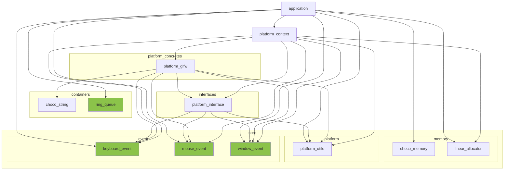

※本記事は [全体イントロダクション](https://zenn.dev/chocolate_pie24/articles/c-glfw-game-engine-introduction)のBook3に対応しています。なお、GL Choco Engineの立ち位置について追記しています。

前回の[Book](https://zenn.dev/chocolate_pie24/books/2d_rendering_step2)では、X Window Systemやwin32への拡張を考慮したプラットフォーム基盤を作成し、ウィンドウの生成までを行いました。

今回は、作成したプラットフォーム基盤にイベントシステムを追加していきます。このステップによって、キーボードイベント、マウスイベント、ウィンドウイベントを取得し、アプリケーション側でイベントに応じた処理を行うことが可能になります。

今回実装するモジュールを全て実装すると、レイヤー構成図は以下のようになります。大分複雑になっていますが、追加されるモジュールは緑のブロックのみです。その他の変更はAPIの追加、変更となります。

## Step3実装解説

### 今回作成するイベントシステムの概要とイベント構造体の定義

今回作成していくイベントは、

- キーボードキー押下イベント
- マウスボタンクリックイベント
- ウィンドウイベント

の3種類です。ゆくゆくはゲームパッド等のイベントも扱えるようにしていくかもしれませんが、当面はこれで行きます。これらのイベントをどのように取得し、アプリケーション側へ伝えるのか、その概要について先ずは説明します。概要の説明の後、簡易的にウィンドウイベントを取得できるようにし、イベントシステムの構造をより具体的に理解できるようにします。

[イベントシステムの概要とイベント構造体の定義](https://zenn.dev/chocolate_pie24/books/2d_rendering_step3/viewer/step3_1_event_system_abstract)

### イベント格納用リングキューの追加

前回は、イベントデータを格納する仕組みがなかったため、発生したイベントは全て即対応する必要がありました。このため、連続したイベントがあった場合、最後のイベントのみに対応すれば良いところを全て対応するという非効率な処理が発生します。今回は、発生したイベントを一時的に格納するキューを作成することで、この問題に対処します。

[イベント格納用リングキューの追加](https://zenn.dev/chocolate_pie24/books/2d_rendering_step3/viewer/step3_2_ring_queue)

### イベントポンプ処理のリファクタリング

ここまで、イベントシステムの全体を説明するため、イベントポンプ処理を多少雑なやり方で行っていました。具体的にはイベントポンプ処理に様々な処理が詰め込まれています。今回は処理を分割し、関数の責務を明確にしていくリファクタリングを行います。

[イベントポンプ処理のリファクタリング](https://zenn.dev/chocolate_pie24/books/2d_rendering_step3/viewer/step3_3_event_pump_refactoring)

### マウスイベントの主機能機能の追加

以上でイベントシステムの構造は完成です。次はマウスイベントを処理できるようにしていきます。

[マウスイベントの追加](https://zenn.dev/chocolate_pie24/books/2d_rendering_step3/viewer/step3_4_mouse_event)

### キーボードイベントの取得機能の追加

最後にキーボードイベントを追加します。

[キーボードイベントの追加](https://zenn.dev/chocolate_pie24/books/2d_rendering_step3/viewer/step3_5_keyboard_event)

### まとめ

以上で「Step3: イベントシステムの構築」は完成となります。記事の中ではdoxygenのコメントやテストコードは省いています。全てのコードは、[リポジトリ](https://github.com/chocolate-pie24/gl_choco_engine)に公開しています。ここまでの成果物には、v0.1.0-step3のタグをつけています。

次回はようやく描画処理に入ります。シェーダーを作成し、三角形の描画処理までを行います。
