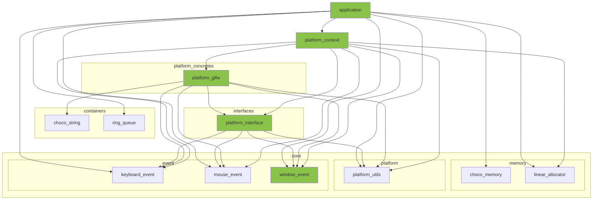

※本記事は [全体イントロダクション](https://zenn.dev/chocolate_pie24/articles/c-glfw-game-engine-introduction)のBook3に対応しています。

- [このステップでやること](#このステップでやること)
- [イベントシステム概要](#イベントシステム概要)
- [イベントポンプ(プラットフォームシステムがOSレイヤーから全てのイベントを吸い上げ)](#イベントポンププラットフォームシステムがosレイヤーから全てのイベントを吸い上げ)
  - [イベント構造体の追加](#イベント構造体の追加)
  - [イベントポンプAPIの定義](#イベントポンプapiの定義)

## このステップでやること

Book3では、前回のBook2で作成したプラットフォーム基盤にイベントシステムを構築していきます。GL Choco Engineで当面扱うイベントは、

- キーボードキー押下イベント
- マウスボタンクリックイベント
- ウィンドウイベント

の3つです。ゲームパッド等のイベントも扱うかも知れませんが、当面はこの3種類のイベントを扱います。イベントシステムは、これら3種類のイベントをOSレイヤーから吸い上げ、アプリケーション側へ伝える役割があります。

このステップでは先ず、どのようなイベントシステムを構築するかについて、概要を説明します。その後に、実際にウィンドウイベントの発生をアプリケーション側へ伝える処理を作成することで、具体的なイベントシステムの仕組みを理解できるようにします。今回の機能追加によって、ウィンドウのクローズが可能になり、ウィンドウサイズの変更をアプリケーション側で検知できるようになります。

下図の緑の部分が今回変更、追加する箇所になります。



## イベントシステム概要

今回作成するイベントシステムを図示すると以下のようになります。


イベントポンプはOS側からイベントを汲み上げる役割を持ち、次のような処理を行います。

- アプリケーションループの先頭で毎フレーム呼び出し、OSレイヤーからイベントを汲み上げる
- OSレイヤーからのイベント情報の形式はプラットフォーム固有なため、アプリケーション側が理解できる形式に変換
- 変換されたイベント情報をアプリケーションモジュールに渡す

アプリケーションの役割は以下です。

- イベントポンプからイベント情報を受け取る
- 受け取ったイベント情報を各種サブシステムが使いやすい形式に変換
- 各種サブシステムにイベントを渡す

各種サブシステムの役割は以下です。

- ウィンドウサイズ変化イベント等によって必要な描画内容の変更等、イベントに応じた処理を行う

このように、今回作成するイベントシステムは、一旦アプリケーションが全イベントを集約する仕組みとなっています。こうすることで、

- イベント処理を行うモジュールとしてのイベントリスナーの仕組みが不要になる
- シングルスレッドでも使用可能

となり、構造が非常にシンプルかつ、動作が分かりやすく使いやすいシステムになります。当然できることは少ないのですが、GL Choco Engineのコンセプトとしてはこれで十分です。

以上がイベントシステムの概要の説明です。以降、ウィンドウイベントを例に具体的に実装していくことで、仕組みのイメージをよりクリアにしていきます。

## イベントポンプ(プラットフォームシステムがOSレイヤーから全てのイベントを吸い上げ)

### イベント構造体の追加

先ずはウィンドウイベントを処理する準備として、ウィンドウイベント用に構造体と列挙体を作成します。

include/engine/core/event/window_event.h

```c
// ウィンドウイベント種別リスト
typedef enum {
    WINDOW_EVENT_RESIZE,    /**< ウィンドウイベント: ウィンドウサイズ変化 */
} window_event_code_t;

// 各イベント種別に付随するデータ
typedef struct window_event {
    window_event_code_t event_code; /**< ウィンドウイベント種別 */
    int window_width;               /**< イベントが発生した際のウィンドウ幅 */
    int window_height;              /**< イベントが発生した際のウィンドウ高さ */
} window_event_t;
```

ウィンドウイベントに関してアプリケーション側に伝える情報は、イベント種別とイベント発生時のウィンドウサイズのみなのでこのような形になります。

なお、このやり方以外にも、より抽象化した仕組みを取ることもできます。例えば次のような形です。

```c
typedef enum {
    WINDOW_EVENT_RESIZE,
} event_code_t;

typedef struct event {
    event_code_t event_code;
    char event_arg[32];
} event_t;
```

このやり方ではevent_codeに付随するデータを32byteのchar型配列に格納する仕組みを取っています。この仕組みは、抽象化することでイベント種別ごとの構造体定義を減らせるメリットがある一方で、デメリットとしてイベント付随データを格納するevent_argバッファサイズを全イベント種別の最大値にしなくてはいけません。バッファサイズを動的にする手もありますが、イベント発生のたびにメモリ確保が発生してしまいます。無駄なメモリリソースを削減することを優先し、前述の構造体定義にしました。

### イベントポンプAPIの定義

アプリケーション側でイベントポンプ処理を実行するために、各プラットフォームモジュールにAPIの定義を追加していきます。

先ずは前回作成したプラットフォームシステムのInterface(Strategy)へのAPI追加です。

Interface(Strategy)について、前回の復習をしておくと、各プラットフォーム(X Window System, win32)それぞれの具体的な実装を実行時に切り替えるために使用する構造です。プラットフォーム共通の処理(関数)の定義と関数ポインタを用意し、実行時に実際使用するプラットフォーム固有実装の関数に差し替えます。

イベントポンプAPIの定義と、仮想関数テーブルにイベントポンプAPIを追加します。

include/engine/interfaces/platform_interface.h

```c
#include "engine/core/event/window_event.h" // 追加

// 途中省略

typedef platform_result_t (*pfn_platform_backend_pump_messages)(
    platform_backend_t* platform_backend_,
    void (*window_event_callback)(const window_event_t* event_));

typedef struct platform_vtable {
    pfn_platform_backend_preinit        platform_backend_preinit;           /**< 関数ポインタ @ref pfn_platform_backend_preinit 参照 */
    pfn_platform_backend_init           platform_backend_init;              /**< 関数ポインタ @ref pfn_platform_backend_init 参照 */
    pfn_platform_backend_destroy        platform_backend_destroy;           /**< 関数ポインタ @ref pfn_platform_backend_destroy 参照 */
    pfn_platform_backend_window_create  platform_backend_window_create;     /**< 関数ポインタ @ref pfn_platform_backend_window_create 参照 */

    pfn_platform_backend_pump_messages  platform_backend_pump_messages; // 追加
} platform_vtable_t;
```

platform_backend_pump_messagesは、アプリケーション側からイベントポンプ機能をInterface(Strategy)モジュール経由で呼び出すAPIになります(APIの実体はplatform_glfwが保有)。引数にウィンドウイベントを処理するwindow_event_callback関数を渡しています。window_event_callbackはアプリケーション側が保有する関数です。こうすることで、platform_glfwという下位レイヤーのモジュールが、上位レイヤーのapplicationモジュールに依存しない構造を保ちつつ、platform_glfwが吸い上げたイベントをアプリケーション側に渡せるようにしています。

次がContext(Strategy)モジュールにAPIを追加します。Contextモジュールは、先程のvtableの構造を意識せずとも、アプリケーションがvtable内の関数を呼ぶためのもので、Interface(Strategy)とアプリケーションとの橋渡し役です。

include/engine/platform_context/platform_context.h

```c
#include "engine/core/event/window_event.h" // 追加

// 途中省略

platform_result_t platform_pump_messages(
    platform_context_t* platform_context_,
    void (*window_event_callback)(const window_event_t* event_));
```

platform_pump_messagesの実装はこのようになります。シンプルにするためにエラー処理は省いてあります。内容は、仮想関数テーブルのplatform_backend_pump_messagesを呼び出すだけです。

src/engine/platform_context/platform_context.c

```c
platform_result_t platform_pump_messages(
    platform_context_t* platform_context_,
    void (*window_event_callback)(const window_event_t* event_)) {

    platform_result_t ret = PLATFORM_INVALID_ARGUMENT;

    ret = platform_context_->vtable->platform_backend_pump_messages(platform_context_->backend, window_event_callback);
    if(PLATFORM_SUCCESS != ret && PLATFORM_WINDOW_CLOSE != ret) {
        ERROR_MESSAGE("platform_pump_messages(%s) - Failed to pump messages.", rslt_to_str(ret));
        goto cleanup;
    }

cleanup:
    return ret;
}
```

ここで、platform_pump_messagesの返り値なのですが、前回作成したplatform_result_tはこのようになっています。

include/engine/core/platform/platform_utils.h

```c
typedef enum {
    PLATFORM_SUCCESS = 0,       /**< 実行結果: 成功 */
    PLATFORM_INVALID_ARGUMENT,  /**< 実行結果: 無効な引数が与えられてエラー */
    PLATFORM_RUNTIME_ERROR,     /**< 実行結果: 実行時エラー */
    PLATFORM_NO_MEMORY,         /**< 実行結果: メモリ不足エラー */
    PLATFORM_UNDEFINED_ERROR,   /**< 実行結果: 未定義エラー */
    PLATFORM_WINDOW_CLOSE,      /**< 実行結果: ウィンドウクローズ(これは絶対に落としてはいけないイベントであるため、イベントキューには入れない(キューが満杯時に捨てられる可能性があるため)) */
} platform_result_t;
```

今回はまだ実装しませんが、次回、イベントデータをリングキューに格納するように変更します。この場合、キューのサイズによっては古いデータが削除される可能性があります。ウィンドウクローズについては絶対に捨てられてはいけないイベントであるため、イベントではなく返り値にしています。また、ウィンドウクローズはエラーではなく、正常使用時に発生しますので、正常扱いとして処理しています。

以上でアプリケーション側からイベントポンプAPIを呼び出す仕組みができましたので、後はAPIの実体をplatform_glfwに作成していきます。このステップではイベントポンプの仕組みと、アプリケーション側でのイベント処理までの一連の流れを説明するのが主な目的なので、処理の内容は単純なものにしています。次回以降で処理を洗練させていきます。

include/engine/platform_concretes/platform_glfw.c

まずはplatform_backend_t構造体にウィンドウサイズを追加します。

```c
struct platform_backend {
    choco_string_t* window_label;   /**< ウィンドウラベル */
    GLFWwindow* window;             /**< GLFWウィンドウ構造体インスタンス */
    bool initialized_glfw;          /**< GLFW初期済みフラグ */

    int window_width;   // 追加
    int window_height;  // 追加
};
```

次に、platform_glfw_window_createで与えられたウィンドウサイズをplatform_backend_tのウィンドウサイズに代入し初期化します。

```c
static platform_result_t platform_glfw_window_create(platform_backend_t* platform_backend_, const char* window_label_, int window_width_, int window_height_) {

    // 途中省略

    // https://www.glfw.org/docs/latest/group__input.html#gaa92336e173da9c8834558b54ee80563b
    glfwSetInputMode(platform_backend_->window, GLFW_STICKY_KEYS, GLFW_TRUE);  // これでエスケープキーが押されるのを捉えるのを保証する

    // ここから追加
    platform_backend_->window_width = window_width_;
    platform_backend_->window_height = window_height_;
    // ここまで追加

    ret = PLATFORM_SUCCESS;

cleanup:
    if(PLATFORM_SUCCESS != ret) {
        if(NULL != platform_backend_->window) {
            glfwDestroyWindow(platform_backend_->window);
            platform_backend_->window = NULL;
        }
        choco_string_destroy(&platform_backend_->window_label);
    }
    return ret;
}
```

これで準備が整いましたので、GLFWを使用したplatform_backend_pump_messagesの本体が実装できます。全体像は以下のようになります。

```c
// プロトタイプ宣言追加
static platform_result_t platform_glfw_pump_messages(platform_backend_t* platform_backend_, void (*window_event_callback)(const window_event_t* event_));

static platform_result_t platform_glfw_pump_messages(
    platform_backend_t* platform_backend_,
    void (*window_event_callback)(const window_event_t* event_)) {

    platform_result_t ret = PLATFORM_INVALID_ARGUMENT;
    int window_width = 0;
    int window_height = 0;
    window_event_t window_event;

    glfwPollEvents();
    const bool window_should_close = (0 != glfwWindowShouldClose(platform_backend_->window)) ? true : false;
    if(window_should_close) {
        ret = PLATFORM_WINDOW_CLOSE;
        goto cleanup;
    }
    glfwGetWindowSize(platform_backend_->window, &window_width, &window_height);

    if(window_width != platform_backend_->window_width || window_height != platform_backend_->window_height) {
        window_event.event_code = WINDOW_EVENT_RESIZE;
        window_event.window_height = window_height;
        window_event.window_width = window_width;
        window_event_callback(&window_event);
        platform_backend_->window_height = window_height;
        platform_backend_->window_width = window_width;
    }
    ret = PLATFORM_SUCCESS;

cleanup:
    return ret;
}
```

処理内容ですが、glfwPollEvents APIを使用してイベントを取得します。今回取得するイベントは、

- ウィンドウクローズ
- ウィンドウサイズ変更

の2つです。まず、ウィンドウクローズですが、glfwWindowShouldClose APIを使うことで、ウィンドウの閉じるボタンの押下を検出できます。次に、ウィンドウサイズ変更についてですが、glfwGetWindowSize APIを使うことで現在のウィンドウサイズを取得できますので、platform_backend_t構造体に保存されている値との比較を行うことによってウィンドウサイズ変化を検出することができます。

最後にvtableにplatform_glfw_pump_messagesを追加して完成です。

```c
static const platform_vtable_t s_glfw_vtable = {
    .platform_backend_preinit = platform_glfw_preinit,
    .platform_backend_init = platform_glfw_init,
    .platform_backend_destroy = platform_glfw_destroy,
    .platform_backend_window_create = platform_glfw_window_create,
    .platform_backend_pump_messages = platform_glfw_pump_messages,  // 追加
};
```

以上でウィンドウイベントを取得することができるようになりました。次はアプリケーション側にコールバック関数を用意します。

先ず、アプリケーション内部状態管理構造体に変数を追加します。

```c
typedef struct app_state {
    // application status
    bool window_should_close;   /**< 追加: ウィンドウクローズ指示フラグ */
    bool window_resized;        /**< 追加: ウィンドウサイズ変更イベント発生フラグ */
    int window_width;           /**< ウィンドウ幅 */
    int window_height;          /**< ウィンドウ高さ */

    // core/memory/linear_allocator
    size_t linear_alloc_mem_req;    /**< リニアアロケータ構造体インスタンスに必要なメモリ量 */
    size_t linear_alloc_align_req;  /**< リニアアロケータ構造体インスタンスが要求するメモリアライメント */
    size_t linear_alloc_pool_size;  /**< リニアアロケータ構造体インスタンスが使用するメモリプールのサイズ */
    void* linear_alloc_pool;        /**< リニアアロケータ構造体インスタンスが使用するメモリプールのアドレス */
    linear_alloc_t* linear_alloc;   /**< リニアアロケータ構造体インスタンス */

    // platform/platform_context
    platform_context_t* platform_context; /**< プラットフォームStrategyパターンへの窓口としてのコンテキスト構造体インスタンス */
} app_state_t;
```

window_should_closeとwindow_resizedを追加しています。各イベントと、それに付随する情報をアプリケーション側にも保存しておくことで、イベント発生のタイミングとは異なる任意のタイミングで各種サブシステムへ情報を伝達することができるようになるためこうしています。

次にイベントコールバック関数を用意します。今回、下記のようなシンプルなコールバックを用意しました。

```c
static void on_window(const window_event_t* event_);  // プロトタイプ宣言追加

static void on_window(const window_event_t* event_) {
    if(NULL == event_) {
        WARN_MESSAGE("on_window - Argument 'event_' must not be NULL.");
        goto cleanup;
    }
    if(NULL == s_app_state) {
        WARN_MESSAGE("on_window - Application state is not initialized.");
        goto cleanup;
    }
    if(WINDOW_EVENT_RESIZE == event_->event_code) {
        INFO_MESSAGE("on_window - Window Resized!! new size: [width, height] = [%d, %d]", event_->window_width, event_->window_height);
    }

cleanup:
    return;
}
```

ウィンドウサイズ変更のイベントが発生したら、標準出力に情報を出力するだけです。この処理を追加により、アプリケーション側でイベントを捕捉したことが確認できます。

最後に、イベントポンプAPIの実行をアプリケーション側に追加し、ウィンドウクローズ処理も行うことができるようにします。

```c
application_result_t application_run(void) {
    application_result_t ret = APPLICATION_SUCCESS;
    if(NULL == s_app_state) {
        ret = APPLICATION_RUNTIME_ERROR;
        ERROR_MESSAGE("application_run(%s) - Application is not initialized.", rslt_to_str(ret));
        goto cleanup;
    }
    struct timespec  req = {0, 1000000};
    while(!s_app_state->window_should_close) {

        // ここから追加
        platform_result_t ret_event = platform_pump_messages(s_app_state->platform_context, on_window);
        if(PLATFORM_WINDOW_CLOSE == ret_event) {
            s_app_state->window_should_close = true;
            continue;
        } else if(PLATFORM_SUCCESS != ret_event) {
            ret = rslt_convert_platform(ret_event);
            WARN_MESSAGE("application_run(%s) - Failed to pump events.", rslt_to_str(ret));
            continue;
        }
        // ここまで追加

        nanosleep(&req, NULL);
    }
cleanup:
    return ret;
}
```

前回まではwhile(1)の無限ループでしたが、今回、PLATFORM_WINDOW_CLOSEを捕捉することができるようになったため、ループ終了条件を変更しています。これで閉じるボタンによるアプリケーション終了が可能になっています。ここまでの実装をビルド、実行し、ウィンドウサイズを変更したときにコンソールにメッセージが出て、ウィンドウを閉じることができれば成功です。

今回のステップは以上になります。なお、今回作成したコールバックでは、イベントが発生したら即、対応する処理を行う実装になっています。しかし、例えば連続したイベントがあった場合、全てのイベントを処理する必要があるのは稀です。実際には、最後に発生したイベントのみを処理すれば良い事のほうが多いです。このため、現状では不要なイベント処理も行う構造になっています。次回は、イベント格納用にリングキューを追加し、この問題を解消します。
