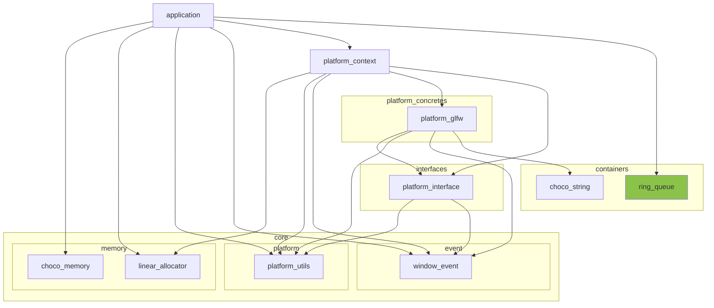

※本記事は [全体イントロダクション](https://zenn.dev/chocolate_pie24/articles/c-glfw-game-engine-introduction)のBook3に対応しています。

- [このステップでやること](#このステップでやること)
- [リングキューについて軽く解説](#リングキューについて軽く解説)
  - [リングキューの特徴](#リングキューの特徴)
  - [リングキューの基本的な実装](#リングキューの基本的な実装)
    - [リングキュー構造体](#リングキュー構造体)
    - [ring\_queue\_push](#ring_queue_push)
    - [ring\_queue\_pop](#ring_queue_pop)
- [GL Choco Engineリングキュー仕様の検討](#gl-choco-engineリングキュー仕様の検討)
- [リングキュー外部公開APIの検討](#リングキュー外部公開apiの検討)
- [リングキュー実装(ring\_queue\_create)](#リングキュー実装ring_queue_create)
- [リングキュー実装(ring\_queue\_destroy)](#リングキュー実装ring_queue_destroy)
- [リングキュー実装(ring\_queue\_push)](#リングキュー実装ring_queue_push)
- [リングキュー実装(ring\_queue\_pop)](#リングキュー実装ring_queue_pop)
- [リングキュー実装(ring\_queue\_empty)](#リングキュー実装ring_queue_empty)
- [アプリケーション側変更](#アプリケーション側変更)
  - [内部状態管理構造体へのリングキューの追加](#内部状態管理構造体へのリングキューの追加)
  - [ring\_queueの初期化](#ring_queueの初期化)
  - [ring\_queue\_destroyの追加](#ring_queue_destroyの追加)
  - [on\_windowの変更](#on_windowの変更)
  - [イベント処理の追加](#イベント処理の追加)

## このステップでやること

前回は、プラットフォームでイベントを吸い上げ、アプリケーション側にイベントを伝え、アプリケーション側でイベントを処理する仕組みを構築しました。しかし、前回作成した仕組みだけでは、連続したイベントがあった場合、最後のイベントのみに対応すれば良いところを全て対応するという非効率な処理が発生します。今回は、発生したイベントを一時的に格納するキューを作成することで、この問題に対処します。

## リングキューについて軽く解説

本題に入る前に、リングキューの基本的な仕組みと、実装について説明します。

### リングキューの特徴

先ずキューについてですが、データを格納するためのデータ構造で、先に入れたものから先に取り出す構造です。同じくデータを格納するためのデータ構造でスタックがありますが、これは後に入れたものから先に取り出す構造です。キューは配列を用いて実装されることが多いです。そのため、配列サイズの拡張を行わない場合、キューが満杯になったらデータを追加することはできません。

ここで、キューの配列サイズなのですが、溢れないようにするためには発生しうるイベント数の最大値を把握しておかなくてはいけません。ただ、イベント数の最大値を把握することは難しく、さらに、イベントの発生数というのは描画フレームごとに安定せず、バラツキが出ます。いたずらに大きな配列を用意するのはメモリ効率的に良くありません。そこで、リングキューを使用します。

リングキューは、キューをリング状にしたもので、配列の最後が配列の先頭につながっています。このため、キューが満杯になった状態でデータを追加する場合、古いデータを削除して新しいデータを挿入できるようになります。

### リングキューの基本的な実装

では、最も簡単なリングキューを実装していきます。int型の整数値を4個格納可能なリングキューを作ります。

#### リングキュー構造体

リングキューのデータ構造は次のようになります。

```c
// リングキュー構造体
typedef struct ring_queue {
    int head;               // データを取り出す(pop)する際の配列インデックス
    int tail;               // データを格納する(push)する際の配列インデックス
    int len;                // キューに格納済の要素数
    int max_element_count;  // キューに格納可能な要素数
    int data[4];            // データ格納配列
} ring_queue_t;
```

この構造体を使用し、データの取り出し(pop)関数とデータの格納(push)関数を作成していきます。なお、初期化関数については全て0にするだけなので、省略します。

#### ring_queue_push

リングキューにデータを格納する際に、head, tail, lenがどのような変化をしていくかを下図に示します。


この動作を実装すると、以下のようになります。

```c
void ring_queue_push(ring_queue_t* ring_queue_, int data_) {
    ring_queue_->data[ring_queue_->tail] = data_;   // データの格納

    ring_queue_->tail = (ring_queue_->tail + 1) % ring_queue_->max_element_count;   // データ格納インデックスの更新

    if(ring_queue_->len != ring_queue_->max_element_count) {    // キューが満杯ではない
        ring_queue_->len++;
    } else {    // キューが満杯
        ring_queue_->head = (ring_queue_->head + 1) % ring_queue_->max_element_count;
    }
}
```

- 先ずデータを格納し後のtailの更新ですが、単純に加算するのではなく、余りを計算することによって、満杯になったら0に戻るようにしています
- キューが満杯でなければ格納されている要素数のカウンタlenをインクリメントしています
- キューが満杯の場合は取り出す際のインデックスheadをインクリメントする必要があります。tailと同様、余りを使用して更新しています。

#### ring_queue_pop

リングキューからデータを取り出す際のhead, tail, lenの動作を下図に示します(図はpushの図の続きです)。


なお、空になったときにheadとtailを0にしていますが、0に戻さず、head=1, tail=1のまま続行しても動作上問題ありません。ただ、キューが空の状態では必ずheadとtailが0になっているという状態にしたかったため、こうしています。

この動作を実装すると、以下のようになります。

```c
bool ring_queue_pop(ring_queue_t* ring_queue_, int* out_data_) {
    if(0 == ring_queue_->len) {
        return false;
    }

    *out_data_ = ring_queue_->data[ring_queue_->head];

    ring_queue_->len--;
    ring_queue_->head = (ring_queue_->head + 1) % ring_queue_->max_element_count;

    if(0 == ring_queue_->len) {
        ring_queue_->head = 0;
        ring_queue_->tail = 0;
    }

    return true;
}
```

popの方はシンプルで、

- キューが空だったら失敗としてfalseを出力
- 配列からインデックスheadの値を取り出し引数に格納
- lenとheadの値を更新
- 取り出した結果、キューが空になったらheadとtailを0に戻す

という内容です。

以上が基本的なリングキューの解説です。なお、今回はint型のデータを格納する専用のリングキューでした。次からはGL Choco Engineで用いるもうちょっと便利なキューの実装について説明を進めます。

## GL Choco Engineリングキュー仕様の検討

今回作成するリングキューの仕様について考えます。まず、格納したいデータは、

- ウィンドウイベント構造体
- キーボードイベント構造体
- マウスイベント構造体

の3つです。これら3つの構造体を格納する専用のリングキューを作成しても良いのですが、ゲームパッドへの対応等によって今後もイベント構造体は増える可能性が高いです。なので、今回は型に依存せず、汎用的に使用可能なリングキューを作成します。一方で、下記の制約は設けます。

構造体を格納するメモリプールのメモリは、既存のメモリーシステムを使用して確保します。ただ、メモリーシステムが返すメモリのアライメントはmax_align_tにアライメントされています。このため、max_align_tを超過するアライメント要件のデータはメモリプールに格納できない場合があります。

本実装のリングキューは、次の条件を満たすデータ型だけを格納できることを前提としています。

- 要素サイズが2のべき乗バイトであること
- データ型のアラインメント要件がmax_align_t以下であること

今回作成するリングキューモジュールはレイヤー構成図の中では以下の位置づけになります。



## リングキュー外部公開APIの検討

現状でリングキューに求められている責務は、

- イベントデータを追加できること
- イベントデータを取り出せること

のみです。データ格納バッファのサイズ変更などは現状では必要としていません。なので、最小限のAPIとして下記を実装していくことにします。

include/engine/containers/ring_queue.h

```c
typedef struct ring_queue ring_queue_t; // 構造体前方宣言

typedef enum {
    RING_QUEUE_SUCCESS = 0,         /**< 処理成功 */
    RING_QUEUE_INVALID_ARGUMENT,    /**< 無効な引数 */
    RING_QUEUE_NO_MEMORY,           /**< メモリ不足 */
    RING_QUEUE_RUNTIME_ERROR,       /**< 実行時エラー */
    RING_QUEUE_UNDEFINED_ERROR,     /**< 未定義エラー */
    RING_QUEUE_EMPTY,               /**< リングキューが空 */
} ring_queue_result_t;

// リングキューモジュールの作成
ring_queue_result_t ring_queue_create(size_t max_element_count_, size_t element_size_, size_t element_align_, ring_queue_t** ring_queue_);

// リングキューモジュールの破棄
void ring_queue_destroy(ring_queue_t** ring_queue_);

// リングキューへのpush
ring_queue_result_t ring_queue_push(ring_queue_t* ring_queue_, const void* data_, size_t element_size_, size_t element_align_);

// リングキューからのpop
ring_queue_result_t ring_queue_pop(ring_queue_t* ring_queue_, void* data_, size_t element_size_, size_t element_align_);

// リングキュー空判定
bool ring_queue_empty(const ring_queue_t* ring_queue_);
```

なお、リングキューモジュールはcontainersに格納します。よって、choco_stringと同様、

- 構造体の内部データは外部から隠蔽
- 構造体自体のメモリリソースは全て使用側ではなく、モジュール側が管理する

とします。それでは、以降で具体的なAPI実装について説明していきます。

## リングキュー実装(ring_queue_create)

では、ring_queue_createの実装に進みます。今回作成するような任意の型を格納可能なコンテナを作成する際、注意しなければいけないのがメモリアライメントです。データは型によって配置可能なアドレスが異なるため、データの格納位置の先頭アドレスを整える必要があります。そのために、3つのパラメータを用いて領域を管理します。

- 要素格納領域(サイズ = element_size)
- パディング領域(サイズ = padding_size)
- 要素の格納に必要な領域(サイズ = stride_size)

図で表すと次のようになります。


これらのパラメータを使用すればリングキューに要素を格納するためのメモリプールの容量は、

```math
memory\_pool\_size = stride\_size \times element\_count
```

で計算できます。それでは具体的な実装の説明に移ります。エラー処理を省いた処理の全体を貼り付けます。

```c
ring_queue_result_t ring_queue_create(size_t max_element_count_, size_t element_size_, size_t element_align_, ring_queue_t** ring_queue_) {
    ring_queue_result_t ret = RING_QUEUE_INVALID_ARGUMENT;
    memory_system_result_t ret_mem = MEMORY_SYSTEM_INVALID_ARGUMENT;
    ring_queue_t* tmp_queue = NULL;
    size_t capacity = 0;
    size_t stride = 0;
    size_t padding = 0;
    size_t diff = 0;

    diff = element_size_ % element_align_;   // アライメントのズレ量
    if(0 == diff) {
        padding = 0;
    } else {
        if(element_size_ > element_align_) {
            padding = element_align_ - diff;
        } else {
            padding = element_align_ - element_size_;
        }
    }
    stride = element_size_ + padding;
    capacity = stride * max_element_count_;

    ret_mem = memory_system_allocate(sizeof(*tmp_queue), MEMORY_TAG_RING_QUEUE, (void**)&tmp_queue);
    memset(tmp_queue, 0, sizeof(*tmp_queue));

    ret_mem = memory_system_allocate(capacity, MEMORY_TAG_RING_QUEUE, &tmp_queue->memory_pool);

    memset(tmp_queue->memory_pool, 0, capacity);

    tmp_queue->capacity = capacity;
    tmp_queue->element_align = element_align_;
    tmp_queue->element_size = element_size_;
    tmp_queue->head = 0;
    tmp_queue->len = 0;
    tmp_queue->max_element_count = max_element_count_;
    tmp_queue->padding = padding;
    tmp_queue->stride = stride;
    tmp_queue->tail = 0;

    *ring_queue_ = tmp_queue;
    ret = RING_QUEUE_SUCCESS;

cleanup:
    if(RING_QUEUE_SUCCESS != ret) {
        if(NULL != tmp_queue) {
            if(NULL != tmp_queue->memory_pool) {
                memory_system_free(tmp_queue->memory_pool, capacity, MEMORY_TAG_RING_QUEUE);
                tmp_queue->memory_pool = NULL;
            }
            memory_system_free(tmp_queue, sizeof(*tmp_queue), MEMORY_TAG_RING_QUEUE);
            tmp_queue = NULL;
        }
    }
    return ret;
}
```

まず、stride_sizeを計算するためにpadding_sizeを計算します。

```c
    diff = element_size_ % element_align_;   // アライメントのズレ量
    if(0 == diff) {
        padding = 0;
    } else {
        if(element_size_ > element_align_) {
            padding = element_align_ - diff;
        } else {
            padding = element_align_ - element_size_;
        }
    }
```

この式で計算しているのですが、簡単な例を用いて説明します。

例えば、要素サイズが15byteで、メモリアライメント要件が4byteの構造体を考えます。この場合、

- element_size = 15
- element_align = 4

です。

このデータを、キューにパディングなしでギチギチにデータを詰め込もうとした場合、2要素目を格納するアドレスは(キューの先頭アドレス+15)になります。このアドレスは4byte境界ではない(4で割り切れない)ので、1byteのパディングを入れる必要があります。この1byteを計算するために、

```c
diff = element_size_ % element_align_;
```

で要素サイズとアライメントのミスマッチ量を計算し、

```c
        if(element_size_ > element_align_) {
            padding = element_align_ - diff;
        } else {
            padding = element_align_ - element_size_;
        }
```

でパディングサイズを計算しています。なお、キューの先頭アドレスはリングキュー仕様の検討で説明したとおり、max_align_tにアラインされているため、無条件でアライメント要件を満たしています。

パディング領域サイズが計算できれば、後は、

```c
    stride = element_size_ + padding;
    capacity = stride * max_element_count_;
```

によって1要素当たりに必要なメモリ領域サイズと、メモリプール全体のサイズが確定します。ここまで来れば、後はメモリシステムを用いてメモリを確保、初期化すればOKです。ここまで来れば、後のAPIは格納要素の型を固定したリングキューとほぼ同じ要領で実装可能です。なお、このAPIの追加に当たり、メモリシステムについて下記の変更を行っています。軽微な変更なので詳細は省略させていただきます。

- memory_tag_tにMEMORY_TAG_RING_QUEUEを追加
- memory_system_createのmem_tag_str初期化にring_queueを追加

## リングキュー実装(ring_queue_destroy)

ring_queue_createが出来ましたので、次はデストラクタに相当するring_queue_destroyです。これについてはメモリを解放するだけなので、特に注意点はありません。実装は以下のようになります。

```c
void ring_queue_destroy(ring_queue_t** ring_queue_) {
    if(NULL == ring_queue_) {
        goto cleanup;
    }
    if(NULL == *ring_queue_) {
        goto cleanup;
    }
    if(NULL != (*ring_queue_)->memory_pool) {
        memory_system_free((*ring_queue_)->memory_pool, (*ring_queue_)->capacity, MEMORY_TAG_RING_QUEUE);
        (*ring_queue_)->memory_pool = NULL;
    }
    memory_system_free(*ring_queue_, sizeof(ring_queue_t), MEMORY_TAG_RING_QUEUE);
    *ring_queue_ = NULL;
cleanup:
    return;
}
```

## リングキュー実装(ring_queue_push)

ここまで来れば、後は最初に説明したint型固定でのリングキューの動作とそこまで差はありません。

注意しなければいけないのは配列インデックスの計算にtailをそのまま使用できないことと、pushするデータのコピーに代入が使えないためmemcpyを使用することのみです。

```c
ring_queue_result_t ring_queue_push(ring_queue_t* ring_queue_, const void* data_, size_t element_size_, size_t element_align_) {
    ring_queue_result_t ret = RING_QUEUE_INVALID_ARGUMENT;
    char* mem_ptr = NULL;
    char* target_ptr = NULL;

    mem_ptr = (char*)ring_queue_->memory_pool;
    target_ptr = mem_ptr + (ring_queue_->stride * ring_queue_->tail);
    memcpy(target_ptr, data_, ring_queue_->element_size);

    ring_queue_->tail = (ring_queue_->tail + 1) % ring_queue_->max_element_count;
    if(ring_queue_->len != ring_queue_->max_element_count) {
        ring_queue_->len++;
    } else {
        ring_queue_->head = (ring_queue_->head + 1) % ring_queue_->max_element_count;
    }
    ret = RING_QUEUE_SUCCESS;

cleanup:
    return ret;
}
```

引数にelement_size_とelement_align_を渡していますが、これはring_queue_createした時と異なる型を入れようとした場合にはエラーとなるように入れています。また、古いデータを上書きする際には特にメッセージは出さずにそのまま古いデータのメモリ領域を上書きします。これは上書きが十分起こりうるということと、厳密に全てのイベントを捕捉する必要はないためこのようにしています。ただ、ウィンドウクローズのように絶対に逃してはいけないイベントについてはリングキューによる管理とは別の仕組みでアプリケーション側に伝えるようにします。

## リングキュー実装(ring_queue_pop)

popについても同様にint型固定でのリングキューの動作と同様です。エラー処理を省いた処理の全体を貼り付けます。popしようとしてリングキューが空だった場合にはデバッグメッセージを出すようにしています。デバッグメッセージであるため、リリースビルド時には出力されません。ワーニングにしてリリースビルド時にもメッセージが出るようにするか悩んだのですが、とりあえずデバッグメッセージとしています。今後、使用していく中で、変更するかも知れません。

pushと同様、引数にelement_size_とelement_align_を渡していますが、これもエラー処理用です。

```c
ring_queue_result_t ring_queue_pop(ring_queue_t* ring_queue_, void* data_, size_t element_size_, size_t element_align_) {
    ring_queue_result_t ret = RING_QUEUE_INVALID_ARGUMENT;
    char* mem_ptr = NULL;
    char* head_ptr = NULL;

    if(ring_queue_empty(ring_queue_)) {
        DEBUG_MESSAGE("Ring queue is empty.");
        ret = RING_QUEUE_EMPTY;
        goto cleanup;
    }

    mem_ptr = (char*)ring_queue_->memory_pool;
    head_ptr = mem_ptr + (ring_queue_->head * ring_queue_->stride);
    memcpy(data_, head_ptr, ring_queue_->element_size);
    ring_queue_->len--;
    ring_queue_->head = (ring_queue_->head + 1) % ring_queue_->max_element_count;

    if(0 == ring_queue_->len) {
        ring_queue_->head = 0;
        ring_queue_->tail = 0;
    }

    ret = RING_QUEUE_SUCCESS;

cleanup:
    return ret;
}
```

## リングキュー実装(ring_queue_empty)

最後はリングキューが空かを判定するAPIの実装です。判定はlenを使用するだけなので、特に説明は不要かと思います。

```c
bool ring_queue_empty(const ring_queue_t* ring_queue_) {
    if(NULL == ring_queue_) {
        return true;
    } else if(NULL == ring_queue_->memory_pool) {
        return true;
    } else {
        if(0 != ring_queue_->len) {
            return false;
        } else {
            return true;
        }
    }
}
```

以上でリングキューの実装が完了しました。ここからはアプリケーション側にリングキューを配置し、ウィンドウイベントを格納できるようにしていきます。

## アプリケーション側変更

### 内部状態管理構造体へのリングキューの追加

まず、内部状態管理構造体app_state_tにウィンドウイベントを格納するリングキューを追加します。現状はウィンドウイベントのみを扱っていますので、window_event_queueのみの追加です。今後、マウスイベントやキーボードイベントが増えた際には、同じようにそれぞれ専用のリングキューを追加することになります。

```c
#include "engine/containers/ring_queue.h"   // 追加

typedef struct app_state {
    // application status
    bool window_should_close;   /**< ウィンドウクローズ指示フラグ */
    bool window_resized;        /**< ウィンドウサイズ変更イベント発生フラグ */
    int window_width;           /**< ウィンドウ幅 */
    int window_height;          /**< ウィンドウ高さ */

    // core/memory/linear_allocator
    size_t linear_alloc_mem_req;    /**< リニアアロケータオブジェクトに必要なメモリ量 */
    size_t linear_alloc_align_req;  /**< リニアアロケータオブジェクトが要求するメモリアライメント */
    size_t linear_alloc_pool_size;  /**< リニアアロケータオブジェクトが使用するメモリプールのサイズ */
    void* linear_alloc_pool;        /**< リニアアロケータオブジェクトが使用するメモリプールのアドレス */
    linear_alloc_t* linear_alloc;   /**< リニアアロケータオブジェクト */

    // core/event
    ring_queue_t* window_event_queue;   /**< ウィンドウイベント格納用リングキュー */

    // platform/platform_context
    platform_context_t* platform_context; /**< プラットフォームstrategyパターンへの窓口としてのコンテキストオブジェクト */
} app_state_t;
```

### ring_queueの初期化

次はapplication_create内でリングキューの初期化を行います。プラットフォームシステムの初期化の次に初期化処理を追加しました。また、エラー発生時のクリーンナップにリングキューの破棄を追加しています。キューのサイズはイベントの種類が現状では少ないため、とりあえず8としています。これは今後、使いながら増やす可能性があります。

```c
application_result_t application_create(void) {
    app_state_t* tmp = NULL;

    application_result_t ret = APPLICATION_RUNTIME_ERROR;
    memory_system_result_t ret_mem_sys = MEMORY_SYSTEM_INVALID_ARGUMENT;
    linear_allocator_result_t ret_linear_alloc = LINEAR_ALLOC_INVALID_ARGUMENT;
    platform_result_t ret_platform = PLATFORM_INVALID_ARGUMENT;
    ring_queue_result_t ret_ring_queue = RING_QUEUE_INVALID_ARGUMENT;

    // 途中省略

    ///////////////////////////////////////////////////////////////////////////////////////////////////////////////////////////////////
    // Simulation -> launch all systems -> create platform.(Don't use s_app_state here.)
    INFO_MESSAGE("Initializing platform state...");
    ret_platform = platform_initialize(tmp->linear_alloc, PLATFORM_USE_GLFW, &tmp->platform_context);
    if(PLATFORM_SUCCESS != ret_platform) {
        ret = rslt_convert_platform(ret_platform);
        ERROR_MESSAGE("application_create(%s) - Failed to initialize platform.", rslt_to_str(ret));
        goto cleanup;
    }
    INFO_MESSAGE("platform_backend initialized successfully.");

    ///////////////////////////////////////////////////////////////////////////////////////////////////////////////////////////////////
    // Simulation -> launch all systems -> create event message queue(window event).(Don't use s_app_state here.)
    INFO_MESSAGE("Starting window event queue initialize...");
    ret_ring_queue = ring_queue_create(8, sizeof(window_event_t), alignof(window_event_t), &tmp->window_event_queue);
    if(RING_QUEUE_SUCCESS != ret_ring_queue) {
        ret = rslt_convert_ring_queue(ret_ring_queue);
        ERROR_MESSAGE("application_create(%s) - Failed to initialize window event queue.", rslt_to_str(ret));
        goto cleanup;
    }
    INFO_MESSAGE("window event queue initialized successfully.");

    // begin temporary
    // TODO: ウィンドウ生成はレンダラー作成時にそっちに移す
    tmp->window_width = 1024;
    tmp->window_height = 768;
    ret_platform = platform_window_create(tmp->platform_context, "test_window", 1024, 768);
    if(PLATFORM_SUCCESS != ret_platform) {
        ret = rslt_convert_platform(ret_platform);
        ERROR_MESSAGE("application_create(%s) - Failed to create window.", rslt_to_str(ret));
        goto cleanup;
    }
    // end temporary

    // commit
    s_app_state = tmp;
    INFO_MESSAGE("Application created successfully.");
    memory_system_report();
    ret = APPLICATION_SUCCESS;

cleanup:
    if(APPLICATION_SUCCESS != ret) {
        if(NULL != tmp) {
            if(NULL != tmp->window_event_queue) {
                ring_queue_destroy(&tmp->window_event_queue);
                tmp->window_event_queue = NULL;
            }
            if(NULL != tmp->platform_context) {
                platform_destroy(tmp->platform_context);
            }
            if(NULL != tmp->linear_alloc_pool) {
                memory_system_free(tmp->linear_alloc_pool, tmp->linear_alloc_pool_size, MEMORY_TAG_SYSTEM);
            }
            if(NULL != tmp->linear_alloc) {
                memory_system_free(tmp->linear_alloc, tmp->linear_alloc_mem_req, MEMORY_TAG_SYSTEM);
            }
            memory_system_free(tmp, sizeof(*tmp), MEMORY_TAG_SYSTEM);
            tmp = NULL;
        }
        memory_system_destroy();
    }

    return ret;
}
```

### ring_queue_destroyの追加

初期化が完了したので、終了処理にring_queue_destroyを追加します。

```c
void application_destroy(void) {
    INFO_MESSAGE("Starting application shutdown...");
    if(NULL == s_app_state) {
        goto cleanup;
    }

    // begin cleanup all systems.

    // ここから追加
    if(NULL != s_app_state->window_event_queue) {
        ring_queue_destroy(&s_app_state->window_event_queue);
        s_app_state->window_event_queue = NULL;
    }
    // ここまで追加

    if(NULL != s_app_state->platform_context) {
        platform_destroy(s_app_state->platform_context);
    }
    if(NULL != s_app_state->linear_alloc_pool) {
        memory_system_free(s_app_state->linear_alloc_pool, s_app_state->linear_alloc_pool_size, MEMORY_TAG_SYSTEM);
        s_app_state->linear_alloc_pool = NULL;
    }
    if(NULL != s_app_state->linear_alloc) {
        memory_system_free(s_app_state->linear_alloc, s_app_state->linear_alloc_mem_req, MEMORY_TAG_SYSTEM);
        s_app_state->linear_alloc = NULL;
    }

    memory_system_free(s_app_state, sizeof(*s_app_state), MEMORY_TAG_SYSTEM);
    s_app_state = NULL;
    INFO_MESSAGE("Freed all memory.");
    memory_system_report();
    memory_system_destroy();
    // end cleanup all systems.

    INFO_MESSAGE("Application destroyed successfully.");
cleanup:
    return;
}
```

### on_windowの変更

ここまでできれば、後はリングキューへのデータの格納処理をウィンドウイベントコールバックに追加します。

前回のコードはこのようにウィンドウリサイズイベントを捕捉し、標準出力にメッセージを出していましたが、ここの部分を修正します。

```c
static void on_window(const window_event_t* event_) {
    if(NULL == event_) {
        WARN_MESSAGE("on_window - Argument 'event_' must not be NULL.");
        goto cleanup;
    }
    if(NULL == s_app_state) {
        WARN_MESSAGE("on_window - Application state is not initialized.");
        goto cleanup;
    }
    if(WINDOW_EVENT_RESIZE == event_->event_code) {
        INFO_MESSAGE("on_window - Window Resized!! new size: [width, height] = [%d, %d]", event_->window_width, event_->window_height);
    }

cleanup:
    return;
}
```

修正後

```c
static void on_window(const window_event_t* event_) {
    ring_queue_result_t ret_push = RING_QUEUE_INVALID_ARGUMENT;

    if(NULL == event_) {
        WARN_MESSAGE("on_window - Argument 'event_' must not be NULL.");
        goto cleanup;
    }
    if(NULL == s_app_state) {
        WARN_MESSAGE("on_window - Application state is not initialized.");
        goto cleanup;
    }

    ret_push = ring_queue_push(s_app_state->window_event_queue, event_, sizeof(window_event_t), alignof(window_event_t));
    if(RING_QUEUE_SUCCESS != ret_push) {
        application_result_t ret = rslt_convert_ring_queue(ret_push);
        WARN_MESSAGE("on_window(%s) - Failed to push window event.", rslt_to_str(ret));
        goto cleanup;
    }
cleanup:
    return;
}
```

内容はシンプルにイベント構造体インスタンスをpushするだけです。これでウィンドウイベントをリングキューに格納できるようになりました。それにより、前回はon_windowの中でその場で処理していましたが、今回は「イベントを一旦キューに貯める -> メインループ側でまとめて処理する」構造に変更しました。次は、リングキューに格納したイベントを処理する仕組みを構築していきます。

### イベント処理の追加

次の3つのプライベート関数をapplication.cに追加します。

```c
static void app_state_update(void);     // イベント処理によるアプリケーション状態変数の変更
static void app_state_dispatch(void);   // イベント処理を行った結果、各種サブシステムに変更を通知する
static void app_state_clean(void);      // アプリケーション状態変数のクリーンナップ
```

先ずはapp_state_updateの中身です。

```c
static void app_state_update(void) {
    application_result_t ret = APPLICATION_INVALID_ARGUMENT;
    if(NULL == s_app_state) {
        ret = APPLICATION_RUNTIME_ERROR;
        ERROR_MESSAGE("app_state_update(%s) - Application state is not initialized.", rslt_to_str(ret));
        goto cleanup;
    }
    if(NULL == s_app_state->window_event_queue) {
        ret = APPLICATION_RUNTIME_ERROR;
        ERROR_MESSAGE("app_state_update(%s) - window event queue is not initialized.", rslt_to_str(ret));
        goto cleanup;
    }

    // window events.
    while(!ring_queue_empty(s_app_state->window_event_queue)) {
        window_event_t event;
        ring_queue_result_t ret_ring = ring_queue_pop(s_app_state->window_event_queue, &event, sizeof(window_event_t), alignof(window_event_t));
        if(RING_QUEUE_SUCCESS != ret_ring) {
            ret = rslt_convert_ring_queue(ret_ring);
            WARN_MESSAGE("app_state_update(%s) - Failed to pop window event.", rslt_to_str(ret));
            goto cleanup;
        } else {
            if(WINDOW_EVENT_RESIZE == event.event_code) {
                INFO_MESSAGE("Window resized: [%dx%d] -> [%dx%d]", s_app_state->window_width, s_app_state->window_height, event.window_width, event.window_height);
                s_app_state->window_resized = true;
                s_app_state->window_height = event.window_height;
                s_app_state->window_width = event.window_width;
            }
        }
    }

cleanup:
    return;
}
```

この処理では、ウィンドウイベントを格納するリングキューが空になるまでイベント構造体インスタンスを取り出し、イベント処理をしています。現状ではイベントはWINDOW_EVENT_RESIZEのみなので、ウィンドウサイズが変更になった際の通知を出しているだけです。今後、キーボードやマウスのイベントが増えると、ここに各イベント用のリングキュー処理が追加されることになります。

次がapp_state_dispatchです。現状ではイベントによる状態変更の通知を行うサブシステムがないので、中身はまだありません。

```c
static void app_state_dispatch(void) {
    // 各サブシステムへイベントを通知 まだ処理はなし
}
```

最後にapp_state_cleanですが、これはapp_state_updateによって各種内部状態変数を書き換え、app_state_dispatchによって通知が終わった後に各種フラグをリセットする役目があります。window_should_closeフラグについてはtrueからfalseにする必要はないので、リセットはしていません。

```c
static void app_state_clean(void) {
    if(NULL == s_app_state) {
        ERROR_MESSAGE("app_state_clean(%s) - Application state is not initialized.", rslt_to_str(APPLICATION_RUNTIME_ERROR));
        goto cleanup;
    }
    s_app_state->window_resized = false;
cleanup:
    return;
}
```

後はapplication_runにこれらの関数の実行を追加します。

```c
application_result_t application_run(void) {
    application_result_t ret = APPLICATION_SUCCESS;
    if(NULL == s_app_state) {
        ret = APPLICATION_RUNTIME_ERROR;
        ERROR_MESSAGE("application_run(%s) - Application is not initialized.", rslt_to_str(ret));
        goto cleanup;
    }
    struct timespec  req = {0, 1000000};
    while(!s_app_state->window_should_close) {
        platform_result_t ret_event = platform_pump_messages(s_app_state->platform_context, on_window);
        if(PLATFORM_WINDOW_CLOSE == ret_event) {
            s_app_state->window_should_close = true;
            continue;
        } else if(PLATFORM_SUCCESS != ret_event) {
            ret = rslt_convert_platform(ret_event);
            WARN_MESSAGE("application_run(%s) - Failed to pump events.", rslt_to_str(ret));
            continue;
        }
        app_state_update();
        app_state_dispatch();
        app_state_clean();
        nanosleep(&req, NULL);
    }
cleanup:
    return ret;
}
```

以上でリングキューの追加と、実際の使用までの実装が完了しました。これでイベントシステムの基本的な動作が出来ました。これによって、将来的にキーボード、マウス、ゲームパッド等のイベントの追加もこれと同様の手順を踏むことで処理が可能になります。次回は、platform_pump_messagesについてリファクタリングを行う予定です。
