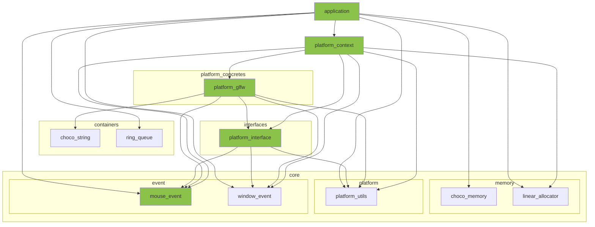

※本記事は [全体イントロダクション](https://zenn.dev/chocolate_pie24/articles/c-glfw-game-engine-introduction)のBook3に対応しています。

- [このステップでやること](#このステップでやること)
- [マウスイベント構造体の追加](#マウスイベント構造体の追加)
- [プラットフォームコンテキストモジュール](#プラットフォームコンテキストモジュール)
- [プラットフォームインターフェイスモジュール](#プラットフォームインターフェイスモジュール)
- [マウスイベント取得処理](#マウスイベント取得処理)
- [アプリケーション側変更](#アプリケーション側変更)


## このステップでやること

前回までで、イベントシステムの土台が完成しました。今回はマウスイベントを追加していきます。
基本的な構造は全て完成しているので、今回と次回(キーボードイベント)は機械的な作業の連続になります。

記事としての派手さは少ないのですが、作成したイベントシステムによって、
様々なイベントを機械的な作業のみで追加できるということを実感していただけたらと思います。

今回変更する部分をレイヤー構成図で図示します。



## マウスイベント構造体の追加

まず、マウスイベント構造体を作っていきます。マウスイベントは、下記の情報があれば十分です。

- マウスのx, y座標
- イベントを発生させたマウスボタン
- イベントを発生させたマウスボタンの押下状態

これに沿って作っていきます。マウスボタン種別に中ボタンを追加しても良かったのですが、恐らく使うことはないので省いています。
ホイールについては将来拡張で追加になるかも知れません。
その他は特に特徴的なところは無いかと思います。

include/engine/core/event/mouse_event.h

```c
#ifndef ENGINE_CORE_MOUSE_EVENT_H
#define ENGINE_CORE_MOUSE_EVENT_H

#ifdef __cplusplus
extern "C" {
#endif

#include <stdbool.h>

/**
 * @brief マウスボタン種別リスト(中ボタンは多分使わないので省略した)
 *
 */
typedef enum {
    MOUSE_BUTTON_LEFT,  /**< マウス左ボタン */
    MOUSE_BUTTON_RIGHT, /**< マウス右ボタン */
} mouse_button_t;

/**
 * @brief マウスイベント構造体
 *
 */
typedef struct mouse_event {
    int x;                  /**< イベントが発生した際のウィンドウ内でのマウス座標 */
    int y;                  /**< イベントが発生した際のウィンドウ内でのマウス座標 */
    mouse_button_t button;  /**< イベントが発生したマウスボタン */
    bool pressed;           /**< イベントが発生した際のマウスボタン状態(true: 押下 / false: 離した) */
} mouse_event_t;

#ifdef __cplusplus
}
#endif
#endif
```

## プラットフォームコンテキストモジュール

今回、マウスイベントを追加していくので、platform_pump_messagesにマウスイベントコールバック関数を引数に追加していきます。

```c
// 省略
#include "engine/core/event/mouse_event.h"  // 追加
#include "engine/core/event/window_event.h"

// 省略

platform_result_t platform_pump_messages(
    platform_context_t* platform_context_,
    void (*window_event_callback)(const window_event_t* event_),
    void (*mouse_event_callback)(const mouse_event_t* event_)); // 追加

// 省略
```

インターフェイスが変わったので、実装も変更します。platform_pump_messagesの引数にmouse_event_callbackを追加するだけです。

```c
platform_result_t platform_pump_messages(
    platform_context_t* platform_context_,
    void (*window_event_callback)(const window_event_t* event_),
    void (*mouse_event_callback)(const mouse_event_t* event_)) {

    platform_result_t ret = PLATFORM_INVALID_ARGUMENT;
    CHECK_ARG_NULL_GOTO_CLEANUP(platform_context_, PLATFORM_INVALID_ARGUMENT, "platform_pump_messages", "platform_context_")
    CHECK_ARG_NULL_GOTO_CLEANUP(platform_context_->vtable, PLATFORM_INVALID_ARGUMENT, "platform_pump_messages", "platform_context_->vtable")
    CHECK_ARG_NULL_GOTO_CLEANUP(platform_context_->backend, PLATFORM_INVALID_ARGUMENT, "platform_pump_messages", "platform_context_->backend")
    CHECK_ARG_NULL_GOTO_CLEANUP(window_event_callback, PLATFORM_INVALID_ARGUMENT, "platform_pump_messages", "window_event_callback")
    CHECK_ARG_NULL_GOTO_CLEANUP(mouse_event_callback, PLATFORM_INVALID_ARGUMENT, "platform_pump_messages", "mouse_event_callback")

    ret = platform_context_->vtable->platform_pump_messages(platform_context_->backend, window_event_callback, mouse_event_callback);
    if(PLATFORM_SUCCESS != ret && PLATFORM_WINDOW_CLOSE != ret) {
        ERROR_MESSAGE("platform_pump_messages(%s) - Failed to pump messages.", rslt_to_str(ret));
        goto cleanup;
    }

cleanup:
    return ret;
}
```

## プラットフォームインターフェイスモジュール

ここに関してもマウスイベントコールバックの追加のみです。

include/engine/interfaces/platform_interface.h

```c
// 省略

#include "engine/core/event/mouse_event.h"  // 追加
#include "engine/core/event/window_event.h"

// 省略

typedef platform_result_t (*pfn_platform_backend_pump_messages)(
    platform_backend_t* platform_backend_,
    void (*window_event_callback)(const window_event_t* event_),
    void (*mouse_event_callback)(const mouse_event_t* event_)); // 追加

// 省略
```

これで、プラットフォームからマウスイベントをアプリケーションに渡すための通り道が用意できました。あとは、この通り道を通って流れるイベントを実際に作成していきます。

## マウスイベント取得処理

前回作成したinput_snapshot_tにマウス関連の情報を追加していきます。

src/engine/platform_concretes/platform_glfw.c

```c
typedef struct input_snapshot {
    double cursor_x;    /**< マウス座標x */ // 追加
    double cursor_y;    /**< マウス座標y */ // 追加

    int window_width;   /**< ウィンドウ幅 */
    int window_height;  /**< ウィンドウ高さ */

    bool window_should_close;   /**< ウィンドウクローズイベント発生 */

    bool left_button_pressed;   /**< マウス左ボタン押下フラグ */    // 追加
    bool right_button_pressed;  /**< マウス右ボタン押下フラグ */    // 追加
} input_snapshot_t;
```

input_snapshot_tに変数を追加したので、初期化処理をplatform_glfw_initに追加します。
ただ単に追加構造体変数の初期化を追加したのみなので読み飛ばしても問題ありません。

```c
static platform_result_t platform_glfw_init(platform_backend_t* platform_backend_) {
    // 省略
    glfwWindowHint(GLFW_OPENGL_PROFILE, GLFW_OPENGL_CORE_PROFILE);  // 古いOpenGLは使用しない

    platform_backend_->window = NULL;
    platform_backend_->window_label = NULL;

    platform_backend_->initialized_glfw = true;

    platform_backend_->prev.left_button_pressed = false;
    platform_backend_->prev.right_button_pressed = false;
    platform_backend_->prev.cursor_x = 0.0;
    platform_backend_->prev.cursor_y = 0.0;
    platform_backend_->prev.window_width = 0;
    platform_backend_->prev.window_height = 0;
    platform_backend_->prev.window_should_close = false;

    platform_backend_->current.left_button_pressed = false;
    platform_backend_->current.right_button_pressed = false;
    platform_backend_->current.cursor_x = 0.0;
    platform_backend_->current.cursor_y = 0.0;
    platform_backend_->current.window_width = 0;
    platform_backend_->current.window_height = 0;
    platform_backend_->current.window_should_close = false;

    ret = PLATFORM_SUCCESS;

cleanup:
    return ret;
}
```

platform_destroyにも同様に値を戻す処理を追加します。
ここも読み飛ばしても問題はありません。

```c
static void platform_glfw_destroy(platform_backend_t* platform_backend_) {
    if(NULL == platform_backend_) {
        return;
    }
    if(NULL != platform_backend_->window) {
        glfwDestroyWindow(platform_backend_->window);
        platform_backend_->window = NULL;
    }
    if(platform_backend_->initialized_glfw) {
        glfwTerminate();
    }
    choco_string_destroy(&platform_backend_->window_label);
    platform_backend_->window = NULL;
    platform_backend_->initialized_glfw = false;

    platform_backend_->prev.left_button_pressed = false;
    platform_backend_->prev.right_button_pressed = false;
    platform_backend_->prev.cursor_x = 0.0;
    platform_backend_->prev.cursor_y = 0.0;
    platform_backend_->prev.window_width = 0;
    platform_backend_->prev.window_height = 0;
    platform_backend_->prev.window_should_close = false;

    platform_backend_->current.left_button_pressed = false;
    platform_backend_->current.right_button_pressed = false;
    platform_backend_->current.cursor_x = 0.0;
    platform_backend_->current.cursor_y = 0.0;
    platform_backend_->current.window_width = 0;
    platform_backend_->current.window_height = 0;
    platform_backend_->current.window_should_close = false;
}
```

イベント収集処理にマウスイベントを追加します。追加する処理は、

- glfwGetCursorPosを使用してマウスカーソル座標を取得
- glfwGetMouseButtonを使用してボタン押下状態を取得

です。

```c
static platform_result_t platform_snapshot_collect(platform_backend_t* platform_backend_) {
    platform_result_t ret = PLATFORM_INVALID_ARGUMENT;
    int left_button_state = 0;
    int right_button_state = 0;

    CHECK_ARG_NULL_GOTO_CLEANUP(platform_backend_, PLATFORM_INVALID_ARGUMENT, "platform_snapshot_collect", "platform_backend_")
    CHECK_ARG_NULL_GOTO_CLEANUP(platform_backend_->window, PLATFORM_INVALID_ARGUMENT, "platform_snapshot_collect", "platform_backend_->window")
    CHECK_ARG_NOT_VALID_GOTO_CLEANUP(platform_backend_->initialized_glfw, PLATFORM_INVALID_ARGUMENT, "platform_snapshot_collect", "platform_backend_->initialized_glfw")

    // window events.
    platform_backend_->current.window_should_close = (0 != glfwWindowShouldClose(platform_backend_->window)) ? true : false;

    glfwGetWindowSize(platform_backend_->window, &platform_backend_->current.window_width, &platform_backend_->current.window_height);

    // ここから追加
    // mouse event.
    glfwGetCursorPos(platform_backend_->window, &platform_backend_->current.cursor_x, &platform_backend_->current.cursor_y);

    left_button_state = glfwGetMouseButton(platform_backend_->window, GLFW_MOUSE_BUTTON_LEFT);
    platform_backend_->current.left_button_pressed = (GLFW_PRESS == left_button_state) ? true : false;

    right_button_state = glfwGetMouseButton(platform_backend_->window, GLFW_MOUSE_BUTTON_RIGHT);
    platform_backend_->current.right_button_pressed = (GLFW_PRESS == right_button_state) ? true : false;
    // ここまで追加

    ret = PLATFORM_SUCCESS;

cleanup:
    return ret;
}
```

次はplatform_snapshot_processにマウスイベント処理を追加です。
特に特筆すべき処理はないかと思うのですが、ボタン押下状態の変化を捉え、変化があった場合にカーソル位置、ボタン押下状態を代入してコールバックを呼ぶだけです。
なお、platform_snapshot_collectで使用したglfwGetCursorPosは返り値がdoubleです。ただ、GL Choco Engineでそこまで精度良くマウス座標を使用することは無いと思われるため、
int型にキャストして代入しています。

```c
static platform_result_t platform_snapshot_process(
    platform_backend_t* platform_backend_,
    void (*window_event_callback)(const window_event_t* event_),
    void (*mouse_event_callback)(const mouse_event_t* event_)) {

    platform_result_t ret = PLATFORM_INVALID_ARGUMENT;
    CHECK_ARG_NULL_GOTO_CLEANUP(platform_backend_, PLATFORM_INVALID_ARGUMENT, "platform_snapshot_process", "platform_backend_")
    CHECK_ARG_NULL_GOTO_CLEANUP(platform_backend_->window, PLATFORM_INVALID_ARGUMENT, "platform_snapshot_process", "platform_backend_->window")
    CHECK_ARG_NOT_VALID_GOTO_CLEANUP(platform_backend_->initialized_glfw, PLATFORM_INVALID_ARGUMENT, "platform_snapshot_process", "platform_backend_->initialized_glfw")
    CHECK_ARG_NULL_GOTO_CLEANUP(window_event_callback, PLATFORM_INVALID_ARGUMENT, "platform_snapshot_process", "window_event_callback")
    CHECK_ARG_NULL_GOTO_CLEANUP(mouse_event_callback, PLATFORM_INVALID_ARGUMENT, "platform_snapshot_process", "mouse_event_callback")

    if(platform_backend_->current.window_should_close) {
        ret = PLATFORM_WINDOW_CLOSE;
        platform_backend_->prev = platform_backend_->current;
        goto cleanup;
    }

    // window event
    if(platform_backend_->current.window_width != platform_backend_->prev.window_width || platform_backend_->current.window_height != platform_backend_->prev.window_height) {
        window_event_t window_event;
        window_event.event_code = WINDOW_EVENT_RESIZE;
        window_event.window_height = platform_backend_->current.window_height;
        window_event.window_width = platform_backend_->current.window_width;

        window_event_callback(&window_event);
    }

    // ここから追加
    // mouse events.
    if(platform_backend_->prev.left_button_pressed != platform_backend_->current.left_button_pressed) {
        mouse_event_t mouse_event;
        mouse_event.button = MOUSE_BUTTON_LEFT;
        mouse_event.pressed = platform_backend_->current.left_button_pressed;
        mouse_event.x = (int)platform_backend_->current.cursor_x;
        mouse_event.y = (int)platform_backend_->current.cursor_y;
        mouse_event_callback(&mouse_event);
    }
    if(platform_backend_->prev.right_button_pressed != platform_backend_->current.right_button_pressed) {
        mouse_event_t mouse_event;
        mouse_event.button = MOUSE_BUTTON_RIGHT;
        mouse_event.pressed = platform_backend_->current.right_button_pressed;
        mouse_event.x = (int)platform_backend_->current.cursor_x;
        mouse_event.y = (int)platform_backend_->current.cursor_y;
        mouse_event_callback(&mouse_event);
    }
    // ここまで追加

    platform_backend_->prev = platform_backend_->current;
    ret = PLATFORM_SUCCESS;

cleanup:
    return ret;
}
```

最後に、platform_glfw_pump_messagesとplatform_snapshot_processの呼び出しにマウスイベントコールバックの引数を追加すればplatform_glfw.cは完了です。

```c
static platform_result_t platform_glfw_pump_messages(
    platform_backend_t* platform_backend_,
    void (*window_event_callback)(const window_event_t* event_),
    void (*mouse_event_callback)(const mouse_event_t* event_)) {

#ifdef TEST_BUILD
    if(s_test_controller.test_enable) {
        return s_test_controller.ret;
    }
#endif

    platform_result_t ret = PLATFORM_INVALID_ARGUMENT;

    CHECK_ARG_NULL_GOTO_CLEANUP(platform_backend_, PLATFORM_INVALID_ARGUMENT, "platform_glfw_pump_messages", "platform_backend_")
    CHECK_ARG_NOT_VALID_GOTO_CLEANUP(platform_backend_->initialized_glfw, PLATFORM_INVALID_ARGUMENT, "platform_glfw_pump_messages", "platform_backend_->initialized_glfw")
    CHECK_ARG_NULL_GOTO_CLEANUP(window_event_callback, PLATFORM_INVALID_ARGUMENT, "platform_glfw_pump_messages", "window_event_callback")
    CHECK_ARG_NULL_GOTO_CLEANUP(mouse_event_callback, PLATFORM_INVALID_ARGUMENT, "platform_glfw_pump_messages", "mouse_event_callback")
    CHECK_ARG_NULL_GOTO_CLEANUP(platform_backend_->window, PLATFORM_INVALID_ARGUMENT, "platform_glfw_pump_messages", "platform_backend_->window")

    // イベントの取得
    glfwPollEvents();

    ret = platform_snapshot_collect(platform_backend_);
    if(PLATFORM_SUCCESS != ret) {
        ERROR_MESSAGE("platform_glfw_pump_messages(%s) - Failed to collect snapshot.", rslt_to_str(ret));
        goto cleanup;
    }
    ret = platform_snapshot_process(platform_backend_, window_event_callback, mouse_event_callback);
    if(PLATFORM_WINDOW_CLOSE == ret) {
        goto cleanup;
    }
    if(PLATFORM_SUCCESS != ret) {
        ERROR_MESSAGE("platform_glfw_pump_messages(%s) - Failed to process snapshot.", rslt_to_str(ret));
        goto cleanup;
    }
    ret = PLATFORM_SUCCESS;

cleanup:
    return ret;
}
```

## アプリケーション側変更

これでマウスイベントを捕捉し、コールバックを呼ぶところまで出来ました。
後はアプリケーション側にコールバック関数、リングキューを用意すればマウスイベントについても完成です。

まずは内部状態管理構造体にイベント用リングキューを追加します。

src/engine/application/application.c

```c
typedef struct app_state {
    // application status
    bool window_should_close;   /**< ウィンドウクローズ指示フラグ */
    bool window_resized;        /**< ウィンドウサイズ変更イベント発生フラグ */
    int window_width;           /**< ウィンドウ幅 */
    int window_height;          /**< ウィンドウ高さ */

    // core/memory/linear_allocator
    size_t linear_alloc_mem_req;    /**< リニアアロケータ構造体インスタンスに必要なメモリ量 */
    size_t linear_alloc_align_req;  /**< リニアアロケータ構造体インスタンスが要求するメモリアライメント */
    size_t linear_alloc_pool_size;  /**< リニアアロケータ構造体インスタンスが使用するメモリプールのサイズ */
    void* linear_alloc_pool;        /**< リニアアロケータ構造体インスタンスが使用するメモリプールのアドレス */
    linear_alloc_t* linear_alloc;   /**< リニアアロケータ構造体インスタンス */

    // event message queues
    ring_queue_t* window_event_queue;   /**< ウィンドウイベント格納用リングキュー */
    ring_queue_t* mouse_event_queue;    /**< マウスイベント格納用リングキュー */

    // platform/platform_context
    platform_context_t* platform_context; /**< プラットフォームStrategyパターンへの窓口としてのコンテキスト構造体インスタンス */
} app_state_t;
```

application_createで追加したリングキューの初期化を行います。
初期化と失敗時の破棄を追加するだけなので、読み飛ばしても特に問題はありません。

```c
application_result_t application_create(void) {
    // 省略

    ///////////////////////////////////////////////////////////////////////////////////////////////////////////////////////////////////
    // Simulation -> launch all systems -> create platform.(Don't use s_app_state here.)
    INFO_MESSAGE("Initializing platform state...");
    ret_platform = platform_initialize(tmp->linear_alloc, PLATFORM_USE_GLFW, &tmp->platform_context);
    if(PLATFORM_SUCCESS != ret_platform) {
        ret = rslt_convert_platform(ret_platform);
        ERROR_MESSAGE("application_create(%s) - Failed to initialize platform.", rslt_to_str(ret));
        goto cleanup;
    }
    INFO_MESSAGE("platform_backend initialized successfully.");

    ///////////////////////////////////////////////////////////////////////////////////////////////////////////////////////////////////
    // Simulation -> launch all systems -> create event message queue(window event).(Don't use s_app_state here.)
    INFO_MESSAGE("Starting window event queue initialize...");
    ret_ring_queue = ring_queue_create(8, sizeof(window_event_t), alignof(window_event_t), &tmp->window_event_queue);
    if(RING_QUEUE_SUCCESS != ret_ring_queue) {
        ret = rslt_convert_ring_queue(ret_ring_queue);
        ERROR_MESSAGE("application_create(%s) - Failed to initialize window event queue.", rslt_to_str(ret));
        goto cleanup;
    }
    INFO_MESSAGE("window event queue initialized successfully.");

    ///////////////////////////////////////////////////////////////////////////////////////////////////////////////////////////////////
    // Simulation -> launch all systems -> create event message queue(mouse event).(Don't use s_app_state here.)
    INFO_MESSAGE("Starting mouse event queue initialize...");
    ret_ring_queue = ring_queue_create(128, sizeof(mouse_event_t), alignof(mouse_event_t), &tmp->mouse_event_queue);
    if(RING_QUEUE_SUCCESS != ret_ring_queue) {
        ret = rslt_convert_ring_queue(ret_ring_queue);
        ERROR_MESSAGE("application_create(%s) - Failed to initialize mouse event queue.", rslt_to_str(ret));
        goto cleanup;
    }
    INFO_MESSAGE("mouse event queue initialized successfully.");

    // begin temporary
    // TODO: ウィンドウ生成はレンダラー作成時にそっちに移す
    tmp->window_width = 1024;
    tmp->window_height = 768;
    ret_platform = platform_window_create(tmp->platform_context, "test_window", 1024, 768);
    if(PLATFORM_SUCCESS != ret_platform) {
        ret = rslt_convert_platform(ret_platform);
        ERROR_MESSAGE("application_create(%s) - Failed to create window.", rslt_to_str(ret));
        goto cleanup;
    }
    // end temporary

    // commit
    s_app_state = tmp;
    INFO_MESSAGE("Application created successfully.");
    memory_system_report();
    ret = APPLICATION_SUCCESS;

cleanup:
    if(APPLICATION_SUCCESS != ret) {
        if(NULL != tmp) {
            if(NULL != tmp->mouse_event_queue) {
                ring_queue_destroy(&tmp->mouse_event_queue);
                tmp->mouse_event_queue = NULL;
            }
            if(NULL != tmp->window_event_queue) {
                ring_queue_destroy(&tmp->window_event_queue);
                tmp->window_event_queue = NULL;
            }
            if(NULL != tmp->platform_context) {
                platform_destroy(tmp->platform_context);
            }
            if(NULL != tmp->linear_alloc_pool) {
                memory_system_free(tmp->linear_alloc_pool, tmp->linear_alloc_pool_size, MEMORY_TAG_SYSTEM);
            }
            if(NULL != tmp->linear_alloc) {
                memory_system_free(tmp->linear_alloc, tmp->linear_alloc_mem_req, MEMORY_TAG_SYSTEM);
            }
            memory_system_free(tmp, sizeof(*tmp), MEMORY_TAG_SYSTEM);
            tmp = NULL;
        }
        memory_system_destroy();
    }

    return ret;
}
```

application_destroyでリングキューの破棄を行います。
破棄を追加するだけなので、読み飛ばしても特に問題はありません。

```c
void application_destroy(void) {
    INFO_MESSAGE("Starting application shutdown...");
    if(NULL == s_app_state) {
        goto cleanup;
    }

    // begin cleanup all systems.
    if(NULL != s_app_state->mouse_event_queue) {
        ring_queue_destroy(&s_app_state->mouse_event_queue);    // 追加
        s_app_state->mouse_event_queue = NULL;
    }
    if(NULL != s_app_state->window_event_queue) {
        ring_queue_destroy(&s_app_state->window_event_queue);
        s_app_state->window_event_queue = NULL;
    }
    if(NULL != s_app_state->platform_context) {
        platform_destroy(s_app_state->platform_context);
    }
    if(NULL != s_app_state->linear_alloc_pool) {
        memory_system_free(s_app_state->linear_alloc_pool, s_app_state->linear_alloc_pool_size, MEMORY_TAG_SYSTEM);
        s_app_state->linear_alloc_pool = NULL;
    }
    if(NULL != s_app_state->linear_alloc) {
        memory_system_free(s_app_state->linear_alloc, s_app_state->linear_alloc_mem_req, MEMORY_TAG_SYSTEM);
        s_app_state->linear_alloc = NULL;
    }

    memory_system_free(s_app_state, sizeof(*s_app_state), MEMORY_TAG_SYSTEM);
    s_app_state = NULL;
    INFO_MESSAGE("Freed all memory.");
    memory_system_report();
    memory_system_destroy();
    // end cleanup all systems.

    INFO_MESSAGE("Application destroyed successfully.");
cleanup:
    return;
}
```

application_runでのplatform_pump_messagesの実行にマウスイベントコールバックを追加します。
これも読み飛ばしても大丈夫です。

```c
application_result_t application_run(void) {
    application_result_t ret = APPLICATION_SUCCESS;
    if(NULL == s_app_state) {
        ret = APPLICATION_RUNTIME_ERROR;
        ERROR_MESSAGE("application_run(%s) - Application is not initialized.", rslt_to_str(ret));
        goto cleanup;
    }
    while(!s_app_state->window_should_close) {
        platform_result_t ret_event = platform_pump_messages(s_app_state->platform_context, on_window, on_mouse);
        if(PLATFORM_WINDOW_CLOSE == ret_event) {
            s_app_state->window_should_close = true;
            continue;
        } else if(PLATFORM_SUCCESS != ret_event) {
            ret = rslt_convert_platform(ret_event);
            WARN_MESSAGE("application_run(%s) - Failed to pump events.", rslt_to_str(ret));
            continue;
        }
        app_state_update();
        app_state_dispatch();
        app_state_clean();
        // sleep(1);
        // TODO: platform_sleep
    }
cleanup:
    return ret;
}
```

マウスイベントコールバックを追加します。マウスイベント用のリングキューにイベント構造体をpushするだけです。

```c
static void on_mouse(const mouse_event_t* event_) {
    ring_queue_result_t ret_push = RING_QUEUE_INVALID_ARGUMENT;

    if(NULL == event_) {
        WARN_MESSAGE("on_mouse - Argument event_ requires a valid pointer.");
        goto cleanup;
    }
    if(NULL == s_app_state) {
        WARN_MESSAGE("on_mouse - Application state is not initialized.");
        goto cleanup;
    }

    ret_push = ring_queue_push(s_app_state->mouse_event_queue, event_, sizeof(mouse_event_t), alignof(mouse_event_t));
    if(RING_QUEUE_SUCCESS != ret_push) {
        application_result_t ret = rslt_convert_ring_queue(ret_push);
        WARN_MESSAGE("on_mouse(%s) - Failed to push mouse event.", rslt_to_str(ret));
        goto cleanup;
    }
cleanup:
    return;
}
```

最後にイベントキューからのイベント取り出しとイベント処理です。app_state_updateにマウスイベント関連を追加していきます。
なお、長くなるのでエラー処理は省略してあります。マウスの左、右ボタンを押したときと離したときに標準出力にメッセージが出るようにしています。

```c
static void app_state_update(void) {
    application_result_t ret = APPLICATION_INVALID_ARGUMENT;

    // window events.
    while(!ring_queue_empty(s_app_state->window_event_queue)) {
        window_event_t event;
        ring_queue_result_t ret_ring = ring_queue_pop(s_app_state->window_event_queue, &event, sizeof(window_event_t), alignof(window_event_t));
        if(RING_QUEUE_SUCCESS != ret_ring) {
            ret = rslt_convert_ring_queue(ret_ring);
            WARN_MESSAGE("app_state_update(%s) - Failed to pop window event.", rslt_to_str(ret));
            goto cleanup;
        } else {
            if(WINDOW_EVENT_RESIZE == event.event_code) {
                INFO_MESSAGE("Window resized: [%dx%d] -> [%dx%d]", s_app_state->window_width, s_app_state->window_height, event.window_width, event.window_height);
                s_app_state->window_resized = true;
                s_app_state->window_height = event.window_height;
                s_app_state->window_width = event.window_width;
            }
        }
    }

    // mouse events.
    while(!ring_queue_empty(s_app_state->mouse_event_queue)) {
        mouse_event_t event;
        ring_queue_result_t ret_ring = ring_queue_pop(s_app_state->mouse_event_queue, &event, sizeof(mouse_event_t), alignof(mouse_event_t));
        if(RING_QUEUE_SUCCESS != ret_ring) {
            ret = rslt_convert_ring_queue(ret_ring);
            WARN_MESSAGE("app_state_update(%s) - Failed to pop mouse event.", rslt_to_str(ret));
            goto cleanup;
        } else {
            if(MOUSE_BUTTON_LEFT == event.button) {
                INFO_MESSAGE("Mouse left %s at (%d, %d)", (event.pressed) ? "pressed" : "released", event.x, event.y);
            } else if(MOUSE_BUTTON_RIGHT == event.button) {
                INFO_MESSAGE("Mouse right %s at (%d, %d)", (event.pressed) ? "pressed" : "released", event.x, event.y);
            }
        }
    }

cleanup:
    return;
}
```

以上でマウスイベントの追加は完成です。これらの変更により、画面の上でマウスのボタンを押したり離したりすると、

```c
[INFORMATION] Mouse right released at (705, 394)
[INFORMATION] Mouse right pressed at (649, 447)
[INFORMATION] Mouse right released at (649, 447)
[INFORMATION] Mouse left pressed at (490, 406)
[INFORMATION] Mouse left released at (490, 406)
[INFORMATION] Mouse left pressed at (467, 341)
```

のようなメッセージが標準出力に表示されます。

今回はかなり機械的な作業が多い回となりました。
ただ、これまで作成したイベントシステムによって、このような単調な作業のみでイベントの種類を増やすことが出来ます。

次回はキーボードについてもイベント処理を追加していきます。今回同様機械的な作業です。
それに加え、今回よりも作業量自体は多くなりますが読んでいただけますと幸いです。
