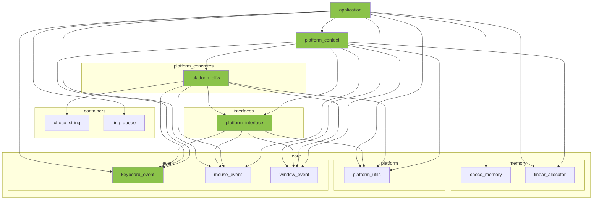

※本記事は [全体イントロダクション](https://zenn.dev/chocolate_pie24/articles/c-glfw-game-engine-introduction)のBook3に対応しています。

- [このステップでやること](#このステップでやること)
- [キーボードイベント構造体の追加](#キーボードイベント構造体の追加)
- [プラットフォームコンテキストモジュール](#プラットフォームコンテキストモジュール)
- [プラットフォームインターフェイスモジュール](#プラットフォームインターフェイスモジュール)
- [キーボードイベント取得処理](#キーボードイベント取得処理)
- [アプリケーション側変更](#アプリケーション側変更)

## このステップでやること

今回は、キーボードイベントの捕捉と処理を追加していきます。前回同様、多くは機械的な作業になります。マウスと同じやり方でキーボードについてもイベントを追加できるということを伝えたいので、説明の文章を含め、作業の流れは前回の流れを踏襲します。

レイヤー構成図で今回変更する部分を図示します。



## キーボードイベント構造体の追加

まず、キーボードイベント構造体を作っていきます。キーボードイベントは、下記の情報があれば十分です。

- イベントが発生したキーは何か？
- イベントが発生したキーの押下状態はどうか？

一つ注意点なのですが、今回具体的なイベント処理を実装するモジュールはplatform_glfw.cで、GLFWを使用します。ここで、GLFWではGLFW_KEY_Aのように、各キーごとにGLFW専用の値が割り当てられています。一方、GL Choco EngineはGLFW以外のプラットフォームも視野に入れています。このため、アプリケーションでもキーコードにGLFW用の値を使用してしまっては、プラットフォームを拡張する際に困ってしまいます。今回は、アプリケーション側では全プラットフォーム共通で使用可能な独自のキーコード列挙体を定義し、プラットフォームモジュールで翻訳して使うようにします。

今回イベントとして使用するキーとして、

- 0〜9
- A〜Z
- F1〜F12
- 矢印キー4つ

を想定しています。今後、必要に応じて拡張するかも知れません。

構造体のソースコードを貼り付けます。下記のコードでは、キーコードの列挙子が多いため、一部省略してあります。また、列挙子の最後にKEY_CODE_MAXを置くことで、ループカウンタのエンド条件や、配列サイズにも使用可能にしています。

include/engine/core/event/keyboard_event.h

```c
#ifndef ENGINE_CORE_KEYBOARD_EVENT_H
#define ENGINE_CORE_KEYBOARD_EVENT_H

#ifdef __cplusplus
extern "C" {
#endif

#include <stdbool.h>

/**
 * @brief 全プラットフォームで共通化するためのキーコード一覧定義
 *
 * @note
 * - プラットフォーム固有のキーはプラットフォーム層で本列挙子にマッピングする
 */
typedef enum {
    KEY_1,              /**< key: '1' */
    KEY_2,              /**< key: '2' */
    KEY_3,              /**< key: '3' */
    // 途中省略
    KEY_9,              /**< key: '9' */
    KEY_0,              /**< key: '0' */
    KEY_A,              /**< key: 'a' */
    KEY_B,              /**< key: 'b' */
    KEY_C,              /**< key: 'c' */
    // 途中省略
    KEY_Z,              /**< key: 'z' */
    KEY_RIGHT,          /**< key: '右矢印キー' */
    KEY_LEFT,           /**< key: '左矢印キー' */
    KEY_UP,             /**< key: '上矢印キー' */
    KEY_DOWN,           /**< key: '下矢印キー' */
    KEY_LEFT_SHIFT,     /**< key: '左シフトキー' */
    KEY_SPACE,          /**< key: 'スペース' */
    KEY_SEMICOLON,      /**< key: 'セミコロン' */
    KEY_MINUS,          /**< key: 'マイナス' */
    KEY_F1,             /**< key: 'F1' */
    KEY_F2,             /**< key: 'F2' */
    KEY_F3,             /**< key: 'F3' */
    // 途中省略
    KEY_F11,            /**< key: 'F11' */
    KEY_F12,            /**< key: 'F12' */
    KEY_CODE_MAX,       /**< キーコード最大数 */
} keycode_t;

/**
 * @brief キーボードイベント構造体
 *
 */
typedef struct keyboard_event {
    keycode_t key;  /**< イベントが発生したキー */
    bool pressed;   /**< イベント(キー押下: true / キーを離した: false) */
} keyboard_event_t;

#ifdef __cplusplus
}
#endif
#endif
```

## プラットフォームコンテキストモジュール

今回、キーボードイベントを追加していくので、platform_pump_messagesにキーボードイベントコールバック関数を引数に追加していきます。

include/engine/platform_context/platform_context.h

```c
// 省略
#include "engine/core/event/keyboard_event.h"   // 追加
#include "engine/core/event/mouse_event.h"
#include "engine/core/event/window_event.h"

// 省略

platform_result_t platform_pump_messages(
    platform_context_t* platform_context_,
    void (*window_event_callback)(const window_event_t* event_),
    void (*keyboard_event_callback)(const keyboard_event_t* event_),    // 追加
    void (*mouse_event_callback)(const mouse_event_t* event_));

// 省略
```

インターフェイスが変わったので、実装も変更します。platform_pump_messagesの引数にkeyboard_event_callbackを追加するだけです。

src/engine/platform_context/platform_context.c

```c
platform_result_t platform_pump_messages(
    platform_context_t* platform_context_,
    void (*window_event_callback)(const window_event_t* event_),
    void (*keyboard_event_callback)(const keyboard_event_t* event_),
    void (*mouse_event_callback)(const mouse_event_t* event_)) {

    platform_result_t ret = PLATFORM_INVALID_ARGUMENT;
    CHECK_ARG_NULL_GOTO_CLEANUP(platform_context_, PLATFORM_INVALID_ARGUMENT, "platform_pump_messages", "platform_context_")
    CHECK_ARG_NULL_GOTO_CLEANUP(platform_context_->vtable, PLATFORM_INVALID_ARGUMENT, "platform_pump_messages", "platform_context_->vtable")
    CHECK_ARG_NULL_GOTO_CLEANUP(platform_context_->backend, PLATFORM_INVALID_ARGUMENT, "platform_pump_messages", "platform_context_->backend")
    CHECK_ARG_NULL_GOTO_CLEANUP(window_event_callback, PLATFORM_INVALID_ARGUMENT, "platform_pump_messages", "window_event_callback")
    CHECK_ARG_NULL_GOTO_CLEANUP(keyboard_event_callback, PLATFORM_INVALID_ARGUMENT, "platform_pump_messages", "keyboard_event_callback")
    CHECK_ARG_NULL_GOTO_CLEANUP(mouse_event_callback, PLATFORM_INVALID_ARGUMENT, "platform_pump_messages", "mouse_event_callback")

    ret = platform_context_->vtable->platform_pump_messages(platform_context_->backend, window_event_callback, keyboard_event_callback, mouse_event_callback);
    if(PLATFORM_SUCCESS != ret && PLATFORM_WINDOW_CLOSE != ret) {
        ERROR_MESSAGE("platform_pump_messages(%s) - Failed to pump messages.", rslt_to_str(ret));
        goto cleanup;
    }

cleanup:
    return ret;
}
```

## プラットフォームインターフェイスモジュール

ここに関してもキーボードイベントコールバックの追加のみです。

include/engine/interfaces/platform_interface.h

```c
// 省略

#include "engine/core/event/keyboard_event.h"   // 追加
#include "engine/core/event/mouse_event.h"
#include "engine/core/event/window_event.h"

// 省略

typedef platform_result_t (*pfn_platform_backend_pump_messages)(
    platform_backend_t* platform_backend_,
    void (*window_event_callback)(const window_event_t* event_),
    void (*keyboard_event_callback)(const keyboard_event_t* event_),    // 追加
    void (*mouse_event_callback)(const mouse_event_t* event_));

// 省略
```

これで、プラットフォームからキーボードイベントをアプリケーションに渡すための通り道が用意できました。あとは、この通り道を通って流れるイベントを実際に作成していきます。

## キーボードイベント取得処理

まず、キーコードをGL Choco Engine用からGLFW用に変換するプライベート関数を作成します。GL Choco Engine内部ではkeycode_tを共通フォーマットとして扱い、GLFWに問い合わせる直前にだけGLFWのキーコードへ変換する方針にします。

ソースコードを貼り付けます。長いので一部省略しています。

src/engine/platform_concretes/platform_glfw.c

```c
static int keycode_to_glfw_keycode(keycode_t keycode_) {
    switch(keycode_) {
    case KEY_1:
        return GLFW_KEY_1;
    // 省略
    case KEY_0:
        return GLFW_KEY_0;
    case KEY_A:
        return GLFW_KEY_A;
    // 省略
    case KEY_Z:
        return GLFW_KEY_Z;
    case KEY_RIGHT:
        return GLFW_KEY_RIGHT;
    case KEY_LEFT:
        return GLFW_KEY_LEFT;
    case KEY_UP:
        return GLFW_KEY_UP;
    case KEY_DOWN:
        return GLFW_KEY_DOWN;
    case KEY_LEFT_SHIFT:
        return GLFW_KEY_LEFT_SHIFT;
    case KEY_SPACE:
        return GLFW_KEY_SPACE;
    case KEY_SEMICOLON:
        return GLFW_KEY_SEMICOLON;
    case KEY_MINUS:
        return GLFW_KEY_MINUS;
    case KEY_F1:
        return GLFW_KEY_F1;
    // 省略
    case KEY_F12:
        return GLFW_KEY_F12;
    default:
        ERROR_MESSAGE("keycode_to_glfw_keycode(%s) - Undefined key code. Returning key '0'", s_rslt_str_invalid_argument);
        return GLFW_KEY_0;
    }
}
```

次に、input_snapshot_tにキーボード関連の情報を追加していきます。追加したkeycode_state配列は、keycode_t列挙子をインデックスに指定すると、そのキーの押下状態が取得できるようになっています。

また、escape_pressed変数を追加していますが、GL Choco Engineでは、画面の閉じるボタン以外にも、エスケープキーの押下によってもアプリケーションを終了可能にします。このため、終了イベントは他のイベントとは重要度が異なるため、別枠で扱います。なので専用の変数を追加しました。

```c
typedef struct input_snapshot {
    double cursor_x;    /**< マウス座標x */
    double cursor_y;    /**< マウス座標y */

    int window_width;   /**< ウィンドウ幅 */
    int window_height;  /**< ウィンドウ高さ */

    bool window_should_close;   /**< ウィンドウクローズイベント発生 */
    bool escape_pressed;        /**< エスケープキー押下イベント発生 */

    bool keycode_state[KEY_CODE_MAX];   /**< 各キーコード（keycode_t）ごとの押下状態(true: 押下中 / false: 非押下) */

    bool left_button_pressed;   /**< マウス左ボタン押下フラグ */
    bool right_button_pressed;  /**< マウス右ボタン押下フラグ */
} input_snapshot_t;
```

input_snapshot_tに変数を追加したので、初期化処理をplatform_glfw_initに追加します。ただ単に追加構造体変数の初期化を追加したのみなので読み飛ばしても問題ありません。

```c
static platform_result_t platform_glfw_init(platform_backend_t* platform_backend_) {
    platform_result_t ret = PLATFORM_INVALID_ARGUMENT;

    // 省略

    glfwWindowHint(GLFW_OPENGL_PROFILE, GLFW_OPENGL_CORE_PROFILE);  // 古いOpenGLは使用しない

    platform_backend_->window = NULL;
    platform_backend_->window_label = NULL;

    platform_backend_->initialized_glfw = true;

    platform_backend_->prev.left_button_pressed = false;
    platform_backend_->prev.right_button_pressed = false;
    platform_backend_->prev.cursor_x = 0.0;
    platform_backend_->prev.cursor_y = 0.0;
    platform_backend_->prev.window_width = 0;
    platform_backend_->prev.window_height = 0;
    platform_backend_->prev.window_should_close = false;
    platform_backend_->prev.escape_pressed = false;
    for(size_t i = 0; i != KEY_CODE_MAX; ++i) {
        platform_backend_->prev.keycode_state[i] = false;
    }

    platform_backend_->current.left_button_pressed = false;
    platform_backend_->current.right_button_pressed = false;
    platform_backend_->current.cursor_x = 0.0;
    platform_backend_->current.cursor_y = 0.0;
    platform_backend_->current.window_width = 0;
    platform_backend_->current.window_height = 0;
    platform_backend_->current.window_should_close = false;
    platform_backend_->current.escape_pressed = false;
    for(size_t i = 0; i != KEY_CODE_MAX; ++i) {
        platform_backend_->current.keycode_state[i] = false;
    }

    ret = PLATFORM_SUCCESS;

cleanup:
    return ret;
}
```

platform_destroyにも同様に値を戻す処理を追加します。ここも読み飛ばしても問題はありません。

```c
static void platform_glfw_destroy(platform_backend_t* platform_backend_) {
    if(NULL == platform_backend_) {
        return;
    }
    if(NULL != platform_backend_->window) {
        glfwDestroyWindow(platform_backend_->window);
        platform_backend_->window = NULL;
    }
    if(platform_backend_->initialized_glfw) {
        glfwTerminate();
    }
    choco_string_destroy(&platform_backend_->window_label);
    platform_backend_->window = NULL;
    platform_backend_->initialized_glfw = false;

    platform_backend_->prev.left_button_pressed = false;
    platform_backend_->prev.right_button_pressed = false;
    platform_backend_->prev.cursor_x = 0.0;
    platform_backend_->prev.cursor_y = 0.0;
    platform_backend_->prev.window_width = 0;
    platform_backend_->prev.window_height = 0;
    platform_backend_->prev.window_should_close = false;
    platform_backend_->prev.escape_pressed = false;
    for(size_t i = 0; i != KEY_CODE_MAX; ++i) {
        platform_backend_->prev.keycode_state[i] = false;
    }

    platform_backend_->current.left_button_pressed = false;
    platform_backend_->current.right_button_pressed = false;
    platform_backend_->current.cursor_x = 0.0;
    platform_backend_->current.cursor_y = 0.0;
    platform_backend_->current.window_width = 0;
    platform_backend_->current.window_height = 0;
    platform_backend_->current.window_should_close = false;
    platform_backend_->current.escape_pressed = false;
    for(size_t i = 0; i != KEY_CODE_MAX; ++i) {
        platform_backend_->current.keycode_state[i] = false;
    }
}
```

イベント収集処理にキーボードイベントを追加します。追加する処理は、glfwGetKeyを使用したキーの押下状態の取得です。取得の際には、先程作成したプライベート関数のキーコード翻訳関数を使用します。なお、GL Choco Engineでは、画面の閉じるボタン以外にも、エスケープキーの押下によってもアプリケーションを終了可能にします。これは他のキー押下イベントとは重要度が異なり、別枠で扱いたいため、別に取得処理を追加しています。

```c
static platform_result_t platform_snapshot_collect(platform_backend_t* platform_backend_) {
    platform_result_t ret = PLATFORM_INVALID_ARGUMENT;
    int left_button_state = 0;
    int right_button_state = 0;

    CHECK_ARG_NULL_GOTO_CLEANUP(platform_backend_, PLATFORM_INVALID_ARGUMENT, "platform_snapshot_collect", "platform_backend_")
    CHECK_ARG_NULL_GOTO_CLEANUP(platform_backend_->window, PLATFORM_INVALID_ARGUMENT, "platform_snapshot_collect", "platform_backend_->window")
    CHECK_ARG_NOT_VALID_GOTO_CLEANUP(platform_backend_->initialized_glfw, PLATFORM_INVALID_ARGUMENT, "platform_snapshot_collect", "platform_backend_->initialized_glfw")

    // window events.
    platform_backend_->current.window_should_close = (0 != glfwWindowShouldClose(platform_backend_->window)) ? true : false;

    glfwGetWindowSize(platform_backend_->window, &platform_backend_->current.window_width, &platform_backend_->current.window_height);

    // ここから追加
    // keyboard events.
    platform_backend_->current.escape_pressed = (GLFW_PRESS == glfwGetKey(platform_backend_->window, GLFW_KEY_ESCAPE)) ? true : false;
    for(int i = KEY_1; i != KEY_CODE_MAX; ++i) {
        const int glfw_key = keycode_to_glfw_keycode(i);
        const int action = glfwGetKey(platform_backend_->window, glfw_key);
        platform_backend_->current.keycode_state[i] = (GLFW_PRESS == action) ? true : false;
    }
    // ここまで追加

    // mouse event.
    glfwGetCursorPos(platform_backend_->window, &platform_backend_->current.cursor_x, &platform_backend_->current.cursor_y);

    left_button_state = glfwGetMouseButton(platform_backend_->window, GLFW_MOUSE_BUTTON_LEFT);
    platform_backend_->current.left_button_pressed = (GLFW_PRESS == left_button_state) ? true : false;

    right_button_state = glfwGetMouseButton(platform_backend_->window, GLFW_MOUSE_BUTTON_RIGHT);
    platform_backend_->current.right_button_pressed = (GLFW_PRESS == right_button_state) ? true : false;

    ret = PLATFORM_SUCCESS;

cleanup:
    return ret;
}
```

次はplatform_snapshot_processにキーボードイベント処理を追加です。エスケープキー押下によるウィンドウクローズイベントと、キー押下イベントを追加しています。

```c
static platform_result_t platform_snapshot_process(
    platform_backend_t* platform_backend_,
    void (*window_event_callback)(const window_event_t* event_),
    void (*keyboard_event_callback)(const keyboard_event_t* event_),
    void (*mouse_event_callback)(const mouse_event_t* event_)) {

    // 省略

    // 追加
    if(platform_backend_->current.escape_pressed) {
        ret = PLATFORM_WINDOW_CLOSE;
        platform_backend_->prev = platform_backend_->current;
        goto cleanup;
    }
    // 追加

    if(platform_backend_->current.window_should_close) {
        ret = PLATFORM_WINDOW_CLOSE;
        platform_backend_->prev = platform_backend_->current;
        goto cleanup;
    }

    // window event
    if(platform_backend_->current.window_width != platform_backend_->prev.window_width || platform_backend_->current.window_height != platform_backend_->prev.window_height) {
        window_event_t window_event;
        window_event.event_code = WINDOW_EVENT_RESIZE;
        window_event.window_height = platform_backend_->current.window_height;
        window_event.window_width = platform_backend_->current.window_width;

        window_event_callback(&window_event);
    }

    // ここから追加
    // keyboard events.
    for(int i = KEY_1; i != KEY_CODE_MAX; ++i) {
        if(platform_backend_->prev.keycode_state[i] != platform_backend_->current.keycode_state[i]) {
            keyboard_event_t key_event;
            key_event.key = (keycode_t)i;
            key_event.pressed = platform_backend_->current.keycode_state[i];
            keyboard_event_callback(&key_event);
        }
    }
    // ここまで追加

    // mouse events.
    if(platform_backend_->prev.left_button_pressed != platform_backend_->current.left_button_pressed) {
        mouse_event_t mouse_event;
        mouse_event.button = MOUSE_BUTTON_LEFT;
        mouse_event.pressed = platform_backend_->current.left_button_pressed;
        mouse_event.x = (int)platform_backend_->current.cursor_x;
        mouse_event.y = (int)platform_backend_->current.cursor_y;
        mouse_event_callback(&mouse_event);
    }
    if(platform_backend_->prev.right_button_pressed != platform_backend_->current.right_button_pressed) {
        mouse_event_t mouse_event;
        mouse_event.button = MOUSE_BUTTON_RIGHT;
        mouse_event.pressed = platform_backend_->current.right_button_pressed;
        mouse_event.x = (int)platform_backend_->current.cursor_x;
        mouse_event.y = (int)platform_backend_->current.cursor_y;
        mouse_event_callback(&mouse_event);
    }

    platform_backend_->prev = platform_backend_->current;
    ret = PLATFORM_SUCCESS;

cleanup:
    return ret;
}
```

最後に、platform_glfw_pump_messagesとplatform_snapshot_processの呼び出しにキーボードイベントコールバックの引数を追加すればplatform_glfw.cは完了です。

```c
static platform_result_t platform_glfw_pump_messages(
    platform_backend_t* platform_backend_,
    void (*window_event_callback)(const window_event_t* event_),
    void (*keyboard_event_callback)(const keyboard_event_t* event_),
    void (*mouse_event_callback)(const mouse_event_t* event_)) {

#ifdef TEST_BUILD
    if(s_test_controller.test_enable) {
        return s_test_controller.ret;
    }
#endif

    platform_result_t ret = PLATFORM_INVALID_ARGUMENT;

    CHECK_ARG_NULL_GOTO_CLEANUP(platform_backend_, PLATFORM_INVALID_ARGUMENT, "platform_glfw_pump_messages", "platform_backend_")
    CHECK_ARG_NOT_VALID_GOTO_CLEANUP(platform_backend_->initialized_glfw, PLATFORM_INVALID_ARGUMENT, "platform_glfw_pump_messages", "platform_backend_->initialized_glfw")
    CHECK_ARG_NULL_GOTO_CLEANUP(window_event_callback, PLATFORM_INVALID_ARGUMENT, "platform_glfw_pump_messages", "window_event_callback")
    CHECK_ARG_NULL_GOTO_CLEANUP(keyboard_event_callback, PLATFORM_INVALID_ARGUMENT, "platform_glfw_pump_messages", "keyboard_event_callback")
    CHECK_ARG_NULL_GOTO_CLEANUP(mouse_event_callback, PLATFORM_INVALID_ARGUMENT, "platform_glfw_pump_messages", "mouse_event_callback")
    CHECK_ARG_NULL_GOTO_CLEANUP(platform_backend_->window, PLATFORM_INVALID_ARGUMENT, "platform_glfw_pump_messages", "platform_backend_->window")

    // イベントの取得
    glfwPollEvents();

    ret = platform_snapshot_collect(platform_backend_);
    if(PLATFORM_SUCCESS != ret) {
        ERROR_MESSAGE("platform_glfw_pump_messages(%s) - Failed to collect snapshot.", rslt_to_str(ret));
        goto cleanup;
    }
    ret = platform_snapshot_process(platform_backend_, window_event_callback, keyboard_event_callback, mouse_event_callback);
    if(PLATFORM_WINDOW_CLOSE == ret) {
        goto cleanup;
    }
    if(PLATFORM_SUCCESS != ret) {
        ERROR_MESSAGE("platform_glfw_pump_messages(%s) - Failed to process snapshot.", rslt_to_str(ret));
        goto cleanup;
    }
    ret = PLATFORM_SUCCESS;

cleanup:
    return ret;
}
```

## アプリケーション側変更

これでキーボードイベントを捕捉し、コールバックを呼ぶところまで出来ました。後はアプリケーション側にコールバック関数、リングキューを用意すればキーボードイベントについても完成です。

まずは内部状態管理構造体にイベント用リングキューを追加します。keyboard_event_queueのみの追加です。

src/engine/application/application.c

```c
typedef struct app_state {
    // application status
    bool window_should_close;   /**< ウィンドウクローズ指示フラグ */
    bool window_resized;        /**< ウィンドウサイズ変更イベント発生フラグ */
    int window_width;           /**< ウィンドウ幅 */
    int window_height;          /**< ウィンドウ高さ */

    // core/memory/linear_allocator
    size_t linear_alloc_mem_req;    /**< リニアアロケータオブジェクトに必要なメモリ量 */
    size_t linear_alloc_align_req;  /**< リニアアロケータオブジェクトが要求するメモリアライメント */
    size_t linear_alloc_pool_size;  /**< リニアアロケータオブジェクトが使用するメモリプールのサイズ */
    void* linear_alloc_pool;        /**< リニアアロケータオブジェクトが使用するメモリプールのアドレス */
    linear_alloc_t* linear_alloc;   /**< リニアアロケータオブジェクト */

    // event message queues
    ring_queue_t* window_event_queue;   /**< ウィンドウイベント格納用リングキュー */
    ring_queue_t* keyboard_event_queue; /**< キーボードイベント格納用リングキュー */
    ring_queue_t* mouse_event_queue;    /**< マウスイベント格納用リングキュー */

    // platform/platform_context
    platform_context_t* platform_context; /**< プラットフォームstrategyパターンへの窓口としてのコンテキストオブジェクト */
} app_state_t;
```

application_createで追加したリングキューの初期化を行います。初期化と失敗時の破棄を追加するだけなので、読み飛ばしても特に問題はありません。

```c
application_result_t application_create(void) {
    app_state_t* tmp = NULL;

    // 省略

    ///////////////////////////////////////////////////////////////////////////////////////////////////////////////////////////////////
    // Simulation -> launch all systems -> create platform.(Don't use s_app_state here.)
    INFO_MESSAGE("Initializing platform state...");
    ret_platform = platform_initialize(tmp->linear_alloc, PLATFORM_USE_GLFW, &tmp->platform_context);
    if(PLATFORM_SUCCESS != ret_platform) {
        ret = rslt_convert_platform(ret_platform);
        ERROR_MESSAGE("application_create(%s) - Failed to initialize platform.", rslt_to_str(ret));
        goto cleanup;
    }
    INFO_MESSAGE("platform_backend initialized successfully.");

    ///////////////////////////////////////////////////////////////////////////////////////////////////////////////////////////////////
    // Simulation -> launch all systems -> create event message queue(window event).(Don't use s_app_state here.)
    INFO_MESSAGE("Starting window event queue initialize...");
    ret_ring_queue = ring_queue_create(8, sizeof(window_event_t), alignof(window_event_t), &tmp->window_event_queue);
    if(RING_QUEUE_SUCCESS != ret_ring_queue) {
        ret = rslt_convert_ring_queue(ret_ring_queue);
        ERROR_MESSAGE("application_create(%s) - Failed to initialize window event queue.", rslt_to_str(ret));
        goto cleanup;
    }
    INFO_MESSAGE("window event queue initialized successfully.");

    ///////////////////////////////////////////////////////////////////////////////////////////////////////////////////////////////////
    // Simulation -> launch all systems -> create event message queue(keyboard event).(Don't use s_app_state here.)
    INFO_MESSAGE("Starting keyboard event queue initialize...");
    ret_ring_queue = ring_queue_create(KEY_CODE_MAX, sizeof(keyboard_event_t), alignof(keyboard_event_t), &tmp->keyboard_event_queue);
    if(RING_QUEUE_SUCCESS != ret_ring_queue) {
        ret = rslt_convert_ring_queue(ret_ring_queue);
        ERROR_MESSAGE("application_create(%s) - Failed to initialize keyboard event queue.", rslt_to_str(ret));
        goto cleanup;
    }
    INFO_MESSAGE("keyboard event queue initialized successfully.");

    ///////////////////////////////////////////////////////////////////////////////////////////////////////////////////////////////////
    // Simulation -> launch all systems -> create event message queue(mouse event).(Don't use s_app_state here.)
    INFO_MESSAGE("Starting mouse event queue initialize...");
    ret_ring_queue = ring_queue_create(128, sizeof(mouse_event_t), alignof(mouse_event_t), &tmp->mouse_event_queue);
    if(RING_QUEUE_SUCCESS != ret_ring_queue) {
        ret = rslt_convert_ring_queue(ret_ring_queue);
        ERROR_MESSAGE("application_create(%s) - Failed to initialize mouse event queue.", rslt_to_str(ret));
        goto cleanup;
    }
    INFO_MESSAGE("mouse event queue initialized successfully.");

    // end Simulation -> launch all systems.

    // end Simulation
    ///////////////////////////////////////////////////////////////////////////////////////////////////////////////////////////////////

    // begin temporary
    // TODO: ウィンドウ生成はレンダラー作成時にそっちに移す
    tmp->window_width = 1024;
    tmp->window_height = 768;
    ret_platform = platform_window_create(tmp->platform_context, "test_window", 1024, 768);
    if(PLATFORM_SUCCESS != ret_platform) {
        ret = rslt_convert_platform(ret_platform);
        ERROR_MESSAGE("application_create(%s) - Failed to create window.", rslt_to_str(ret));
        goto cleanup;
    }
    // end temporary

    // commit
    s_app_state = tmp;
    INFO_MESSAGE("Application created successfully.");
    memory_system_report();
    ret = APPLICATION_SUCCESS;

cleanup:
    if(APPLICATION_SUCCESS != ret) {
        if(NULL != tmp) {
            if(NULL != tmp->mouse_event_queue) {
                ring_queue_destroy(&tmp->mouse_event_queue);
                tmp->mouse_event_queue = NULL;
            }
            if(NULL != tmp->keyboard_event_queue) {
                ring_queue_destroy(&tmp->keyboard_event_queue);
                tmp->keyboard_event_queue = NULL;
            }
            if(NULL != tmp->window_event_queue) {
                ring_queue_destroy(&tmp->window_event_queue);
                tmp->window_event_queue = NULL;
            }
            if(NULL != tmp->platform_context) {
                platform_destroy(tmp->platform_context);
            }
            if(NULL != tmp->linear_alloc_pool) {
                memory_system_free(tmp->linear_alloc_pool, tmp->linear_alloc_pool_size, MEMORY_TAG_SYSTEM);
            }
            if(NULL != tmp->linear_alloc) {
                memory_system_free(tmp->linear_alloc, tmp->linear_alloc_mem_req, MEMORY_TAG_SYSTEM);
            }
            memory_system_free(tmp, sizeof(*tmp), MEMORY_TAG_SYSTEM);
            tmp = NULL;
        }
        memory_system_destroy();
    }

    return ret;
}
```

application_destroyでリングキューの破棄を行います。破棄を追加するだけなので、読み飛ばしても特に問題はありません。

```c
void application_destroy(void) {
    INFO_MESSAGE("Starting application shutdown...");
    if(NULL == s_app_state) {
        goto cleanup;
    }

    // begin cleanup all systems.
    if(NULL != s_app_state->mouse_event_queue) {
        ring_queue_destroy(&s_app_state->mouse_event_queue);
        s_app_state->mouse_event_queue = NULL;
    }
    if(NULL != s_app_state->keyboard_event_queue) {
        ring_queue_destroy(&s_app_state->keyboard_event_queue);
        s_app_state->keyboard_event_queue = NULL;
    }
    if(NULL != s_app_state->window_event_queue) {
        ring_queue_destroy(&s_app_state->window_event_queue);
        s_app_state->window_event_queue = NULL;
    }
    if(NULL != s_app_state->platform_context) {
        platform_destroy(s_app_state->platform_context);
    }
    if(NULL != s_app_state->linear_alloc_pool) {
        memory_system_free(s_app_state->linear_alloc_pool, s_app_state->linear_alloc_pool_size, MEMORY_TAG_SYSTEM);
        s_app_state->linear_alloc_pool = NULL;
    }
    if(NULL != s_app_state->linear_alloc) {
        memory_system_free(s_app_state->linear_alloc, s_app_state->linear_alloc_mem_req, MEMORY_TAG_SYSTEM);
        s_app_state->linear_alloc = NULL;
    }

    memory_system_free(s_app_state, sizeof(*s_app_state), MEMORY_TAG_SYSTEM);
    s_app_state = NULL;
    INFO_MESSAGE("Freed all memory.");
    memory_system_report();
    memory_system_destroy();
    // end cleanup all systems.

    INFO_MESSAGE("Application destroyed successfully.");
cleanup:
    return;
}
```

application_runでのplatform_pump_messagesの実行にキーボードイベントコールバックを追加します。これも読み飛ばしても大丈夫です。

```c
application_result_t application_run(void) {
    application_result_t ret = APPLICATION_SUCCESS;
    if(NULL == s_app_state) {
        ret = APPLICATION_RUNTIME_ERROR;
        ERROR_MESSAGE("application_run(%s) - Application is not initialized.", rslt_to_str(ret));
        goto cleanup;
    }
    while(!s_app_state->window_should_close) {
        platform_result_t ret_event = platform_pump_messages(s_app_state->platform_context, on_window, on_key, on_mouse);
        if(PLATFORM_WINDOW_CLOSE == ret_event) {
            s_app_state->window_should_close = true;
            continue;
        } else if(PLATFORM_SUCCESS != ret_event) {
            ret = rslt_convert_platform(ret_event);
            WARN_MESSAGE("application_run(%s) - Failed to pump events.", rslt_to_str(ret));
            continue;
        }
        app_state_update();
        app_state_dispatch();
        app_state_clean();
        // sleep(1);
        // TODO: platform_sleep
    }
cleanup:
    return ret;
}
```

キーボードイベントコールバックを追加します。キーボードイベント用のリングキューにイベント構造体をpushするだけです。

```c
static void on_key(const keyboard_event_t* event_) {
    ring_queue_result_t ret_push = RING_QUEUE_INVALID_ARGUMENT;

    if(NULL == event_) {
        WARN_MESSAGE("on_key - Argument event_ requires a valid pointer.");
        goto cleanup;
    }
    if(NULL == s_app_state) {
        WARN_MESSAGE("on_key - Application state is uninitialized.");
        goto cleanup;
    }

    ret_push = ring_queue_push(s_app_state->keyboard_event_queue, event_, sizeof(keyboard_event_t), alignof(keyboard_event_t));
    if(RING_QUEUE_SUCCESS != ret_push) {
        application_result_t ret = rslt_convert_ring_queue(ret_push);
        WARN_MESSAGE("on_key(%s) - Failed to push keyboard event.", rslt_to_str(ret));
        goto cleanup;
    }
cleanup:
    return;
}
```

最後にイベントキューからのイベント取り出しとイベント処理です。app_state_updateにキーボードイベント関連を追加していきます。なお、長くなるのでエラー処理は省略してあります。キーを押したり離したりすると、メッセージが出力されるようにしています。また、mキーを押して離すとメモリ使用量が表示されるようにしてあります。このように、特定のキーにエンジン固有のデバッグ機能をひもづけておくと、かなり便利です。

```c
static void app_state_update(void) {
    application_result_t ret = APPLICATION_INVALID_ARGUMENT;

    // 省略

    // keyboard events.
    while(!ring_queue_empty(s_app_state->keyboard_event_queue)) {
        keyboard_event_t event;
        ring_queue_result_t ret_ring = ring_queue_pop(s_app_state->keyboard_event_queue, &event, sizeof(keyboard_event_t), alignof(keyboard_event_t));
        if(RING_QUEUE_SUCCESS != ret_ring) {
            ret = rslt_convert_ring_queue(ret_ring);
            WARN_MESSAGE("app_state_update(%s) - Failed to pop keyboard event.", rslt_to_str(ret));
            goto cleanup;
        } else {
            if(KEY_M == event.key && !event.pressed) {
                memory_system_report();
            } else {
                INFO_MESSAGE("Keyboard event: %s %s", keycode_str(event.key), (event.pressed) ? "pressed" : "released");
            }
        }
    }

    // 省略

cleanup:
    return;
}
```

なお、上記で押したキーの情報を文字列に変換するため、以下のプライベート関数を追加しています。

```c
static const char* keycode_str(keycode_t keycode_) {
    static const char* s_key_1 = "key: '1'";
    // 省略
    static const char* s_key_f12 = "key: 'f12'";
    static const char* s_key_undefined = "key: 'undefined'";

    switch(keycode_) {
    case KEY_A:
        return s_key_a;
    case KEY_B:
        return s_key_b;
    // 省略
    case KEY_F12:
        return s_key_f12;
    default:
        return s_key_undefined;
    }
}
```

以上でキーボードイベントの追加は完成です。これらの変更により、キーボードのキーを押したり離したりすると、

```console
[INFORMATION] Keyboard event: key: 'd' pressed
[INFORMATION] Keyboard event: key: 'd' released
[INFORMATION] Keyboard event: key: 'e' pressed
[INFORMATION] Keyboard event: key: 'e' released
[INFORMATION] Keyboard event: key: 'g' pressed
[INFORMATION] Keyboard event: key: 'g' released
[INFORMATION] Keyboard event: key: 'a' pressed
[INFORMATION] Keyboard event: key: 'a' released
[INFORMATION] Keyboard event: key: 'm' pressed
[INFORMATION] memory_system_report
        Total allocated: 4004
        Memory tag allocated:
                tag(system): 1136
                tag(string): 36
                tag(ring_queue): 2832
```

のように画面に情報が出力されます。

以上でキーボードイベントの追加が終了しました。イベントの具体的な処理が変わるのと、キーコードが多い分作業は多かったですが、追加手順自体はマウスと同じやり方でいけることが分かったかと思います。今後、しばらくイベントの追加はないと思いますが、もし、将来的にゲームパッド等のイベントが追加になったとしても、実装量こそ増えますが、ロジックとしては今回と同じ手順で素直に追加していけます。

これでBook3の内容は以上です。Book3では、ウィンドウ、マウス、キーボードのイベントを処理するための仕組みを作ってきました。これによって、例えば画面内のカメラ視点を変えることでモデルを動かしたりすることが可能になります。その他、今回追加したメモリー使用量のレポート機能のように、様々な機能の追加が可能になります。

さて、次回はいよいよ画面への描画を行っていきます。ただ、派手な3Dモデルではなくて、Hello Triangle!!として、シンプルな三角形から描画していくことになります。

今回もここまで読んでいただきありがとうございました。
