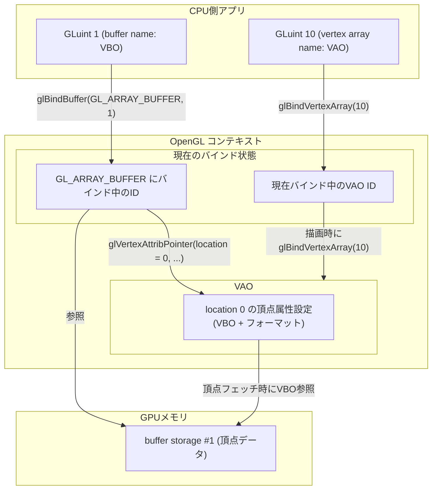

- [レンダリングコンテキストについて補足説明](#レンダリングコンテキストについて補足説明)
- [バッファオブジェクト概要](#バッファオブジェクト概要)
  - [描画する三角形の座標定義](#描画する三角形の座標定義)
  - [バッファオブジェクト識別子の予約](#バッファオブジェクト識別子の予約)
  - [バッファオブジェクトのバインド(紐付け)と用途の指定](#バッファオブジェクトのバインド紐付けと用途の指定)
  - [GPU側へのデータの転送](#gpu側へのデータの転送)
    - [第一引数(target)](#第一引数target)
    - [第二引数(size)](#第二引数size)
    - [第三引数(data)](#第三引数data)
    - [第四引数(usage)](#第四引数usage)
  - [頂点属性(VertexAttribute)](#頂点属性vertexattribute)
  - [API仕様(glVertexAttribPointer)](#api仕様glvertexattribpointer)
    - [第一引数(GLuint index)](#第一引数gluint-index)
    - [第二引数(GLint size)](#第二引数glint-size)
    - [第三引数(GLenum type)](#第三引数glenum-type)
    - [第四引数(GLboolean normalized)](#第四引数glboolean-normalized)
    - [第五引数(GLsizei stride)](#第五引数glsizei-stride)
    - [第六引数(const void \* pointer)](#第六引数const-void--pointer)
- [VAO](#vao)
- [描画](#描画)

BOOK1〜BOOK3では、CPU側のプログラムを作ってきました。ただ、昨今のグラフィックスアプリケーションは、アプリケーション開発者がGPU側のプログラムも書くようになっています。そのため、CPU側のプログラムからGPU側のプログラムへ描画データを転送する必要があります。

この資料は、Book4(step4_2)の補足資料で、アプリケーション側プログラムとGPU側プログラムとの間のデータのやり取りをOpenGLがどのようにやっているのかを解説していきます。

なお、本付録で説明する内容は、エンジン側のコードとしては極々一部になります。また、一回書いたらほぼ変更することはありません。このため、使用頻度が少ない知識となり、すぐに忘れてしまう場合もあるかと思います。

しかし、「CPUからGPUへのデータ転送の全体像」をつかむうえで、重要です。「このBOOKにこういうことが書いてあった」ということだけは覚えておいて、必要になったときに戻ってきて見直せるようにしておきます。

## レンダリングコンテキストについて補足説明

データのやり取りの説明の前に、以前Step2-6で解説したレンダリングコンテキストについて補足しておきます。

Book2 step2_6において、「レンダリングコンテキストとは、描画に用いられる情報で、ウィンドウごとに保持されます。」と簡単に説明しました。

より詳しく説明すると、レンダリングコンテキスト(OpenGLContext)とは、描画ウィンドウと一対一で紐付けられる巨大な変数のテーブルで、GPUではなく、CPU側のOpenGLドライバで管理されています。このテーブルの中にはウィンドウの背景色、直線描画の際のライン幅、点描画の際のポイントサイズ、等々、描画に必要なあらゆるものが格納されています。アプリケーションプログラマーは、このテーブルに対してOpenGL APIを使用して様々な値の変更を行います。

## バッファオブジェクト概要

グラフィックの描画には、図形の頂点座標や色の情報が必要です。3Dモデルであれば各ポリゴンの法線情報も必要です。

こういった情報は、GPU側のバッファで管理されます。アプリケーションプログラマーはこのバッファに対してCPU側のアプリケーションから頂点座標等の情報を送信することになります。ここで、このバッファはGPU内に複数持つことが可能です。このため、アプリケーション側ではどのバッファに対してデータを送るのかという、識別子が必要となります。このバッファの識別子をレンダリングコンテキストで管理します。

OpenGLでは、「GPU側のメモリ領域(バッファ)」と、それを指し示すID(コンテキストで管理される名前)をセットにしたものをまとめてバッファオブジェクトと呼びます。

バッファオブジェクトは様々な用途で使用でき、用途によって呼び方が変わります。基本的なものとしては、頂点情報(図形の頂点座標、法線情報、色情報等)を管理するVBO(Vertex Buffer Object)や、頂点のインデックス情報を管理するEBO(Element Buffer Object)などがあります。どちらも中身はバッファオブジェクトで、用途によって名称が変わります。

では、このバッファオブジェクトを使用してどのようにCPU側アプリケーションとGPU側プログラムとの間でデータをやり取りするのか、具体的なソースコードを見ながら解説していきます。

以下のコードはBook4で ***application_run()*** に追加したコードです。このコードについて解説をしていきます。

```c
    static const GLfloat vertex_buffer_data[] = {
    -1.0f, -1.0f, 0.0f,
    1.0f, -1.0f, 0.0f,
    0.0f,  1.0f, 0.0f,
    };

    GLuint vertexbuffer;

    glGenBuffers(1, &vertexbuffer);

    glBindBuffer(GL_ARRAY_BUFFER, vertexbuffer);

    glBufferData(GL_ARRAY_BUFFER, sizeof(vertex_buffer_data), vertex_buffer_data, GL_STATIC_DRAW);
```

### 描画する三角形の座標定義

```c
static const GLfloat vertex_buffer_data[] = {
-1.0f, -1.0f, 0.0f, // 画面左下
1.0f, -1.0f, 0.0f,  // 画面右下
0.0f,  1.0f, 0.0f,  // 画面上中央
};
```

これはBook4で描画した三角形の頂点座標を表しています。座標は(x, y, z)という並びで格納されています。座標系の解説では複数の座標系を紹介しましたが、Book4ではまだカメラ(視点)は扱いませんし、複数のオブジェクト描画も行いません。なので、もっとも単純化するためにいきなり正規化デバイス座標系を使用して座標を指定することにします。座標値には-1〜+1の値を使用していますので、この三角形は画面全体に描画される三角形になります。

### バッファオブジェクト識別子の予約

```c
GLuint vertexbuffer;

glGenBuffers(1, &vertexbuffer);
```

先程、アプリケーション側からGPU側のバッファへデータを送信するために識別子が必要で、識別子はコンテキストで管理されると述べました。

glGenBuffersを呼び出すと、OpenGLはまだ使われていない識別子(整数値)を1つ選び、それを「このコンテキストで有効なバッファオブジェクト名」として予約します。この「バッファオブジェクト名(ID)」が、そのままvertexbufferに書き込まれます。アプリケーション側は、このIDをvertexbufferという変数に保持しておくことで、後からどのバッファオブジェクトを操作するかをOpenGLに対して指定できるようになります。

これでバッファオブジェクトをアプリケーション側で指定することができるようになりました。なお、この状態ではまだGPU側のバッファのメモリは確保されていません。

### バッファオブジェクトのバインド(紐付け)と用途の指定

glGenBuffersでバッファオブジェクト名(ID)の予約を行いました。このIDはコンテキスト内に複数存在することができます。なので、「今から使用するIDはどれで、どんな用途で使用するのか？」をOpenGLに伝える必要があります。

glBindBufferは、これから使用するIDを「どの用途で使うか」とセットでOpenGLに伝える関数です。

```c
glBindBuffer(GL_ARRAY_BUFFER, vertexbuffer);
```

この呼び出しは、「vertexbufferというIDを、頂点配列用(GL_ARRAY_BUFFER)として使う」という指定になります。

### GPU側へのデータの転送

ここまでの処理で、「どのIDのバッファを」「どの用途(GL_ARRAY_BUFFER)として使うか」がコンテキストに設定できました。次はCPU側で保持している三角形の頂点データをGPU側に送信する処理です。

```c
glBufferData(GL_ARRAY_BUFFER, sizeof(vertex_buffer_data), vertex_buffer_data, GL_STATIC_DRAW);
```

これを実行することで、今、GL_ARRAY_BUFFERにバインドされているIDに対してストレージが確保され、そのバッファにデータがコピーされます。内容について解説します。

API仕様

```c
void glBufferData(
    GLenum target,
  	GLsizeiptr size,
  	const void * data,
  	GLenum usage);
```

#### 第一引数(target)

第一引数は転送先のバッファの用途を指定します。今回は頂点情報を送るため、GL_ARRAY_BUFFERを指定します。こうすることにより、現在GL_ARRAY_BUFFERにバインドされているバッファに対してサイズ確保とデータを転送する、という意味になります。今回であれば、先程glBindBufferを行ったバッファがターゲットになります。

#### 第二引数(size)

第二引数は転送するデータサイズ(byte)です。今回はvertex_buffer_data配列のサイズになりますので、

```c
sizeof(vertex_buffer_data)
```

を指定しました。

#### 第三引数(data)

第三引数は転送するデータそのものです。vertex_buffer_dataの先頭アドレスを渡しています。

#### 第四引数(usage)

第四引数のusageは送信するデータの性質を指定します。バーテックスバッファの性質としては、その頂点情報はどのくらいの頻度で書き換えが行われるか？を指定することになります。
今回は三角形の頂点座標は変更しないので、GL_STATIC_DRAWを指定します。GL_STATIC_DRAWの他にGL_DYNAMIC_DRAWというものもあり、変化する場合にはこちらを指定します。

例えば完全な剛体で変形しないロボットを描画するのであればGL_STATIC_DRAWを指定することになりますし、LiDAR点群データの描画や、FEMシミュレーション等で形状の変形を視覚的に表現する場合にはGL_DYNAMIC_DRAWを指定することになります。

なぜ、このようにSTATICやDYNAMICを指定するかというと、GPU側にデータの書き換え頻度を事前に教えることによって、効率の良いメモリアクセスができるようになっています。

### 頂点属性(VertexAttribute)

以上でGPU側に座標データを転送することができました。ここから描画の説明に移りたいのですが、先程、頂点データには座標の他にも色情報や法線情報も含まれる場合があると説明しました。なので、バッファには、 [x, y, z, r, g, b, ...]という並びの場合もあれば、今回のように座標のみで、[x, y, z, ...]という場合もあります。よって、描画を行う前にGPU側のバッファに転送したデータがどのような並びになっているかを伝えなければいけません。このための処理がglVertexAttribPointerです。

コードはapplication_runのこの部分です。

```c
glVertexAttribPointer(
0,
3,
GL_FLOAT,
GL_FALSE,
sizeof(GLfloat) * 3,
(void*)0
);
```

### API仕様(glVertexAttribPointer)

```c
void glVertexAttribPointer(
    GLuint index,
  	GLint size,
  	GLenum type,
  	GLboolean normalized,
  	GLsizei stride,
  	const void * pointer);
```

#### 第一引数(GLuint index)

第一引数の0ですが、これは後で説明するシェーダープログラム内のどのバッファ変数の設定値か、を指定しています。今回のシェーダプログラムでは、

```c
"layout(location = 0) in vec3 vertexPosition_modelspace; \n"
```

としていますので、GPUに対して、vertexPosition_modelspaceのバッファレイアウトはこのようになっています、と伝えることになります。

#### 第二引数(GLint size)

第二引数の3ですが、これは頂点情報に含まれるデータの数です。今回は[x, y, z]の3次元座標のみなので、3です。

これが座標 + 色情報で[x, y, z, r, g, b]となった場合についてですが、この場合、シェーダープログラムにも色情報の変数が追加されます。例えばこのような感じです。

```c
"layout(location = 0) in vec3 vertexPosition_modelspace; \n"
"layout(location = 1) in vec3 vertexColor_modelspace; \n"
```

この場合、1回目のglVertexAttribPointerで

- 第一引数に0(location = 0)
- 第二引数に3(x, y, zなので3)

を指定します。その後に、2回目のglVertexAttribPointerで、

- 第一引数に1(location = 1)
- 第二引数に3(r, g, bなので3)

を指定します。頂点情報に他のデータが含まれる場合にも同様のやり方です。

#### 第三引数(GLenum type)

第三引数のGL_FLOATについては、バッファに格納されているデータの型を指定しています。今回の三角形の座標はGLfloatなので、GL_FLOATを指定しています。

#### 第四引数(GLboolean normalized)

第四引数のnormalizedですが、これは与えられたデータを正規化するかどうかを指定します。

具体的には、例えば色情報[r, g, b]があったとして、GPU側はfloatで処理する必要がありますが、CPUアプリケーションはuint8_tでr, g, bをそれぞれ保存していたとします。この場合、第三引数にGL_UNSIGNED_BYTEを指定して、normalizedにGL_TRUEを指定すると、r, g, bのそれぞれの値をuint8_tの最大値255で割った値がGPUに転送されます。つまり、0〜255のr, g, b値が0.0〜1.0に「正規化」される、という効果があります。

他にも法線情報のように向きだけ分ければ良い場合にも-128〜127に圧縮できるため、使用する場合があります。

なお、この機能は整数値に限った機能で、今回のようにGL_FLOATを指定した場合には機能しません。

#### 第五引数(GLsizei stride)

strideですが、頂点情報1つあたりのサイズを指定します。これを指定することで、頂点1の先頭アドレス+strideで頂点2の先頭アドレスに飛ぶことができます。今回はGLfloat型の[x, y, z]なので、sizeof(GLfloat) x 3を指定しています。仮に色情報(GLfloat型)のrgbが追加された場合は、sizeof(GLfloat) x 6になります。

なお、0を指定した場合については特例で、データが密に並んでいるということになり、内部的にはsize * sizeof(type)をstride に指定したのと同じ扱いになります。今回は座標情報のみなので、0を指定することが可能で、コンパイル、実行すると同じ三角形の描画が得られます。ただ、これはあくまで特例です。普通は座標以外に色、法線が含まれることが多いため、この特殊な指定方法は覚える必要はないと思います。

#### 第六引数(const void * pointer)

最後の第六引数は、「この頂点属性の先頭が、現在GL_ARRAY_BUFFERにバインドされているバッファの先頭から何バイト目にあるか」を指定します。VBOがバインドされている状態でglVertexAttribPointerを呼び出した場合、この引数は「GPUメモリ上のバッファ先頭からのバイトオフセット」として解釈されます。例えば1つのVBOに複数形状の頂点データを詰め込んでいる場合、描画したい形状の開始位置にあわせてこのオフセットを変えることで、同じバッファから違う範囲を描画することができます。

以上が頂点属性の説明になります。これを指定することでGPU側で正しく頂点情報に含まれる各値に正確にアクセスできるようになります。

## VAO



さて、ここまで解説が終われば、ようやくapplication_runの最初の、

```c
GLuint vertex_array_id;
glGenVertexArrays(1, &vertex_array_id);
glBindVertexArray(vertex_array_id);
```

の説明が可能になります。この部分でやっているのは、VAOというものの設定です。

VAOというのは、VBOの設定値をまとめたものです。先程、VBOの説明でglVertexAttribPointerによるバッファの使い方の設定処理がありました。このglVertexAttribPointerは、頂点の座標情報、色情報、法線情報、それぞれに対して呼び出すということも説明しました。

ここで、描画の度に毎回全てのglVertexAttribPointerを呼び出すのは手間です。それを省くことができるのがVAOです。一つのVAOには複数のVBO設定情報をぶら下げることができます。なお、VAOにはEBO(Element Array Buffer)もぶら下げることができますが、VBOとは異なり1個しかぶら下げることは出来ません。(EBOについては3D Rendering編で使用していくことになりますので、その際に詳細に説明します)

では、具体的にどのように使うのかを説明していきます。先ず、

```c
GLuint vertex_array_id;
glGenVertexArrays(1, &vertex_array_id);
```

流れはVBOと同じで、glGenVertexArraysで1つのVAO識別子を予約し、予約した結果の識別子をvertex_array_idに入れています。その後、

```c
glBindVertexArray(vertex_array_id);
```

することで、コンテキストとの紐付けが行われます。この状態でVBOを作成、Bindし、glVertexAttribPointerを実行すると、glVertexAttribPointerで設定した情報がVAOにぶら下がります。同様に別のVBOを作成、Bindし、glVertexAttribPointerを実行すると、その情報もぶら下がります。こうしておけば、アプリケーション側で、

```c
glBindVertexArray(vertex_array_id);
```

すれば、全てのVBOのglVertexAttribPointerが反映され、GPU内のバッファを正しく使用することができます。

## 描画

最後に描画処理です。

```c
glClear(GL_COLOR_BUFFER_BIT | GL_DEPTH_BUFFER_BIT);

glUseProgram(s_app_state->program_id);

glBindVertexArray(vertex_array_id);

glDrawArrays(GL_TRIANGLES, 0, 3);

glBindVertexArray(0);

glfwSwapBuffers(window);
```
