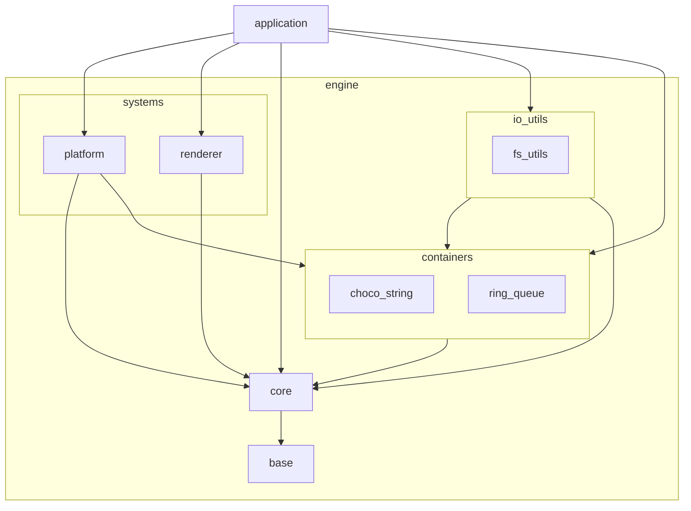
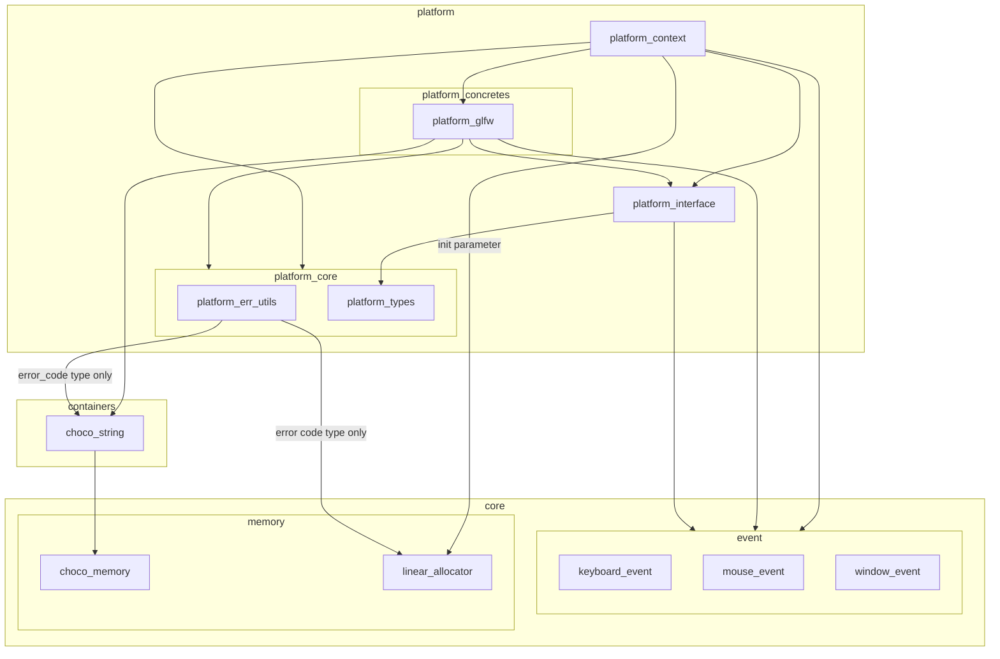
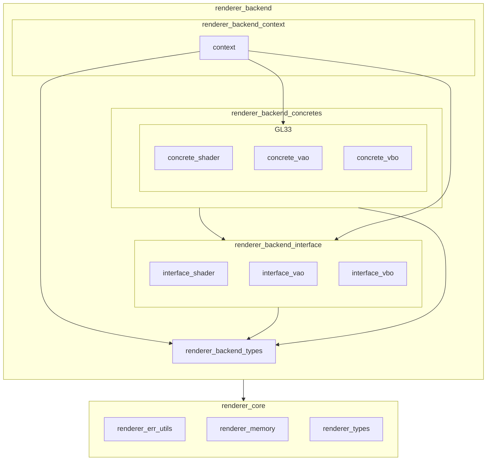

※本記事は [全体イントロダクション](https://zenn.dev/chocolate_pie24/articles/c-glfw-game-engine-introduction)のBook4に対応しています。

今回からはいよいよ描画処理です。そのためのファーストステップとして三角形の描画を行います。

GL CHOCO ENGINEでは、当面はグラフィックスAPIとしてOpenGL 3.3を使用します。3.3を使用する理由は私が慣れた環境であるというのが理由です。
ただ、OpenGL 3.3は一般的なPCを使用する場合には動かない環境はないと思われますが、組み込み用のコントローラではまだGPUやAPUがサポートしていないことも多いです。
将来的には組み込み、車載コントローラといった環境でも動くエンジンにしていきたいため、3.3以外のバージョンも使用できるようにする必要があります。
(Vulkanへの対応も興味はありますが、当面はOpenGLをターゲットとします)

描画処理はRendererレイヤーを新設することで実現します。Rendererレイヤーは、

- 上位レイヤーから呼び出される、描画コマンドの生成、描画コマンドの発行、描画後処理といったグラフィックスAPIの操作を意識させない処理を担当するRenderer Frontend
- Renderer Frontendの処理を実現するため、グラフィックスAPIの各種操作を担当するRenderer Backend

で構成されます。今回作成するRenderer Backendは、複数のOpenGLバージョンを差し替えて使用できる構造にする必要があります。
このため、Renderer BackendはPlatformシステムと同様、オブジェクト指向のStrategyパターンを使用して作っていくことになります。
ただ、前提条件として、GL CHOCO ENGINEでは複数のグラフィックスAPIが混在や、動的なグラフィックスAPI差し替えについては行いません。
この前提を置くことで、Renderer Backendをかなりシンプルにすることができます。GL CHOCO ENGINEの立ち位置、コンセプト的にはこれで十分です。

Strategyパターンを使用したRenderer Backendなのですが、描画処理はGPU側プログラムのための処理や、グラフィックスAPIの操作が多かったりと、
Platformシステムに比べて大分規模の大きなものとなります。そのため、開発の手順については今までは異なる進め方を採ります。

これまでは下位モジュールから上位モジュールに向かって積み上げていくスタイルを取っていました。
この進め方だと、最終的な動作結果である三角形の描画が中々できず、動作確認をしながら確実に積み上げていくことができません。
よって今回は、先ずアーキテクチャ設計を抜きにして、とりあえず最短で三角形を描画できるコードを記述します。
その後、追加したコードをモジュール化し、外部に追い出していき、最終的に整ったアーキテクチャにしていきます。

また、前回までは追加した各関数の詳細についても説明をしていましたが、

- 今回は追加したコードの量が非常に多い
- リファクタリングとしての既存機能のAPI名称変更、エラー処理変更、実行結果コードの変更が非常に多い

ため、アーキテクチャと実装の方針に絞った解説とします。実装内容については、リポジトリのタグv0.1.0-step4を参照してください。
なお、コンピュータグラフィックス固有の話、OpenGL APIについての説明は、私のメモとしても残しておきたいため、Book4の付録として追加することにします。

Book4の実行結果スクリーンショット

## Step4解説

### Platformレイヤーの構成変更と機能追加

### 最小限のコードで三角形を出す

### filesystem / fs_utilsモジュールの追加

### API差し替え可能なRenderer Backendの枠組み

### renderer_coreの追加

### renderer_backend_interfaceの追加

### renderer_backend_contextの追加

### まとめ

#### レイヤー構成図

今回はこれまでに比べ、広範囲に渡る変更、機能追加を行いました。Book4の内容を実装した結果、エンジン構成は以下のようになりました。

Engine Overview

Platform

Renderer

#### テストカバレッジ

大分モジュールも増えてきたため、今回からテストカバレッジを載せておきます。

GL CHOCO ENGINEの現状でのテスト方針ですが、カバレッジ重視で行っています。
シナリオベースのテストも重視すべきですが、私自身のテストスキルがあまり高くないため、AIによる支援を受けつつカバレッジの値が高くなるテストを行っています。
これでメモリリークがないことの確認や、入力に対して意図した処理を通過すること、返り値が意図と合っているかの確認はできるため、当面はこの方針で進めます。

なお、一部カバレッジの数値が低いところがありますが、これらは仕様が固まった段階でテストを実施していく予定です。

#### Book5の内容(予定)

これでBook4の解説は完了です。次のステップでは、頂点情報構造体の作成と、それを使用したGeometry(形状データ)モジュールを作っていきます。
