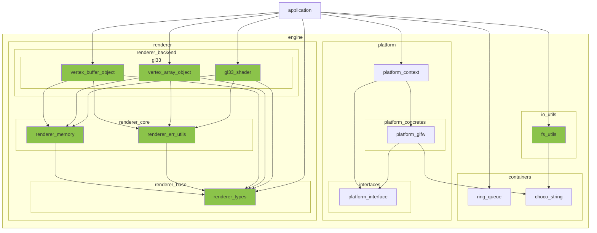

※本記事は [全体イントロダクション](https://zenn.dev/chocolate_pie24/articles/c-glfw-game-engine-introduction)のBook4に対応しています。

前回の[Book](https://zenn.dev/chocolate_pie24/books/2d_rendering_step2)では、イベントシステムを構築し、キーボード、マウス、ウィンドウに関するイベントを処理できるようになりました。

今回は、描画処理に入っていきます。描画するのはシンプルな三角形です。三角形の描画は新しい言語を学ぶ際のHello World!!に相当し、最もシンプルなグラフィックスアプリケーションです。

なお、今回追加していくレイヤー、モジュールの作成に伴い、これまでに作成してきたモジュールに対して多くの変更を行いました。
モジュールの役割については変更していないのですが、戻り値の実行結果コードや、テスト関数に変更が入っています。
これら変更点について解説していくと、Book4の本題がぼやけてしまうため、これら変更点の解説については省略させていただきます。

また、今までは各APIの内部実装についても解説していましたが、このように細部に変更があった際に整合性が取れなくなってしまうため、
今後はこちらについても省略させていただこうと思います。ただ、C言語でのStrategyパターンの実装や、ジェネリック型のコンテナモジュールの実装等、
実装方法の解説が重要になる部分もあると思いますので、そういったテーマについてはBookの付録や、別途記事にして出すことを考えています。

今後も進めながら方針を変えさせていただくことがあろうかと思いますが、よろしくお願いします。

さて、本題の三角形描画についてですが、アプローチとして、レイヤー構成やモジュールの分割といったことは考えず、
とりあえず最速で三角形を描画できるようにしていきます。その後、作成した各処理をモジュール化して外部に掃き出していく手法を取ります。
このやり方を取る理由は、「なぜこのモジュールが必要なのか？」ということが分かりやすいのと、
とりあえず早く結果が見えた方がモチベーションも上がりやすいためです。

## Step4実装解説

今回追加されるモジュールを示します。
coreレイヤーへも追加されるモジュールがありますが、図が複雑になりすぎるため省いてあります。

また、applicationがダイレクトにレンダラーバックエンドに依存していますが、
これはレンダラーフロントエンドの作成後、依存が解消されます。

### Step4-1: PlatformレイヤーへのAPI追加

最速で三角形を描画するためには、application_runで描画するようにしてしまうのが最も速いです。
描画するためにはOpenGLのウィンドウインスタンスが必要なのですが、現状ではplatform_glfwモジュールが保有しています。
よって、準備として、Platformレイヤーからウィンドウインスタンスを取得するAPIを追加します。

[PlatformレイヤーへのAPI追加](https://zenn.dev/chocolate_pie24/books/2d_rendering_step4/viewer/step4_1_window_instance)

### Step4-1: とりあえず三角形を出す

準備が整ったので、三角形を出す処理を追加します。
今回は、[OpenGL Tutorial](https://www.opengl-tutorial.org/jp/beginners-tutorials/tutorial-2-the-first-triangle/)
のコードを使用して三角形を表示します。

[とりあえず三角形を出す](https://zenn.dev/chocolate_pie24/books/2d_rendering_step4/viewer/step4_2_hello_triangle)

なお、画面に描画するためにはOpenGLの座標系の知識が必要です。
座標系の解説をメモとして[付録1: OpenGLで使われる座標系メモ](https://zenn.dev/chocolate_pie24/books/2d_rendering_step4/viewer/appendix1_coordinates)
に記しました。

### Step4-2: レンダラーレイヤーの追加とVAO、VBOモジュールの追加

追加した三角形描画処理から、VAO、VBOに関連する処理をモジュール化していきます。
このため、新規にレンダラーレイヤーを追加し、モジュールを追加します。

なお、VAO、VBOについても付録にメモを追加しました。
[付録2: OpenGL VAO、VBO解説](https://zenn.dev/chocolate_pie24/books/2d_rendering_step4/viewer/appendix2_vao_vbo)

### Step4-3: filesystemモジュールの追加

次はシェーダープログラムを外部のファイルに出していきます。よって、読み込み処理が必要となります。
coreレイヤーにfilesystemモジュールを追加していきます。

[filesystemモジュールの追加](https://zenn.dev/chocolate_pie24/books/2d_rendering_step4/viewer/step4_3_core_filesystem)

### Step4-4: choco_stringモジュールへのAPI追加

シェーダープログラムの読み込みの準備として、
追加したfilesystemモジュールが提供するバイト単位での読み込みAPIを使用して取得した文字列を連結するAPIをchoco_stringに追加します。

[choco_stringモジュールへのAPI追加](https://zenn.dev/chocolate_pie24/books/2d_rendering_step4/viewer/step4_4_string_cat)

### Step4-5: fs_utilモジュールの追加

filesystemモジュール、choco_stringモジュールを使用して、シェーダープログラムを読み込む機能を提供するfs_utilモジュールを追加します。

[fs_utilモジュールの追加](https://zenn.dev/chocolate_pie24/books/2d_rendering_step4/viewer/step4_5_fs_util)

### Step4-6: シェーダーモジュールの追加

以上でシェーダープログラムの読み込みが可能になったので、シェーダーモジュールを追加していきます。

[シェーダーモジュールの追加](https://zenn.dev/chocolate_pie24/books/2d_rendering_step4/viewer/step4_5_shader)

### 付録1: OpenGLで使われる座標系メモ

[付録1: OpenGLで使われる座標系メモ](https://zenn.dev/chocolate_pie24/books/2d_rendering_step4/viewer/appendix1_coordinates)

### 付録2: VAO, VBO解説メモ

[付録2: OpenGL VAO、VBO解説](https://zenn.dev/chocolate_pie24/books/2d_rendering_step4/viewer/appendix2_vao_vbo)
