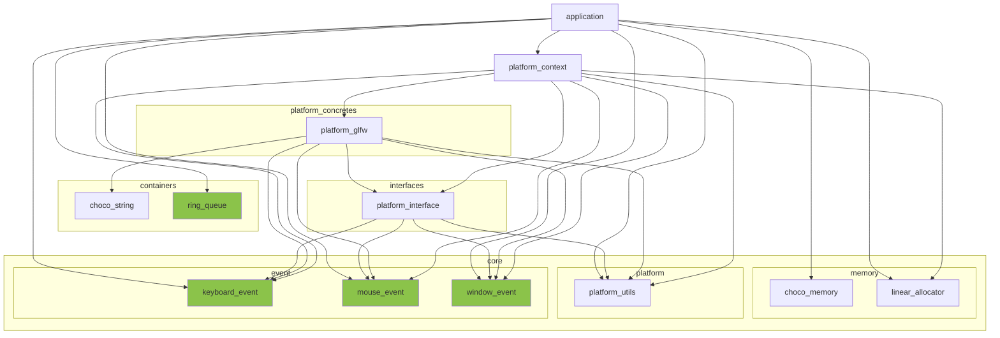
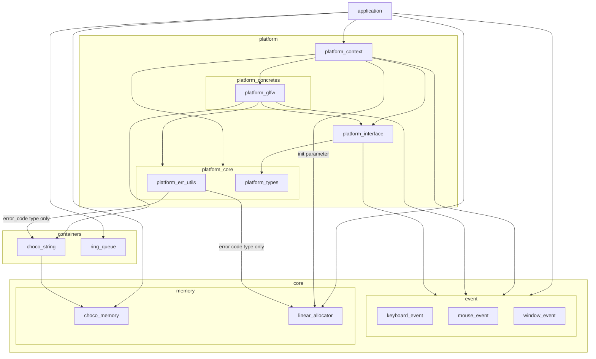

※本記事は [全体イントロダクション](https://zenn.dev/chocolate_pie24/articles/c-glfw-game-engine-introduction)のBook4に対応しています。

# Platformレイヤーの構成変更と機能追加

## レイヤー構成変更

現在のレイヤー構成は下図のようになっています。

ここに今回、Rendererレイヤーが新設されます。PlatformについてもRendererと同層に位置するべきだと考え、Platformレイヤーします。
Platformレイヤーには、現状のPlatform関連モジュール(platform_context, platform_concretes, interfaces)を格納します。
さらに、Renderer開発時に採った構成をPlatformにも適用し、統一感を保つため、以下の変更を行います。

- core/platform_utilsをplatform_typesに名称変更し、platform/platform_coreに移動
- platform_core/platform_err_utilsを追加し、Platform関連の実行結果コード定義とモジュール間実行結果コード処理を集約

これらの変更を行った新しいレイヤー構成は下図のようになります。

## Platformシステムへの機能追加

次は、Platformシステムへの機能追加です。描画を行う際には、一般にダブルバッファリングを用い、
描画を表示中画面とは別のサーフェイスに行い、表示する際に入れ替えるという手法を採ります。

このダブルバッファリング機能なのですが、画面に関する機能とも言えるし、描画に関する機能とも言えます。
前者の場合はPlatformレイヤーに属する機能となり、後者の場合はRendererレイヤーに属する機能となります。
どちらにするか悩んだのですが、今回はダブルバッファリング処理に ***glfwSwapBuffers*** というGLFW依存のAPIを使用するため、
Platformレイヤーに配置することにしました。ここに関しては今後、別のPlatformを使用することになった場合、設計変更が必要となるかもしれません。

追加はplatform_contextに ***platform_swap_buffers()*** を追加し、それに伴い ***platform_interface*** と ***platform_concretes*** にもAPIを追加しました。
処理自体は内部で ***glfwSwapBuffers()*** を呼び出すだけの機能です。

## PlatformシステムAPIの仕様変更

今回、三角形の描画処理を追加した際、Linux環境とmacOS環境で以下のように実行結果が異なる現象が発生しました。

macOS環境

Linux環境

原因は、描画範囲の指定にピクセルサイズではなく、ウィンドウサイズを指定していたことが原因でした。具体的に言うと、
Linuxの場合はウィンドウサイズと画面のピクセルサイズがイコールであるのに対し、
macOSでRetina Displayを使用している場合はイコール(上の例では幅が1/2、高さが1/2で1/4の三角形になっている)とならず、描画範囲がLinuxとmacOSで異なる範囲になっていました。
描画範囲の指定にピクセルサイズを指定することにより、不具合は解消されました。

以上の理由により、Platformレイヤーから上位レイヤーへ画面のピクセルサイズを渡すことができるよう既存APIが仕様変更が必要です。
今回は、 ***platform_glfw_window_create()*** APIの引数に出力変数としてフレームバッファサイズを追加することで対応しました。
なお、画面のピクセルサイズはGLFW環境では、 ***glfwGetFramebufferSize*** によって取得することができます。
