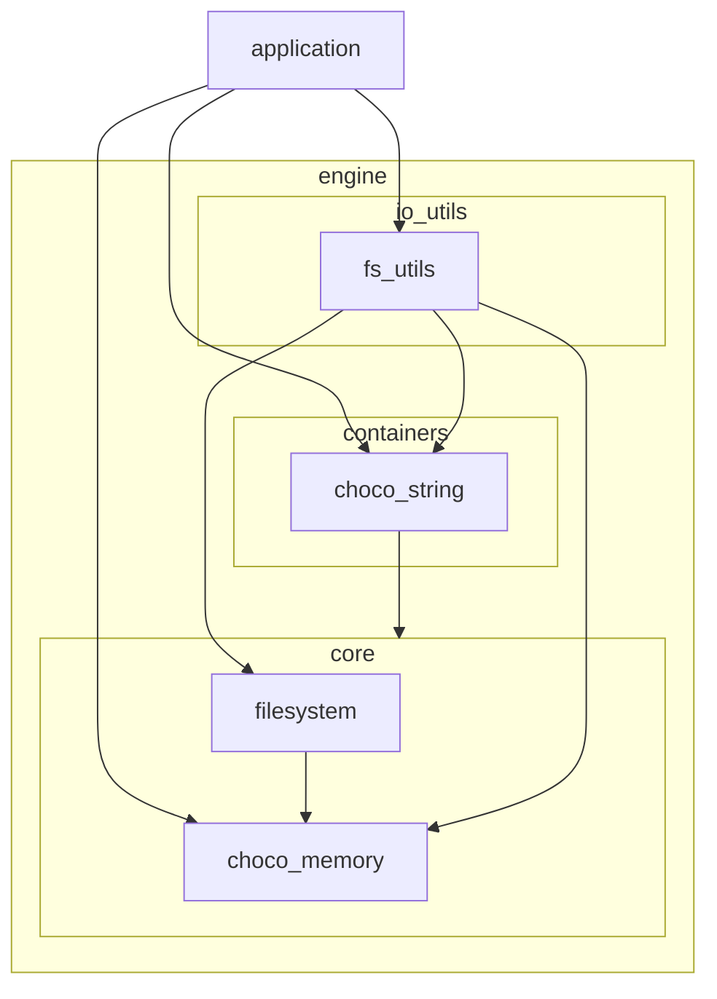
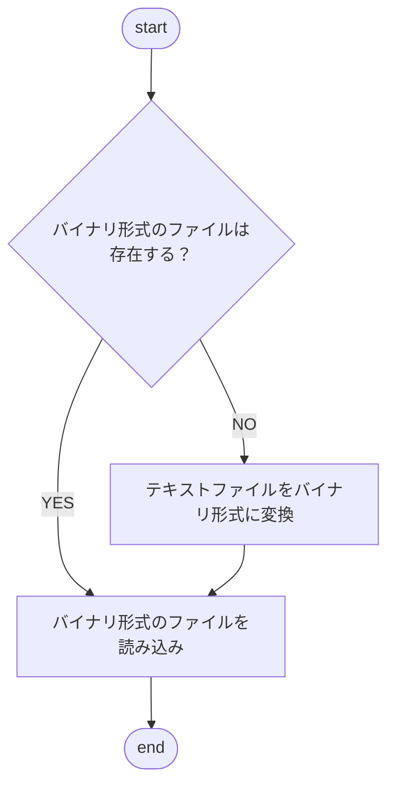

※本記事は [全体イントロダクション](https://zenn.dev/chocolate_pie24/articles/c-glfw-game-engine-introduction)のBook4に対応しています。

実装コードについては、リポジトリのタグv0.1.0-step4を参照してください。

# filesystem / fs_utilsモジュールの追加

前回は、最小限のコードで三角形を描画する処理を作成しました。ここからは追加した処理を外部モジュールに切り出していく作業になります。最初に行うのは、シェーダーソースを外部ファイルに移し、実行時にファイルを読み込み、シェーダーソースのコンパイル、リンクを行うことができる仕組みを構築していきます。

そのために、シェーダーソースを全て文字列として格納できるようにします。以下の機能を作成します。

- ファイルオープン / クローズ機能
- ファイル内容一括読み込み機能

ファイルを読み込んだ結果の文字列の格納には、リソース管理機能を有する ***choco_string*** モジュールを使用します。こうすることで、終端文字の有無を意識する必要がなくなり、文字列長さの変更によるバッファサイズの変更もモジュールに任せることができます。そのため、「ファイル内容一括読み込み機能」はcontainersレイヤーよりも上層に格納されることになります。

一方、「ファイルオープン / クローズ機能」については、標準Cライブラリのみで作成が可能で、比較的低レイヤーに位置すべき機能です。また、「ファイル内容一括読み込み機能」を実現するためには、「バイト単位でのファイル読み込み」や、「行単位でのファイル読み込み」といった処理が必要で、これについても標準Cライブラリのみで作成が可能です。

以上の考えから、今回はモジュールを2層に分けて配置することにしました。

| 追加機能                        | 所属レイヤー | モジュール名 |
| ----------------------------- | ----------- | ---------- |
| ファイルオープン / クローズ機能    | core        | filesystem |
| バイト単位でのファイル読み込み機能  | core        | filesystem |
| ファイル一括読み込み機能          | io_utils    | fs_utils   |

今回の変更で、全体のレイヤー構成は以下のようになります(追加モジュール関連部のみ, baseレイヤーは省略)。



追加するモジュールの実装方針は以下です。

- インスタンスが実行時に動的に生成され、破棄される性質であるため、メモリアロケータは ***choco_memory*** モジュールを使用
- APIの誤用を防ぐことと、モジュールにリソース管理責務を持たせるため、データ構造の中身は隠蔽

## filesystemモジュール

filesystemモジュールには以下の機能を持たせます。このモジュールには今後、行単位での読み込み機能等も追加される予定です。

| API名称                     | 役割                            |
| -------------------------- | ------------------------------ |
| filesystem_create          | filesystem_tのリソース確保と初期化 |
| filesystem_destroy         | filesystem_tのリソース解放        |
| filesystem_open            | ファイルオープン                  |
| filesystem_close           | ファイルクローズ                  |
| filesystem_byte_read       | バイト単位でのファイル読み込み      |
| filesystem_open_mode_c_str | ファイルオープンモードの文字列変換   |

## fs_utilsモジュール

fs_utilsモジュールには以下の機能を持たせることにします。

| API名称                  | 役割                                            |
| ----------------------- | ----------------------------------------------- |
| fs_utils_create         | fs_utils_tのリソース確保と初期化                   |
| fs_utils_destroy        | fs_utils_tのリソース解放                          |
| fs_utils_text_file_read | ファイル一括読み込み機能                            |
| fs_utils_fullpath_get   | fs_utils_tが管理するファイルパス情報のフルパス文字列化 |

特記事項としては、 ***fs_utils_create*** は引数として以下を受け取ります。

- ファイルパス
- ファイル名
- 拡張子(拡張子がない場合はNULLを指定する)
- ファイルオープンモード
- 初期化対象構造体インスタンスへのダブルポインタ

この設計の目的は、同一リソースの“派生ファイル”(テキスト版／バイナリ版など)を、拡張子の差し替えだけで扱えるようにすることです。

グラフィックスアプリケーションで使用するリソースデータには、数GB単位のものも出てきます。こうしたデータは、トラブル時に編集・差分確認しやすいよう、人間が読めるテキスト形式でも持っておきたい一方で、毎回テキストをパースすると読み込みが重くなりやすいため、高速に読み込めるバイナリ形式も併用したくなります。

このため、読み込み時は次の手順を踏む方針にします。



このように、同じファイル名に対して拡張子だけを変えたテキスト版 / バイナリ版を保存しておけば、初回のみテキストから生成し、2回目以降はバイナリを使って高速に読み込めます。

## 追加したモジュールを使用したシェーダーソースの読み込み

これでシェーダーソースを外部ファイルに移し、読み込むことが可能になりました。
GL CHOCO ENGINEでは、シェーダーソースを ***assets/shaders/*** に格納するようにします。
シェーダーソースを

- fragment_shader.frag
- vertex_shader.vert

に分けて格納しました。これを読み込むために追加したモジュールを以下のように使用します。前回追加した ***program_create()*** 内の処理がこのように変わります。

```c
    fs_utils_t* frag_fs_utils = NULL;
    fs_utils_t* vert_fs_utils = NULL;
    choco_string_t* vert_shader_source = NULL;
    choco_string_t* frag_shader_source = NULL;

    choco_string_default_create(&vert_shader_source);
    choco_string_default_create(&frag_shader_source);
    fs_utils_create("assets/shaders/test_shader/", "fragment_shader", ".frag", FILESYSTEM_MODE_READ, &frag_fs_utils);
    fs_utils_create("assets/shaders/test_shader/", "vertex_shader", ".vert", FILESYSTEM_MODE_READ, &vert_fs_utils);

    // シェーダープログラムロード
    fs_utils_text_file_read(frag_fs_utils, frag_shader_source);
    fs_utils_text_file_read(vert_fs_utils, vert_shader_source);

    renderer_backend_shader_compile(SHADER_TYPE_VERTEX, choco_string_c_str(vert_shader_source), s_app_state->renderer_backend_context, s_app_state->ui_shader);
    renderer_backend_shader_compile(SHADER_TYPE_FRAGMENT, choco_string_c_str(frag_shader_source), s_app_state->renderer_backend_context, s_app_state->ui_shader);
    renderer_backend_shader_link(s_app_state->renderer_backend_context, s_app_state->ui_shader);
```
