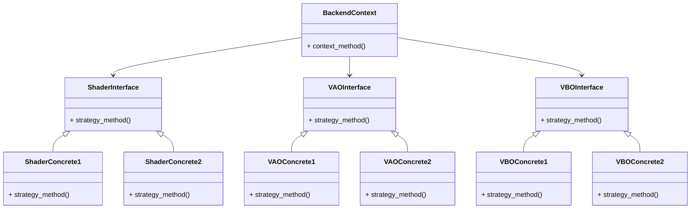
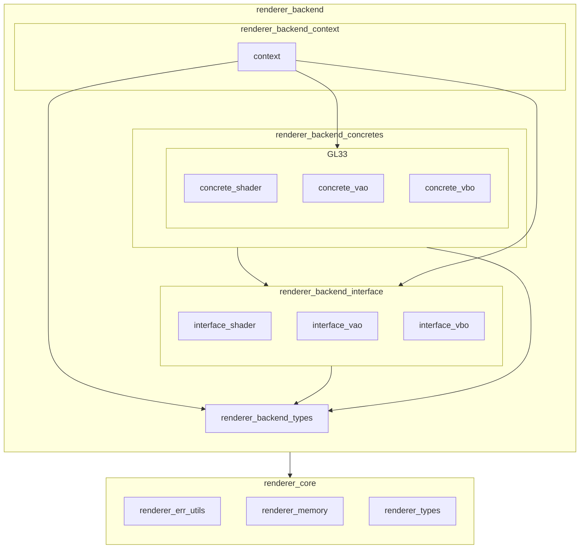

※本記事は [全体イントロダクション](https://zenn.dev/chocolate_pie24/articles/c-glfw-game-engine-introduction)のBook4に対応しています。

実装コードについては、リポジトリのタグv0.1.0-step4を参照してください。

# API差し替え可能なRenderer Backendの枠組み

ここから追加していくモジュールは、VAO / VBO / シェーダーです。これらはRenderer Backendの中に配置されることになります。なので、先ずはRenderer Backendの枠組みを決定し、その後に各モジュールを配置していくことにします。

Renderer Backendに配置するモジュールは以下です。

| モジュール  | 役割                                          | 性質                                                                  |
| --------- | --------------------------------------------- | -------------------------------------------------------------------- |
| shader    | シェーダープログラム、シェーダーモジュールの情報を格納 | シェーダープログラムごとにインスタンスが作られる                              |
| vao       | VAO機能を提供する                               | インスタンスの生成単位は未定(シェーダープログラム単位 or 形状データ単位かで悩み中) |
| vbo       | VBO機能を提供する                               | インスタンスの生成単位は未定(シェーダープログラム単位 or 形状データ単位かで悩み中) |

ここで、シェーダープログラムなのですが、現状では三角形描画用のテスト用シェーダーのみですが、今後、描画対象の性質(2D? 3D? マテリアル情報あり? なし?)によって複数のシェーダープログラムが作られる予定です。

また、vao / vboに似たモジュールとして今後、ebo(Index Buffer Object)が追加されます。vao / vboはセットで存在しますが、eboについては形状データの性質によっては作られません。よって、vao / vbo / eboについては、それぞれ独立してインスタンスを管理することにします。

以上を踏まえ、これらをAPI差し替え可能なBackendにするために、Strategyパターンを使用して下記の構成を作ります。

上記の構成をC言語で実装するために、Rendererレイヤーは下記の構成を取ることにします。

なお、Renderer Frontendについては、このタイミングで作成するよりは、エンジンの機能が充実し、描画内容がリッチになってきてから作成した方が設計の手戻りが少ないと考え、まだ用意しません。
