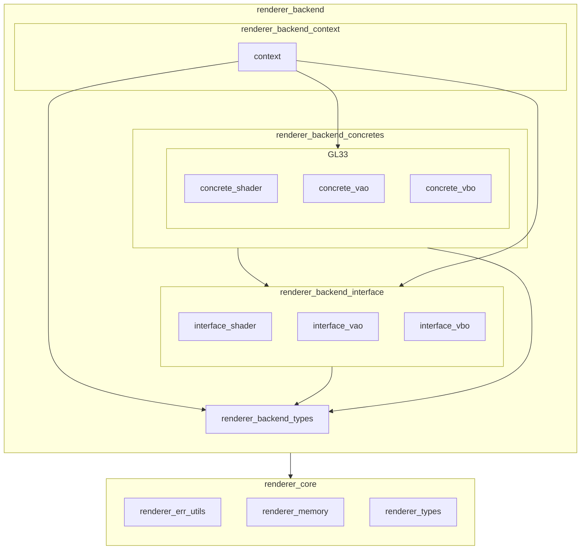

※本記事は [全体イントロダクション](https://zenn.dev/chocolate_pie24/articles/c-glfw-game-engine-introduction)のBook4に対応しています。

# renderer_coreの追加

このステップでは、Rendererの構成のうち、renderer_coreを作っていきます。Rendererレイヤーの構成をもう一度貼ります。

renderer_coreの役割ですが、Renderer Frontend / Renderer Backend全体から使用されるモジュールを配置します。
配置するモジュールと役割は下表の通りです。

| モジュール           | 役割                                                                                             |
| ------------------ | ------------------------------------------------------------------------------------------------ |
| renderer_err_utils | 下位レイヤーに属するモジュールの実行結果コード変換機能を提供                                               |
| renderer_memory    | choco_memoryのallocate / freeのラッパーAPIで、Renderer専用の実行結果コード出力、メモリータグ指定を可能にする |
| renderer_types     | Renderer全体で使用される型を提供する。現状では以下を提供する                                              |
|                    | - renderer_result_t: Renderer実行結果コード定義                                                     |
|                    | - buffer_usage_t: GPU側バッファの使用方法(STATIC / DYNAMIC)を定義                                     |
|                    | - renderer_type_t: グラフィックスAPIに依存しないデータ型を定義                                          |
|                    | - shader_type_t: シェーダー種別を定義                                                                |
