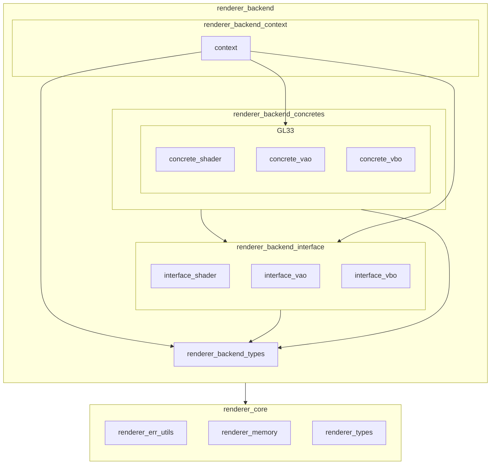

※本記事は [全体イントロダクション](https://zenn.dev/chocolate_pie24/articles/c-glfw-game-engine-introduction)のBook4に対応しています。

# renderer_backend_interfaceの追加

このステップでは、Rendererの構成のうち、renderer_backend_interfaceを作っていきます。Rendererレイヤーの構成をもう一度貼ります。

renderer_backend_interfaceは、グラフィックスAPIの差し替えを可能にするための仮想関数テーブルの提供が責務です。
