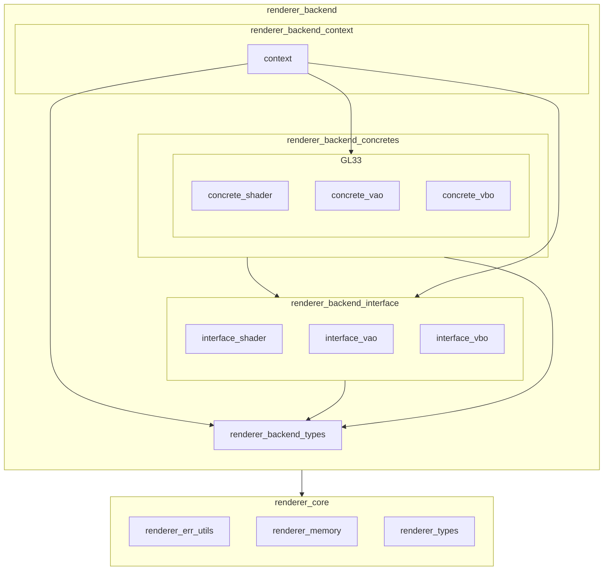

※本記事は [全体イントロダクション](https://zenn.dev/chocolate_pie24/articles/c-glfw-game-engine-introduction)のBook4に対応しています。

実装コードについては、リポジトリのタグv0.1.0-step4を参照してください。

# renderer_backend_interfaceの追加

このステップでは、Rendererの構成のうち、renderer_backend_interfaceを作ります。Rendererレイヤーの構成をもう一度貼ります。



renderer_backend_interfaceは、グラフィックスAPIの差し替えを可能にするための仮想関数テーブルの提供が責務です。仮想関数テーブルは以下の3つを用意します。

| 仮想関数テーブル用途 | テーブル名称               |
| ---------------- | ------------------------ |
| shader操作用      | renderer_shader_vtable_t |
| VAO操作用         | renderer_vao_vtable_t    |
| VBO操作用         | renderer_vbo_vtable_t    |

shader / VAO / VBOは常にセットで使用します。この3つだけであれば一つの仮想関数テーブルでも良いのですが、将来的に追加となるEBOについては描画対象の性質によって使ったり使わなかったりするため、全て分けることにしました。

それぞれの仮想関数テーブルが保有する機能は以下の表のとおりです。

| 仮想関数テーブル            | 保有関数                    | 役割                                                                                                       |
| ------------------------ | -------------------------- | --------------------------------------------------------------------------------------------------------- |
| renderer_shader_vtable_t | renderer_shader_create     | シェーダーハンドル構造体インスタンスのメモリを確保し、renderer_backend_shader_tインスタンスのフィールドを全て0で初期化する |
|                          | renderer_shader_destroy    | シェーダーハンドル構造体インスタンスを破棄する                                                                    |
|                          | renderer_shader_compile    | シェーダーソースをコンパイルし、シェーダーオブジェクトハンドルを初期化する                                             |
|                          | renderer_shader_link       | コンパイル済みのシェーダーオブジェクトをリンクし、シェーダープログラムハンドルを初期化する                                |
|                          | renderer_shader_use        | シェーダープログラムの使用開始をグラフィックスAPIに伝える                                                           |
| renderer_vao_vtable_t    | vertex_array_create        | VAO構造体インスタンスのメモリを確保し、初期化(VAOの生成)する                                                       |
|                          | vertex_array_destroy       | VAOを無効化し、VAO構造体インスタンスのメモリを解放する                                                             |
|                          | vertex_array_bind          | VAOのbindを行う(現在bind中のVAOの場合は何もしない)                                                              |
|                          | vertex_array_unbind        | VAOのunbindを行う                                                                                           |
|                          | vertex_array_attribute_set | VAOで管理する頂点情報のレイアウト情報を設定する(設定前にVAOのbind処理を行う)                                         |
| renderer_vbo_vtable_t    | vertex_buffer_create       | VBO構造体インスタンスのメモリを確保し、初期化(VBOの生成)する                                                        |
|                          | vertex_buffer_destroy      | VBOを無効化し、VBO構造体インスタンスのメモリを解放する                                                             |
|                          | vertex_buffer_bind         | VBOのbindを行う(現在bind中のVBOの場合は何もしない)                                                              |
|                          | vertex_buffer_unbind       | VBOのunbindを行う                                                                                           |
|                          | vertex_buffer_vertex_load  | VBOが管理する頂点バッファに頂点情報を転送する(転送の前にVBOのbind処理を行う)                                         |

これらの仮想関数テーブルが保有する関数の実体についてなのですが、VAOとVBOは役割に対応するOpenGL APIのほぼラップ関数です。shaderについても現在 ***application.c*** で記述している ***program_create*** / ***shader_create*** とほぼ同じ内容であるため詳細は省略します。

関数の実体で使用するデータ構造については下記のようにしました。

## shader構造体

```c
/**
 * @brief シェーダープログラム／シェーダーオブジェクトのハンドルを保持する構造体
 *
 * @details
 * - リンクされたシェーダープログラムのハンドルを保持する
 * - コンパイルされた各シェーダーステージのシェーダーオブジェクトハンドルを保持する
 *
 */
struct renderer_backend_shader {
    GLuint program_id;              /**< リンクしたOpenGLシェーダープログラムへのハンドル */
    GLuint vertex_shader_handle;    /**< コンパイルしたバーテックスシェーダーオブジェクトへのハンドル */
    GLuint fragment_shader_handle;  /**< コンパイルしたフラグメントシェーダーオブジェクトへのハンドル */
};
```

シェーダーオブジェクトのハンドルについては、プログラムのリンク後は保持する必要はないのですが、データ破損チェック(*)のために残しておくことにしました。

*: リンク済なのにshader_handleが0であればデータ破損と判定

## VAO構造体

VAO構造体は、VAO生成時に取得したハンドルを保持するだけです。

```c
/**
 * @brief VAOモジュール内部状態管理構造体
 *
 */
struct renderer_backend_vao {
    GLuint vao_handle;  /**< VAO */
};
```

## VBO構造体

VBO構造体は、VBO生成時に取得したハンドルを保持するだけです。

```c
/**
 * @brief VBOモジュール内部状態管理構造体
 *
 */
struct renderer_backend_vbo {
    GLuint vbo_handle;  /**< VBO */
};
```
