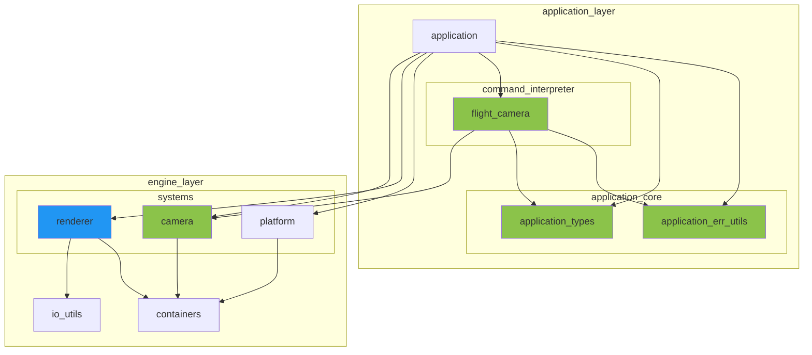
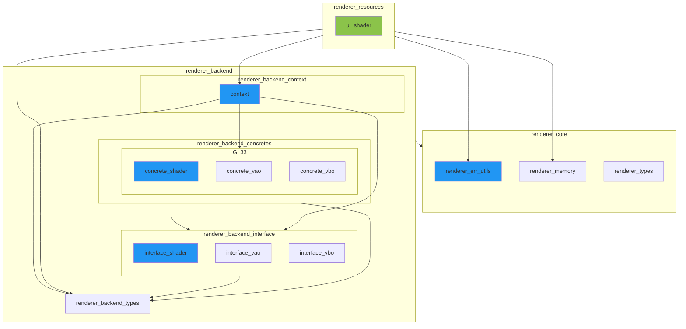
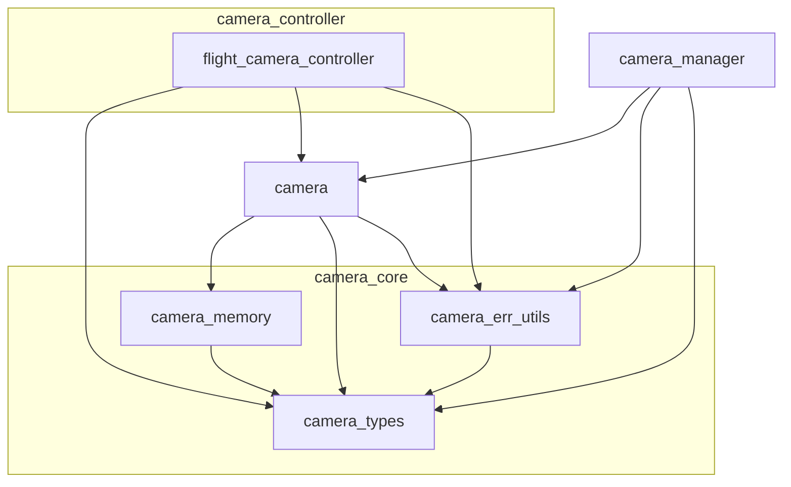

※本記事は [全体イントロダクション](https://zenn.dev/chocolate_pie24/articles/c-glfw-game-engine-introduction)のBook5に対応しています。

前回は、Renderer Backendを追加し、シンプルな三角形を描画できるようにしました。

今回は、キーボード操作によって描画視点を変更できるようにし、三角形を様々な位置から見れるようにしていきます。

## Step5解説

- step5_1: [Model, View, Projection行列の導入](https://zenn.dev/chocolate_pie24/books/2d_rendering_step5/viewer/step5_1_mvp_matrix)
- step5_2: [Camera Systemアーキテクチャ](https://zenn.dev/chocolate_pie24/books/2d_rendering_step5/viewer/step5_2_camera_system_architecture)
- step5_3: [Cameraモジュールの追加](https://zenn.dev/chocolate_pie24/books/2d_rendering_step5/viewer/step5_3_camera_module)
- step5_4: [Camera制御モジュールの追加](https://zenn.dev/chocolate_pie24/books/2d_rendering_step5/viewer/step5_4_camera_control_module)
- step5_5: [Cameraシステムの構築](https://zenn.dev/chocolate_pie24/books/2d_rendering_step5/viewer/step5_5_camera_system)
- step5_6: [カメラ制御コマンドとキー操作イベントの連携](https://zenn.dev/chocolate_pie24/books/2d_rendering_step5/viewer/step5_6_control_command_interpreter)

## レイヤー構成図

今回の変更によって、レイヤー構成図は以下のように変化しました。

- 青: 変更あり
- 緑: 新規追加

### GL Choco Engine OverView

### Renderer System

### Camera System

このレイヤーは全モジュールが新規のため色分けはしていません。

