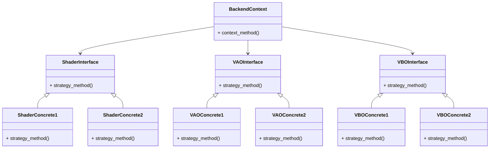

※本記事は [全体イントロダクション](https://zenn.dev/chocolate_pie24/articles/c-glfw-game-engine-introduction)のBook5に対応しています。

実装コードについては、リポジトリのタグv0.1.0-step5を参照してください。

## MVP行列の導入

このステップでは、カメラの導入によって描画空間と視点を扱えるようにするための準備を行います。
そのために、GPU側、CPU側両方のプログラムに、MVP行列を使用した頂点座標の座標変換処理を追加します。

MVP行列とは、Model, View, Projection行列の総称であり、3D空間上の座標を画面へ描画するための基本的な行列です。
それぞれ以下の役割があります。

| 行列           | 役割                                                                                      | 行列の中身が変化するタイミング                                                |
| ------------- | ---------------------------------------------------------------------------------------- | ------------------------------------------------------------------------- |
| Model行列      | モデル座標系で表現された座標をワールド座標系に変換する(=モデルを世界のどこにどう置くかを決める)          | モデルの位置・回転・拡大縮小が変化  |
| View行列       | ワールド座標系で表現された座標をカメラ座標系に変換する(=世界をカメラから見た座標系に変換する)           | カメラ姿勢が変化                                                            |
| Projection行列 | カメラ座標系で表現された座標をクリップ座標系に変換する(=カメラから見た3D空間を、画面に映せる形に変換する) | 視野角、near/far、投影方式、画面サイズに応じたアスペクト比が変化したとき |

なお、各座標系の意味については、[OpenGL座標系説明](https://zenn.dev/chocolate_pie24/books/2d_rendering_step4/viewer/appendix_opengl_coordinates)を参考にしてください。

これらの行列は、CPU側で行列を管理し、必要なタイミングでGPUへ転送します。
GPU側は、CPU側から転送された3D頂点座標全てに対し、これらの行列を掛けることによって全頂点座標を変換します。なお、座標変換処理はバーテックスシェーダーで行います。

## 前提条件(GL Choco Engineでの行列 / ベクトル数値格納方法)

行列に数値を格納する際は、

- 行優先(行ごとに連続して格納する方式)
- 列優先(列ごとに連続して格納する方式)

例えば以下の行列をint型配列に格納する場合、

$$
\left[
\begin{matrix}
    1 & 2 & 3 \\
    4 & 5 & 6 \\
    7 & 8 & 9 \\
\end{matrix}
\right]
$$

```c
int matrix[9] = {1, 2, 3, 4, 5, 6, 7, 8, 9};
```

となります。一方で、列優先で格納する場合は、

```c
int matrix[9] = {1, 4, 7, 2, 5, 8, 3, 6, 9};
```

このように、行優先で格納した行列の要素列は、元の行列を転置したものを列優先で格納した場合の要素列と一致します。

OpenGLでは、行列をGPUへ転送する際に、列優先の並びを前提とする扱いが基本となります。しかし、GL Choco Engineでは、全ての行列を行優先で扱い、GPUに転送する際に転置することで整合性を取ります。
理由は、ロボティクス分野における描画基盤としての使用も想定しており、ロボット工学の教科書に記載されているのと同じ格納方式の方が座標変換等のデバッグの際にわかりやすいからです。
また、座標値を表すベクトルは列ベクトルとして扱います。そのため、座標変換は以下のように、行列をベクトルの左から掛ける方式で統一します。

$$
\left[
\begin{matrix}
    a & b & c \\
    d & e & f \\
    g & h & i \\
\end{matrix}
\right]
\left[
\begin{matrix}
x \\
y \\
z \\
\end{matrix}
\right]
$$

## 数学系ライブラリの追加

今回から行列演算が追加されますので、この機会に数学系ライブラリを整えます。
このライブラリはGL Choco Engine以外の私のプロジェクトにも使えるようにしたいので、engine/baseに置くことにします。

| パス                                 | 役割                    |
| ----------------------------------- | ----------------------- |
| engine/base/choco_math/math_types.h | 数学系データ型定義         |
| engine/base/choco_math/choco_math.h | 行列、ベクトル計算モジュール |

それぞれに持たせる機能 / 型は当面、以下のものがあればGL Choco Engineの数学機能としては十分です。

| ヘッダ        | 機能 / 型             | 説明                                                       |
| ------------ | -------------------- | --------------------------------------------------------- |
| math_types.h | CHOCO_PI             | 円周率定義                                                  |
|              | CHOCO_DEG_TO_RAD     | degree -> radian変換マクロ                                  |
|              | CHOCO_RAD_TO_DEG     | radian -> degree変換マクロ                                  |
|              | vec3f_t              | float型3次元ベクトル構造体                                    |
|              | vec4f_t              | float型4次元ベクトル構造体                                    |
|              | mat4x4f_t            | float型4x4行列構造体                                        |
| choco_math.h | choco_tanf           | <math.h>のtanfラッパーAPI                                   |
|              | is_equal_float       | float値のイコール判定API                                     |
|              | vec3f_initialize     | 3次元ベクトル構造体インスタンスを引数x_, y_, z_で初期化するAPI     |
|              | vec3f_add            | 3次元ベクトル構造体インスタンスの足し算API                       |
|              | vec3f_length_squared | 3次元ベクトルの長さの2乗値を返すAPI                             |
|              | vec3f_length         | 3次元ベクトルの長さを返すAPI                                   |
|              | vec3f_normalize      | 3次元ベクトルを正規化するAPI                                   |
|              | vec4f_initialize     | 4次元ベクトル構造体インスタンスを引数x_, y_, z_, w_で初期化するAPI |
|              | vec4f_add            | 4次元ベクトル構造体インスタンスの足し算API                       |
|              | mat4f_zero           | 4x4行列の要素を全て0.0fで初期化するAPI                         |
|              | mat4f_identity       | 4x4行列を単位行列で初期化するAPI                               |
|              | mat4f_mul            | 4x4行列の掛け算を行うAPI                                      |
|              | mat4f_transpose      | 4x4行列を転置するAPI                                         |
|              | mat4f_copy           | 4x4行列のコピーを行うAPI                                      |
|              | mat4f_inverse        | 4x4行列の逆行列を計算するAPI                                   |
|              | mat4f_vec4f_mul      | 4x4行列と4次元ベクトルの掛け算を行うAPI                          |
|              | mat4f_translation    | 平行移動行列を取得するAPI                                      |
|              | mat4f_rot_x          | x軸周りの回転行列を取得するAPI                                  |
|              | mat4f_rot_y          | y軸周りの回転行列を取得するAPI                                  |
|              | mat4f_rot_z          | z軸周りの回転行列を取得するAPI                                  |
|              | mat4f_rot_xyz        | x, y, z周りの回転行列を取得するAPI(順番はx, y, z)               |

## シェーダーソースの変更

前回までは、すでに[-1, +1]の範囲に正規化された正規化デバイス座標系で三角形座標を表現していました。
このため座標値のみをCPU側プログラムからGPU側プログラムに転送し、何も変換を行わないままプログラムを終了していました。

今回からは、CPU側プログラムからはモデル座標系(今回は三角形一個なのでワールド座標系と同一)で表現された3次元座標をGPUに転送し、
GPU側プログラムで座標変換を行います。バーテックスシェーダーのプログラムを以下のように変更します。

```c
#version 330 core

layout(location = 0) in vec3 in_position;

uniform mat4 g_model_matrix;
uniform mat4 g_view_matrix;
uniform mat4 g_projection_matrix;

void main() {
	gl_Position = g_projection_matrix * g_view_matrix * g_model_matrix * vec4(in_position, 1.0);
}
```

ソース内の、***g_model_matrix***, ***g_view_matrix***, ***g_projection_matrix***がMVP行列です。
これらはCPU側プログラムからデータを転送するようにします。

CPU側プログラムから転送された頂点座標に対して、モデル行列、ビュー行列、プロジェクション行列の順に掛けています。
こうすることで、モデル座標系 -> ワールド座標系 -> カメラ座標系 -> クリップ座標系に変換されます。

なお、描画するためには、座標値は[-1, +1]に正規化された正規化デバイス座標系で表現する必要があります。
クリップ座標から正規化デバイス座標系への変換はOpenGLが行います。

## Rendererレイヤーへの機能追加

これでGPU側が座標変換を行えるようになったので、後はCPU側にも行列を用意し、GPU側に転送できるようにします。
頂点情報はバーテックスバッファへ情報を送りましたが、今回はuniform変数への転送です。

OpenGLでuniform変数へデータを転送するためには、

1. glGetUniformLocationでuniform変数の位置を取得
2. glUniformMatrix4fvでuniform変数に値をセット

という流れを踏みます。これを行えるようにrenderer_backendに機能を追加していきます。
renderer_backendは、Strategyパターンを取っており、以下のようなデータ構造になっています。



uniform変数へのデータ転送はシェーダーの一機能として提供することにしますので、以下の手順で機能を追加します。

1. ShaderInterfaceが提供するvtableに関数を追加
2. ShaderConcreteへの関数追加
3. BackendContextから呼び出し可能にする

### ShaderInterfaceの変更

renderer_backend/renderer_backend_interface/interface_shader.hにuniform変数の転送関連機能を追加します。

```c
typedef struct renderer_shader_vtable {
    pfn_renderer_shader_create renderer_shader_create;                              /**< 関数ポインタ @ref pfn_renderer_shader_create 参照 */
    pfn_renderer_shader_destroy renderer_shader_destroy;                            /**< 関数ポインタ @ref pfn_renderer_shader_destroy 参照 */
    pfn_renderer_shader_compile renderer_shader_compile;                            /**< 関数ポインタ @ref pfn_renderer_shader_compile 参照 */
    pfn_renderer_shader_link renderer_shader_link;                                  /**< 関数ポインタ @ref pfn_renderer_shader_link 参照 */
    pfn_renderer_shader_use renderer_shader_use;                                    /**< 関数ポインタ @ref pfn_renderer_shader_use 参照 */
    pfn_renderer_shader_uniform_location_get renderer_shader_uniform_location_get;  /**< 関数ポインタ @ref pfn_renderer_shader_uniform_location_get 参照 */
    pfn_renderer_shader_mat4f_uniform_set renderer_shader_mat4f_uniform_set;        /**< 関数ポインタ @ref pfn_renderer_shader_mat4f_uniform_set 参照 */
} renderer_shader_vtable_t;
```

### ShaderConcreteへの関数追加

renderer_backend/renderer_backend_concretes/gl33/concrete_shader.cに以下のプライベート関数を追加しました。
これらは、***glGetUniformLocation***, ***glUniformMatrix4fv***のラッパー関数です。

- gl33_uniform_location_get
- gl33_mat4f_uniform_set

これらを先ほど追加したvtableの関数にセットすれば、InterfaceとConcreteは完成です。

### BackendContextへのAPI追加

BackendContextへの変更は、***renderer_backend_context***が既に保持しているshader_vtableの中身が変更になるだけです。
shader_vtableが保有する***renderer_shader_uniform_location_get***と***renderer_shader_mat4f_uniform_set***を呼び出すAPIを追加するだけで良いです。

今回追加したAPIは以下の2つです。

- renderer_backend_shader_uniform_location_get
- renderer_backend_shader_mat4f_uniform_set

ここで、renderer_backend_shader_mat4f_uniform_setについては、以下のインターフェイスを持っています。

```c
/**
 * @brief シェーダープログラムにmat4f型のユニフォーム変数を送信する
 *
 * @note
 * - OpenGL 3.3実装
 * - 現在使用中のシェーダープログラムと、送信対象シェーダープログラムが異なる場合は、使用中のプログラムが送信対象シェーダープログラムに切り替わる
 *
 * @param[in] backend_context_ レンダラーバックエンドコンテキストへのポインタ
 * @param[in] shader_handle_ シェーダープログラムハンドルインスタンスへのポインタ
 * @param[in] location_ ユニフォーム変数のLocation
 * @param[in] should_transpose_ true: 送信時に行列を転置する / false: 送信時に行列を転置しない
 * @param[in] data_ 送信データへのポインタ
 *
 * @retval RENDERER_INVALID_ARGUMENT 以下のいずれか
 * - backend_context_ == NULL
 * - shader_handle_ == NULL
 * - data_ == NULL
 * @retval RENDERER_DATA_CORRUPTED シェーダープログラムハンドルインスタンスの内部データが破損
 * @retval RENDERER_BAD_OPERATION 以下のいずれか
 * - シェーダープログラムが未リンク状態
 * - backend_context_が未初期化でshader_vtableがNULL
 * @retval RENDERER_SUCCESS 処理に成功し、正常終了
 */
renderer_result_t renderer_backend_shader_mat4f_uniform_set(renderer_backend_context_t* backend_context_, const renderer_backend_shader_t* shader_handle_, int32_t location_, bool should_transpose_, const float* data_);
```

GL Choco Engineでは、行列の要素を行優先で格納しているため、GPUへのデータ転送時に行列を転置する必要があります。これを実行可能にするために、should_transpose_を入れています。
上位レイヤーでAPIを呼び出す際には、should_transpose_ = trueにすることが必要です。

### UIシェーダーモジュールの作成

以上で、シェーダー側、CPU側ともにMVP行列を使用する準備が整いました。これで、現状のエンジンでは、

- uniform変数の取り扱い
- VAOの取り扱い
- VBOの取り扱い
- シェーダーのコンパイル、リンク

ができるようになりました。現状ではシェーダープログラムは1つのみですが、今後、

- マテリアル情報を扱える3Dモデル描画用シェーダー
- マテリアル情報のない3Dモデル描画用シェーダー

といった様々なシェーダープログラムが出てきます。これらは使用するuniform変数に違いがあったり、EBOの使用有無が異なっていたりします。
当然、シェーダーソースのファイル名も異なります。このため、各シェーダープログラムごとに異なる処理をする必要があります。
これらは現状のようにアプリケーションレイヤーで行うよりは、
専用のモジュールに切り出してしまった方が便利です。なので、新しくUIシェーダーモジュールを作っていきます。
作成するモジュールは、

- engine/renderer/renderer_resources/ui_shader

です。今後、シェーダープログラムが増えるに従い、renderer_resources内にモジュールを追加していきます。

モジュールが管理する内部データは、現状では以下のデータを管理するようにします。

src/engine/renderer/renderer_resources/ui_shader.c

```c
struct ui_shader {
    int32_t model_matrix_location;          /**< モデル行列のユニフォーム変数Location */
    int32_t view_matrix_location;           /**< ビュー行列のユニフォーム変数Location */
    int32_t projection_matrix_location;     /**< プロジェクション行列のユニフォーム変数Location */
    renderer_backend_shader_t* shader;      /**< シェーダープログラムハンドルインスタンスへのポインタ */
};
```

また、モジュールが保有するAPIは以下の通りです。

| API名称                          | 役割                                                 |
| ------------------------------- | ---------------------------------------------------- |
| ui_shader_create                | シェーダーソースのコンパイル、リンク、uniform変数の位置の取得 |
| ui_shader_destroy               | リソースの破棄                                         |
| ui_shader_use                   | シェーダープログラムの切り替え                            |
| ui_shader_model_matrix_set      | モデル行列の転送                                        |
| ui_shader_view_matrix_set       | ビュー行列の転送                                        |
| ui_shader_projection_matrix_set | プロジェクション行列の転送                                |

このようにすることで、アプリケーションレイヤーでは、各シェーダープログラムの詳細について把握する必要がなくなり、より上位の責務に集中できるようになります。
VAOやVBOの管理については、バッファの使用状況の管理モジュールを作った段階で、このモジュールに移していく予定です。

以上でMVP行列の導入のステップは完了です。
次のステップでは、カメラモジュールを作成し、カメラの位置、姿勢に応じてV行列とP行列を生成する仕組みを作っていきます。
