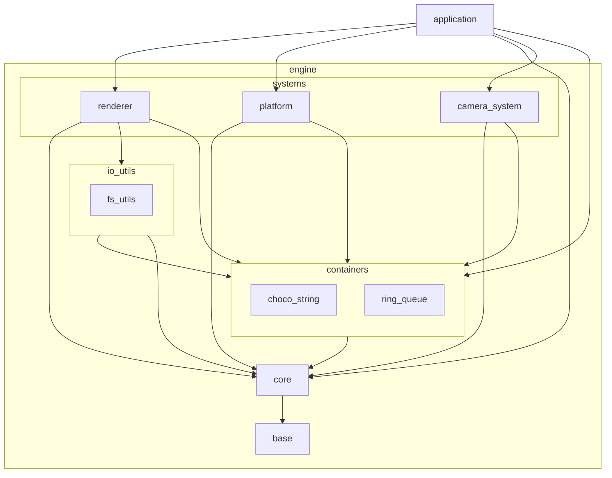
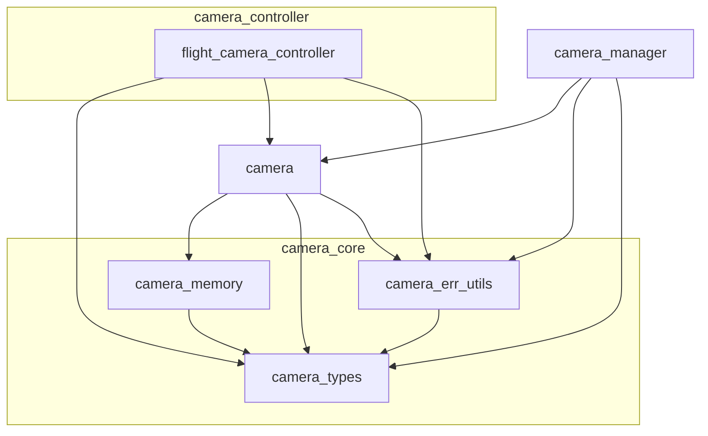

※本記事は [全体イントロダクション](https://zenn.dev/chocolate_pie24/articles/c-glfw-game-engine-introduction)のBook5に対応しています。

実装コードについては、リポジトリのタグv0.1.0-step5を参照してください。

## Camera System

[前回](https://zenn.dev/chocolate_pie24/books/2d_rendering_step5/viewer/step5_1_mvp_matrix)までで、MVP行列が使用可能になりました。今回からはエンジンにカメラと、カメラを制御する機能を追加し、カメラの位置や姿勢に応じてView行列、Projection行列を生成し、画面の三角形を様々な位置、角度から見えるようにしていきます。

グラフィックスアプリケーションでは、描画対象によって様々なカメラを使い分けます。例えばユーザーインターフェイスで何かを選択する画面では、カメラの位置や姿勢を固定にしたりする場合がありますし、1人称視点や3人称視点でキャラクターを画面内で動かすようなカメラもあります。

今回、GL Choco Engineでは、3次元空間内を上下左右に移動することができ、カメラのヨー角、ピッチ角を変更することができるカメラを作成していきます。このカメラをフライトカメラという名称で扱うことにします。今後、エンジン開発の進捗に応じて他のカメラも実装していきます。

カメラに関連する機能は、systemsレイヤー内にCamera Systemを新設し、全てそこにまとめることにします。Camera Systemは、カメラ状態の保持、行列生成、制御方式の切り替え、複数カメラ管理までを担当し、入力イベントとの接続はapplicationレイヤーが担当します。

また、Camera System内部は以下の構造にしました。

特徴は、カメラモジュールはカメラの種類に依らず同一モジュールを使用します。別途設けられたcamera_controllerによってカメラ種別に応じてカメラの制御方式を切り替えることにします。また、今回、フライトカメラはキーボード入力によって動かします。そのため、キーバインドの登録等、イベントシステムとの接続が必要となります。イベントシステムとの接続はCamera Systemでは行いません。現状ではapplicationレイヤーに持たせることにしました。

イベントシステムとの接続はエンジン側に持たせても良いのですが、今後、例えば画面内のロボットを動かす、といったことをやろうとした場合、このロボットという概念はエンジンに持たせるべきではなく、エンジンの一用途としてapplicationレイヤーに属するべき概念です。このため、ロボットを動かすためのキーバインド登録等はapplicationレイヤーに属することになります。よって、カメラを含め、制御機能とイベントシステムの接続は、applicationレイヤーに置くということに統一します。

もちろん、制御対象を抽象化し、統一したキーバインド登録機能を作成することも可能です。ただ、これらの処理は個別に実装したとしてもそこまで規模の大きなものではありません。このため、抽象化によって見通しが悪くなることよりも、エンジンのシンプルさを優先し、イベントシステムと制御機能の接続はapplicationレイヤーに置くということにしました。

Camera Systemに属する各モジュールは以下の通りです。

| モジュール                                   | 役割                                                                           |
| ------------------------------------------ | ------------------------------------------------------------------------------ |
| camera                                     | カメラの位置 / 姿勢 / 投影設定を管理し、これらから求まるView行列、Projection行列を生成する |
| camera_controller/flight_camera_controller | フライトカメラの制御機能を提供する                                                   |
| camera_err_utils                           | Camera Systemのエラーコード関連ユーティリティを提供する                               |
| camera_memory                              | Camera System用にchoco memoryモジュールが提供するAPIのラッパーAPIを提供する           |
| camera_types                               | Camera System内で共通して使用するデータ型を提供する                                  |
| camera_manager                             | 複数のカメラを管理するための、カメラ構造体インスタンスの登録、取得機能を提供する            |

以降、各モジュールの詳細について解説していきます。
