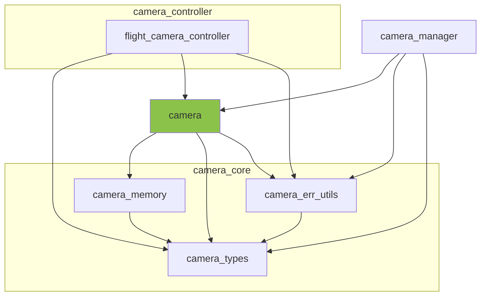

※本記事は [全体イントロダクション](https://zenn.dev/chocolate_pie24/articles/c-glfw-game-engine-introduction)のBook5に対応しています。

実装コードについては、リポジトリのタグv0.1.0-step5を参照してください。

## カメラモジュールの作成

今回は、カメラモジュールを追加し、カメラの位置、姿勢、投影設定に応じてView行列、Projection行列を生成できるようにしていきます。

追加するモジュールはCamera System内の以下の部分です。



### カメラ構造体

カメラモジュールは、内部状態としてカメラ構造体を持ちます。構造体インスタンスを一意に識別でき、また、デバッグの際に分かりやすいよう、名称を文字列で持たせることにしました。

```c
struct camera {
    vec3f_t euler;                      /**< カメラ姿勢オイラー角(degree) */
    vec3f_t position;                   /**< カメラ位置 */

    mat4x4f_t camera_to_world_matrix;   /**< カメラ座標系のある座標をワールド座標系へ変換する行列 */
    mat4x4f_t view_matrix;              /**< ビュー行列 */
    mat4x4f_t perspective_matrix;       /**< プロジェクション行列(透視投影) */

    viewing_frustum_t frustum;          /**< 視錐台パラメータ */

    choco_string_t* name;               /**< カメラ名称文字列 */

    bool posture_cache_dirty;           /**< true: 姿勢が更新されているが、姿勢由来の行列が更新されていない, false: 姿勢と姿勢由来の行列が同期済み */
    bool frustum_cache_dirty;           /**< true: 視錐台が更新されているが、視錐台由来の行列が更新されていない, false: 視錐台と視錐台由来の行列が同期済み */
};
```

GL Choco Engineでは、カメラの姿勢管理にオイラー角を使用します。クォータニオンによる姿勢管理の方が良い面もありますが、数値を見た時に直感的に姿勢を把握できるオイラー角を使用します。同様の理由で角度の単位はdegreeを使用します。カメラの座標系は以下のように定義しています。

- 座標系: 右手座標系
- Roll: Z軸回りの回転
- Pitch: X軸回りの回転
- Yaw: Y軸回りの回転
- カメラ前方方向: Z軸マイナス方向

また、カメラの制御を行う際には、カメラの移動方向を取得できるようにする必要があります。その際にはビュー行列の逆行列である、「カメラ座標系のある座標をワールド座標系へ変換する行列」を使用します。行列を使用するたびに毎回ビュー行列を生成し、逆行列を計算する手間を省くため、ビュー行列とその逆行列も保持するようにします。これらの行列を保持する方針にするため、プロジェクション行列も保持します。なお、プロジェクション行列は現状では透視投影用の行列のみですが、今後、正投影の行列も持たせる予定です。

これらの行列は、姿勢、位置、投影設定に変化があった際に再生成する必要があるため、posture_cache_dirtyとfrustum_cache_dirtyフラグを持たせています。

### 外部公開API

カメラモジュールは、外部公開APIとして以下のものをもたせます。

| API名称                        | 役割                                                          |
| ----------------------------- | ------------------------------------------------------------- |
| camera_create                 | カメラ構造体インスタンスのメモリを確保し、構造体フィールドを0で初期化する |
| camera_destroy                | カメラ構造体インスタンスが管理するリソースを破棄し、自身のメモリも破棄する |
| camera_name_get               | カメラ構造体が管理するカメラ名称文字列を取得する                      |
| camera_viewing_frustum_update | カメラ構造体が管理する視錐台パラメータを更新(または初期化)する          |
| camera_euler_update           | カメラ姿勢情報を更新する                                          |
| camera_position_update        | カメラ位置情報を更新する                                          |
| camera_euler_get              | カメラ姿勢情報を取得する                                          |
| camera_position_get           | カメラ位置情報を取得する                                          |
| camera_perspective_matrix_get | プロジェクション行列として、透視投影変換を行う行列を計算して取得する      |
| camera_view_matrix_get        | ビュー行列を計算して取得する                                       |
| camera_forward_vector_get     | カメラ前方の正規化されたベクトルを返す                               |
| camera_backward_vector_get    | カメラ後方の正規化されたベクトルを返す                               |
| camera_right_vector_get       | カメラ右方向の正規化されたベクトルを返す                             |
| camera_left_vector_get        | カメラ左方向の正規化されたベクトルを返す                             |
| camera_up_vector_get          | カメラ上方向の正規化されたベクトルを返す                             |
| camera_down_vector_get        | カメラ下方向の正規化されたベクトルを返す                             |

APIは基本的には構造体フィールドのgetterとsetterがメインで、それらの説明は省きますが、***camera_forward_vector_get***や***camera_backward_vector_get***についてはアルゴリズムを解説します。

### カメラ移動方向取得方法

カメラ制御を行う際には、移動方向のベクトルに、速度と移動時間を掛けることによってカメラの移動量を計算します。この移動方向のベクトルの求め方について解説します。まず、ビュー行列は性質として、「ワールド座標系の座標をカメラ座標系に変換する」機能を持ちます。よって、ビュー行列の逆行列は「カメラ座標系のある座標をワールド座標系に変換する」機能を持ちます。この特性を利用すれば、例えばビュー行列の逆行列に対し、カメラ座標系の座標、

$$
\left[
    \begin{matrix}
        x \\
        y \\
        z \\
        w \\
    \end{matrix}
\right]
=
\left[
    \begin{matrix}
        1 \\
        0 \\
        0 \\
        0 \\
    \end{matrix}
\right]
$$

を掛けた場合、カメラをカメラ座標系でx軸方向に+1移動させた際の、ワールド座標系におけるx, y, z方向の移動量が求まります。カメラ座標系でx軸+方向はカメラの右方向になりますので、求まったベクトルを正規化すればカメラを右方向に移動するためのベクトルが求まります。このベクトルに対し、移動速度と移動時間をかければ、ワールド座標系でカメラを右に動かすための移動量を求めることができます。

その他、上下、前後、左方向のベクトルも同様の考え方で求めることができます。次回は、この移動方向のベクトル取得APIを用いて3次元空間を自由に動くことができるフライトカメラ制御モジュールを作成していきます。
