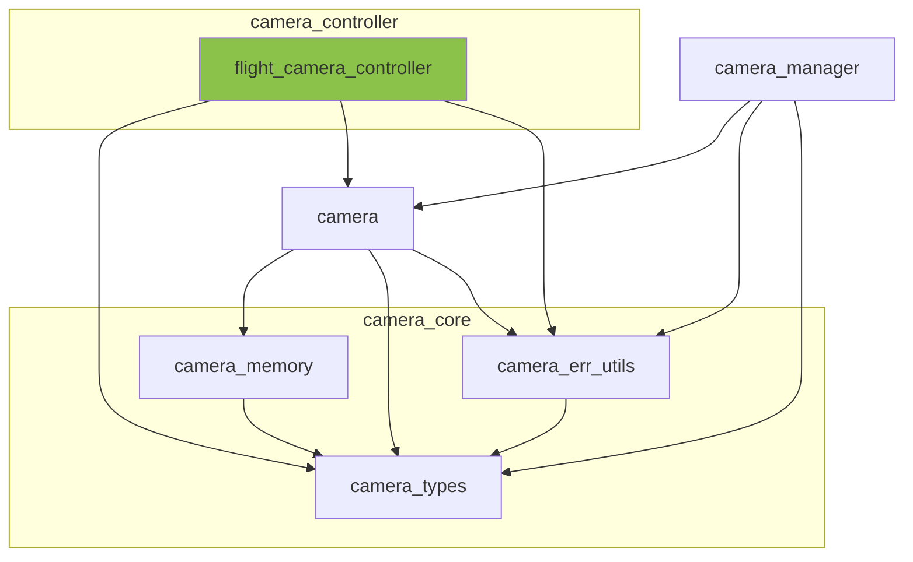

※本記事は [全体イントロダクション](https://zenn.dev/chocolate_pie24/articles/c-glfw-game-engine-introduction)のBook5に対応しています。

実装コードについては、リポジトリのタグv0.1.0-step5を参照してください。

## カメラ制御モジュールの作成

[前回](https://zenn.dev/chocolate_pie24/books/2d_rendering_step5/viewer/step5_3_camera_module)ではカメラの位置、姿勢を管理し、そこから求まる様々な幾何情報を提供するカメラモジュールを作成しました。このカメラモジュールは、カメラの種類に依らず、共通して使用します。

GL Choco Engineでは、様々な動作を行うカメラについて、カメラモジュールは共通して使用し、別途作成する制御モジュールによってカメラの動作の差異を吸収します。今回は、3次元空間内を上下左右前後に自由に移動でき、ヨー角とピッチ角を変更できるフライトカメラの制御モジュールを作成します。このモジュールは、与えられた移動速度・回転速度・経過時間に基づいて camera の位置と姿勢を更新する機能を提供します。

Camera System内の以下のモジュールが今回作成するモジュールです。

## フライトカメラ制御方法(平行移動)

前回作成した[Cameraモジュール](https://zenn.dev/chocolate_pie24/books/2d_rendering_step5/viewer/step5_3_camera_module)は、外部公開APIとして、以下のものを公開しています。

| API名称                        | 役割                                                          |
| ----------------------------- | ------------------------------------------------------------- |
| camera_forward_vector_get     | カメラ前方の正規化されたベクトルを返す                               |
| camera_backward_vector_get    | カメラ後方の正規化されたベクトルを返す                               |
| camera_right_vector_get       | カメラ右方向の正規化されたベクトルを返す                             |
| camera_left_vector_get        | カメラ左方向の正規化されたベクトルを返す                             |
| camera_up_vector_get          | カメラ上方向の正規化されたベクトルを返す                             |
| camera_down_vector_get        | カメラ下方向の正規化されたベクトルを返す                             |

これらのAPIを用いれば、以下の手順で移動後のカメラ座標を簡単に求めることができます。

1. カメラを動かす方向の正規化されたベクトルを取得
2. 取得したベクトルに移動速度、移動時間を掛けて移動量を計算する
3. 現在のカメラ座標を取得
4. 現在のカメラ座標に対して移動量を加算

なお、内部状態はカメラモジュールにて管理し、カメラ制御モジュール自身では管理しません。複数のカメラ制御モジュールを同じcameraに対して差し替え可能にしたいためです。このために、制御モジュールの各APIには、

- カメラ構造体インスタンスへのポインタ
- カメラ移動速度
- カメラ移動時間

を引数に与えます。

| API名称                                 | 役割                      |
| -------------------------------------- | ------------------------- |
| flight_camera_controller_move_forward  | フライトカメラを前方に動かす   |
| flight_camera_controller_move_backward | フライトカメラを後方に動かす   |
| flight_camera_controller_move_right    | フライトカメラを右方向に動かす |
| flight_camera_controller_move_left     | フライトカメラを左方向に動かす |
| flight_camera_controller_move_up       | フライトカメラを上方向に動かす |
| flight_camera_controller_move_down     | フライトカメラを下方向に動かす |

## フライトカメラ制御方法(回転)

回転については平行移動よりも簡単です。与えられた角速度[deg/sec]と回転時間を掛けたものを現在のカメラ姿勢に加算するだけで求まります。

なお、カメラの姿勢をオイラー角で保存しているため、特異点となる姿勢では回転の一部が効きにくくなる可能性があります。この問題については、実際の挙動を確認しながら対策したいと考えています。現状の三角形描画では確認が難しいため、今後 3D モデル描画機能を追加した段階で検証し、必要に応じて対策を行います。

回転するためのAPIは以下です。平行移動と同様、

- カメラ構造体インスタンスへのポインタ
- 回転角速度
- 回転時間

を引数に与えます。

| API名称                                  | 役割                             |
| ---------------------------------------- | ------------------------------- |
| flight_camera_controller_rot_pitch_plus  | フライトカメラをピッチ+方向に回転する |
| flight_camera_controller_rot_pitch_minus | フライトカメラをピッチ-方向に回転する |
| flight_camera_controller_rot_yaw_plus    | フライトカメラをヨー+方向に回転する   |
| flight_camera_controller_rot_yaw_minus   | フライトカメラをヨー-方向に回転する   |

以上で、カメラモジュールとカメラ制御モジュールが完成しました。後は以下のものを作ればCamera Systemは完成です。

- 複数のカメラを保持するcamera manager
- 既存のキーボードイベントシステムとカメラ制御モジュールの接続

次はcamera managerについて解説します。
