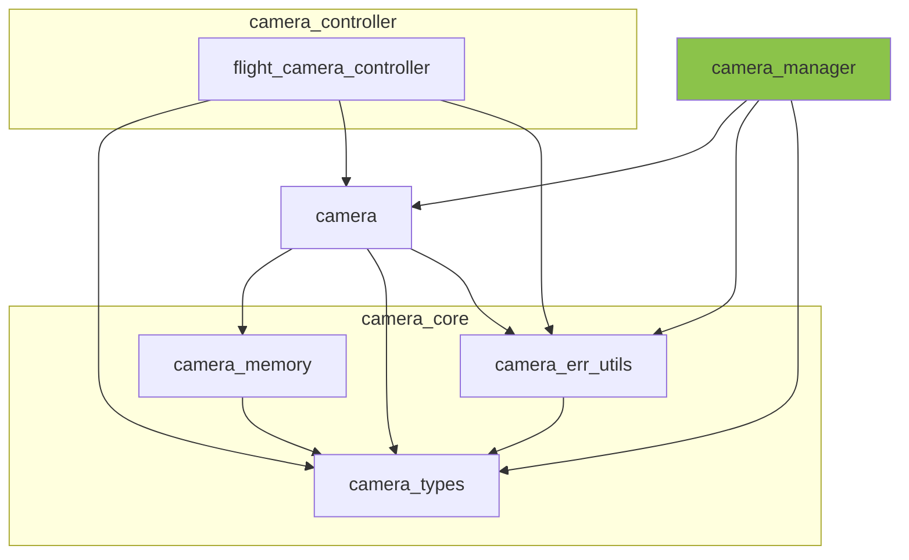

※本記事は [全体イントロダクション](https://zenn.dev/chocolate_pie24/articles/c-glfw-game-engine-introduction)のBook5に対応しています。

実装コードについては、リポジトリのタグv0.1.0-step5を参照してください。

## カメラ管理モジュールの作成

前回までで、カメラモジュール、カメラ制御モジュールを作ってきました。今回は、Camera Systemで作成する最後のモジュールとして、カメラ管理モジュールを作成します。
モジュールに求められる役割は以下のものです。

- 複数カメラを管理可能
- 指定した識別子を用いてカメラ構造体インスタンスを取得可能
- エンジンの起動時に立ち上がり、エンジンの終了時に破棄される



## camera_managerデータ構造

camera_managerは、内部状態を管理する以下のような構造体を持ちます。

```c
/**
 * @brief camera_manager内部状態管理構造体
 *
 */
struct camera_manager {
    int16_t max_camera_count;   /**< camera_managerに登録可能なカメラ数上限値 */
    camera_t** camera_array;    /**< カメラ構造体インスタンス格納配列 */
};
```

camera_arrayにはカメラ構造体インスタンスへのポインタを格納します。カメラ構造体インスタンスの生成・破棄は、camera_managerの責務とします。

現状ではcamera_arrayの配列サイズはシステムの初期化時に指定する仕様にしています。
当面はこのままで行きますが、将来的にはC++のstd::vectorのような動的配列にするかもしれません。
このcamera_array配列のインデックスはカメラ識別子としても使用することになります。

なお、カメラ識別子は、無効な識別子(INVALID_CAMERA_ID)として-1を使います。このため、カメラ識別子のデータ型は符号ありの16bit整数を使用します。
これに合わせる形で当面はmax_camera_countのデータ型をint16_tとしています。GL Choco Engineの規模感として、符号なしにするほどの必要性は感じなかったためこうしています。

## 外部公開API

camera_managerは外部に公開するAPIとして以下のものを持ちます。
カメラ構造体インスタンスの取得の際の識別子は、毎回文字列のイコール判定をするのは無駄が多いため、整数の識別子でも取得可能にしてあります。
整数の識別子はカメラ構造体インスタンスのシステムへの登録時に、取得するようにします。

| API名称                            | 役割                                                         |
| --------------------------------- | ------------------------------------------------------------ |
| camera_manager_initialize         | camera_managerのメモリを確保し、初期化する                       |
| camera_manager_deinitialize       | camera_managerが管理するカメラ構造体インスタンスを全て削除する       |
| camera_manager_register           | カメラ名称をもとにカメラを生成し、camera_managerに追加する         |
| camera_manager_unregister         | カメラIDを使用して対応するカメラをcamera_managerから削除する        |
| camera_manager_unregister_by_name | カメラ名称を使用して対応するカメラをcamera_managerから削除する       |
| camera_manager_camera_id_get      | カメラ名称に対応するカメラ識別子をcamera_managerから取得する         |
| camera_manager_camera_get         | カメラIDに対応するカメラ構造体インスタンスへのポインタを取得する       |
| camera_manager_camera_get_by_name | カメラ名称に対応するカメラ構造体インスタンスへのポインタを取得する      |

camera_manager は単体オブジェクトというより、エンジン起動時に初期化され終了時に破棄される長寿命サービスであるため、create/destroyではなくinitialize/deinitializeという命名にしています。
また、このようなライフサイクルを持つため、リソース確保にはchoco_memoryではなくlinear_allocatorを使用します。
