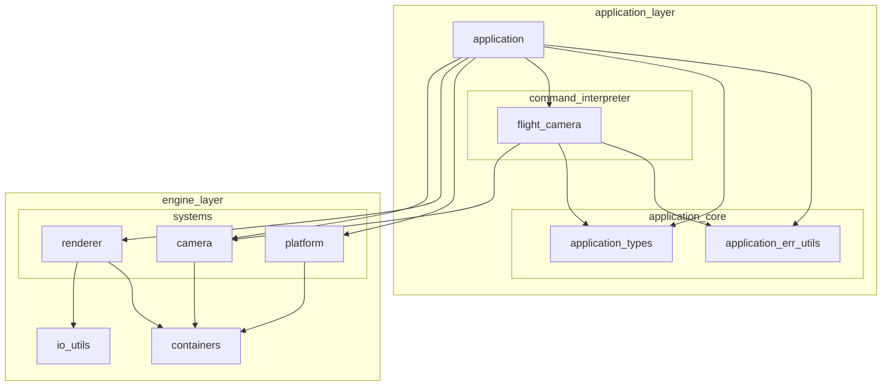

※本記事は [全体イントロダクション](https://zenn.dev/chocolate_pie24/articles/c-glfw-game-engine-introduction)のBook5に対応しています。

実装コードについては、リポジトリのタグv0.1.0-step5を参照してください。

## イベントシステムとの接続

これまでの内容で、カメラシステムとして以下を作成してきました。

- カメラモジュール
- カメラ制御モジュール
- カメラ管理モジュール

これでカメラ関連は全て実装が完了したのですが、まだイベントシステムとの接続を行っていないため、カメラを動作させることはできません。
今回は、イベントシステムとの接続を行い、キーボードによるカメラ操作を可能にしていきます。

## カメラ操作キーバインド

現状作成してあるフライトカメラですが、操作はキーボードにより行います。キーとカメラ操作の対応は以下のようにします。

| キー   | カメラ操作            |
| ----- | ------------------- |
| w     | カメラ前進            |
| s     | カメラ後進            |
| d     | カメラ右移動           |
| a     | カメラ左移動           |
| e     | カメラ上方向移動       |
| q     | カメラ下方向移動       |
| 上矢印 | カメラピッチ方向(+)回転 |
| 下矢印 | カメラピッチ方向(-)回転 |
| 左矢印 | カメラヨー方向(+)回転   |
| 右矢印 | カメラヨー方向(-)回転   |

## アーキテクチャ: イベントシステムとの接続

カメラとイベントシステムとの接続を行うためのモジュールですが、GL Choco Engineではapplicationレイヤーで行うことにします。

エンジンが保有するカメラ機能のみであればエンジン側にキーバインド登録機能等を持たせても良いです。
ただ、将来的にはGL Choco Engineではロボットの描画や、制御との連携を行っていきます。
この場合、ロボットというのはエンジン側では扱うべきではない概念になってきます。そのため、ロボット制御に関連するモジュールはapplicationレイヤーに配置されます。
それに合わせる形でカメラについてもエンジン側との接続機能はapplicationレイヤーに配置することにしました。

追加するモジュールはapplication/command_interpreter/flight_cameraで、以下のように配置します。
このモジュールは、キーバインド設定を初期化し、キーボードイベントをフライトカメラ制御APIの呼び出しへ変換するためのものです。



## データ構造: command_interpreter/flight_camera

イベントシステムとフライトカメラ制御を接続するため、以下の構造体を作成しました。

include/application/command_interpreter/flight_camera.h

```c
/**
 * @brief フライトカメラ制御コマンドリスト
 *
 */
typedef enum {
    FLIGHT_CAMERA_COMMAND_MOVE_FORWARD = 0,   /**< フライトカメラ制御コマンド: 前方移動 */
    FLIGHT_CAMERA_COMMAND_MOVE_BACKWARD,      /**< フライトカメラ制御コマンド: 後方移動 */
    FLIGHT_CAMERA_COMMAND_MOVE_RIGHT,         /**< フライトカメラ制御コマンド: 右方向移動 */
    FLIGHT_CAMERA_COMMAND_MOVE_LEFT,          /**< フライトカメラ制御コマンド: 左方向移動 */
    FLIGHT_CAMERA_COMMAND_MOVE_UP,            /**< フライトカメラ制御コマンド: 上方向移動 */
    FLIGHT_CAMERA_COMMAND_MOVE_DOWN,          /**< フライトカメラ制御コマンド: 下方向移動 */
    FLIGHT_CAMERA_COMMAND_ROT_PITCH_PLUS,     /**< フライトカメラ制御コマンド: ピッチ+方向回転 */
    FLIGHT_CAMERA_COMMAND_ROT_PITCH_MINUS,    /**< フライトカメラ制御コマンド: ピッチ-方向回転 */
    FLIGHT_CAMERA_COMMAND_ROT_YAW_PLUS,       /**< フライトカメラ制御コマンド: ヨー+方向回転 */
    FLIGHT_CAMERA_COMMAND_ROT_YAW_MINUS,      /**< フライトカメラ制御コマンド: ヨー-方向回転 */
    FLIGHT_CAMERA_COMMAND_MAX,                /**< フライトカメラ制御コマンド数 */
} command_list_flight_camera_t;

/**
 * @brief フライトカメラ制御コマンド実行用構造体
 *
 */
typedef struct command_status_flight_camera {
    command_list_flight_camera_t command;   /**< フライトカメラ制御コマンド */
    keycode_t keybind;                      /**< 制御コマンドに割り当てられたキーバインド */
    bool status;                            /**< 制御コマンド実行要求有無(true: 実行要求あり / false: 実行要求なし) */
    camera_result_t (*pfn_command_executor)(float speed_, float delta_time_, camera_t* camera_);  /**< コマンド実行関数 */
} command_status_flight_camera_t;
```

command_status_flight_camera_tでは、フライトカメラの動作に対応するキー設定の他に、pfn_command_executorを持たせています。
pfn_command_executorにはengine/camera_system/camera_controller/flight_camera_controllerが公開している制御関数を紐付けることで、各キー操作に応じてカメラ制御関数が動くようにします。
command_status_flight_camera_t構造体インスタンスは配列としてapplication.cが保有し、モジュールの初期化関数内で以下のように初期化します。

```c
    // カメラ右移動コマンド(キーバインド: KEY_D)
    command_status_[FLIGHT_CAMERA_COMMAND_MOVE_RIGHT].command = FLIGHT_CAMERA_COMMAND_MOVE_RIGHT;
    command_status_[FLIGHT_CAMERA_COMMAND_MOVE_RIGHT].keybind = KEY_D;
    command_status_[FLIGHT_CAMERA_COMMAND_MOVE_RIGHT].status = false;
    command_status_[FLIGHT_CAMERA_COMMAND_MOVE_RIGHT].pfn_command_executor = flight_camera_controller_move_right;
```

command_interpreter/flight_cameraは、以下のAPIを提供します。

| API名称                           | 役割                                                                                      |
| -------------------------------- | ----------------------------------------------------------------------------------------- |
| flight_camera_command_initialize | フライトカメラ制御コマンド実行用構造体インスタンス配列を初期化する                                   |
| flight_camera_command_update     | キーボードイベント1件を受け取り、イベントに応じて制御コマンド実行用構造体インスタンスのフィールドを更新する |
| flight_camera_command_execute    | フライトカメラ制御コマンド実行用構造体インスタンス配列のフィールド状態に基づいて制御を実行する            |

## application.cでの使用方法

app_state_tにフライトカメラとイベントシステムとの接続構造体インスタンス配列を追加します。

```c
typedef struct app_state {
    // 省略

    command_status_flight_camera_t flight_camera_commands[FLIGHT_CAMERA_COMMAND_MAX];

    // 省略
} app_state_t;
```

app_state_updateで以下のようにしてキーボード操作に応じて構造体フィールドを更新します。

```c
    // keyboard events.
    while(!ring_queue_empty(s_app_state->keyboard_event_queue)) {
        keyboard_event_t event;
        ring_queue_result_t ret_ring = ring_queue_pop(sizeof(keyboard_event_t), alignof(keyboard_event_t), s_app_state->keyboard_event_queue, &event);
        if(RING_QUEUE_SUCCESS != ret_ring) {
            ret = app_rslt_convert_ring_queue(ret_ring);
            WARN_MESSAGE("app_state_update(%s) - Failed to pop keyboard event.", app_rslt_to_str(ret));
            goto cleanup;
        } else {
            if(KEY_M == event.key && !event.event_args.pressed) {
                memory_system_report();
            } else {
                ret = flight_camera_command_update(&event, s_app_state->flight_camera_commands);
                if(APPLICATION_SUCCESS != ret) {
                    WARN_MESSAGE("app_state_update(%s) - Failed to update flight camera command.", app_rslt_to_str(ret));
                    goto cleanup;
                }
            }
        }
    }
```

最後にapp_state_dispatchでエンジン内部状態を更新させます。これでフライトカメラがキー操作により動き、それに応じて画面の三角形の表示も変わるようになります。
なお、カメラの移動時間を現状では1.0固定にしていますが、将来的にはapplication_runのループの実行時間に応じて変化させるようにしていきます。

```c
    ret =  flight_camera_command_execute(0.1f, 1.0f, s_app_state->flight_camera_commands, s_app_state->active_camera, &s_app_state->view_dirty);
    if(APPLICATION_SUCCESS != ret) {
        ERROR_MESSAGE("app_state_dispatch(%s) - Failed to execute flight camera command.", app_rslt_to_str(ret));
        goto cleanup;
    }
```
