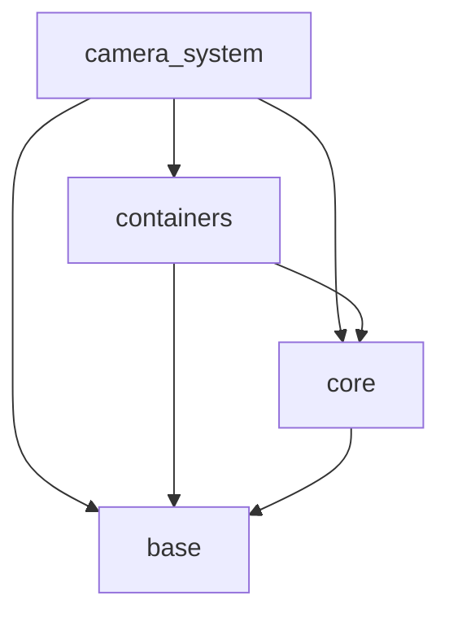
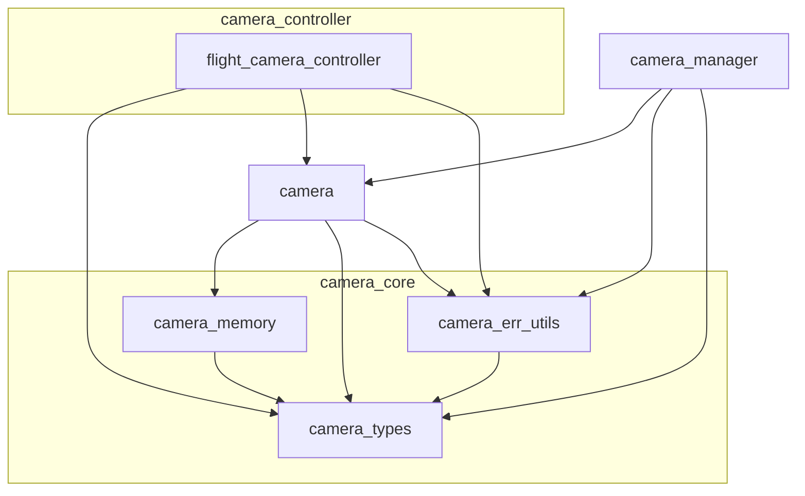

@page arch_camera_system_en Camera System Architecture(English)

# Camera System Architecture

## Purpose and Positioning

The `Camera System` is a subsystem that provides camera state management and control functionality in three-dimensional space.
This system provides upper layers with a unified API for creating, retrieving, and deleting cameras, as well as for handling position, orientation, view matrices, and projection matrices.
Control functionality for each camera type is also included in the responsibilities of this system.
As a result, upper layers can use camera functionality without being aware of the details of individual camera implementations or internal memory management.

## Dependency on External Layers

The `Camera System` internally depends on the following layers.

## Internal Structure of the Camera System

## Roles and Characteristics of the Included Modules

The roles and characteristics of the modules included in the `Camera System` are as follows.

| Module                   | Role                                                                                                                                                              | Characteristics                                                                                                              |
| ------------------------ | ----------------------------------------------------------------------------------------------------------------------------------------------------------------- | ---------------------------------------------------------------------------------------------------------------------------- |
| flight_camera_controller | Provides control APIs for movement and orientation changes of a flight camera (*).                                                                                | Provides control APIs only and does not hold internal state. Performs time-delta-based operations on `camera`.               |
| camera_manager           | Manages camera instances and provides APIs for registration, deletion, and retrieval.                                                                             | A management module that remains resident from system startup to shutdown. Resources are allocated using `Linear Allocator`. |
| camera                   | Holds the camera name, position, orientation, and various parameters, and provides APIs for retrieving view matrices, projection matrices, and direction vectors. | A stateful core module. Instances are created as needed, and resources are allocated using `Choco Memory`.                   |
| camera_memory            | Provides wrapper APIs for `Choco Memory`, allowing memory tags and result codes to be handled in a form suitable for the `Camera System`.                         | A helper module for handling dynamic memory allocation within the `Camera System` in a unified manner.                       |
| camera_err_utils         | Provides APIs for converting the result codes of external modules into `Camera System` result codes, as well as APIs for converting result codes into strings.    | A helper module that absorbs dependencies on external modules and unifies error representation within the `Camera System`.   |
| camera_types             | Provides data types, constants, and result codes used throughout the `Camera System`.                                                                             | A common foundational module for the `Camera System`. |

(*) A flight camera is a camera that can move freely up, down, left, and right in three-dimensional space and can change its own orientation (Pitch / Yaw).

## Details of `camera_manager`

`camera_manager` is a module that centrally manages multiple camera instances and has the following constraints and characteristics.

- The size of the array used to store camera instances is specified when `camera_manager_initialize()` is executed.
- Expanding or shrinking the array size is not supported (*1).
- Registration of cameras with duplicate names is not allowed.
- `INVALID_CAMERA_ID` is provided as an invalid camera identifier.
- Cameras can be retrieved or deleted using either the camera identifier or the camera name.
- `camera_manager` owns the managed `camera` instances and destroys all managed instances at shutdown.
- `camera_manager` itself and its management array are treated as long-lived resources and are allocated using `Linear Allocator`.

(*1) The array size may be changed in the future to a variable-length configuration using `dynamic_array`.

## Camera Coordinate System

The cameras used in GLCE follow the coordinate system described below.

- Camera forward direction: negative Z-axis
- Coordinate system: right-handed coordinate system

## Policy for Using Matrices and Vectors

In GLCE, matrices and vectors are handled as follows.

- Matrices: stored in row-major order
- Vectors: treated as column vectors, and matrices are multiplied from the left side of the vector
