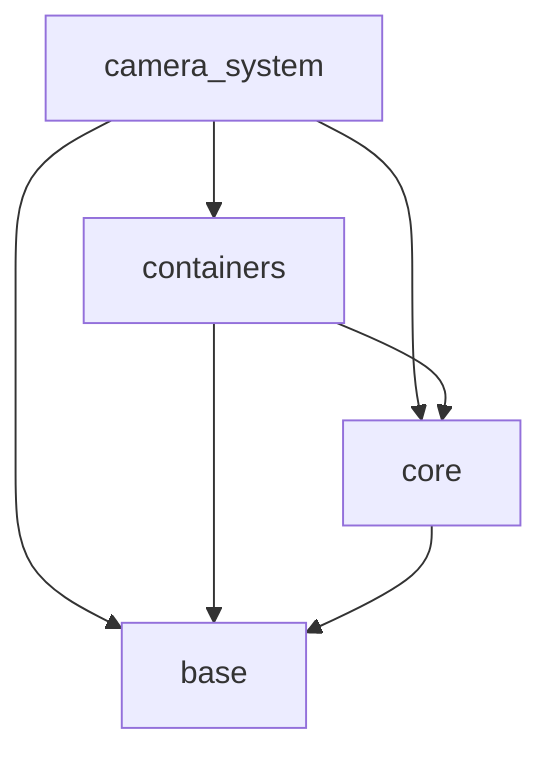
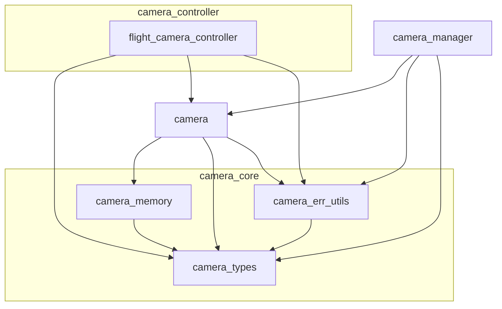

@page arch_camera_system_ja Camera System Architecture(Japanese)

# Camera System architecture

## 目的と位置づけ

`Camera System`は、3次元空間におけるカメラの状態管理と制御機能を提供するサブシステムである。
本システムは、カメラの生成・取得・削除、および位置・姿勢・ビュー行列・プロジェクション行列の取り扱いを、統一されたAPIとして上位レイヤーへ提供する。
また、カメラ種別ごとの制御機能も本システムの責務に含まれる。
これにより、上位レイヤーは個々のカメラ実装や内部メモリ管理の詳細を意識せず、カメラ機能を利用できる。

## 外部レイヤーとの依存関係

`Camera System`は内部で以下のレイヤーに依存している。

## Camera System内部詳細

## 保有モジュールの役割と性質

`Camera System`が保有する各モジュールの役割と性質は以下の通り。

| モジュール                 | 役割                                                                                                          | 性質                                                                                    |
| ------------------------ | ------------------------------------------------------------------------------------------------------------- | -------------------------------------------------------------------------------------- |
| flight_camera_controller | フライトカメラ(*)に対する移動および姿勢変更の制御APIを提供する                                                          | 制御用APIのみを提供し、内部状態を持たない。`camera`に対して時間差分ベースの操作を行う              |
| camera_manager           | カメラインスタンスを管理し、登録 / 削除 / 取得APIを提供する                                                            | システムの起動時から終了時まで常駐する管理モジュール。リソースは`Linear Allocator`により取得する    |
| camera                   | カメラの名称、位置、姿勢、各種パラメータを保持し、ビュー行列 / プロジェクション行列 / 方向ベクトルの取得APIを提供する            | 状態を持つ中核モジュール。インスタンスは必要に応じて生成され、リソースは`Choco Memory`により取得する |
| camera_memory            | `Choco Memory`のラッパーAPIを提供し、メモリータグおよび実行結果コードを`Camera System`に適した形で扱えるようにする          | `Camera System`内の動的メモリ確保を統一的に扱うための補助モジュール                             |
| camera_err_utils         | 各外部モジュールの実行結果を`Camera System`用に変換するAPIと、実行結果コードの文字列変換APIを提供する                       | 外部モジュール依存を吸収し、`Camera System`内のエラー表現を統一するための補助モジュール            |
| camera_types             | `Camera System`全体で使用されるデータ型、定数、実行結果コードを提供する                                                 | `Camera System`内の共通基盤となるモジュール                                                |

(*)フライトカメラとは、3次元空間を上下、左右に移動し、カメラ自身の姿勢（Pitch / Yaw）を変更できるカメラである。

## camera_manager詳細

`camera_manager`は、複数のカメラインスタンスを一元管理するモジュールであり、以下の制約および性質を持つ。

- カメラインスタンスを格納する配列サイズは`camera_manager_initialize()`実行時に指定する
- 配列サイズの拡張 / 縮小は不可(*1)
- 重複した名称のカメラの登録は不可
- 無効なカメラ識別子として`INVALID_CAMERA_ID`を提供する
- カメラの取得 / 削除は、カメラ識別子または名称のいずれかを用いて行うことができる
- `camera_manager`は管理対象の`camera`インスタンスを所有し、終了時には管理下のインスタンスを破棄する
- `camera_manager`自身および管理用配列は長寿命リソースとして扱い、`Linear Allocator`により確保する

(*1) 配列サイズは将来的に`dynamic_array`を用いた可変長構成へ変更する可能性がある。

## カメラ座標系

GLCEで使用するカメラは、以下の座標系を使用する

- カメラ前方: Z軸マイナス方向
- 座標系: 右手座標系

## 各種行列、ベクトルの使用方針

GLCEにおいて行列、ベクトルの扱いは、以下のようになっている。

- 行列: 行優先で格納する
- ベクトル: 列ベクトルとして扱い、行列はベクトルに対して左から掛ける
