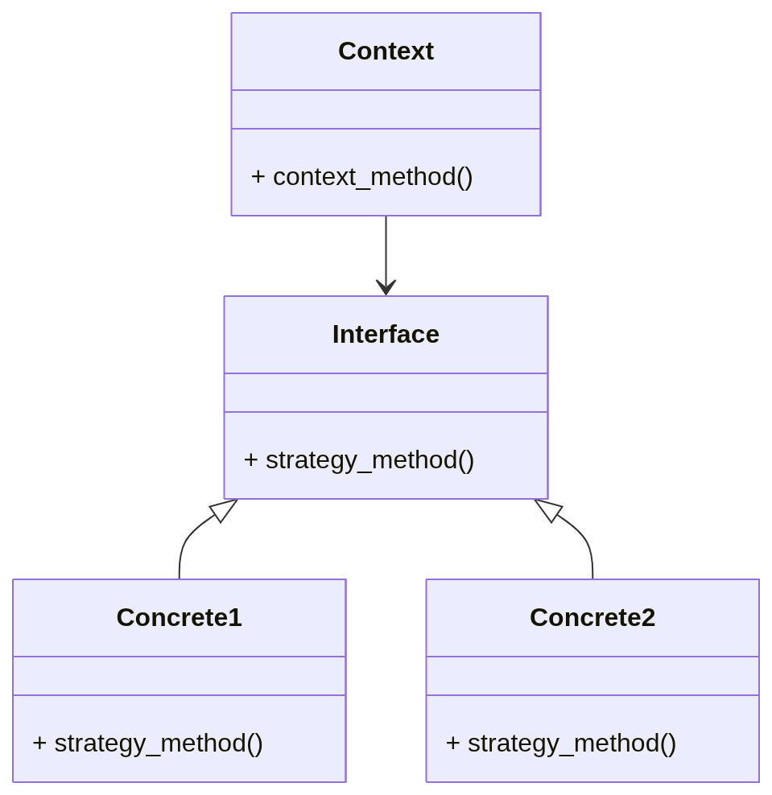
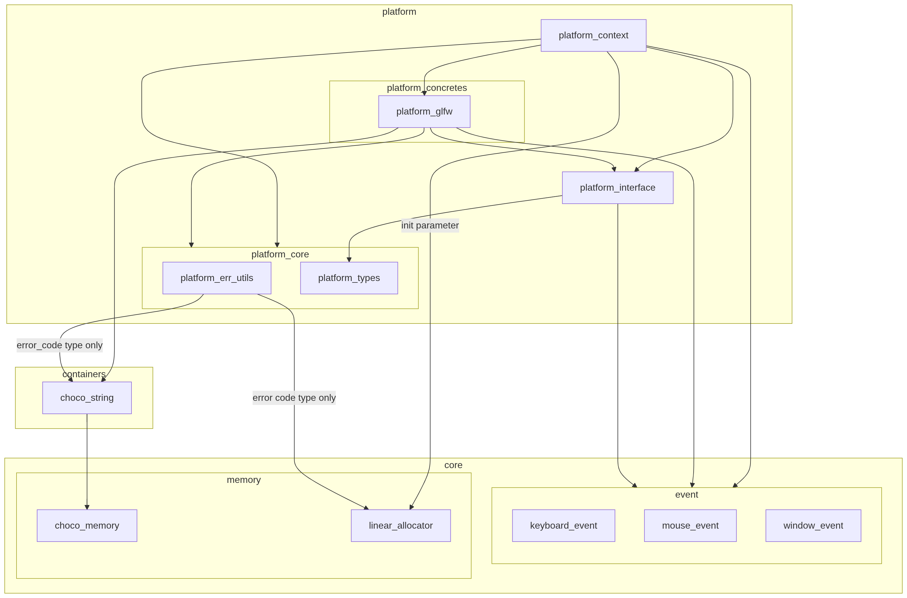

# Platform System Architecture

## Purpose and Scope

`Platform System` is a subsystem that provides a swappable, platform-agnostic interface API so that application developers can build graphics applications without being aware of the underlying platform.

## Platform System Concept

To achieve this goal, `Platform System` applies the object-oriented design pattern **Strategy**.
The Strategy pattern typically has the following structure:

The correspondence between the Strategy objects and GLCE modules is as follows.

| Strategy Object | GLCE Module        | Role                                                                                                                |
| --------------- | ------------------ | ------------------------------------------------------------------------------------------------------------------- |
| Context         | platform_context   | Provides API entry points for the functionality owned by `Platform System` to upper layers                          |
| Interface       | platform_interface | Provides a per-platform swappable virtual function table (vtable) to the Context (holding abstracted platform APIs) |
| Concrete1       | platform_glfw      | Provides the GLFW-based vtable implementation for the Interface and its internal implementation                     |
| Concrete2       | Not implemented    | Added when supported platforms increase                                                                             |

In addition, `Platform System` provides the following modules that support the Strategy-based design.

| Module             | Role                                                                                                                                                                                        |
| ------------------ | ------------------------------------------------------------------------------------------------------------------------------------------------------------------------------------------- |
| platform_err_utils | For all `Platform System` modules, provides (1) conversion from lower-layer result codes to `Platform System` result codes, and (2) conversion of `Platform System` result codes to strings |
| platform_types     | Provides common data types shared across all `Platform System` modules                                                                                                                      |

### Platform Concrete Selection (Current)

Currently, the platform to use is selected by specifying it when creating an instance of `Platform System`.

### Platform Concrete Selection (Future)

With the current specification, all platform concrete implementations must be buildable, which is difficult to achieve. In the future, the system will migrate to a build-option-based approach where the platform is selected via build options.

## Design / Internal Structure / Usage Flow

`Platform Context` exposes `platform_context_t` to upper layers as the structure that manages the internal state of the system (only the type name is exposed; the internal structure is not public).
An instance of `platform_context_t` is held by the application-layer internal state structure `app_state_t` under the instance name `platform_context`.
The application layer is also responsible for allocating and releasing the resources of the `platform_context` instance.

`Platform System` is brought up at system startup and stays resident until system shutdown.
Therefore, since it does not release resources during execution, the memory resources for `Platform System` use the Linear Allocator.
The Linear Allocator held by `app_state_t` as `linear_alloc` serves as the subsystem allocator, and `Platform System` uses it.

The usage flow is as follows.

| Phase               | Operation                                 | Method                                                                                                                       |
| ------------------- | ----------------------------------------- | ---------------------------------------------------------------------------------------------------------------------------- |
| Initialization      | Allocate resources for `platform_context` | Call `platform_initialize()` in `application_create()`                                                                       |
| Initialization      | Create the rendering window               | Call `platform_window_create()` in `application_create()` (planned to be moved after `renderer_frontend` is created)         |
| Shutdown            | Release resources for `platform_context`  | Call `platform_destroy()` in `application_destroy()`                                                                         |
| Runtime (per-frame) | Pump events from the Platform layer       | Call `platform_pump_messages()` in `application_run()` (per-frame)                                                           |
| Runtime (per-frame) | Swap buffers via double buffering         | Call `platform_swap_buffers()` in `application_run()` (per-frame) (planned to be moved after `renderer_frontend` is created) |

For event pumping via `platform_pump_messages()`, refer to the [Event System Guide](../../guide/event_system/event_en.md).

## Currently Unsupported Items

The following items are not supported at this time. They may be supported as GLCE evolves, as needed.

- Thread-safe API support
- Runtime switching of the active platform

## Configuration

No configuration options are available at this time.

## References

When adding a supported platform, refer to the [Platform System Guide](../../guide/platform_system/adding_concretes_en.md).
