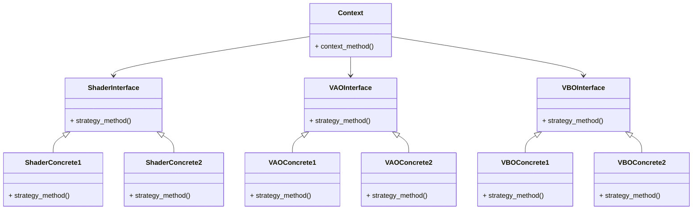
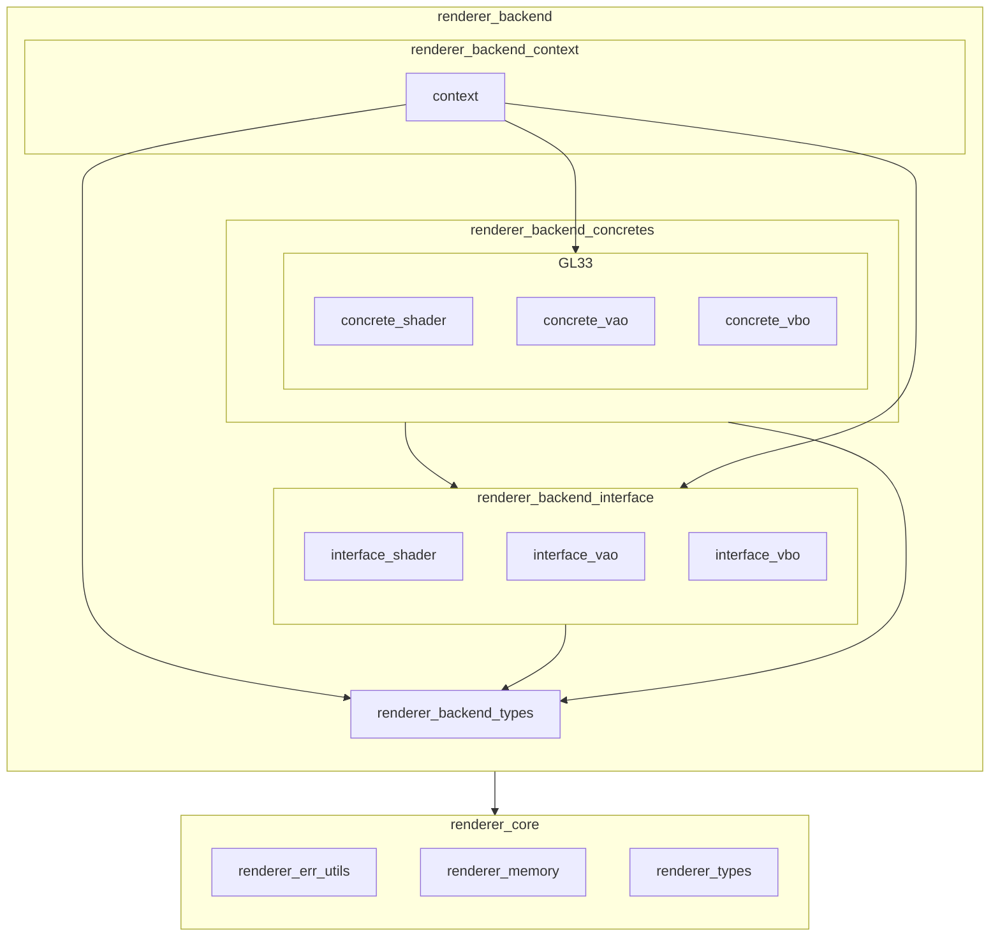

# Renderer System architecture

## Purpose and positioning

`Renderer System` is a subsystem that provides a swappable, graphics-API-agnostic interface so that application developers can build graphics applications without being aware of the underlying graphics API.

`Renderer System` consists of `Renderer Frontend` and `Renderer Backend`. However, since `Renderer Frontend` is not implemented in GLCE at this time, this document focuses only on the architecture of `Renderer Backend`.

## Renderer System concept

To achieve its goal, `Renderer System` applies the object-oriented design pattern *Strategy*.

The functionality provided by `Renderer Backend` is broadly categorized into three groups: VAO, VBO, and Shader. For each group, an Interface is defined to absorb differences between graphics APIs.
On the other hand, the entry point for upper layers (e.g., the application layer) to use `Renderer Backend` is kept simple, so only one Context is used.

VAO, VBO, and Shader are assumed to use the same graphics API and are selected as a set (mixing different APIs is not assumed).

Based on these assumptions, the Strategy pattern has the following structure.

The correspondence between the Strategy objects and GLCE modules is as follows:

| Strategy Object | GLCE Module                                     | Role                                                                                                                                      |
| --------------- | ----------------------------------------------- | ----------------------------------------------------------------------------------------------------------------------------------------- |
| Context(*1)     | renderer_backend_context/context                | Provides the API entry point for initializing and shutting down the `Renderer Backend` among the features owned by `Renderer Backend`.    |
|                 | renderer_backend_context/context_shader         | Provides the API entry point for `Shader`-related functionality among the features owned by `Renderer Backend`.                           |
|                 | renderer_backend_context/context_vao            | Provides the API entry point for `VAO`-related functionality among the features owned by `Renderer Backend`.                              |
|                 | renderer_backend_context/context_vbo            | Provides the API entry point for `VBO`-related functionality among the features owned by `Renderer Backend`.                              |
| ShaderInterface | renderer_backend_interface/interface_shader     | Provides a graphics-API-swappable virtual function table for Shader-related functionality (an API that abstracts Shader features) to Context. |
| VAOInterface    | renderer_backend_interface/interface_vao        | Provides a graphics-API-swappable virtual function table for VAO-related functionality (an API that abstracts VAO features) to Context.      |
| VBOInterface    | renderer_backend_interface/interface_vbo        | Provides a graphics-API-swappable virtual function table for VBO-related functionality (an API that abstracts VBO features) to Context.      |
| ShaderConcrete1 | renderer_backend_concretes/gl33/concrete_shader | Provides an OpenGL 3.3 implementation vtable and its internal implementation for the Interface.                                           |
| VAOConcrete1    | renderer_backend_concretes/gl33/concrete_vao    | Provides an OpenGL 3.3 implementation vtable and its internal implementation for the Interface.                                           |
| VBOConcrete1    | renderer_backend_concretes/gl33/concrete_vbo    | Provides an OpenGL 3.3 implementation vtable and its internal implementation for the Interface.                                           |
| ShaderConcrete2 | Not implemented                                 | Will be added when support for additional graphics APIs is introduced.                                                                    |
| VAOConcrete2    | Not implemented                                 | Will be added when support for additional graphics APIs is introduced.                                                                    |
| VBOConcrete2    | Not implemented                                 | Will be added when support for additional graphics APIs is introduced.                                                                    |

*1: The Context is split into `context`, `context_shader`, `context_vao`, and `context_vbo` header files to improve readability of the public API definitions, but all implementations are located in `renderer_backend_context/context.c`.

In addition, the `Renderer System` provides the following modules that support the Strategy-based design:

| Module                 | Role                                                                                                                                                                                                 |
| ---------------------- | ---------------------------------------------------------------------------------------------------------------------------------------------------------------------------------------------------- |
| renderer_err_utils     | Provides, for all modules in the `Renderer System`, functionality to convert lower-layer result codes into `Renderer System` result codes, and to convert `Renderer System` result codes into strings. |
| renderer_memory        | For all modules in the `Renderer System` that use the `choco_memory` module, provides wrapper APIs for memory allocation and deallocation to prevent mistakes in memory-tag selection, and enables using `Renderer System` error codes. |
| renderer_types         | Provides common data types shared across all modules in the `Renderer System`.                                                                                                                       |
| renderer_backend_types | Provides common data types shared across all modules in the `Renderer Backend`.                                                                                                                      |

The module dependencies within the `Renderer System`, as well as its dependencies on lower-layer modules, are shown below (the core and base layers are omitted because the diagram would otherwise become too complex).
Note that the dependency of `renderer_backend_context` on `gl33` is used only to obtain the virtual function table, and does not depend on concrete API implementations.

### Selecting Concretes (Shader, VAO, VBO) (Current)

Currently, the graphics API to be used is selected by specifying it when creating an instance of the `Renderer System`.

### Selecting Concretes (Shader, VAO, VBO) (Future)

With the current design, it would be required that the internal implementations for all supported graphics APIs can be built, which is difficult to achieve in practice. In the future, the selection will be moved to build-time, by specifying the target graphics API via build options.

## Mechanism / Internal Structure / Usage Flow

The `Renderer Backend` exposes the following structs to the upper layers as containers for managing internal system state (only the type names are public; the internal layouts are opaque):

- renderer_backend_context_t
- renderer_backend_shader_t
- renderer_backend_vao_t
- renderer_backend_vbo_t

Instances of these structs are owned by `app_state_t`, the internal state management struct in the application layer, under the instance names `renderer_backend_context`, `ui_shader`, `ui_vao`, and `ui_vbo`.

As 3D rendering features and other capabilities are added in the future, the number of shader/VAO/VBO instances will increase. The memory lifecycle, allocator to be used, and the characteristics of each instance are as follows:

| Instance                 | Memory lifecycle                                             | Allocator        | Characteristics                                                   |
| ------------------------ | ------------------------------------------------------------ | ---------------- | ---------------------------------------------------------------- |
| renderer_backend_context | Allocated at startup and freed at shutdown                    | Linear Allocator | Only one instance exists in the engine                           |
| ui_shader                | Allocated and freed at runtime while the engine is running    | choco_memory     | A UI rendering shader program; only one instance exists in the engine |
| ui_vao                   | Allocated and freed at runtime while the engine is running    | choco_memory     | VAO for UI rendering (*1)                                        |
| ui_vbo                   | Allocated and freed at runtime while the engine is running    | choco_memory     | VBO for UI rendering (*2)                                        |

*1: It is not decided yet whether VAO instances are owned per UI geometry or per UI rendering shader.
*2: It is not decided yet whether VBO instances are owned per UI geometry or per UI rendering shader.

The Linear Allocator used to allocate `renderer_backend_context` is `linear_alloc` owned by `app_state_t`, which serves as the subsystem allocator.

The detailed usage flow is not described at this time, because it will change significantly as more shader types are added and `Renderer Frontend` is introduced.

## Current Unsupported Items

At present, the following are not supported. They may be implemented as needed as GLCE evolves.

- Providing thread-safe APIs
- Switching the graphics API at runtime
- Mixing multiple graphics APIs

## Configuration

There are no configuration options at this time.

## References

To add support for a new graphics API, see [Renderer System Guide](../../guide/renderer/adding_concretes_en.md).
