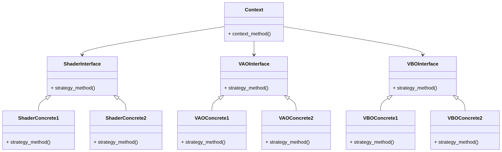

# Renderer System architecture

## 目的と位置づけ

`Renderer System`は、アプリケーション開発者がグラフィックスAPIを意識せず、グラフィックスアプリケーションを構築できるように、
差し替え可能でグラフィックスAPI非依存のインターフェイスAPIを提供するサブシステムである。

`Renderer System`は`Renderer Frontend`と`Renderer Backend`で構成されるが、
GLCEでは現状では`Renderer Frontend`は未実装であるため、本ドキュメントでは`Renderer Backend`のアーキテクチャに絞った解説を行う。

## Renderer Systemコンセプト

`Renderer System`は、目的を達成するために、オブジェクト指向のデザインパターンであるStrategyを適用した。

`Renderer Backend`が提供する機能を大別してVAO, VBO, Shaderの3つに分類し、それぞれグラフィックスAPIの差異を吸収するためのInterfaceを設ける。
一方、アプリケーションレイヤー等の上位レイヤーが`Renderer Backend`の機能を使用するための窓口はシンプルにしたかったため、Contextは1個にした。
なお、VAO, VBO, Shaderは、同一のグラフィックスAPIを使用することを前提としており、セットで選択する(混在は想定していない)。

この前提を踏まえたStrategyパターンは以下のような構造を取る。

GLCEにおける各モジュールと、Strategyのオブジェクトの対応は以下のようになっている。

| Strategy Object | GLCE Module                                     | 役割                                                                                                       |
| --------------- | ----------------------------------------------- | --------------------------------------------------------------------------------------------------------- |
| Context(*1)     | renderer_backend_context/context                | 上位層に`Renderer Backend`が保有する機能のうち、`Renderer Backend`の初期化、終了のAPI窓口を提供する                 |
|                 | renderer_backend_context/context_shader         | 上位層に`Renderer Backend`が保有する機能のうち、`Shader`関連機能のAPI窓口を提供する                                |
|                 | renderer_backend_context/context_vao            | 上位層に`Renderer Backend`が保有する機能のうち、`VAO`関連機能のAPI窓口を提供する                                   |
|                 | renderer_backend_context/context_vbo            | 上位層に`Renderer Backend`が保有する機能のうち、`VBO`関連機能のAPI窓口を提供する                                   |
| ShaderInterface | renderer_backend_interface/interface_shader     | ContextにグラフィックスAPIごとに差し替え可能なShader関連機能の仮想関数テーブル(Shader機能を抽象化したAPIを保持)を提供する |
| VAOInterface    | renderer_backend_interface/interface_vao        | ContextにグラフィックスAPIごとに差し替え可能なVAO関連機能の仮想関数テーブル(VAO機能を抽象化したAPIを保持)を提供する       |
| VBOInterface    | renderer_backend_interface/interface_vbo        | ContextにグラフィックスAPIごとに差し替え可能なVBO関連機能の仮想関数テーブル(VBO機能を抽象化したAPIを保持)を提供する       |
| ShaderConcrete1 | renderer_backend_concretes/gl33/concrete_shader | InterfaceにOpenGL3.3実装版vtableと、その内部実装を提供する                                                      |
| VAOConcrete1    | renderer_backend_concretes/gl33/concrete_vao    | InterfaceにOpenGL3.3実装版vtableと、その内部実装を提供する                                                      |
| VBOConcrete1    | renderer_backend_concretes/gl33/concrete_vbo    | InterfaceにOpenGL3.3実装版vtableと、その内部実装を提供する                                                      |
| ShaderConcrete2 | Not implemented                                 | 対応グラフィックスAPIが増えた際に追加する                                                                        |
| VAOConcrete2    | Not implemented                                 | 対応グラフィックスAPIが増えた際に追加する                                                                        |
| VBOConcrete2    | Not implemented                                 | 対応グラフィックスAPIが増えた際に追加する                                                                        |

*1: Contextは、外部公開API定義用ヘッダを公開APIの見通しを良くするためcontext, context_shader, context_vao, context_vboに分割しているが、実装は全てrenderer_backend_context/context.cに記載している。

その他、`Renderer System`では、Strategyを支えるモジュールとして、下記を提供している。

| Module                 | 役割                                                                                                                                                                                |
| ---------------------- | ---------------------------------------------------------------------------------------------------------------------------------------------------------------------------------- |
| renderer_err_utils     | `Renderer System`の全モジュールに対して、下位レイヤーの実行結果コードを`Renderer System`実行結果コードに変換する機能と、`Renderer System`実行結果コードの文字列への変換機能を提供する                     |
| renderer_memory        | `choco_memory`モジュールを使用する`Renderer System`の全モジュールに対し、メモリ確保、メモリ開放のラップAPIを提供し、メモリタグ指定の間違いを防ぐと共に、エラーコードを`Renderer System`のものを使用可能にする |
| renderer_types         | `Renderer System`の全モジュールに対して、共通して使用されるデータ型を提供する                                                                                                                 |
| renderer_backend_types | `Renderer Backend`の全モジュールに対して、共通して使用されるデータ型を提供する                                                                                                                |

`Renderer System`の全モジュールの依存関係と、下位モジュールへの依存関係は以下のようになっている(図が複雑になりすぎるため、core, baseレイヤーについては省略)。
ここで、`renderer_backend_context`の`gl33`への依存は、仮想関数テーブル取得APIの使用のためのみに使用しており、APIの具体的な実装には依存していないことに注意。

### Concrete(Shader, VAO, VBO)の選択(現状)

現状では`Renderer System`のインスタンス生成時にグラフィックスAPIを指定することで使用するグラフィックスAPIを選択している。

### Concrete(Shader, VAO, VBO)の選択(将来)

現状の仕様では、全グラフィックスAPIの内部実装がビルド可能であることが求められるが、実現は難しい。将来的にはビルドオプションでグラフィックスAPIを指定する方式に移行する。

## 仕組み / 内部構造 / 使い方の流れ

`Renderer Backend`は、システムの内部状態を管理する構造体として、

- renderer_backend_context_t
- renderer_backend_shader_t
- renderer_backend_vao_t
- renderer_backend_vbo_t

を上位層に公開(型名の公開のみで内部構造は非公開)している。
それぞれの構造体インスタンスは、applicationレイヤーの内部状態管理構造体である`app_state_t`がインスタンス名称`renderer_backend_context`,`ui_shader`,`ui_vao`,`ui_vbo`で保持することにする。
今後、3D描画機能等が増えるに従い、shader, vao, vboインスタンスは増加する。ここで、各構造体インスタンスのメモリライフサイクル、使用するメモリアロケータ、インスタンスの性質は下表のようになっている。

| インスタンス               | メモリライフサイクル                                   | メモリアロケータ   | 性質                                                      |
| ------------------------ | -------------------------------------------------- | ---------------- | -------------------------------------------------------- |
| renderer_backend_context | 起動時に確保され、終了時に解放される                     | Linear Allocator | エンジンで1つのみのインスタンスを持つ                          |
| ui_shader                | エンジン実行中にランタイムで確保され、ランタイムで解放される | choco_memory     | UI描画用シェーダープログラムでエンジンで1つのみのインスタンスを持つ |
| ui_vao                   | エンジン実行中にランタイムで確保され、ランタイムで解放される | choco_memory     | UI描画用VAO(*1)                                           |
| ui_vbo                   | エンジン実行中にランタイムで確保され、ランタイムで解放される | choco_memory     | UI描画用VBO(*2)                                           |

*1: VAOインスタンスをUI用Geometry単位で持つか、UI描画用シェーダー単位で持つかは現時点では未定
*2: VBOインスタンスをUI用Geometry単位で持つか、UI描画用シェーダー単位で持つかは現時点では未定

なお、`renderer_backend_context`のメモリ確保に使用するLinear Allocatorは、`app_state_t`が保持する`linear_alloc`がサブシステム用アロケータの役割を担っているため、これを使用する。

使用方法の流れについては、今後、shader種別の増加や、`Renderer Frontend`の追加に伴い大きく変更が加わるため、現状では記載しない。

## 現状の非対応項目

現状では以下には対応していない。GLCEの機能拡張に伴い、必要に応じて対応する。

- スレッドセーフなAPIの提供
- 実行時の使用グラフィックスAPI切り替え
- 複数のグラフィックスAPIの混在

## 設定方法

現状では設定項目はなし。

## 参照

対応グラフィックスAPIを追加する際には、[Renderer System Guide](../../guide/renderer/adding_concretes_ja.md)を参照のこと。
