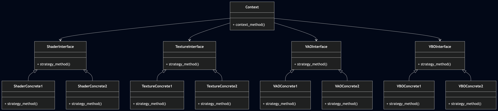

@page arch_renderer_backend_ja Renderer Backend Architecture(Japanese)

# Renderer Backend architecture

## 目的と位置づけ

`Renderer Backend`は、アプリケーション開発者がグラフィックスAPIを意識せず、グラフィックスアプリケーションを構築できるように、
差し替え可能でグラフィックスAPI非依存のインターフェイスAPIを提供するサブシステムである。

## Renderer Backendコンセプト

`Renderer Backend`は、目的を達成するために、オブジェクト指向のデザインパターンであるStrategyを適用した。

`Renderer Backend`が提供する機能を大別してVAO, VBO, Shaderの3つに分類し、それぞれグラフィックスAPIの差異を吸収するためのInterfaceを設ける。
一方、アプリケーションレイヤー等の上位レイヤーが`Renderer Backend`の機能を使用するための窓口はシンプルにしたかったため、Contextは1個にした。
なお、VAO, VBO, Shaderは、同一のグラフィックスAPIを使用することを前提としており、セットで選択する(混在は想定していない)。

この前提を踏まえたStrategyパターンは以下のような構造を取る。

GLCEにおける各モジュールと、Strategyのオブジェクトの対応は以下のようになっている。

| Strategy Object | GLCE Module                                     | 役割                                                                                                       |
| --------------- | ----------------------------------------------- | --------------------------------------------------------------------------------------------------------- |
| Context(*1)     | renderer_backend_context/context                | 上位層に`Renderer Backend`が保有する機能のうち、`Renderer Backend`の初期化、終了のAPI窓口を提供する                 |
|                 | renderer_backend_context/context_shader         | 上位層に`Renderer Backend`が保有する機能のうち、`Shader`関連機能のAPI窓口を提供する                                |
|                 | renderer_backend_context/context_vao            | 上位層に`Renderer Backend`が保有する機能のうち、`VAO`関連機能のAPI窓口を提供する                                   |
|                 | renderer_backend_context/context_vbo            | 上位層に`Renderer Backend`が保有する機能のうち、`VBO`関連機能のAPI窓口を提供する                                   |
| ShaderInterface | renderer_backend_interface/interface_shader     | ContextにグラフィックスAPIごとに差し替え可能なShader関連機能の仮想関数テーブル(Shader機能を抽象化したAPIを保持)を提供する |
| VAOInterface    | renderer_backend_interface/interface_vao        | ContextにグラフィックスAPIごとに差し替え可能なVAO関連機能の仮想関数テーブル(VAO機能を抽象化したAPIを保持)を提供する       |
| VBOInterface    | renderer_backend_interface/interface_vbo        | ContextにグラフィックスAPIごとに差し替え可能なVBO関連機能の仮想関数テーブル(VBO機能を抽象化したAPIを保持)を提供する       |
| ShaderConcrete1 | renderer_backend_concretes/gl33/concrete_shader | InterfaceにOpenGL3.3実装版vtableと、その内部実装を提供する                                                      |
| VAOConcrete1    | renderer_backend_concretes/gl33/concrete_vao    | InterfaceにOpenGL3.3実装版vtableと、その内部実装を提供する                                                      |
| VBOConcrete1    | renderer_backend_concretes/gl33/concrete_vbo    | InterfaceにOpenGL3.3実装版vtableと、その内部実装を提供する                                                      |
| ShaderConcrete2 | Not implemented                                 | 対応グラフィックスAPIが増えた際に追加する                                                                        |
| VAOConcrete2    | Not implemented                                 | 対応グラフィックスAPIが増えた際に追加する                                                                        |
| VBOConcrete2    | Not implemented                                 | 対応グラフィックスAPIが増えた際に追加する                                                                        |

*1: Contextは、外部公開API定義用ヘッダを公開APIの見通しを良くするためcontext, context_shader, context_vao, context_vboに分割しているが、実装は全てrenderer_backend_context/context.cに記載している。

### Concrete(Shader, VAO, VBO)の選択(現状)

現状では`Renderer Backend`の各モジュールインスタンス生成時にグラフィックスAPIを指定することで使用するグラフィックスAPIを選択している。

### Concrete(Shader, VAO, VBO)の選択(将来)

現状の仕様では、全グラフィックスAPIの内部実装がビルド可能であることが求められるが、実現は難しい。将来的にはビルドオプションでグラフィックスAPIを指定する方式に移行する。

## 現状の非対応項目

現状では以下には対応していない。GLCEの機能拡張に伴い、必要に応じて対応する。

- スレッドセーフなAPIの提供
- 実行時の使用グラフィックスAPI切り替え
- 複数のグラフィックスAPIの混在

## 設定方法

現状では設定項目はなし。

## 参照

対応グラフィックスAPIを追加する際には、[Renderer System Guide](../../../guide/renderer_backend/adding_concretes_ja.md)を参照のこと。
