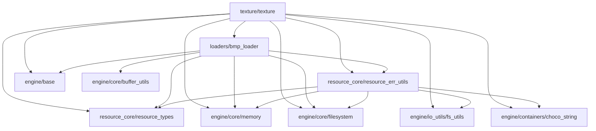

@page arch_resource_en Resource Layer Architecture(English)

# Resource Layer architecture

## Purpose and positioning

The `Resource Layer` is a layer for converting and holding external asset data, such as images, as CPU-side resource representations that are easy to handle inside GLCE.

At present, it mainly provides the following functionality:

- Loading BMP files
- Normalizing BMP pixel data
- Creating, destroying, and loading pixels into CPU-side texture resources
- Common result codes and error conversion utilities for the Resource Layer

The `Resource Layer` is not responsible for creating or managing GPU-side resources.
Creating and managing GPU-side texture resources, as well as managing the correspondence between CPU-side texture resources and GPU-side texture resources, are the responsibilities of the `Texture System` and the `Renderer Backend`.

In other words, the responsibility of the `Resource Layer` is to load external files or built-in data and prepare them as CPU-side data structures that can be used inside the engine.

Here, CPU-side resource data structures refer not to handles or buffers stored directly on the GPU, but to resource representations that can be held, referenced, and processed in CPU memory by the engine.
At present, this mainly corresponds to `texture_t`. `texture_t` stores texture information before GPU upload, such as texture width, height, channel count, and pixel data.

### Module dependencies

## Roles and characteristics of owned modules

The roles and characteristics of each module owned by the `Resource Layer` are as follows.

| Module             | Role                                                                                                                                 | Characteristics |
| ------------------ | ------------------------------------------------------------------------------------------------------------------------------------ | --------------- |
| resource_types     | Provides common data types and result codes used across the entire `Resource Layer`.                                                   | A common foundation module within the `Resource Layer`. Return-value types for externally exposed APIs are also defined here. |
| resource_err_utils | Provides APIs for translating lower-layer and related-module result codes into `Resource Layer` result codes, and for converting result codes to strings. | A utility module for unifying error representation within the `Resource Layer`. |
| bmp_loader         | Loads BMP files and converts them into pixel data that is easy for GLCE to handle.                                                     | A module dedicated to BMP file loading. It holds loaded pixel data and, when needed, transfers ownership of that pixel data to the caller. |
| texture            | Creates and destroys CPU-side texture resources, and provides APIs for loading, freeing, and referencing pixel data.                    | A CPU-side resource module that holds texture name, size, channel count, and pixel data. |

## Responsibility boundaries of the Resource Layer

The `Resource Layer` is a layer for handling CPU-side resources.
Therefore, its responsibilities include the following:

- Loading resource data from external files
- Absorbing differences between file formats
- Converting data into CPU-side formats that are easy for the engine to handle
- Providing APIs for creating, destroying, and referencing CPU-side resources
- Unifying result codes within the Resource Layer

On the other hand, the following are not responsibilities of the `Resource Layer`:

- Creating or destroying GPU-side resources
- Transferring pixel data to the GPU
- Managing the correspondence between CPU-side resources and GPU-side resources
- Registering, deleting, searching, or managing IDs for multiple textures
- Binding, unbinding, or setting uniforms during rendering

These are the responsibilities of the `Texture System`, the `Renderer Backend`, or higher layers.

## texture module details

`texture` is a module that provides `texture_t`, which represents a CPU-side texture resource.
Internally, `texture_t` holds the texture name, width, height, channel count, and pixel data.

`texture` provides the following functionality:

- Creating CPU-side texture resources with texture names
- Destroying CPU-side texture resources
- Loading texture pixel data
- Freeing texture pixel data
- Getting references to pixel data
- Getting texture size information
- Getting texture names

At present, BMP files are supported as normal image files.
In addition, the following built-in texture names are handled specially for testing and sample use:

- `test_texture_red`
- `test_texture_green`
- `test_texture_blue`

Ownership of the pixel data held by `texture` belongs to `texture_t`.
The pixel data pointer returned by `texture_pixel_get()` is for reference only, and the caller must not free it.

## bmp_loader module details

`bmp_loader` is a module that loads BMP files and converts them into pixel data that is easy for GLCE to handle.

At present, the supported BMP files are as follows:

- Uncompressed BMP files
- RGB or RGBA pixel data
- Images whose width is greater than 0 and fits within `int16_t`
- Images whose height fits within `int16_t`

When loading BMP files, `bmp_loader` performs the following normalization steps:

- Converts BGR pixel data order to RGB order
- Removes row-end padding included in formats such as 24-bit BMP, and packs pixel data densely
- Converts bottom-up images into pixel arrays based on a top-left origin

The loaded pixel data is held internally by `bmp_loader`.
Using `bmp_loader_pixel_move()` transfers ownership of the held pixel data to the caller.
After ownership transfer, the pixel data pointer on the `bmp_loader` side becomes NULL, and the same instance is assumed not to be reused for loading again.

## Relationship with the Texture System

`texture` in the `Resource Layer` represents a single CPU-side texture resource.
On the other hand, `texture_manager` in the `Texture System` manages multiple CPU-side texture resources and GPU-side texture resources, and provides registration, deletion, and retrieval APIs by texture name and texture ID.

For details, see [Texture System](../systems/texture_system/architecture_en.md).

## Current unsupported items

At present, the following are not supported. They may be implemented as needed as GLCE evolves.

- Providing thread-safe APIs
- Loading normal image file formats other than BMP
- Loading compressed BMP files
- Loading palette-based BMP files
- Direct management of GPU-side resources
- Resource cache mechanism
- Resource lifetime management by reference counting

## Configuration

There are no configuration options at this time.

## References

For management of CPU-side texture resources and GPU-side texture resources, see [Texture System](../systems/texture_system/architecture_en.md).
