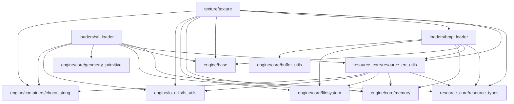

@page arch_resource_en Resource Layer Architecture(English)

# Resource Layer architecture

## Purpose and positioning

The `Resource Layer` is a layer for converting and holding external asset information, such as images and geometry, as CPU-side resource representations that are easy for GLCE to handle.

At present, it mainly provides the following features.

- Loading BMP files
- Normalizing BMP pixel data
- Loading ASCII STL files
- Converting STL vertex data into CPU-side vertex arrays
- Creating, destroying, and loading pixel data into CPU-side texture resources
- Common Resource-layer result codes and error conversion utilities

The `Resource Layer` is not responsible for creating or managing GPU-side resources.
Creating and managing GPU-side texture resources, GPU-side vertex buffers, GPU-side index buffers, and managing the relationship between CPU-side resources and GPU-side resources are responsibilities of the `Texture System`, the `Renderer Backend`, or higher-level systems that will be added in the future.

In other words, the responsibility of the `Resource Layer` is to read external files or built-in data and prepare them as CPU-side data structures that can be used inside the engine.

A CPU-side resource data structure here means a resource representation that can be held, referenced, and processed in engine CPU memory, rather than a handle or buffer held directly on the GPU.
At present, this mainly refers to `texture_t` and arrays of `point_normal_vertex_t`.
`texture_t` holds texture information before upload to the GPU, such as texture width, height, channel count, and pixel data.
An array of `point_normal_vertex_t` holds geometry vertex information before transfer to a GPU vertex buffer.

### Module dependencies

```mermaid
graph TD
  RESOURCE_TYPES[resource_core/resource_types]
  RESOURCE_ERR_UTILS[resource_core/resource_err_utils]
  BMP_LOADER[loaders/bmp_loader]
  STL_LOADER[loaders/stl_loader]
  TEXTURE[texture/texture]

  BASE[engine/base]
  CORE_MEMORY[engine/core/memory]
  CORE_FILESYSTEM[engine/core/filesystem]
  CORE_BUFFER_UTILS[engine/core/buffer_utils]
  CORE_GEOMETRY[engine/core/geometry_primitive]
  IO_UTILS[engine/io_utils/fs_utils]
  CONTAINERS[engine/containers/choco_string]

  RESOURCE_ERR_UTILS --> RESOURCE_TYPES
  RESOURCE_ERR_UTILS --> CORE_MEMORY
  RESOURCE_ERR_UTILS --> CORE_FILESYSTEM
  RESOURCE_ERR_UTILS --> IO_UTILS
  RESOURCE_ERR_UTILS --> CONTAINERS

  BMP_LOADER --> RESOURCE_TYPES
  BMP_LOADER --> RESOURCE_ERR_UTILS
  BMP_LOADER --> BASE
  BMP_LOADER --> CORE_MEMORY
  BMP_LOADER --> CORE_FILESYSTEM
  BMP_LOADER --> CORE_BUFFER_UTILS

  STL_LOADER --> RESOURCE_TYPES
  STL_LOADER --> RESOURCE_ERR_UTILS
  STL_LOADER --> BASE
  STL_LOADER --> CORE_MEMORY
  STL_LOADER --> CORE_GEOMETRY
  STL_LOADER --> IO_UTILS
  STL_LOADER --> CONTAINERS

  TEXTURE --> RESOURCE_TYPES
  TEXTURE --> RESOURCE_ERR_UTILS
  TEXTURE --> BMP_LOADER
  TEXTURE --> BASE
  TEXTURE --> CORE_MEMORY
  TEXTURE --> CORE_FILESYSTEM
  TEXTURE --> IO_UTILS
  TEXTURE --> CONTAINERS
```

## Roles and characteristics of owned modules

The roles and characteristics of each module owned by the `Resource Layer` are as follows.

| Module             | Role                                                                                                                | Characteristics |
| ------------------ | ------------------------------------------------------------------------------------------------------------------- | --------------- |
| resource_types     | Provides common data types and result codes used across the entire `Resource Layer`                                  | A common foundation module inside the `Resource Layer`. Return types for externally exposed APIs are also defined here |
| resource_err_utils | Provides APIs for converting result codes from lower layers and related modules into `Resource Layer` result codes, and for converting result codes to strings | A helper module for unifying error representation inside the `Resource Layer` |
| bmp_loader         | Loads BMP files and converts them into pixel data that is easy for GLCE to handle                                    | A module dedicated to BMP file loading. It holds loaded pixel data and transfers ownership to the caller when needed |
| stl_loader         | Loads ASCII STL files and converts them into vertex arrays that are easy for GLCE to handle                          | A module dedicated to ASCII STL file loading. It holds the loaded `point_normal_vertex_t` array and transfers ownership to the caller when needed |
| texture            | Provides APIs for creating and destroying CPU-side texture resources, loading and freeing pixel data, and referencing texture data | A CPU-side resource module that holds texture name, size, channel count, and pixel data |

## Responsibility boundary of the Resource Layer

The `Resource Layer` is a layer for handling CPU-side resources.
Therefore, it includes the following responsibilities.

- Reading resource information from external files
- Absorbing differences specific to file formats
- Converting external data into CPU-side data formats that are easy for the engine to handle
- Providing APIs for creating, destroying, and referencing CPU-side resources
- Building CPU-side resource representations before GPU transfer, such as textures and geometry
- Unifying result codes inside the Resource layer

On the other hand, the following are not responsibilities of the `Resource Layer`.

- Creating or destroying GPU-side resources
- Transferring pixel data to the GPU
- Transferring vertex data to the GPU
- Creating or managing GPU-side vertex buffers, index buffers, VAOs, and similar objects
- Managing the relationship between CPU-side resources and GPU-side resources
- Registering, deleting, searching, and managing IDs for multiple textures, meshes, or models
- Binding, unbinding, or setting uniforms during rendering
- Managing the relationship between vertex attribute layouts and shader resources

These are responsibilities of the `Texture System`, the `Renderer Backend`, or higher-level layers.

## texture module details

The `texture` module provides `texture_t`, which represents a CPU-side texture resource.
Internally, `texture_t` holds the texture name, width, height, channel count, and pixel data.

The `texture` module provides the following features.

- Creating CPU-side texture resources with texture names
- Destroying CPU-side texture resources
- Loading texture pixel data
- Freeing texture pixel data
- Getting a reference to pixel data
- Getting texture size information
- Getting the texture name

At present, BMP files are supported as normal image files.
For tests and samples, the following built-in texture names are treated specially.

- `test_texture_red`
- `test_texture_green`
- `test_texture_blue`

The pixel data held by `texture` is owned by `texture_t`.
The pixel data pointer obtained by `texture_pixel_get()` is for reference only, and the caller must not free it.

## bmp_loader module details

The `bmp_loader` module loads BMP files and converts them into pixel data that is easy for GLCE to handle.

At present, the supported BMP files are as follows.

- Uncompressed BMP files
- RGB or RGBA pixel data
- Images whose width is greater than 0 and fits in `int16_t`
- Images whose height fits in `int16_t`

When loading BMP files, `bmp_loader` performs the following normalization steps.

- Converts pixel data from BGR order to RGB order
- Removes row-end padding included in formats such as 24-bit BMP and packs the pixel data tightly
- Converts bottom-up images into pixel arrays based on a top-left origin

Loaded pixel data is held inside `bmp_loader`.
By using `bmp_loader_pixel_move()`, ownership of the held pixel data can be transferred to the caller.
After ownership transfer, the pixel data pointer inside `bmp_loader` becomes NULL, and the same instance is treated on the assumption that it will not be reused for reloading.

## stl_loader module details

The `stl_loader` module loads ASCII STL files and converts them into `point_normal_vertex_t` arrays that are easy for GLCE to handle.

At present, the supported STL files are as follows.

- ASCII STL files
- Facets composed of `facet normal`, `outer loop`, three `vertex` lines, `endloop`, and `endfacet`
- Triangle data where each facet has three vertices
- Data with finite vertex coordinates
- Data with finite normal components where each component is within the range `[-1.0, 1.0]`

When loading STL files, `stl_loader` performs the following steps.

- Reads the file once to count the number of vertices in advance
- Allocates a `point_normal_vertex_t` array according to the vertex count
- Reads the file a second time, parses `facet normal` and `vertex`, and stores the data in the vertex array
- Verifies that the STL structure follows the order `facet normal` → `outer loop` → `vertex` x 3 → `endloop` → `endfacet`
- Treats normals and vertex coordinates containing `NaN` or `Inf` as invalid data
- Treats normal components outside the range `[-1.0, 1.0]` as invalid data
- Converts normals into `int8_t` representation and stores them together with vertex positions in `point_normal_vertex_t`

After loading, the vertex array is held inside `stl_loader`.
By using `stl_loader_vertices_move()`, ownership of the held vertex array can be transferred to the caller.
After ownership transfer, the vertex array pointer inside `stl_loader` becomes NULL and the vertex count becomes 0.

At present, `stl_loader` does not verify whether normal vectors in the STL file have unit length.
Normal length verification is planned for the future.

### Load acceleration policy using a custom STL format

At present, `stl_loader` reads ASCII STL files twice.
The first read counts the number of vertices in advance, and the second read stores vertex information into a `point_normal_vertex_t` array allocated with the required size.
This method can estimate memory usage without introducing a dynamic array, but it is inefficient in terms of load speed because the ASCII STL file is parsed twice.

In the future, GLCE plans to generate an internal custom binary format from ASCII STL and use it to accelerate subsequent loads.
The custom format will be treated as an intermediate format that holds the parsed ASCII STL result in a form close to the CPU-side vertex array before GPU transfer.

The custom format is expected to have roughly the following structure.

- The vertex count is stored at the beginning
- After that, vertex position information and normal information are stored sequentially in binary form

The future loading policy is as follows.

1. Check whether a custom format file corresponding to the ASCII STL exists
2. If it exists, load the custom format instead of the ASCII STL
3. If it does not exist, load the ASCII STL and generate the vertex array
4. Output the generated vertex array as the custom format
5. Use the custom format preferentially for subsequent loads

With this policy, the first load pays the parsing cost of the ASCII STL, while subsequent loads can avoid advance vertex counting and line-by-line parsing with `sscanf`, allowing the CPU-side vertex array to be built more quickly.

However, the detailed specification and extension of the custom format are currently undecided.
Therefore, at present, this is treated as a future extension item.

## Relationship with the Texture System

The `texture` module in the `Resource Layer` represents a single CPU-side texture resource.
On the other hand, `texture_manager` in the `Texture System` manages multiple CPU-side texture resources and GPU-side texture resources, and provides APIs for registering, deleting, and retrieving textures by texture name and texture ID.

For details, see [Texture System](../systems/texture_system/architecture_en.md).

## Relationship with the Renderer Backend

The `stl_loader` module in the `Resource Layer` builds CPU-side vertex arrays.
On the other hand, the `Renderer Backend` is responsible for transferring those vertex arrays to GPU-side vertex buffers and VAOs, associating them with rendering state, and handling them as drawable GPU-side resources.

The `Resource Layer` is responsible only for holding and transferring ownership of vertex arrays loaded from STL files.
It is not responsible for generating GPU buffers, setting vertex attributes, or associating data with shader resources.

## Currently unsupported items

The following are currently unsupported.
They will be supported as needed as GLCE features are expanded.

- Providing thread-safe APIs
- Loading normal image file formats other than BMP
- Loading compressed BMP files
- Loading BMP files with palettes
- Loading binary STL files
- Loading 3D model file formats other than STL, such as OBJ and MTL
- Verifying unit length of normal vectors in STL files
- Converting and outputting ASCII STL to a GLCE custom binary format
- Directly loading the GLCE custom binary format
- Registering, deleting, searching, and managing IDs for multiple meshes or models
- Directly managing GPU-side resources
- Resource cache mechanisms
- Resource lifetime management based on reference counting

## Configuration

There are currently no configuration items.

## References

For management of CPU-side texture resources and GPU-side texture resources, see [Texture System](../systems/texture_system/architecture_en.md).
For GPU-side vertex buffers and vertex attribute settings during rendering, see future `Renderer Backend` documentation.
