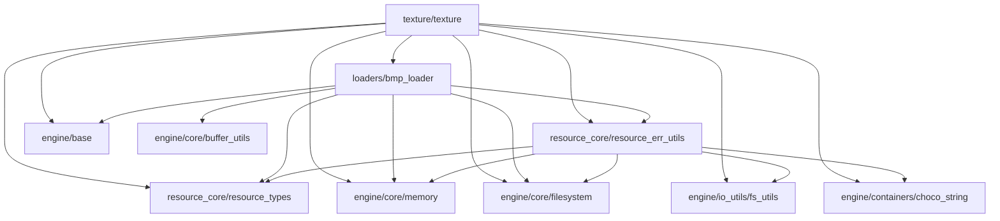

@page arch_resource_ja Resource Layer Architecture(Japanese)

# Resource Layer architecture

## 目的と位置づけ

`Resource Layer`は、画像などの外部アセット情報を、GLCE内部で扱いやすいCPU側リソース表現へ変換・保持するためのレイヤーである。

現時点では、主に以下の機能を提供する。

- BMPファイルのロード
- BMPピクセルデータの正規化
- CPU側テクスチャリソースの生成・破棄・ピクセルロード
- Resourceレイヤー共通の実行結果コードとエラー変換機能

`Resource Layer`は、GPU側リソースの生成・管理を担当しない。
GPU側テクスチャリソースの生成・管理、およびCPU側テクスチャリソースとGPU側テクスチャリソースの対応関係管理は、`Texture System`および`Renderer Backend`の責務である。

つまり、`Resource Layer`の責務は、外部ファイルやビルトインデータを読み込み、エンジン内部で利用可能なCPU側データ構造として整えることである。

ここでいうCPU側リソースデータ構造とは、GPUに直接保持されるハンドルやバッファではなく、エンジンのCPUメモリ上で保持・参照・加工できるリソース表現を指す。
現時点では、主に `texture_t` がこれに該当する。`texture_t` は、テクスチャの幅・高さ・チャンネル数・ピクセルデータなど、GPUへアップロードする前のテクスチャ情報を保持する。

### モジュール依存関係

## 保有モジュールの役割と性質

`Resource Layer`が保有する各モジュールの役割と性質は以下の通り。

| モジュール           | 役割                                                                                                                | 性質 |
| ------------------ | ------------------------------------------------------------------------------------------------------------------- | ---- |
| resource_types     | `Resource Layer`全体で使用する共通データ型と実行結果コードを提供する                                                         | `Resource Layer`内の共通基盤となるモジュール。外部に公開されるAPIの戻り値型もここで定義する |
| resource_err_utils | 下位レイヤーや関連モジュールの実行結果コードを`Resource Layer`用の実行結果コードへ変換し、実行結果コードを文字列へ変換するAPIを提供する | `Resource Layer`内のエラー表現を統一するための補助モジュール |
| bmp_loader         | BMPファイルを読み込み、GLCEで扱いやすいピクセルデータへ変換する                                                               | BMPファイルロード専用モジュール。ロード結果のピクセルデータを保持し、必要に応じて所有権を呼び出し側へ委譲する |
| texture            | CPU側テクスチャリソースを生成・破棄し、ピクセルデータのロード・解放・参照APIを提供する                                            | テクスチャ名称、サイズ、チャンネル数、ピクセルデータを保持するCPU側リソースモジュール |

## Resource Layerの責務境界

`Resource Layer`は、CPU側リソースを扱うためのレイヤーである。
そのため、以下を責務に含む。

- 外部ファイルからリソース情報を読み込む
- ファイル形式固有の差異を吸収する
- エンジン内部で扱いやすいCPU側データ形式へ変換する
- CPU側リソースの生成・破棄・参照APIを提供する
- Resourceレイヤー内の実行結果コードを統一する

一方で、以下は`Resource Layer`の責務ではない。

- GPU側リソースの生成・破棄
- GPUへのピクセルデータ転送
- CPU側リソースとGPU側リソースの対応関係管理
- 複数テクスチャの登録・削除・検索・ID管理
- 描画時のbind / unbind / uniform設定

これらは、それぞれ`Texture System`、`Renderer Backend`、または上位レイヤーの責務である。

## textureモジュール詳細

`texture`は、CPU側テクスチャリソースを表す`texture_t`を提供するモジュールである。
`texture_t`は内部状態として、テクスチャ名称、幅、高さ、チャンネル数、ピクセルデータを保持する。

`texture`は以下の機能を提供する。

- テクスチャ名称を持つCPU側テクスチャリソースの生成
- CPU側テクスチャリソースの破棄
- テクスチャピクセルデータのロード
- テクスチャピクセルデータの解放
- ピクセルデータへの参照取得
- テクスチャサイズ情報の取得
- テクスチャ名称の取得

現時点では、通常の画像ファイルとしてBMPファイルをサポートする。
また、テストやサンプル用途として、以下のビルトインテクスチャ名称を特別に扱う。

- `test_texture_red`
- `test_texture_green`
- `test_texture_blue`

`texture`が保持するピクセルデータの所有権は`texture_t`が持つ。
`texture_pixel_get()`で取得されるピクセルデータポインタは参照用であり、呼び出し側は解放してはならない。

## bmp_loaderモジュール詳細

`bmp_loader`は、BMPファイルを読み込み、GLCEで扱いやすいピクセルデータへ変換するモジュールである。

現時点でサポートするBMPファイルは以下の通り。

- 非圧縮BMPファイル
- RGBまたはRGBAのピクセルデータ
- 幅が0より大きく、`int16_t`に収まる画像
- 高さが`int16_t`に収まる画像

`bmp_loader`はBMPファイルの読み込み時に、以下の正規化処理を行う。

- BGR順のピクセルデータをRGB順へ変換する
- 24bit BMPなどに含まれる行末paddingを除去し、ピクセルデータを密に詰める
- ボトムアップ画像を左上原点基準のピクセル配列へ変換する

ロード後のピクセルデータは、`bmp_loader`内部で保持される。
`bmp_loader_pixel_move()`を使用すると、保持しているピクセルデータの所有権を呼び出し側へ委譲できる。
所有権委譲後、`bmp_loader`側のピクセルデータポインタはNULLになり、同一インスタンスを再ロード用途に再利用しない前提で扱う。

## Texture Systemとの関係

`Resource Layer`の`texture`は、CPU側テクスチャリソース単体を表す。
一方、`Texture System`の`texture_manager`は、複数のCPU側テクスチャリソースとGPU側テクスチャリソースを管理し、テクスチャ名称およびテクスチャIDによる登録・削除・取得APIを提供する。

詳細は[Texture System](../systems/texture_system/architecture_ja.md)を参照のこと。

## 現状の非対応項目

現状では以下には対応していない。GLCEの機能拡張に伴い、必要に応じて対応する。

- スレッドセーフなAPIの提供
- BMP以外の通常画像ファイル形式のロード
- 圧縮BMPファイルのロード
- パレット付きBMPファイルのロード
- GPU側リソースの直接管理
- リソースキャッシュ機構
- 参照カウントによるリソース寿命管理

## 設定方法

現状では設定項目はなし。

## 参照

CPU側テクスチャリソースとGPU側テクスチャリソースの管理については、[Texture System](../systems/texture_system/architecture_ja.md)を参照のこと。
