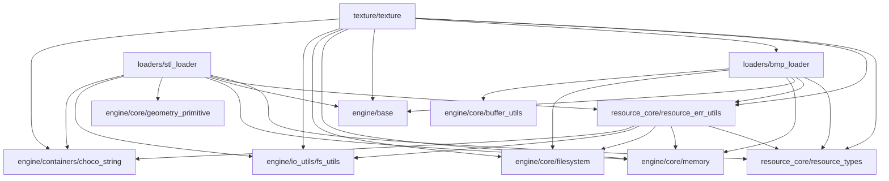

@page arch_resource_ja Resource Layer Architecture(Japanese)

# Resource Layer architecture

## 目的と位置づけ

`Resource Layer`は、画像・ジオメトリなどの外部アセット情報を、GLCE内部で扱いやすいCPU側リソース表現へ変換・保持するためのレイヤーである。

現時点では、主に以下の機能を提供する。

- BMPファイルのロード
- BMPピクセルデータの正規化
- ASCII STLファイルのロード
- STL頂点データのCPU側頂点配列への変換
- CPU側テクスチャリソースの生成・破棄・ピクセルロード
- Resourceレイヤー共通の実行結果コードとエラー変換機能

`Resource Layer`は、GPU側リソースの生成・管理を担当しない。
GPU側テクスチャリソース、GPU側頂点バッファ、GPU側インデックスバッファなどの生成・管理、およびCPU側リソースとGPU側リソースの対応関係管理は、`Texture System`、`Renderer Backend`、または今後追加される上位システムの責務である。

つまり、`Resource Layer`の責務は、外部ファイルやビルトインデータを読み込み、エンジン内部で利用可能なCPU側データ構造として整えることである。

ここでいうCPU側リソースデータ構造とは、GPUに直接保持されるハンドルやバッファではなく、エンジンのCPUメモリ上で保持・参照・加工できるリソース表現を指す。
現時点では、主に `texture_t` と `point_normal_vertex_t` 配列がこれに該当する。`texture_t` は、テクスチャの幅・高さ・チャンネル数・ピクセルデータなど、GPUへアップロードする前のテクスチャ情報を保持する。`point_normal_vertex_t` 配列は、GPU頂点バッファへ転送する前のジオメトリ頂点情報を保持する。

### モジュール依存関係

```mermaid
graph TD
  RESOURCE_TYPES[resource_core/resource_types]
  RESOURCE_ERR_UTILS[resource_core/resource_err_utils]
  BMP_LOADER[loaders/bmp_loader]
  STL_LOADER[loaders/stl_loader]
  TEXTURE[texture/texture]

  BASE[engine/base]
  CORE_MEMORY[engine/core/memory]
  CORE_FILESYSTEM[engine/core/filesystem]
  CORE_BUFFER_UTILS[engine/core/buffer_utils]
  CORE_GEOMETRY[engine/core/geometry_primitive]
  IO_UTILS[engine/io_utils/fs_utils]
  CONTAINERS[engine/containers/choco_string]

  RESOURCE_ERR_UTILS --> RESOURCE_TYPES
  RESOURCE_ERR_UTILS --> CORE_MEMORY
  RESOURCE_ERR_UTILS --> CORE_FILESYSTEM
  RESOURCE_ERR_UTILS --> IO_UTILS
  RESOURCE_ERR_UTILS --> CONTAINERS

  BMP_LOADER --> RESOURCE_TYPES
  BMP_LOADER --> RESOURCE_ERR_UTILS
  BMP_LOADER --> BASE
  BMP_LOADER --> CORE_MEMORY
  BMP_LOADER --> CORE_FILESYSTEM
  BMP_LOADER --> CORE_BUFFER_UTILS

  STL_LOADER --> RESOURCE_TYPES
  STL_LOADER --> RESOURCE_ERR_UTILS
  STL_LOADER --> BASE
  STL_LOADER --> CORE_MEMORY
  STL_LOADER --> CORE_GEOMETRY
  STL_LOADER --> IO_UTILS
  STL_LOADER --> CONTAINERS

  TEXTURE --> RESOURCE_TYPES
  TEXTURE --> RESOURCE_ERR_UTILS
  TEXTURE --> BMP_LOADER
  TEXTURE --> BASE
  TEXTURE --> CORE_MEMORY
  TEXTURE --> CORE_FILESYSTEM
  TEXTURE --> IO_UTILS
  TEXTURE --> CONTAINERS
```

## 保有モジュールの役割と性質

`Resource Layer`が保有する各モジュールの役割と性質は以下の通り。

| モジュール           | 役割                                                                                                                | 性質 |
| ------------------ | ------------------------------------------------------------------------------------------------------------------- | ---- |
| resource_types     | `Resource Layer`全体で使用する共通データ型と実行結果コードを提供する                                                         | `Resource Layer`内の共通基盤となるモジュール。外部に公開されるAPIの戻り値型もここで定義する |
| resource_err_utils | 下位レイヤーや関連モジュールの実行結果コードを`Resource Layer`用の実行結果コードへ変換し、実行結果コードを文字列へ変換するAPIを提供する | `Resource Layer`内のエラー表現を統一するための補助モジュール |
| bmp_loader         | BMPファイルを読み込み、GLCEで扱いやすいピクセルデータへ変換する                                                               | BMPファイルロード専用モジュール。ロード結果のピクセルデータを保持し、必要に応じて所有権を呼び出し側へ委譲する |
| stl_loader         | ASCII STLファイルを読み込み、GLCEで扱いやすい頂点配列へ変換する                                                              | ASCII STLファイルロード専用モジュール。ロード結果の `point_normal_vertex_t` 配列を保持し、必要に応じて所有権を呼び出し側へ委譲する |
| texture            | CPU側テクスチャリソースを生成・破棄し、ピクセルデータのロード・解放・参照APIを提供する                                            | テクスチャ名称、サイズ、チャンネル数、ピクセルデータを保持するCPU側リソースモジュール |

## Resource Layerの責務境界

`Resource Layer`は、CPU側リソースを扱うためのレイヤーである。
そのため、以下を責務に含む。

- 外部ファイルからリソース情報を読み込む
- ファイル形式固有の差異を吸収する
- エンジン内部で扱いやすいCPU側データ形式へ変換する
- CPU側リソースの生成・破棄・参照APIを提供する
- テクスチャやジオメトリなど、GPU転送前のCPU側リソース表現を構築する
- Resourceレイヤー内の実行結果コードを統一する

一方で、以下は`Resource Layer`の責務ではない。

- GPU側リソースの生成・破棄
- GPUへのピクセルデータ転送
- GPUへの頂点データ転送
- GPU側頂点バッファ、インデックスバッファ、VAOなどの生成・管理
- CPU側リソースとGPU側リソースの対応関係管理
- 複数テクスチャ、複数メッシュ、複数モデルの登録・削除・検索・ID管理
- 描画時のbind / unbind / uniform設定
- 頂点属性レイアウトとshader resourceの対応関係管理

これらは、それぞれ`Texture System`、`Renderer Backend`、または上位レイヤーの責務である。

## textureモジュール詳細

`texture`は、CPU側テクスチャリソースを表す`texture_t`を提供するモジュールである。
`texture_t`は内部状態として、テクスチャ名称、幅、高さ、チャンネル数、ピクセルデータを保持する。

`texture`は以下の機能を提供する。

- テクスチャ名称を持つCPU側テクスチャリソースの生成
- CPU側テクスチャリソースの破棄
- テクスチャピクセルデータのロード
- テクスチャピクセルデータの解放
- ピクセルデータへの参照取得
- テクスチャサイズ情報の取得
- テクスチャ名称の取得

現時点では、通常の画像ファイルとしてBMPファイルをサポートする。
また、テストやサンプル用途として、以下のビルトインテクスチャ名称を特別に扱う。

- `test_texture_red`
- `test_texture_green`
- `test_texture_blue`

`texture`が保持するピクセルデータの所有権は`texture_t`が持つ。
`texture_pixel_get()`で取得されるピクセルデータポインタは参照用であり、呼び出し側は解放してはならない。

## bmp_loaderモジュール詳細

`bmp_loader`は、BMPファイルを読み込み、GLCEで扱いやすいピクセルデータへ変換するモジュールである。

現時点でサポートするBMPファイルは以下の通り。

- 非圧縮BMPファイル
- RGBまたはRGBAのピクセルデータ
- 幅が0より大きく、`int16_t`に収まる画像
- 高さが`int16_t`に収まる画像

`bmp_loader`はBMPファイルの読み込み時に、以下の正規化処理を行う。

- BGR順のピクセルデータをRGB順へ変換する
- 24bit BMPなどに含まれる行末paddingを除去し、ピクセルデータを密に詰める
- ボトムアップ画像を左上原点基準のピクセル配列へ変換する

ロード後のピクセルデータは、`bmp_loader`内部で保持される。
`bmp_loader_pixel_move()`を使用すると、保持しているピクセルデータの所有権を呼び出し側へ委譲できる。
所有権委譲後、`bmp_loader`側のピクセルデータポインタはNULLになり、同一インスタンスを再ロード用途に再利用しない前提で扱う。

## stl_loaderモジュール詳細

`stl_loader`は、ASCII STLファイルを読み込み、GLCEで扱いやすい `point_normal_vertex_t` 配列へ変換するモジュールである。

現時点でサポートするSTLファイルは以下の通り。

- ASCII STLファイル
- `facet normal`、`outer loop`、3つの`vertex`、`endloop`、`endfacet`で構成されるfacet
- 各facetが3頂点を持つ三角形データ
- finiteな頂点座標を持つデータ
- finiteな法線成分を持ち、各成分が `[-1.0, 1.0]` の範囲内に収まるデータ

`stl_loader`は、STLファイルの読み込み時に以下の処理を行う。

- 1回目の読み込みで頂点数を事前に数える
- 頂点数に応じて `point_normal_vertex_t` 配列を確保する
- 2回目の読み込みで `facet normal` と `vertex` を解析し、頂点配列へ格納する
- STLの構造が `facet normal` → `outer loop` → `vertex` x 3 → `endloop` → `endfacet` の順序になっていることを検証する
- `NaN` または `Inf` を含む法線・頂点座標を不正データとして扱う
- 法線成分が `[-1.0, 1.0]` の範囲外である場合、不正データとして扱う
- 法線を `int8_t` 表現へ変換し、頂点位置とともに `point_normal_vertex_t` へ格納する

ロード後の頂点配列は、`stl_loader`内部で保持される。
`stl_loader_vertices_move()`を使用すると、保持している頂点配列の所有権を呼び出し側へ委譲できる。
所有権委譲後、`stl_loader`側の頂点配列ポインタはNULLになり、頂点数は0になる。

現時点では、STLファイル内の法線ベクトルが単位長であるかは検証しない。
法線の長さ検証は今後行う予定である。

### STLカスタムフォーマットによるロード高速化方針

現時点の `stl_loader` は、ASCII STLファイルを2回読み込む。
1回目の読み込みでは頂点数を事前に数え、2回目の読み込みでは必要量だけ確保した `point_normal_vertex_t` 配列へ頂点情報を格納する。
この方式はdynamic arrayを導入せずにメモリ使用量を見積もれる一方、ASCII STLの解析を2回行うため、ロード速度の面では非効率である。

将来的には、ASCII STLからGLCE内部向けのカスタムバイナリフォーマットを生成し、2回目以降のロードを高速化する方針である。
カスタムフォーマットは、ASCII STLの構文解析結果をそのままGPU転送前のCPU側頂点配列に近い形で保持する中間形式として扱う。

カスタムフォーマットは、概ね以下の構成を想定する。

- 先頭に頂点数を格納する
- 以降はbinary形式で、頂点位置情報と法線情報を順に格納する

将来的なロード方針は以下の通りである。

1. ASCII STLに対応するカスタムフォーマットファイルが存在するか確認する
2. 存在する場合は、ASCII STLではなくカスタムフォーマットを読み込む
3. 存在しない場合は、ASCII STLを読み込んで頂点配列を生成する
4. 生成した頂点配列をカスタムフォーマットとして出力する
5. 以降のロードでは、そのカスタムフォーマットを優先して使用する

この方針により、初回ロード時はASCII STLの解析コストを支払うが、2回目以降は頂点数の事前カウントや `sscanf` による行単位の構文解析を避け、より高速にCPU側頂点配列を構築できる。

ただし、カスタムフォーマットの詳細仕様、拡張子は未定である。
そのため、現時点では将来拡張項目として扱う。

## Texture Systemとの関係

`Resource Layer`の`texture`は、CPU側テクスチャリソース単体を表す。
一方、`Texture System`の`texture_manager`は、複数のCPU側テクスチャリソースとGPU側テクスチャリソースを管理し、テクスチャ名称およびテクスチャIDによる登録・削除・取得APIを提供する。

詳細は[Texture System](../systems/texture_system/architecture_ja.md)を参照のこと。

## Renderer Backendとの関係

`Resource Layer`の`stl_loader`は、CPU側の頂点配列を構築する。
一方、`Renderer Backend`は、その頂点配列をGPU側頂点バッファやVAOへ転送・関連付けし、描画可能なGPU側リソースとして扱う責務を持つ。

`Resource Layer`は、STLファイルから読み込んだ頂点配列を保持・委譲するまでを担当し、GPUバッファの生成、頂点属性設定、shader resourceとの対応付けは担当しない。

## 現状の非対応項目

現状では以下には対応していない。GLCEの機能拡張に伴い、必要に応じて対応する。

- スレッドセーフなAPIの提供
- BMP以外の通常画像ファイル形式のロード
- 圧縮BMPファイルのロード
- パレット付きBMPファイルのロード
- Binary STLファイルのロード
- OBJ、MTLなどのSTL以外の3Dモデルファイル形式のロード
- STLファイル内法線の単位長検証
- ASCII STLからGLCEカスタムバイナリフォーマットへの変換・出力
- GLCEカスタムバイナリフォーマットの直接ロード
- 複数メッシュ、複数モデルの登録・削除・検索・ID管理
- GPU側リソースの直接管理
- リソースキャッシュ機構
- 参照カウントによるリソース寿命管理

## 設定方法

現状では設定項目はなし。

## 参照

CPU側テクスチャリソースとGPU側テクスチャリソースの管理については、[Texture System](../systems/texture_system/architecture_ja.md)を参照のこと。
GPU側頂点バッファや描画時の頂点属性設定については、今後整備する`Renderer Backend`関連ドキュメントを参照のこと。
