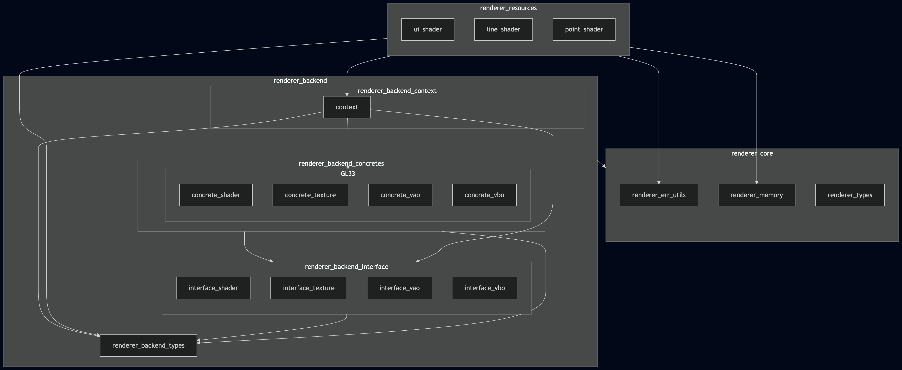

@page arch_renderer_system_en Renderer System Architecture

# Renderer System Architecture

The `Renderer System` provides rendering functionality to upper layers. It consists of the following sublayers:

* `Renderer Backend`, which provides graphics API-independent interface APIs and allows the underlying graphics API to be replaced.
* `Renderer Core`, which provides modules used across the entire `Renderer System`.
* `Renderer Resources`, which provides renderer-layer rendering resource modules used by upper layers.

`Renderer Frontend` is planned to be added in the future, but it has not been implemented yet.

## Sublayer Details

### Renderer Backend

[Renderer Backend Architecture](renderer_backend/architecture_en.md)

### Renderer Core

`Renderer Core` provides the following modules.

| Module Name        | Role                                                                                                                                                                |
| ------------------ | ------------------------------------------------------------------------------------------------------------------------------------------------------------------- |
| renderer_err_utils | Provides utilities used across the entire `Renderer System` for converting result codes from lower-layer modules and converting renderer result codes into strings. |
| renderer_memory    | Provides wrapper APIs over `core/choco_memory` to prevent misuse of memory tags within the `Renderer System` and reduce unnecessary result-code conversion logic.   |
| renderer_types     | Provides graphics API-independent types used within the `Renderer System`.                                                                                          |

### Renderer Resources

`Renderer Resources` provides renderer-layer rendering resource modules used by upper layers.

Since `Renderer Frontend` has not been implemented yet, `Renderer Resources` currently functions as an intermediate resource layer between upper layers and `Renderer Backend`.
Each resource groups a shader program, cached uniform locations, shader-specific VAO/VBO resources, and GPU data upload operations.

`Renderer Resources` currently provides the following modules.

| Module Name | Role                                                                                                                                                                                                                                                                                                 |
| ----------- | ---------------------------------------------------------------------------------------------------------------------------------------------------------------------------------------------------------------------------------------------------------------------------------------------------- |
| ui_shader   | Provides shader resources for textured UI quad rendering. It manages a UI shader program, MVP matrix uniform locations, and VAO/VBO resources configured for vertex position and texture-coordinate vertex attributes.                                                                               |
| line_shader | Provides shader resources for single-color 3D line rendering. It manages a line shader program, MVP matrix and color uniform locations, and VAO/VBO resources configured for position-only line vertices. It is intended for simple line primitives such as debug lines, AABB edges, and grid lines. |
| point_shader | Provides shader resources for point-cloud and point primitive rendering. It manages a point shader program, MVP matrix uniform locations, a VAO, and separate VBOs for position and color vertex attributes. Color data is stored as normalized unsigned-byte RGBA values and is treated as a vec4 in the shader. It is intended for point-based visualization data such as debug points, measurement points, and point clouds. |
