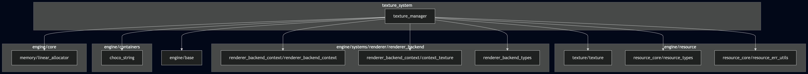

@page arch_texture_system_en Texture System Architecture(English)

# Texture System architecture

## Purpose and positioning

The `Texture System` is a subsystem that manages the correspondence between CPU-side texture resources and GPU-side texture resources, allowing upper layers to register, retrieve, and destroy textures without being directly aware of the graphics API.

The `texture` module in the `Resource Layer` provides `texture_t`, a CPU-side texture resource that holds information such as the texture name, width, height, channel count, and pixel data.
It also provides APIs for creating and destroying CPU-side texture resources, loading and unloading pixel data, retrieving references to pixel data, retrieving texture size information, and retrieving texture names.

On the other hand, the Texture API of the `Renderer Backend` provides operations for GPU-side texture resources, such as creating and destroying `renderer_backend_texture_t`, bind / unbind, and pixel upload.

The `Texture System` bridges these two layers.
Specifically, it creates and loads CPU-side texture resources through the `Resource Layer`, and uploads their pixel data to GPU-side texture resources through the `Renderer Backend`.
After that, it manages the CPU-side resource and the GPU-side resource using the same texture ID, and provides upper layers with APIs for retrieving GPU-side resources.

## Texture System concept

The `Texture System` centralizes the management of multiple texture resources in `texture_manager`.

Upper layers register a texture by specifying a texture name and a GPU-side texture unit number.
During registration, `texture_manager` creates a CPU-side texture resource and a GPU-side texture resource, then uploads the pixel data loaded on the CPU side to the GPU-side resource.
When registration succeeds, `texture_manager` stores the CPU-side resource and the GPU-side resource in the same slot, and returns that slot number to the upper layer as a `texture_id`.

Internally, `texture_manager` has the following two arrays:

- CPU-side texture resource array: `texture_t**`
- GPU-side texture resource array: `renderer_backend_texture_t**`

A CPU-side resource and a GPU-side resource stored at the same index represent the same texture.
This index is returned to upper layers as a `texture_id`.

In other words, `texture_id` is the resource array index inside `texture_manager`, and it identifies the correspondence between a CPU-side resource and a GPU-side resource.

The size of the management arrays is determined by `max_texture_count_` in `texture_manager_initialize()`, and is fixed in the current implementation.
Therefore, the number of manageable textures cannot be expanded after initialization.
In the future, this may be changed to variable-size management using `dynamic_array` or a similar mechanism, so that the number of manageable textures can be expanded as needed.

Note that `texture_manager` continues to hold `texture_t*` after registration, but it does not permanently retain CPU-side pixel data.
In the current implementation, pixel data is temporarily loaded during registration by `texture_pixel_load()`, uploaded to the GPU-side resource, and then freed by `texture_pixel_unload()`.
Therefore, after registration, the retained CPU-side resource mainly functions as a resource object that represents the texture name and registration state.

## Module dependencies

The `Texture System` depends on the `Resource Layer` for CPU-side resource operations, and on the `Renderer Backend` for GPU-side resource operations.
It also uses `linear_allocator` to allocate management memory, and `choco_string` to compare texture names.

This diagram shows the major dependencies of the `Texture System`.
It is not an exhaustive list of all include relationships; rather, it is an overview diagram for understanding which layers are used by `texture_manager`.

## Roles and characteristics of owned modules

At present, the `Texture System` owns only the `texture_manager` module.

| Module | Role | Characteristics |
| ------ | ---- | --------------- |
| texture_manager | Manages the correspondence between CPU-side texture resources and GPU-side texture resources, and provides APIs for texture registration, deletion, ID retrieval, and GPU resource retrieval. | The central module of the `Texture System`. It stores CPU-side resources and GPU-side resources in arrays allocated by a linear allocator, and uses the same array index as the `texture_id`. |

## Responsibility boundaries of the Texture System

The `Texture System` is a subsystem for managing the correspondence between CPU-side texture resources and GPU-side texture resources.
Therefore, its responsibilities include the following:

- Initializing and shutting down the texture management system
- Allocating resource management arrays based on the maximum number of manageable textures
- Creating CPU-side texture resources from texture names
- Creating GPU-side texture resources
- Loading pixel data into CPU-side texture resources
- Uploading pixel data to GPU-side texture resources
- Freeing CPU-side pixel data after GPU upload
- Managing CPU-side resources and GPU-side resources using the same `texture_id`
- Retrieving GPU-side resources by texture ID or texture name
- Unregistering texture resources by texture ID or texture name
- Converting result codes from the Resource Layer / Renderer Backend / Linear Allocator / choco_string into Texture System result codes

On the other hand, the following are not responsibilities of the `Texture System`:

- Detailed parsing of BMP file formats
- Defining the internal representation of individual CPU-side texture resources
- Graphics-API-specific implementation of GPU-side texture resources
- Directly binding or unbinding textures
- Setting uniforms during rendering
- Issuing rendering commands
- Managing texture lifetimes by texture cache or reference counting

BMP file parsing and CPU-side texture representation are the responsibilities of the `Resource Layer`.
The concrete creation, destruction, and upload processing of GPU-side texture resources are the responsibilities of the `Renderer Backend`.
Binding / unbinding during rendering and uniform setting are the responsibilities of the upper layer that uses the Renderer Backend Texture API, or of the Renderer Frontend that may be introduced in the future.

## texture_manager module details

`texture_manager` is the central module of the `Texture System`.

It holds the following internal state:

- `max_texture_count`: The maximum number of textures that can be managed by the system
- `cpu_resources`: An array of CPU-side texture resources, `texture_t*`
- `gpu_resources`: An array of GPU-side texture resources, `renderer_backend_texture_t*`

`cpu_resources[i]` and `gpu_resources[i]` are a pair that represents the same texture.
Therefore, a state where only one of them is NULL while the other is non-NULL is treated as data inconsistency.

### Initialization

`texture_manager_initialize()` allocates the `texture_manager_t` object itself, the CPU-side resource array, and the GPU-side resource array from a linear allocator.
After allocation, all elements of the resource arrays are initialized to NULL.

`texture_manager` is assumed to remain alive from system startup to shutdown.
Therefore, it is based on bulk lifetime management by the linear allocator, rather than individual memory deallocation.

### Shutdown

`texture_manager_deinitialize()` destroys all managed CPU-side texture resources and GPU-side texture resources.

CPU-side resources are destroyed by `texture_destroy()`.
GPU-side resources are destroyed by `renderer_backend_texture_destroy()`.

However, because the memory for `texture_manager_t` itself is allocated by the linear allocator, this function does not free that memory individually.

### Texture registration

`texture_manager_register()` registers a CPU-side resource and a GPU-side resource by specifying a texture name.

The main processing flow is as follows:

1. Validate the arguments and the internal state of `texture_manager`
2. Check for duplicate registered texture names
3. Search for an empty slot
4. Create a CPU-side texture resource with `texture_create()`
5. Create a GPU-side texture resource with `renderer_backend_texture_create()`
6. Load pixel data into the CPU-side texture resource with `texture_pixel_load()`
7. Retrieve the information required for upload with `texture_pixel_get()` and `texture_pixel_size_get()`
8. Upload pixel data to the GPU-side texture resource with `renderer_backend_texture_pixel_upload()`
9. Free CPU-side pixel data with `texture_pixel_unload()`
10. Register the CPU-side resource and the GPU-side resource in the same slot
11. Return the registered slot number as the `texture_id`

If registration fails, any CPU-side resource and GPU-side resource created during the process are destroyed.
The resources are committed to the internal resource arrays of `texture_manager` only on success.

### Texture unregistration

`texture_manager_unregister()` unregisters and destroys the registered CPU-side resource and GPU-side resource specified by `texture_id`.

`texture_manager_unregister_by_name()` searches for a `texture_id` from the texture name, and unregisters the resources corresponding to that `texture_id`.

### Texture ID retrieval

`texture_manager_texture_id_get()` retrieves the `texture_id` corresponding to a texture name.
Texture names are compared using `choco_string_equal()`.

### GPU-side resource retrieval

`texture_manager_gpu_resource_get()` retrieves a GPU-side texture resource by specifying a `texture_id`.

`texture_manager_gpu_resource_get_by_name()` searches for a `texture_id` from the texture name, and retrieves the GPU-side texture resource corresponding to that `texture_id`.

The retrieved GPU-side resource is for reference only, and the caller must not destroy the returned `renderer_backend_texture_t*`.

## Resource ownership

In the `Texture System`, ownership of CPU-side resources and GPU-side resources is held by `texture_manager`.

| Resource | Owner | Release timing |
| -------- | ----- | -------------- |
| `texture_manager_t` | `Texture System` / upper-layer initialization process | Follows the lifetime of the linear allocator. It is not individually freed by `texture_manager_deinitialize()`. |
| `texture_t*` | `texture_manager` | `texture_manager_unregister()` or `texture_manager_deinitialize()` |
| `renderer_backend_texture_t*` | `texture_manager` | `texture_manager_unregister()` or `texture_manager_deinitialize()` |

`texture_manager_register()` transfers ownership of CPU-side resources and GPU-side resources to `texture_manager` only when registration succeeds.
If registration fails, temporarily created resources are destroyed internally.

Note that ownership of `texture_t*` being held by `texture_manager` does not mean that CPU-side pixel data continues to be retained after registration.
In the current implementation, `texture_pixel_unload()` is called after GPU upload to free CPU-side pixel data.
Therefore, after registration, `texture_t*` is treated mainly as a CPU-side resource object that holds the texture name and registration state.

## Relationship with the Resource Layer

The `Texture System` uses the `texture` API of the `Resource Layer` to create CPU-side texture resources, load pixel data, and free pixel data.

The `Resource Layer` is responsible for converting external files and built-in data into CPU-side resource representations.
The `Texture System` is responsible for managing multiple such CPU-side resources and associating them with GPU-side resources.

For details, see [Resource Layer](../../resource/architecture_en.md).

## Relationship with the Renderer Backend

The `Texture System` uses the Texture API of the `Renderer Backend` to create, destroy, and upload pixels to GPU-side texture resources.

Specifically, it uses the following APIs:

- `renderer_backend_texture_create()`
- `renderer_backend_texture_destroy()`
- `renderer_backend_texture_pixel_upload()`

The `Texture System` does not depend on the concrete implementation of GPU-side resources.
Differences between concrete graphics APIs, such as OpenGL 3.3, are absorbed by the Concrete implementations of the `Renderer Backend`.

For details, see [Renderer Backend](../renderer_system/renderer_backend/architecture_en.md).

## Current unsupported items

At present, the following are not supported. They may be implemented as needed as GLCE evolves.

- Providing thread-safe APIs
- Texture cache mechanism
- Resource lifetime management by reference counting
- Asynchronous texture loading
- mipmap generation
- External specification of texture filter settings
- External specification of texture wrap settings
- External specification of texture file search paths
- Loading normal image file formats other than BMP
- Simultaneous support for multiple Renderer Backend Contexts

## Configuration

At present, the upper limit of the number of manageable textures is specified by `max_texture_count_` in `texture_manager_initialize()`.

The texture unit number used by the registered GPU-side texture resource is specified by `gpu_unit_num_` in `texture_manager_register()`.

All other configuration items are fixed at this time.
For example, in the current implementation, the filter / wrap settings used when creating GPU-side textures are fixed as follows:

- min filter: `TEXTURE_MIN_FILTER_CONFIG_NEAREST`
- mag filter: `TEXTURE_MAG_FILTER_CONFIG_NEAREST`
- wrap s: `TEXTURE_WRAP_CONFIG_CLAMP_TO_EDGE`
- wrap t: `TEXTURE_WRAP_CONFIG_CLAMP_TO_EDGE`

In addition, normal texture file loading uses the following path rules in the current implementation:

- Base path: `assets/textures/`
- Extension: `.bmp`

## References

- For CPU-side resource representations, see [Resource Layer](../../resource/architecture_en.md).
- For the GPU-side Texture API, see [Renderer Backend](../renderer_system/renderer_backend/architecture_en.md).
