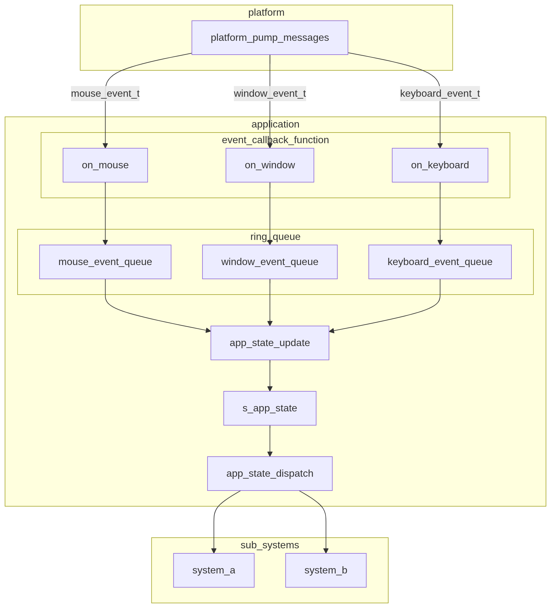

# Event System Guide

This page provides the following to help engine developers operate the event system safely:

- The event system design (structure and data flow)
- Procedures and guidelines for adding new events

## Event System Overview

The event system is executed in `application_run()` in `application.c` as follows:

1. The platform system polls keyboard, mouse, and window events via `platform_pump_messages()`.
2. The polled events are pushed into the per-event-type ring queues owned by the application layer, through the event callback functions passed from `application.c` to `platform_pump_messages()`.
3. `app_state_update()` consumes events from the ring queues and updates the state variables managed in `s_app_state`.
4. Changes in the state variables in `s_app_state` are dispatched to each subsystem.
5. The “state changed” flags/deltas in `s_app_state` are cleared (the state variable values themselves are retained).

Event callbacks are responsible only for enqueuing events into ring queues and must not perform event handling. All event handling is performed in a centralized manner by `app_state_update()`.
This allows `app_state_update()` to aggregate events into a state representation, so even if the same kind of event occurs multiple times within a single frame, only the final state needs to be applied (e.g., mouse movement).

Note that the ring queue implementation discards the oldest data when it becomes full. Therefore, events that must never be dropped are handled without going through a ring queue.
At present, the only must-not-drop event is the window close event. However, additional events may be added in the future if they affect the control flow of `application_run()`.

These steps are executed every frame. The simplified logic can be expressed as follows.
(The following is pseudocode; error handling, arguments, and non-event-related code are omitted.)

```c
application_run() {
    while(!s_app_state->window_should_close) {  // run until the window is closed
        ret = platform_pump_messages(on_window, on_keyboard, on_mouse);
        if(PLATFORM_WINDOW_CLOSE == ret) {
            s_app_state->window_should_close = true;
            continue;
        }
        app_state_update();
        app_state_dispatch();
        app_state_clean();
    }
}
```

## Event System Data Flow



## Guidelines for Adding Events

When adding an event, you must first evaluate the nature of the event.
The key question is: **Does this event affect the control flow of `application_run()`?**

If it does (e.g., a window close event), refer to **Guidelines for Adding Must-Not-Drop Events**.
Otherwise, refer to **Guidelines for Adding Normal Events**.

### Guidelines for Adding Normal Events

A **normal event** is an event for which the application control flow does not break even if events are dropped (oldest discarded when the queue is full).

There are two types of normal event additions:

- Adding a new event code and handling to an existing event category (mouse/keyboard/window)
- Introducing a new event category

Because the required steps differ, each procedure is described below.

#### Adding an Event Code to an Existing Event Category

- Add an event code and (if necessary) accompanying event arguments (modify the appropriate file under `engine/include/core/event` based on the target event category).
- Update platform-specific event handling under `engine/src/platform/platform_concretes/`:
  - `platform_snapshot_collect()`: collect event information
  - `platform_snapshot_process()`: convert collected events into event-struct form and pass them to the application layer via event callbacks
- Add handling for the newly collected event to `app_state_update()` (pop from the queue and convert into a state change representation such as flags/deltas).
- Notify subsystems of the resulting application state changes via `app_state_dispatch()`.
- Add clearing of the corresponding state-change information to `app_state_clean()`.

As long as the normal event addition stays within the existing event categories (keyboard/mouse/window), no changes to the event callback functions are required.

#### Introducing a New Event Category

- Create a new header file for the new event category under `engine/include/core/event`.
- In the header, add:
  - an event code enum (`xxx_event_code_t`)
  - an event arguments struct (`xxx_event_args_t`)
  - an event struct (`xxx_event_t`)
  - `xxx_event_t` must contain `xxx_event_code_t` and `xxx_event_args_t` as members
- Add a ring queue for the new event category to `app_state_t` in `application.c`.
- In `application_create()` in `application.c`, add code to create/initialize the newly added ring queue.
- In `application.c`, add a new callback function and implement pushing the event into the ring queue.
- Update platform-specific event handling under `engine/src/platform/platform_concretes/`:
  - add the newly created callback function to the arguments of `platform_pump_messages()`
  - `platform_snapshot_collect()`: collect event information
  - `platform_snapshot_process()`: convert collected events into event-struct form and pass them to the application layer via event callbacks
- Add handling for the newly collected event to `app_state_update()` (pop from the queue and convert into a state change representation such as flags/deltas).
- Notify subsystems of the resulting application state changes via `app_state_dispatch()`.
- Add clearing of the corresponding state-change information to `app_state_clean()`.

### Guidelines for Adding Must-Not-Drop Events

For must-not-drop events, processing is not performed via event codes or callback functions. Instead, the event is handled by the return value of `platform_pump_messages()`.

The steps to add this type of event are:

- Add the event name to `platform_result_t` in `engine/include/platform/platform_core/platform_types.h`.
- Update platform-specific event handling under `engine/src/platform/platform_concretes/`:
  - `platform_snapshot_collect()`: collect event information
  - `platform_snapshot_process()`: if a must-not-drop event is detected among the collected events, return it as the function result
  - `platform_pump_messages()`: if the return value from `platform_snapshot_process()` indicates a must-not-drop event, return it as the result of `platform_pump_messages()`
- In `application_run()` in `application.c`, add handling for the must-not-drop event based on the return value of `platform_pump_messages()`.

Note that return-value-based handling cannot process all must-not-drop events if multiple such events occur at the same time.
If such a case becomes possible, the input/output specification of `platform_pump_messages()` will be revised.
