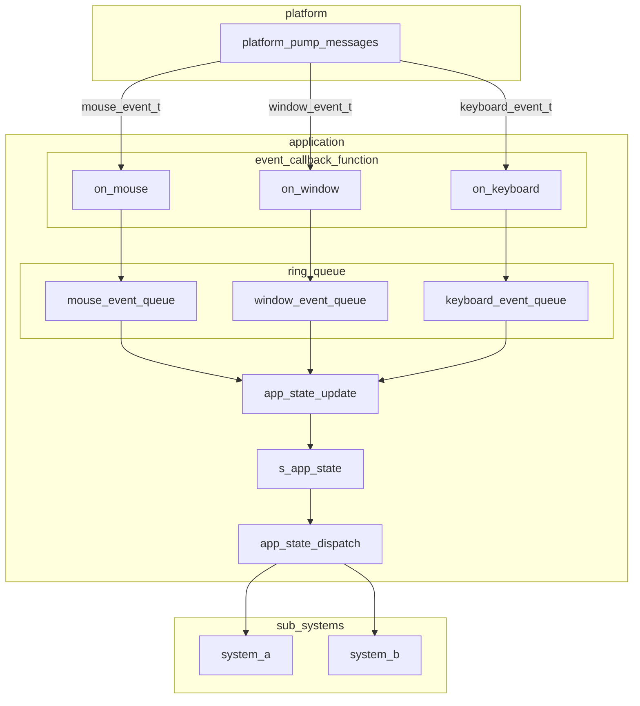

# イベントシステム解説

このページでは、エンジン開発者が安全にイベントシステムの運用を行っていくために下記を提供する。

- イベントシステムの設計(構造、データフロー)
- 新規イベントを追加する際の手順、ガイドライン

## イベントシステム概要

イベントシステムの処理は、`application.c`内の`application_run()`で次のように実行される。

1. プラットフォームシステムが `platform_pump_messages()` により、キーボード、マウス、ウィンドウイベントを吸い上げる。
2. 吸い上げたイベントを`platform_pump_messages()`に引数で`application.c`から渡されたイベントコールバック関数によって、アプリケーションレイヤーが保持するリングキューにそれぞれ格納する。
3. `app_state_update()`関数によってリングキュー内のイベントを処理し、`s_app_state`内で管理する状態変数を更新する。
4. `s_app_state`内の状態変数の変化を各種サブシステムに通知する。
5. `s_app_state`内の状態変数の変化をクリアする(変化なしにする、状態変数の値は保持)

イベントコールバックは、リングキューへの格納のみにとどめ、イベントの処理は行わない。イベントの処理は`app_state_update()`で一括処理する。
こうすることで、`app_state_update()`でイベントを状態に集約するため、同一フレーム内に同種イベントが複数回発生しても最終状態だけを採用できる(例：マウス移動)。

なお、リングキューの仕様上、満杯だった場合には最古のデータが捨てられる。このため、絶対に捨ててはいけないイベントについてはリングキューを介さずに処理する。
絶対に捨ててはいけないイベントは、現状ではウィンドウクローズイベントのみであるが、今後、`application_run()`の制御フローに変化を及ぼすイベントが発生した場合は追加となる。

これらの処理は毎フレーム実行される。簡略化したコードで表現すると次のようになる。
(以下は疑似コードであり、エラー処理、引数、イベント処理以外のコードは省略している)

```c
application_run() {
    while(!s_app_state->window_should_close) {  // ウィンドウが閉じられるまで実行
        ret = platform_pump_messages(on_window, on_keyboard, on_mouse);
        if(PLATFORM_WINDOW_CLOSE == ret) {
            s_app_state->window_should_close = true;
            continue;
        }
        app_state_update();
        app_state_dispatch();
        app_state_clean();
    }
}
```

## イベントシステムデータフロー



## イベント追加ガイドライン

イベントを追加する際には、先ず追加するイベントの性質を吟味する必要がある。
吟味の観点は、「`application_run()`の制御フローに変化を及ぼすか？」である。

もしウィンドウクローズのように変化を及ぼすイベントであれば、「絶対に落としてはいけないイベントの追加ガイドライン」を参照すること。
それ以外の通常のイベントは「通常イベント追加ガイドライン」参照のこと。

### 通常イベント追加ガイドライン

通常イベントとは、取りこぼし(キュー満杯による最古破棄)が発生してもアプリケーションの制御フローが破綻しないイベントを指す。
なお、通常イベントの追加には2種類あり、

- 既存イベント種別(mouse/keyboard/window)に対してイベントコードと処理を追加する場合
- イベント種別を新規に設ける場合

それぞれで手順が異なるため、それぞれの手順を示す。

#### 既存イベント種別へのイベントコード追加の場合

- イベントコードと(必要であれば)イベント付随情報を追加(`engine/include/core/event`以下の、追加するイベント種別に応じたファイルを修正)
- `engine/src/platform/platform_concretes/`以下の各プラットフォームごとのイベント処理を変更
  - `platform_snapshot_collect()`: イベント情報の収集
  - `platform_snapshot_process()`: 収集したイベントをイベント構造体の形式に変換し、イベントコールバックによりアプリケーションレイヤーに渡す
- イベントコールバックによって収集したイベントの処理を`app_state_update()`(キューから取り出して、状態変化(フラグ/差分)に変換する処理)に追加
- 処理したイベントによって発生したアプリケーション状態変化を`app_state_dispatch()`でサブシステムに通知
- 状態変化のクリアを`app_state_clean()`に追加

通常イベントの追加は、既存のイベント種別(keyboard/mouse/window)の範囲で行う限り、イベントコールバック関数の変更は不要である。

#### 新規イベント種別の追加の場合

- `engine/include/core/event`以下に新規イベント種別用のヘッダファイルを作成
- ヘッダファイルには、イベントコード列挙体(`xxx_event_code_t`), イベント付随情報構造体(`xxx_event_args_t`)とイベント構造体(`xxx_event_t`)を追加する
  - `xxx_event_t`にはメンバとして`xxx_event_code_t`と`xxx_event_args_t`をもたせる
- `application.c`の`app_state_t`に新規イベント種別用のリングキューを追加
- `application.c`の`application_create()`で新規に追加したリングキューの生成処理を追加
- `application.c`に新規コールバック関数を追加し、リングキューへの追加処理を記載する
- `engine/src/platform/platform_concretes/`以下の各プラットフォームごとのイベント処理を変更
  - `platform_pump_messages()`の引数に追加したコールバック関数を追加する
  - `platform_snapshot_collect()`: イベント情報の収集
  - `platform_snapshot_process()`: 収集したイベントをイベント構造体の形式に変換し、イベントコールバックによりアプリケーションレイヤーに渡す
- イベントコールバックによって収集したイベントの処理を`app_state_update()`(キューから取り出して、状態変化(フラグ/差分)に変換する処理)に追加
- 処理したイベントによって発生したアプリケーション状態変化を`app_state_dispatch()`でサブシステムに通知
- 状態変化のクリアを`app_state_clean()`に追加

### 絶対に落としてはいけないイベントの追加ガイドライン

絶対に落としてはいけないイベントの追加に関しては、イベントコードやコールバック関数による処理ではなく、`platform_pump_messages()`の戻り値によって処理を行う。
この類のイベントの追加手順は、

- `engine/include/platform/platform_core/platform_types.h`の`platform_result_t`にイベント名称を追加
- `engine/src/platform/platform_concretes/`以下の各プラットフォームごとのイベント処理を変更
  - `platform_snapshot_collect()`: イベント情報の収集
  - `platform_snapshot_process()`: 収集したイベントの中で落とせないイベントが発生していた場合には返り値として返すよう変更
  - `platform_pump_messages()`: `platform_snapshot_process()`の返り値が落とせないイベントだった場合には返り値として返すよう変更
- `application.c`の`application_run()`で`platform_pump_messages()`の返り値を見て落とせないイベントの処理を追加

なお、返り値による処理では複数の落とせないイベントが同時に発生した際に全てを処理することができない。
このようなケースが発生しうる場合は、`platform_pump_messages()`の入出力仕様を変更する予定である。
