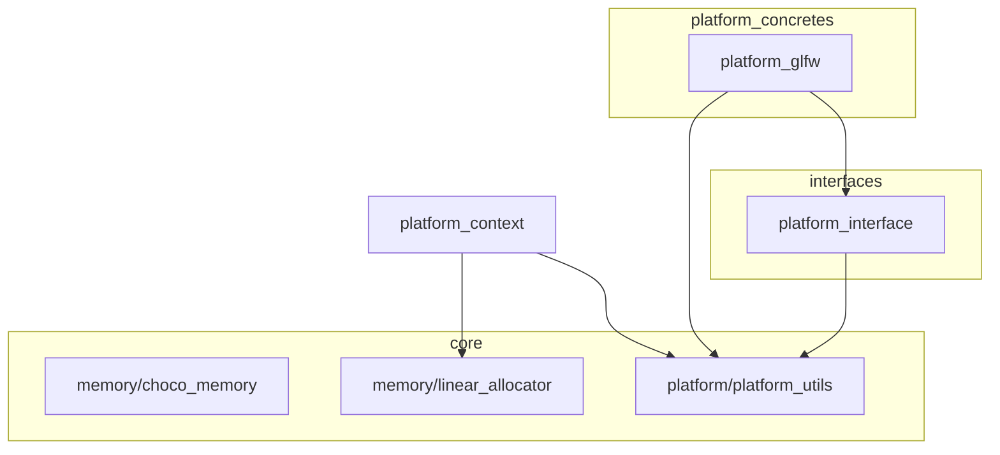
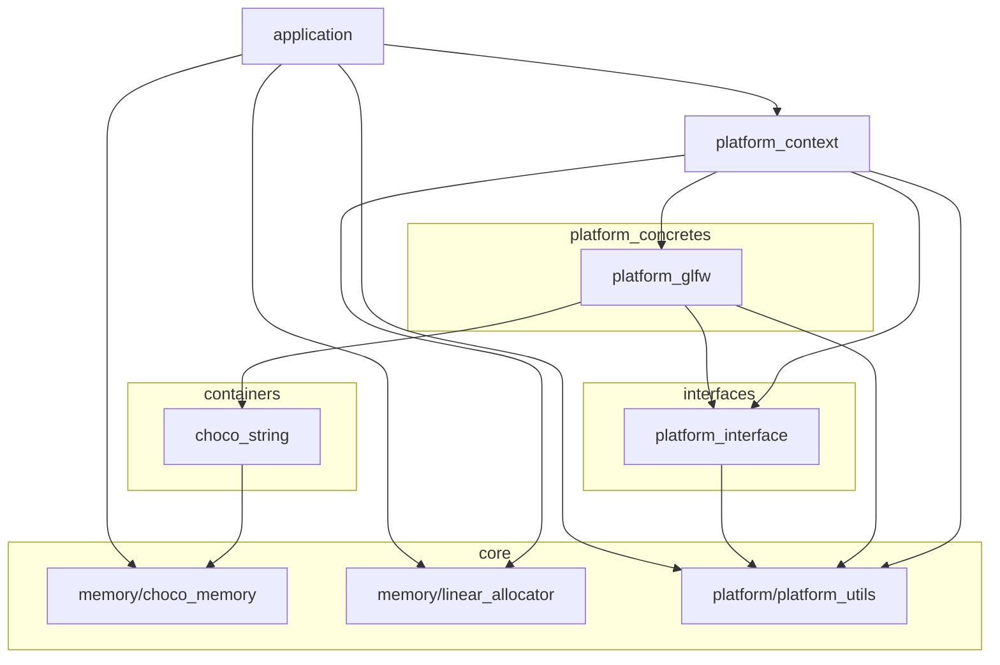

# gl_choco_engineレイヤーツリー

- [gl\_choco\_engineレイヤーツリー](#gl_choco_engineレイヤーツリー)
  - [Public(API) Dependencies](#publicapi-dependencies)
  - [Implementation(Private) Dependencies](#implementationprivate-dependencies)
  - [各レイヤー詳細](#各レイヤー詳細)
    - [application](#application)
    - [base](#base)
    - [core](#core)
    - [containers](#containers)
    - [interfaces](#interfaces)
    - [platform\_concretes](#platform_concretes)
    - [platform\_context](#platform_context)

## Public(API) Dependencies

凡例: A->BはAがBに依存を表す

## Implementation(Private) Dependencies

凡例: A->BはAがBに依存を表す

baseレイヤーについては複雑になりすぎるため省略(全域で使用されるため図からは省略)

## 各レイヤー詳細

### application

- 目的: プロジェクトの最上位レイヤーで全サブシステムのオーケストレーションを行う。以下の機能を提供する
  - 全サブシステムの起動、終了処理
  - アプリケーションメインループ
- 性質: システムの起動時から終了時まで常駐

### base

- 目的: 最下層の“横断ユーティリティ”。全レイヤーが使える小道具を提供
- 性質: 外部ライブラリ/OS依存なし(標準Cのみ)。初期化不要でシステム起動直後から使用可能
- 保有機能:
  - ***base/choco_message***: stdout, stderrへの色付きメッセージ出力
  - ***base/choco_macros***: 共通マクロ定義

### core

- 目的: プロジェクト全体から使用される機能/APIを提供する(メモリアロケータ/数学ライブラリ等)
- 保有機能:
  - ***choco_memory***: 不定期に発生するメモリ確保、解放に対応するメモリアロケータモジュールで、メモリトラッキング機能も有する
  - ***linear_allocator***: サブシステム等、ライフサイクルが固定で、個別のメモリ開放が不要なメモリ確保に対応するリニアアロケータモジュール
  - ***platform/platform_utils***: プラットフォームシステムで共通に使用されるデータ型を提供する

### containers

- 目的: リソースの管理責務を有する各種データを格納可能なコンテナを提供する
- 保有機能:
  - ***choco_string***: 文字列を格納するコンテナモジュールで、文字列比較や文字列連結等の文字列処理機能も提供する

### interfaces

- 目的: StrategyパターンのInterfaceオブジェクトに相当するモジュールを格納する
- 保有機能:
  - ***platform_interface***: プラットフォームシステムのInterface構造体を提供する

### platform_concretes

- 目的: プラットフォームシステムStrategyパターンのConcreteオブジェクトに相当するモジュールを格納する
- 保有機能:
  - ***platform_glfw***: GLFW APIで実装されたプラットフォームシステムAPIを提供する

### platform_context

- 目的: プラットフォームシステムのStrategy Contextモジュールを提供する
