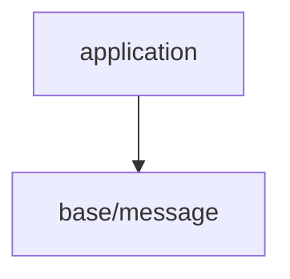

# gl_choco_engineレイヤー構成

## レイヤツリー

## 各レイヤー詳細

### application

- 目的: 最上位のオーケストレーション。サブシステム初期化、メインループ駆動、終了処理。
- 依存:
  - base

### base

- 目的: 最下層のユーティリティ(ログ、プロジェクト全体で使用するマクロ定義等)。外部依存なし(標準Cのみ)。
- 保有機能:
  - base/message: 色付き出力/レベル/STDOUT/STDERR
- 依存: C標準ライブラリのみ
