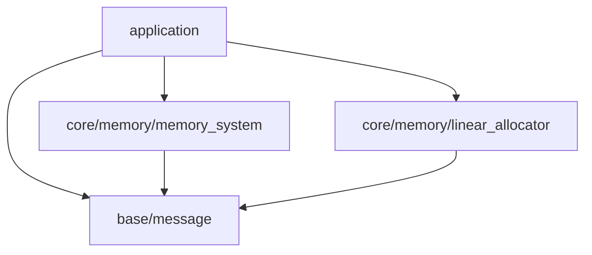
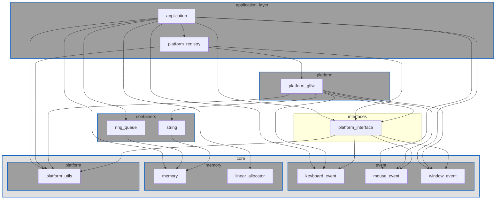
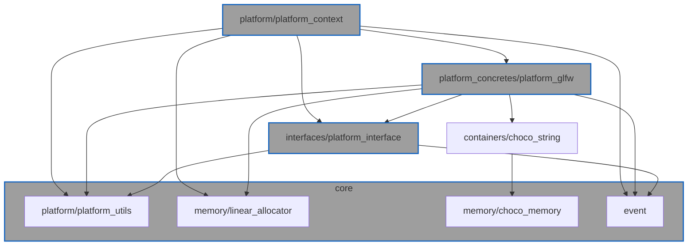

# gl_choco_engineレイヤー構成

## レイヤツリー

### ベーシック
| 色名 | Hex |
|---|---|
| White | #FFFFFF |
| Near-white | #F5F5F5 |
| Light Gray | #E0E0E0 |
| Gray | #9E9E9E |
| Dark Gray | #424242 |
| Black | #000000 |

### ブルー系
| 色名 | Hex |
|---|---|
| Blue | #2196F3 |
| Light Blue | #03A9F4 |
| Indigo | #3F51B5 |
| Navy | #000080 |
| Blue Grey | #607D8B |

### シアン／ティール
| 色名 | Hex |
|---|---|
| Cyan | #00BCD4 |
| Teal | #009688 |

### グリーン系
| 色名 | Hex |
|---|---|
| Green | #4CAF50 |
| Light Green | #8BC34A |
| Dark Green | #2E7D32 |
| Lime | #CDDC39 |

### イエロー／オレンジ
| 色名 | Hex |
|---|---|
| Yellow | #FFEB3B |
| Amber | #FFC107 |
| Orange | #FF9800 |
| Deep Orange | #FF5722 |

### レッド／ピンク／パープル
| 色名 | Hex |
|---|---|
| Red | #F44336 |
| Crimson | #DC143C |
| Pink | #E91E63 |
| Purple | #9C27B0 |
| Deep Purple | #673AB7 |
| Magenta | #FF00FF |

### Public(API) Dependencies

### Implementation(Private) Dependencies

TODO: applicationがplatform_registryに依存している。横方向依存。要修正

#### Platform System

- event/keyboard_event, event/mouse_event, event/window_eventはeventに集約
- baseレイヤーは省略

## 各レイヤー詳細

### application

- 目的: 最上位のオーケストレーション。サブシステム初期化、メインループ駆動、終了処理。
- 依存:
  - base

### base

- 目的: 最下層の“横断ユーティリティ”。全レイヤーから安心して使える小道具を提供する。
- 性質: 外部ライブラリ/OS依存なし(標準Cのみ)。原則として初期化不要・状態最小。
- 保有機能:
  - `base/message`: stdout, stderrへの色付きメッセージ出力
  - `base/macros`: 共通マクロ
- 依存: C標準ライブラリのみ
- 入れないもの: メモリアロケータ、数学/コンテナなど“機能モジュール”(＝coreへ)

### core

- 目的: プロジェクト全体から使用される機能/APIを提供する(メモリアロケータ/数学ライブラリ等)。
- 保有機能:
  - `core/memory/linear_allocator`: リニアアロケータ
  - `core/memory/choco_memory`: メモリトラッキング+mallocラッパー(将来的にはFreeListに入れ替え)
- 依存:
  - base
