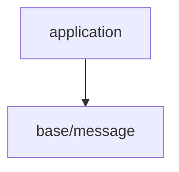

# gl_choco_engineレイヤー構成

## レイヤツリー

## 各レイヤー詳細

### application

- 目的: 最上位のオーケストレーション。サブシステム初期化、メインループ駆動、終了処理。
- 依存:
  - base

### base

- 目的: 最下層の“横断ユーティリティ”。全レイヤーから安心して使える小道具を提供する。
- 性質: 外部ライブラリ/OS依存なし(標準Cのみ)。原則として初期化不要・状態最小。
- 保有機能:
  - `base/message`: stdout, stderrへの色付きメッセージ出力
  - `base/macros`: 共通マクロ
- 依存: C 標準ライブラリのみ
- 入れないもの: メモリアロケータ、数学/コンテナなど“機能モジュール”（＝coreへ）
