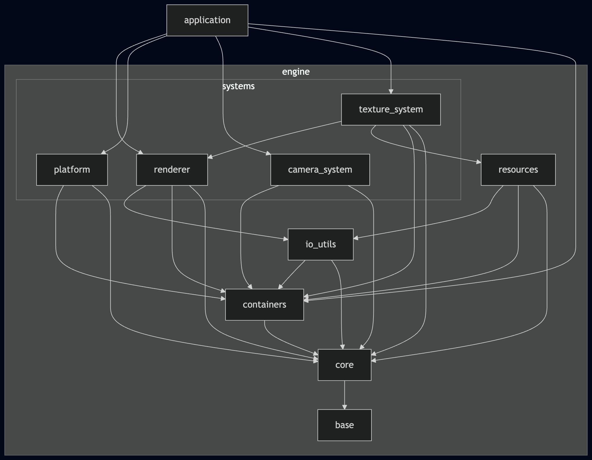

# GLCE Architecture (Layered Architecture)

This document describes the high-level layering and module dependencies of GL CHOCO ENGINE (GLCE).

- [GLCE Architecture (Layered Architecture)](#glce-architecture-layered-architecture)
  - [Dependency rules](#dependency-rules)
  - [Engine overview](#engine-overview)
  - [Detailed view: Platform](#detailed-view-platform)
  - [Detailed view: Renderer](#detailed-view-renderer)
  - [Layer Reference](#layer-reference)
    - [application](#application)
    - [engine/base](#enginebase)
    - [engine/core](#enginecore)
    - [engine/containers](#enginecontainers)
    - [engine/io\_utils](#engineio_utils)
    - [engine/platform](#engineplatform)
    - [engine/renderer](#enginerenderer)

## Dependency rules

- Dependencies must not point upward (from lower layers to higher layers).
- Circular dependencies are not allowed.

## Engine overview

This diagram shows the module dependencies at the engine level.

## Detailed view: Platform

[Platform System Architecture](./architecture/platform_system/architecture_en.md)

## Detailed view: Renderer

[Renderer System Architecture](./architecture/renderer_system/architecture_en.md)

## Layer Reference

### application

- Purpose: The top-level layer of the project, responsible for orchestrating all subsystems. It provides:
  - Initialization and shutdown of all subsystems
  - The application main loop
- Characteristics: Runs for the full lifetime of the application (startup to shutdown).

### engine/base

- Purpose: Engine-wide, project-agnostic utilities reusable beyond GLCE.
- Characteristics: Initialization-free; usable immediately at startup.
- Modules:
  - choco_macros: Common macro definitions.
  - choco_message: Colored logging/output helpers for stdout/stderr.
  - choco_math: General-purpose math utilities, including vector and matrix operations.

### engine/core

- Purpose: GLCE-specific engine foundations used across the whole engine.
- Characteristics: Some modules require explicit initialization.
- Modules:
  - keyboard_event / mouse_event / window_event: Event-related data types.
  - choco_memory: Allocation/free with memory tracking.
  - linear_allocator: Linear allocator for fixed-lifecycle allocations.
  - filesystem: Basic file I/O (open/close, byte reads).

### engine/containers

- Purpose: Provides container modules that encapsulate resource ownership and management.
- Characteristics: No module-specific initialization, but requires core memory system to be initialized.
- Modules:
  - ring_queue: Generic ring queue (ring buffer) container module.
  - choco_string: String container module with basic string operations.

### engine/io_utils

- Purpose: Provides higher-level I/O utilities that go beyond the standard C library by building on other GLCE modules.
- Characteristics: No module-specific initialization, but requires core memory system to be initialized.
- Modules:
  - fs_utils: Higher-level file I/O utilities on top of **filesystem**, such as loading an entire text file.

### engine/platform

- Purpose: GLCE currently uses GLFW as its primary platform backend, but the platform subsystem is designed to avoid hard-coding a GLFW dependency. To keep room for future non-GLFW implementations,
GLCE abstracts the platform subsystem using a Strategy-style interface (function table) and swappable backend implementations.
- Characteristics: Requires explicit initialization. Once initialized, the platform subsystem remains active for the lifetime of the application (until shutdown).
- Modules:
  - platform_core/platform_types: Common data types used across the platform subsystem.
  - platform_core/platform_err_utils: Provides utilities to translate lower-layer error codes into platform subsystem error codes, and to convert platform subsystem error codes into human-readable strings.
  - platform_interface: Defines the platform interface as a function table (vtable-like) shared by all platform backends.
  - platform_concretes/platform_glfw: GLFW-based backend implementation that provides the concrete function table for the platform interface.
  - platform_context: Strategy context and public entry point for the platform subsystem, responsible for initialization, backend selection, lifecycle management, and dispatching API calls through the interface.

### engine/renderer

*Note*: A renderer frontend has not been implemented yet, so the application currently uses some backend modules directly.
This will be removed once the frontend is introduced.

- Purpose: Provides the rendering subsystem. GLCE currently targets an OpenGL 3.3-based implementation, but the renderer is structured to accommodate additional backends in the future (e.g., other OpenGL versions or Vulkan). The long-term design separates a frontend (API-agnostic layer) from backend implementations (graphics-API-specific layers).
- Characteristics: Requires explicit initialization. Once initialized, the renderer subsystem remains active for the lifetime of the application (until shutdown).
- Modules:
  - renderer_backend/renderer_backend_context/renderer_backend_context: The primary entry point and orchestration layer for the renderer backend. It wires the selected backend implementation and dispatches calls from higher layers through the backend interfaces, while exposing a small set of facade headers (shader/VAO/VBO contexts) as the public API surface.
  - renderer_backend/renderer_backend_context/renderer_backend_shader_context: Provides a thin facade (public API surface) for shader-related backend operations used by higher layers. The implementation is consolidated in renderer_backend_context.c.
  - renderer_backend/renderer_backend_context/renderer_backend_vao_context: Provides a thin facade (public API surface) for VAO-related backend operations used by higher layers. The implementation is consolidated in renderer_backend_context.c.
  - renderer_backend/renderer_backend_context/renderer_backend_vbo_context: Provides a thin facade (public API surface) for VBO-related backend operations used by higher layers. The implementation is consolidated in renderer_backend_context.c.
  - renderer_backend/renderer_backend_concretes/gl33/gl33_shader: OpenGL 3.3 shader program utilities (compile, link, and program use/bind).
  - renderer_backend/renderer_backend_concretes/gl33/gl33_vao: OpenGL 3.3 VAO utilities (bind/unbind and vertex attribute configuration).
  - renderer_backend/renderer_backend_concretes/gl33/gl33_vbo: OpenGL 3.3 VBO utilities (bind/unbind and uploading data to the GPU).
  - renderer_backend/renderer_backend_interface/shader: Defines the shader interface as a function table (vtable-like) shared by all renderer backends.
  - renderer_backend/renderer_backend_interface/vertex_array_object: Defines the VAO interface as a function table (vtable-like) shared by all renderer backends.
  - renderer_backend/renderer_backend_interface/vertex_buffer_object: Defines the VBO interface as a function table (vtable-like) shared by all renderer backends.
  - renderer_backend/renderer_backend_types: Defines common data types shared across the entire renderer backend layer (shader, VAO, and VBO modules).
  - renderer_core/renderer_err_utils: Provides utilities to translate lower-layer error codes into renderer subsystem error codes, and to convert renderer subsystem error codes into human-readable strings.
  - renderer_core/renderer_memory: Wrapper APIs over **engine/core/choco_memory** tailored for the renderer layer (renderer-specific result codes and automatic memory-tag assignment) to simplify allocation/free within the renderer.
  - renderer_core/renderer_types: Common data types shared across the renderer subsystem.
