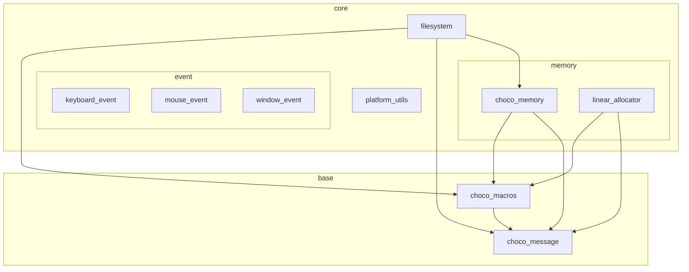
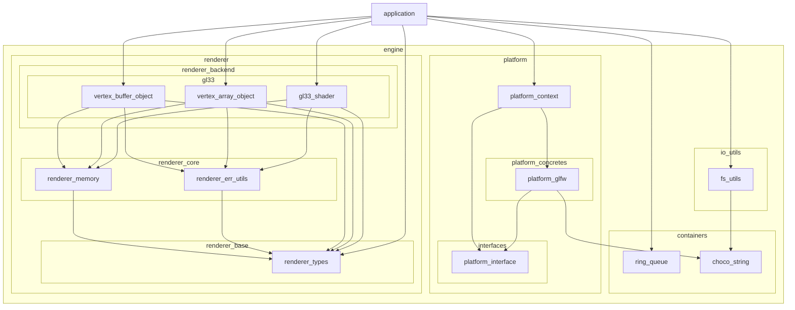
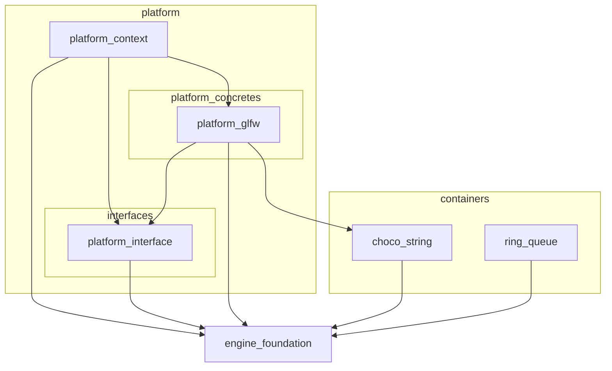
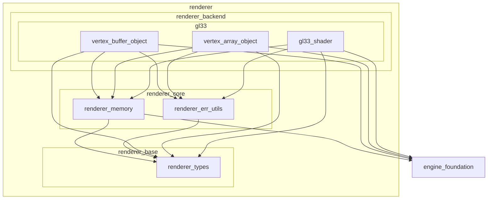

# gl_choco_engineレイヤーツリー

- [gl\_choco\_engineレイヤーツリー](#gl_choco_engineレイヤーツリー)
  - [Software Architecture](#software-architecture)
    - [EngineFoundation](#enginefoundation)
    - [EngineOverview](#engineoverview)
    - [LocalLayer: Platform](#locallayer-platform)
  - [LocalLayer: Renderer](#locallayer-renderer)
  - [Layer Reference(各レイヤー詳細)](#layer-reference各レイヤー詳細)
    - [application](#application)
    - [engine\_foundation](#engine_foundation)
      - [base](#base)
      - [core](#core)
    - [engine](#engine)
      - [containers](#containers)
      - [interfaces](#interfaces)
      - [platform\_concretes](#platform_concretes)
      - [platform\_context](#platform_context)
      - [io\_utils](#io_utils)
        - [fs\_utils](#fs_utils)
      - [renderer\_backend](#renderer_backend)
        - [gl33](#gl33)

## Software Architecture

### EngineFoundation

全モジュールが使用可能なエンジン基盤モジュールの依存関係を示す。

凡例: A->BはAがBに依存を表す

```mermaid
graph TD
  subgraph BASE[base]
    direction TB
    CHOCO_MESSAGE[choco_message]
    CHOCO_MACROS[choco_macros]
  end
  CHOCO_MACROS --> CHOCO_MESSAGE

  subgraph CORE[core]
    direction TB
    subgraph EVENT[event]
      direction TB
      KEYBOARD_EVENT[keyboard_event]
      MOUSE_EVENT[mouse_event]
      WINDOW_EVENT[window_event]
    end

    subgraph MEMORY[memory]
      direction TB
      CHOCO_MEMORY[choco_memory]
      LINEAR_ALLOCATOR[linear_allocator]
    end

    FILESYSTEM[filesystem]
    PLATFORM_UTILS[platform_utils]
  end
  FILESYSTEM --> CHOCO_MACROS
  FILESYSTEM --> CHOCO_MESSAGE
  FILESYSTEM --> CHOCO_MEMORY
  CHOCO_MEMORY --> CHOCO_MACROS
  CHOCO_MEMORY --> CHOCO_MESSAGE
  LINEAR_ALLOCATOR --> CHOCO_MACROS
  LINEAR_ALLOCATOR --> CHOCO_MESSAGE
```

### EngineOverview

エンジン全体のモジュール依存関係を示す。

baseレイヤー、coreレイヤーについては、全モジュールが使用可能であるため、
依存関係を書くと複雑になりすぎるため、省略している。

現状ではレンダラー層を抽象化したフロントエンドが未作成であるため、
バックエンド内のモジュールをアプリケーション側が直に使用しているが将来的に廃止予定。

凡例: A->BはAがBに依存を表す

```mermaid
graph TD
  APPLICATION[application]
  APPLICATION --> RING_QUEUE
  APPLICATION --> FS_UTILS
  APPLICATION --> PLATFORM_CONTEXT
  APPLICATION --> RENDERER_TYPES
  APPLICATION --> VERTEX_BUFFER_OBJECT
  APPLICATION --> VERTEX_ARRAY_OBJECT
  APPLICATION --> GL33_SHADER

  subgraph ENGINE[engine]
    direction TB

    subgraph CONTAINERS[containers]
      direction TB
      CHOCO_STRING[choco_string]
      RING_QUEUE[ring_queue]
    end

    subgraph IO_UTILS[io_utils]
      direction TB
      FS_UTILS[fs_utils]
    end
    FS_UTILS --> CHOCO_STRING

    subgraph PLATFORM[platform]
      PLATFORM_CONTEXT[platform_context]
      direction TB
      subgraph INTERFACES[interfaces]
        direction TB
        PLATFORM_INTERFACE[platform_interface]
      end
      subgraph PLATFORM_CONCRETES[platform_concretes]
        direction TB
        PLATFORM_GLFW[platform_glfw]
      end
    end
    PLATFORM_GLFW --> PLATFORM_INTERFACE
    PLATFORM_GLFW --> CHOCO_STRING
    PLATFORM_CONTEXT --> PLATFORM_INTERFACE
    PLATFORM_CONTEXT --> PLATFORM_GLFW

    subgraph RENDERER[renderer]
      direction TB
      subgraph RENDERER_BACKEND[renderer_backend]
        direction TB
        subgraph GL33[gl33]
          direction TB
          GL33_SHADER[gl33_shader]
          VERTEX_ARRAY_OBJECT[vertex_array_object]
          VERTEX_BUFFER_OBJECT[vertex_buffer_object]
        end
      end
      subgraph RENDERER_BASE[renderer_base]
        direction TB
        RENDERER_TYPES[renderer_types]
      end
      subgraph RENDERER_CORE[renderer_core]
        direction TB
        RENDERER_ERR_UTILS[renderer_err_utils]
        RENDERER_MEMORY[renderer_memory]
      end
    end
    GL33_SHADER --> RENDERER_TYPES
    GL33_SHADER --> RENDERER_MEMORY
    GL33_SHADER --> RENDERER_ERR_UTILS

    VERTEX_ARRAY_OBJECT --> RENDERER_TYPES
    VERTEX_ARRAY_OBJECT --> RENDERER_ERR_UTILS
    VERTEX_ARRAY_OBJECT --> RENDERER_MEMORY
    VERTEX_BUFFER_OBJECT --> RENDERER_TYPES
    VERTEX_BUFFER_OBJECT --> RENDERER_ERR_UTILS
    VERTEX_BUFFER_OBJECT --> RENDERER_MEMORY
    RENDERER_ERR_UTILS --> RENDERER_TYPES
    RENDERER_MEMORY --> RENDERER_TYPES
  end
```

### LocalLayer: Platform

```mermaid
graph TD
  ENGINE_FOUNDATION[engine_foundation]

  subgraph CONTAINERS[containers]
    direction TB
    CHOCO_STRING[choco_string]
    RING_QUEUE[ring_queue]
  end
  CHOCO_STRING --> ENGINE_FOUNDATION
  RING_QUEUE --> ENGINE_FOUNDATION

  subgraph PLATFORM[platform]
    PLATFORM_CONTEXT[platform_context]
    direction TB
    subgraph INTERFACES[interfaces]
      direction TB
      PLATFORM_INTERFACE[platform_interface]
    end
    subgraph PLATFORM_CONCRETES[platform_concretes]
      direction TB
      PLATFORM_GLFW[platform_glfw]
    end
  end
  PLATFORM_INTERFACE --> ENGINE_FOUNDATION
  PLATFORM_GLFW --> PLATFORM_INTERFACE
  PLATFORM_GLFW --> ENGINE_FOUNDATION
  PLATFORM_GLFW --> CHOCO_STRING
  PLATFORM_CONTEXT --> ENGINE_FOUNDATION
  PLATFORM_CONTEXT --> PLATFORM_INTERFACE
  PLATFORM_CONTEXT --> PLATFORM_GLFW
```

## LocalLayer: Renderer

```mermaid
graph TD
  ENGINE_FOUNDATION[engine_foundation]

  subgraph RENDERER[renderer]
    direction TB
    subgraph RENDERER_BACKEND[renderer_backend]
      direction TB
      subgraph GL33[gl33]
        direction TB
        GL33_SHADER[gl33_shader]
        VERTEX_ARRAY_OBJECT[vertex_array_object]
        VERTEX_BUFFER_OBJECT[vertex_buffer_object]
      end
    end
    subgraph RENDERER_BASE[renderer_base]
      direction TB
      RENDERER_TYPES[renderer_types]
    end
    subgraph RENDERER_CORE[renderer_core]
      direction TB
      RENDERER_ERR_UTILS[renderer_err_utils]
      RENDERER_MEMORY[renderer_memory]
    end
  end
  GL33_SHADER --> RENDERER_TYPES
  GL33_SHADER --> RENDERER_MEMORY
  GL33_SHADER --> RENDERER_ERR_UTILS
  GL33_SHADER --> ENGINE_FOUNDATION

  VERTEX_ARRAY_OBJECT --> RENDERER_TYPES
  VERTEX_ARRAY_OBJECT --> RENDERER_ERR_UTILS
  VERTEX_ARRAY_OBJECT --> RENDERER_MEMORY
  VERTEX_ARRAY_OBJECT --> ENGINE_FOUNDATION
  VERTEX_BUFFER_OBJECT --> RENDERER_TYPES
  VERTEX_BUFFER_OBJECT --> RENDERER_ERR_UTILS
  VERTEX_BUFFER_OBJECT --> RENDERER_MEMORY
  VERTEX_BUFFER_OBJECT --> ENGINE_FOUNDATION
  RENDERER_ERR_UTILS --> RENDERER_TYPES
  RENDERER_MEMORY --> RENDERER_TYPES
  RENDERER_MEMORY --> ENGINE_FOUNDATION
```

## Layer Reference(各レイヤー詳細)

### application

- 目的: プロジェクトの最上位レイヤーで全サブシステムのオーケストレーションを行う。以下の機能を提供する
  - 全サブシステムの起動、終了処理
  - アプリケーションメインループ
- 性質: システムの起動時から終了時まで常駐

### engine_foundation

#### base

- 目的: 最下層の“横断ユーティリティ”。全レイヤーが使える小道具を提供
- 性質:
  - 外部ライブラリ/OS依存なし(標準Cのみ)
  - 初期化不要でシステム起動直後から使用可能
- 保有機能:
  - ***choco_message***: stdout, stderrへの色付きメッセージ出力
  - ***choco_macros***: 共通マクロ定義

#### core

- 目的: プロジェクト全体から使用される機能/APIを提供する(メモリアロケータ/数学ライブラリ等)
- 性質:
  - baseレイヤーのみに依存
  - core, baseレイヤー以外のモジュールへの依存は禁止
- 保有機能:
  - ***choco_memory***: 不定期に発生するメモリ確保、解放に対応するメモリアロケータモジュールで、メモリトラッキング機能も有する
  - ***linear_allocator***: サブシステム等、ライフサイクルが固定で、個別のメモリ開放が不要なメモリ確保に対応するリニアアロケータモジュール
  - ***platform/platform_utils***: プラットフォームシステムで共通に使用されるデータ型を提供する
  - ***event/keyboard_event***: キーボードイベントに使用されるデータ型を提供する
  - ***event/mouse_event***: マウスイベントに使用されるデータ型を提供する
  - ***event/window_event***: ウィンドウイベントに使用されるデータ型を提供する
  - ***filesystem/filesystem***: ファイル入出力について、最も基本的な機能(オープン、クローズ、バイト単位での読み取り)とデータ型を提供する

### engine

#### containers

- 目的: リソースの管理責務を有する各種データを格納可能なコンテナを提供する
- 保有機能:
  - ***choco_string***: 文字列を格納するコンテナモジュールで、文字列比較や文字列連結等の文字列処理機能も提供する
  - ***ring_queue***: ジェネリック型のリングキューモジュールで、push, pop, empty, create, destroyを提供する

#### interfaces

- 目的: StrategyパターンのInterfaceオブジェクトに相当するモジュールを格納する
- 保有機能:
  - ***platform_interface***: プラットフォームシステムのInterface構造体を提供する

#### platform_concretes

- 目的: プラットフォームシステムStrategyパターンのConcreteオブジェクトに相当するモジュールを格納する
- 保有機能:
  - ***platform_glfw***: GLFW APIで実装されたプラットフォームシステムAPIを提供する

#### platform_context

- 目的: プラットフォームシステムのStrategy Contextモジュールを提供する

#### io_utils

##### fs_utils

- 目的: core/filesystem、choco_stringを用いて高度なファイルI/O処理を提供する
- 性質:
  - 前提条件: engine_foundation が使用可能であること
  - ライフサイクル: 任意のタイミングで呼び出し可能(常駐状態を持たない)
- リソース所有権: 本モジュールが使用する全てのリソースは、本モジュールが提供するAPIによってリソース確保、破棄を行う
- 実行結果コード: fs_utils_result_t
- 外部依存: 下記レイヤーへの依存を許可、それ以外は禁止
  - containers/choco_string
  - core/filesystem
  - core/memory/choco_memory
  - base/choco_macros
  - base/choco_message
- 保有機能:
  - テキストファイルの一括読み込み
  - ファイルパス、ファイル名、拡張子からフルパス文字列を生成

#### renderer_backend

- 目的: OpenGL、VulkanといったグラフィックスAPIの違いや、OpenGLのバージョン違いによる実装の差異を吸収する
- 性質: グラフィックスAPIに依存した処理はこのレイヤーに閉じ込め、外部に漏らさない
- 使用可能グラフィックスAPI+バージョン
  - OpenGL 3.3

##### gl33

- 目的: OpenGL Version3.3用にOpenGL APIのラッパーAPIを提供し、上位レイヤーのOpenGL 3.3への依存を解消する
- 保有機能:
  - ***gl33_shader***: OpenGL 3.3用にシェーダープログラム取扱モジュールで、以下の機能を提供する
    - シェーダープログラムのコンパイル
    - シェーダープログラムのリンク
    - リンクしたシェーダープログラムの使用開始通知
  - ***vertex_array_object***: OpenGL 3.3用のVAO取扱モジュールで、以下の機能を提供する
    - VAOのbind
    - VAOのunbind
    - 頂点情報のアトリビュート設定
  - ***vertex_buffer_object***: OpenGL 3.3用のVBO取扱モジュールで、以下の機能を提供する
    - VBOのbind
    - VBOのunbind
    - GPUへのデータ転送

- [] 各モジュールのヘッダファイルにはfs_utilsと同様の情報を書くようにする
- [] layer.mdのモジュール説明は、以下のようにする
  - レイヤー名称
    - 保有モジュール
      - モジュールA: 一行で説明
      - モジュールB: 一行で説明
- [] renderer_base/renderer_typesが抜けている
- [] renderer_core/renderer_memoryが抜けている
- [] renderer_err_utilsが抜けている
