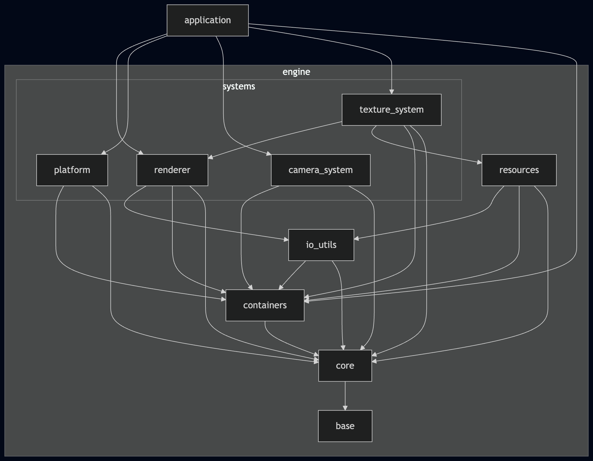

# GLCE Architecture (Layered Architecture)

This document describes the high-level layering and module dependencies of GL CHOCO ENGINE (GLCE).

- [GLCE Architecture (Layered Architecture)](#glce-architecture-layered-architecture)
  - [Dependency rules](#dependency-rules)
  - [Engine overview](#engine-overview)
  - [Detailed view: Platform System](#detailed-view-platform-system)
  - [Detailed view: Renderer System](#detailed-view-renderer-system)
  - [Detailed view: Camera System](#detailed-view-camera-system)
  - [Detailed view: Texture System](#detailed-view-texture-system)
  - [Detailed view: Resource](#detailed-view-resource)
  - [Layer Reference](#layer-reference)
    - [application](#application)
    - [engine/base](#enginebase)
    - [engine/core](#enginecore)
    - [engine/containers](#enginecontainers)
    - [engine/io_utils](#engineio_utils)
    - [engine/resource](#engineresource)
    - [engine/systems/platform](#enginesystemsplatform)
    - [engine/systems/renderer](#enginesystemsrenderer)
    - [engine/systems/camera_system](#enginesystemscamera_system)
    - [engine/systems/texture_system](#enginesystemstexture_system)

## Dependency rules

- Dependencies must not point upward from lower layers to higher layers.
- Circular dependencies are not allowed.
- This document shows high-level module dependencies. Dependencies on internal submodules are folded into their parent module.

## Engine overview

This diagram shows the module dependencies at the engine level.

## Detailed view: Platform System

[Platform System Architecture](./architecture/systems/platform_system/architecture_en.md)

## Detailed view: Renderer System

[Renderer Backend Architecture](./architecture/systems/renderer_system/renderer_backend/architecture_en.md)

## Detailed view: Camera System

[Camera System Architecture](./architecture/systems/camera_system/architecture_en.md)

## Detailed view: Texture System

[Texture System Architecture](./architecture/systems/texture_system/architecture_en.md)

## Detailed view: Resource

[Resource Architecture](./architecture/resource/architecture_en.md)

## Layer Reference

### application

- Purpose: The top-level composition layer of GLCE. It creates, owns, connects, runs, and shuts down the engine subsystems required by the current executable.
  It is responsible for:
  - Creating and destroying engine-wide runtime state.
  - Initializing and shutting down subsystems in the required order.
  - Owning the application main loop.
  - Receiving events from the Platform subsystem and storing them in application-level event queues.
  - Updating application state from queued events.
  - Dispatching updated state to subsystems such as camera, renderer, and texture management.
  - Holding temporary sample-scene logic until the renderer frontend and a higher-level scene layer are introduced.

- Characteristics: Runs for the full lifetime of the executable, from startup to shutdown. This layer is allowed to depend on multiple engine subsystems because it acts as the composition root. However, lower engine layers must not depend on the application layer.

- Notes:
  - The application layer currently uses `ring_queue` directly to temporarily store window, keyboard, and mouse events received from the Platform subsystem.
  - The application currently uses some renderer backend and OpenGL/GLFW-related functionality directly as a temporary implementation detail. This dependency should be reduced when the renderer frontend is introduced.

- Modules:
  - application: Public lifecycle API for creating, running, and destroying the application.
  - application_core/application_types: Common application-layer configuration values and result types.
  - application_core/application_err_utils: Utilities for converting lower-layer result codes into application-layer result codes and strings.
  - command_interpreter/flight_camera: Converts application-level keyboard input state into flight-camera control commands.

### engine/base

- Purpose: Engine-wide, project-agnostic utilities reusable beyond GLCE.
- Characteristics: Initialization-free; usable immediately at startup.
- Modules:
  - choco_macros: Common macro definitions.
  - choco_message: Colored logging/output helpers for stdout/stderr.
  - choco_math: General-purpose math utilities, including vector and matrix operations.

### engine/core

- Purpose: GLCE-specific engine foundations used across the whole engine.
- Characteristics: Some modules require explicit initialization.
- Modules:
  - keyboard_event / mouse_event / window_event: Event-related data types.
  - choco_memory: Allocation/free with memory usage tracking.
  - linear_allocator: Linear allocator for fixed-lifecycle allocations.
  - filesystem: Basic file I/O, such as open/close and byte reads.
  - buffer_utils/buffer_utils: Defines APIs for writing data to densely packed buffers and reading data back from them.
  - geometry_primitive/vertex: Defines basic geometric data structures used to represent shape data.

### engine/containers

- Purpose: Provides general-purpose container modules used by multiple GLCE layers and subsystems.
- Characteristics: No module-specific initialization, but requires the core memory system to be initialized.
- Modules:
  - ring_queue: Generic ring queue (ring buffer) container module.
  - choco_string: String container module that provides basic string operations.

### engine/io_utils

- Purpose: Provides higher-level I/O utilities beyond the standard C library by building on other GLCE modules.
- Characteristics: No module-specific initialization, but requires the core memory system to be initialized.
- Modules:
  - fs_utils: Higher-level file I/O utilities built on top of **filesystem**. It provides operations such as loading an entire text file and reading a text file one line at a time.

### engine/resource

- Purpose: Provides modules that convert asset data, such as textures and geometry, into CPU-side resources usable by the engine.
- Characteristics: No module-specific initialization, but requires the core memory system to be initialized.
- Modules:
  - loaders/bmp_loader: BMP file loader. It reads BMP files and converts them into pixel data that is easier for GLCE to handle.
  - loaders/stl_loader: ASCII STL file loader. It reads ASCII STL files and converts them into `point_normal_vertex_t` arrays.
  - resource_core/resource_err_utils: Resource-layer error utility module that translates result codes between modules and converts resource-layer result codes to strings.
  - resource_core/resource_types: Provides common data types used across the Resource layer.
  - texture/texture: Provides APIs for operating on CPU-side texture resources.

### engine/systems/platform

- Purpose: GLCE currently uses GLFW as its primary platform backend. However, the Platform subsystem is designed to avoid hard-coding a GLFW dependency. To keep room for future non-GLFW implementations, GLCE abstracts the Platform subsystem using a Strategy-style interface (function table) and swappable backend implementations.
- Characteristics: Requires explicit initialization. Once initialized, the Platform subsystem remains active for the lifetime of the application.
- Modules:
  - platform_core/platform_types: Common data types used across the Platform subsystem.
  - platform_core/platform_err_utils: Utilities for translating lower-layer error codes into Platform subsystem error codes and converting them into human-readable strings.
  - platform_interface: Defines the platform interface as a function table (vtable-like) shared by all platform backends.
  - platform_concretes/platform_glfw: GLFW-based backend implementation that provides the concrete function table for the platform interface.
  - platform_context: Strategy context and public entry point for the Platform subsystem. It is responsible for initialization, backend selection, lifecycle management, and API dispatch through the interface.

### engine/systems/renderer

*Note*: A renderer frontend has not been implemented yet, so the application currently uses some backend modules directly.
This direct dependency will be removed once the frontend is introduced.

- Purpose: Provides the rendering subsystem. GLCE currently targets an OpenGL 3.3-based implementation, but the renderer is structured to accommodate additional backends in the future, such as other OpenGL versions or Vulkan. The long-term design separates an API-agnostic frontend from graphics-API-specific backend implementations.
- Characteristics: Requires explicit initialization. Once initialized, the renderer subsystem remains active for the lifetime of the application.
- Modules:
  - renderer_backend/renderer_backend_context/renderer_backend_context: The primary entry point and orchestration layer for the renderer backend. It wires the selected backend implementation and dispatches calls from higher layers through backend interfaces, while exposing thin facade headers for shader/texture/VAO/VBO contexts as the public API surface.
  - renderer_backend/renderer_backend_context/context_shader: Provides a thin facade (public API surface) for shader-related backend operations used by higher layers. The implementation is consolidated in renderer_backend_context.c.
  - renderer_backend/renderer_backend_context/context_texture: Provides a thin facade (public API surface) for texture-related backend operations used by higher layers. The implementation is consolidated in renderer_backend_context.c.
  - renderer_backend/renderer_backend_context/context_vao: Provides a thin facade (public API surface) for VAO-related backend operations used by higher layers. The implementation is consolidated in renderer_backend_context.c.
  - renderer_backend/renderer_backend_context/context_vbo: Provides a thin facade (public API surface) for VBO-related backend operations used by higher layers. The implementation is consolidated in renderer_backend_context.c.
  - renderer_backend/renderer_backend_concretes/gl33/concrete_shader: OpenGL 3.3 shader program utilities, including compile, link, and program use/bind.
  - renderer_backend/renderer_backend_concretes/gl33/concrete_texture: OpenGL 3.3 texture operation APIs, including bind, unbind, and pixel upload.
  - renderer_backend/renderer_backend_concretes/gl33/concrete_vao: OpenGL 3.3 VAO utilities responsible for bind/unbind and vertex attribute configuration.
  - renderer_backend/renderer_backend_concretes/gl33/concrete_vbo: OpenGL 3.3 VBO utilities responsible for bind/unbind and data upload to the GPU.
  - renderer_backend/renderer_backend_interface/interface_shader: Defines the shader interface as a function table (vtable-like) shared by all renderer backends.
  - renderer_backend/renderer_backend_interface/interface_texture: Defines the texture interface as a function table (vtable-like) shared by all renderer backends.
  - renderer_backend/renderer_backend_interface/interface_vao: Defines the VAO interface as a function table (vtable-like) shared by all renderer backends.
  - renderer_backend/renderer_backend_interface/interface_vbo: Defines the VBO interface as a function table (vtable-like) shared by all renderer backends.
  - renderer_backend/renderer_backend_types: Defines common data types shared across the renderer backend layer, including types used by shader, texture, VAO, and VBO modules.
  - renderer_core/renderer_err_utils: Utilities for translating lower-layer error codes into renderer subsystem error codes and converting them into strings.
  - renderer_core/renderer_memory: Wrapper APIs over **engine/core/choco_memory** tailored for the renderer layer. It simplifies allocation/free inside the renderer by using renderer-specific result codes and automatic memory-tag assignment.
  - renderer_core/renderer_types: Common data types shared across the renderer subsystem.
  - renderer_resources: Renderer-level resource modules used by higher layers before the renderer frontend is introduced. A renderer resource groups a shader program, cached uniform locations, shader-specific VAO/VBO resources, and GPU data upload operations.
    - ui_shader: Shader resource for textured UI quad rendering. It manages a UI shader program, MVP uniform location, and VAO/VBO configured for position and texture-coordinate vertex attributes.
    - line_shader: Shader resource for single-color 3D line rendering. It manages a line shader program, MVP/color uniform locations, and a VAO/VBO configured for position-only line vertices. It is intended for simple line primitives such as debug lines, AABB edges, and grid lines.
    - point_shader: Shader resource for point-cloud and point primitive rendering. It manages a point shader program, MVP uniform location, a VAO, and separate VBOs for position and color vertex attributes. Position data is stored as floating-point coordinates, while color data is stored as normalized unsigned-byte RGBA values and passed to the shader as a `vec4`. This resource is intended for rendering point-based visualization data such as debug points, measurement points, and point clouds.

### engine/systems/camera_system

- Purpose: The `Camera System` is a subsystem that provides camera state management and control functionality in three-dimensional space.
  It provides upper layers with a unified API for creating, retrieving, and deleting cameras, as well as for handling position, orientation, view matrices, and projection matrices.
  Control functionality for each camera type is also included in the responsibilities of this system.
  As a result, upper layers can use camera functionality without being aware of the details of individual camera implementations or internal memory management.
- Characteristics: Some modules require explicit initialization. In particular, camera_manager must be initialized before camera instances can be centrally registered, retrieved, and managed.
- Modules:
  - camera_controller/flight_camera_controller: Provides control APIs for flight-camera movement and orientation updates.
  - camera_manager: Manages camera instances and provides registration, deletion, and retrieval APIs.
  - camera: Holds camera state such as name, position, orientation, and projection parameters, and provides APIs for retrieving matrices and direction vectors.
  - camera_core/camera_memory: Wrapper APIs over `choco_memory` tailored for the camera layer.
  - camera_core/camera_err_utils: Utilities for translating lower-layer error codes into camera-system result codes and converting them into strings.
  - camera_core/camera_types: Common data types, constants, and result codes used throughout the Camera system.

### engine/systems/texture_system

- Purpose: A system for managing CPU-side and GPU-side texture resources. It provides the following functionality:
  - Manages CPU-side texture resources through `engine/resource/texture`.
  - Manages GPU-side texture resources through the Texture API of `renderer_backend`.
  - Provides registration, deletion, and retrieval APIs for CPU/GPU texture resources by texture name and texture ID.
  - Allocates the module's memory resources using a linear allocator during initialization.
- Characteristics: Requires explicit initialization. Once initialized, the texture subsystem remains active for the lifetime of the application.
- Modules:
  - texture_manager: Manages the correspondence between CPU-side texture resources and GPU-side texture resources, and provides registration, deletion, and retrieval APIs by texture name and texture ID.
